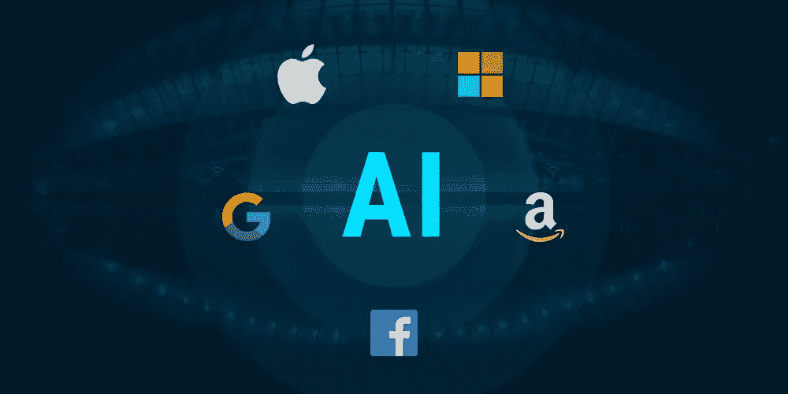
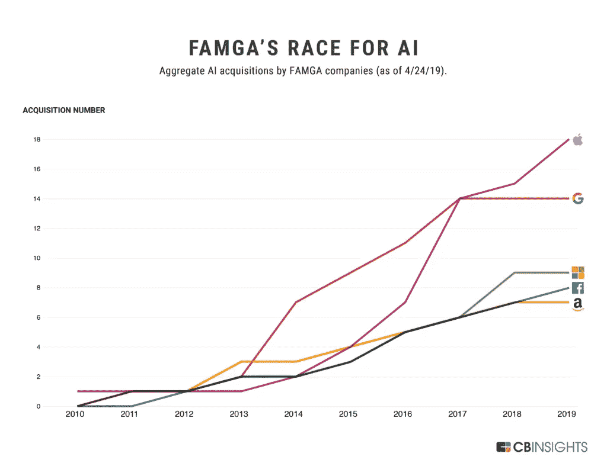
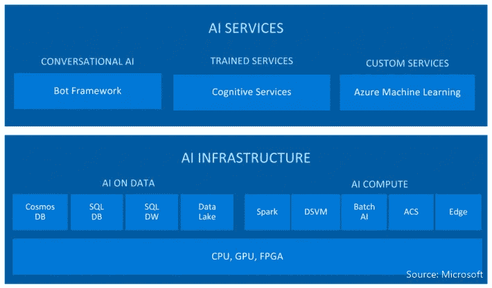
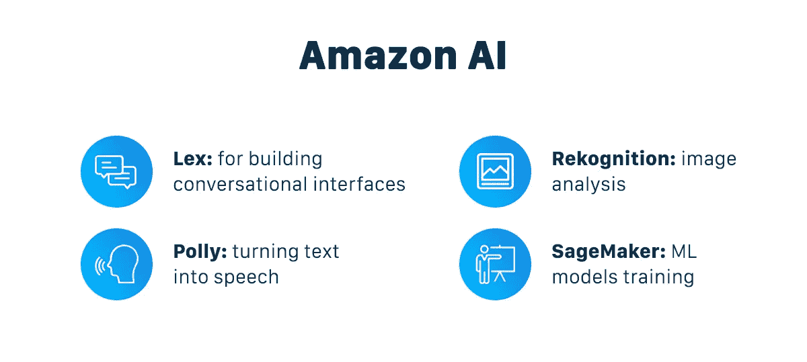

# 脸书、苹果、微软、谷歌和亚马逊如何投资人工智能

> 原文：<https://medium.com/hackernoon/how-facebook-apple-microsoft-google-and-amazon-are-investing-in-ai-f58b5706e34a>

[**人工智能**](https://dashbouquet.com/blog/artificial-intelligence/ai-trends-for-2019-what-should-we-expect) 是大事。公司不断在这项技术上投资，以利用他们的产品，更好地为客户服务。

像往常一样，行业巨头们站在第一线，研究如何获得竞争优势，推出全新的产品和服务。我们准备了一份技术世界最大的名字和他们在人工智能上的投资的概述。

# 谷歌

谷歌在人工智能方面有着悠久的历史，并计划发展成为“人工智能优先的世界”，据该公司首席执行官 Sundar Pichaim 称。

回到 2014 年，谷歌以 4 亿美元收购了一家 DeepMind 初创公司。这家公司提供一系列人工智能解决方案，从图像和语音识别到在视频游戏中模拟人类。

我们看到谷歌在一些日常任务中使用人工智能:Gmail 中的建议回复和高级搜索算法。除此之外，该公司最近推出了机器学习系统 TensorFlow，并免费供任何开发者使用。

然后我们有 Google Assistant 和 Duplex。谷歌助手是一种虚拟助手(类似于 Alexa、Cortana 或 Siri)，可以帮助用户以更高效、更快速的方式解决日常任务。它由一堆设备(Sonos 扬声器、三星智能电视、飞利浦 Hue)支持，是目前使用最广泛的人工智能解决方案之一。

至于 [**双工**](https://www.androidauthority.com/what-is-google-duplex-869476/) ，它是一种人工智能驱动的语音，帮助用户通过谷歌助手设置商务约会。所有用户需要做的就是要求谷歌助手为某个日期预订一家餐馆，Duplex 会照顾它。为了让它听起来更像人类，开发人员甚至在讲话中添加了“嗯”和停顿。

由于 Duplex 今年才上线，它提供的唯一功能是餐厅预订，但开发商当然正计划扩展该功能。

关于 Google 和 AI 的最后一件事是最新的 [**结对倡议**](https://ai.google/research/teams/brain/pair) 。PAIR 代表人+人工智能研究，旨在使与人工智能的合作尽可能愉快和有益。它基本上是一个研究中心，在不久的将来可能会带来一些真正有趣的结果。

# 脸谱网

我们都知道脸书是完全由人工智能驱动的面部识别的先驱。那么，这个社交媒体巨头在人工智能方面还做了什么？

可惜不多。当亚马逊和谷歌一直在积极研究和实现他们的人工智能项目时，**却在计划的中途停滞不前。该公司希望推出自己的虚拟助手，并在许多过程中实施人工智能，如内容监控和管理。**

**今年，脸书在德国慕尼黑的人工智能伦理研究所投资了 750 万美元。考虑到人工智能带来的许多问题(道德和监管)，这似乎是一项明智的投资。然而，埃隆·马斯克表示，扎克伯格对人工智能的了解“有限”，因此，如果公司真的希望加入人工智能竞赛，脸书似乎还有很多事情要做。**

# **微软**

**微软是对人工智能进行大量投资的公司之一。**

****

**我们可以从微软研究院 AI 开始，这是一个组织，由微软创立，专注于 AI 研发。因为该公司已经在其流程中部署了 AI(Skype 聊天机器人、数据分析、与 Cortana 的交互等。)，难怪微软打算往这个方向发展，扩大 AI 的使用。**

**除此之外，微软一直在通过 Azure 云计算服务推出其人工智能驱动的工具，并致力于将人工智能实现到 Office 365 中。**

**到 2018 年，微软收购了 5 家人工智能科技公司。它最近的收购是 [**XOXCO**](https://blogs.microsoft.com/blog/2018/11/14/microsoft-to-acquire-xoxco-bringing-together-leading-bot-development-communities-to-help-advance-conversational-ai/) :一个软件产品设计和开发工作室。**

**总而言之，微软似乎把人工智能技术看得非常重要，并计划为微软产品用户提供真正的价值。**

# **亚马孙**

**亚马逊是世界上最大的电子商务平台之一，难怪它是首批掌握人工智能的公司之一。**

**如果我们谈论亚马逊和人工智能，首先想到的是 Alexa。这是另一个由亚马逊 Echo Dot 扬声器支持的虚拟助手，可以设置你的闹钟，发送通知，并通过语音与你互动。**

**但由于亚马逊专注于电子商务，最近它推出了 Alexa 购物功能。现在，购物者可以在 Alexa 的帮助下从亚马逊订购。助理可以将商品放入购物车，取出商品，跟踪商品状态，并通知送货情况。由于语音购物预计到 2020 年将达到 4000 万美元，亚马逊做出了一个非常明智的举动。**

**亚马逊做的另一件大事是在 AWS 中实现 ML。这些功能包括:**

****

**关于亚马逊和人工智能的一个有趣事实是该公司对待技术的方式。他们称之为 [**飞轮**](https://www.wired.com/story/amazon-artificial-intelligence-flywheel) ，这意味着知识的持续存储及其在整个公司的均匀分布。因此，人们可以说亚马逊是一个真正由人工智能驱动的企业，它充分利用了人工智能。**

# **苹果**

**乍看之下，苹果似乎无所不包。**

**我们有 Siri，它是世界上使用最多的虚拟助手之一。我们有面部识别功能，玩起来很有趣，还增加了安全性。此外，苹果使用人工智能来检测欺诈和优化电池的使用，总体上看起来像是竞争对手的平等对手。**

**不幸的是，事实并非如此。首先，苹果在人工智能方面的投资没有谷歌或亚马逊那么多。第二，苹果遵循非常本地化的方法，其 CreateML 框架只在 iOS 设备上运行，而大多数公司都在云中训练他们的 ML 模型。**

**虽然这种方法有其粉丝，但许多行业专家认为，有经验的开发人员会选择 Google 的 TensorFlow，而不是 CreateML，因为后者缺乏功能。**

# **结论**

**随着大公司对人工智能产生兴趣，是时候让中小型公司跟进了。对于那些希望稳步增长并跟上不断变化的商业环境的公司来说，人工智能已经成为一项必备技术，而不是奢侈品。**

**[*作者娜塔莉亚·库库什金娜*](https://www.linkedin.com/in/natalia-kukushkina-b62397132/)**