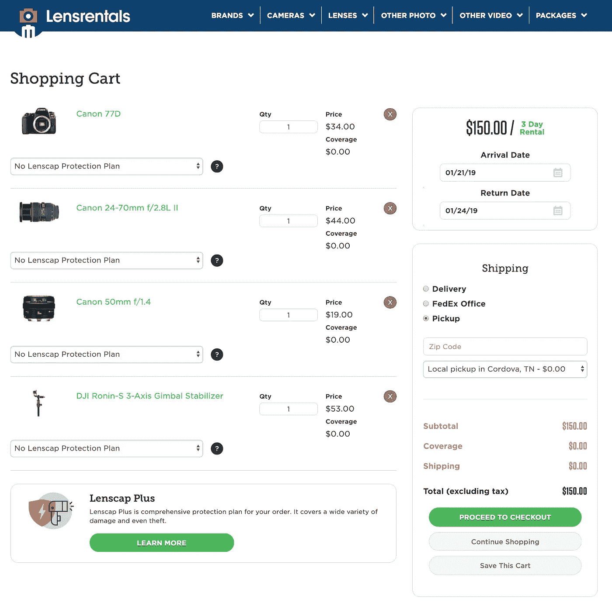
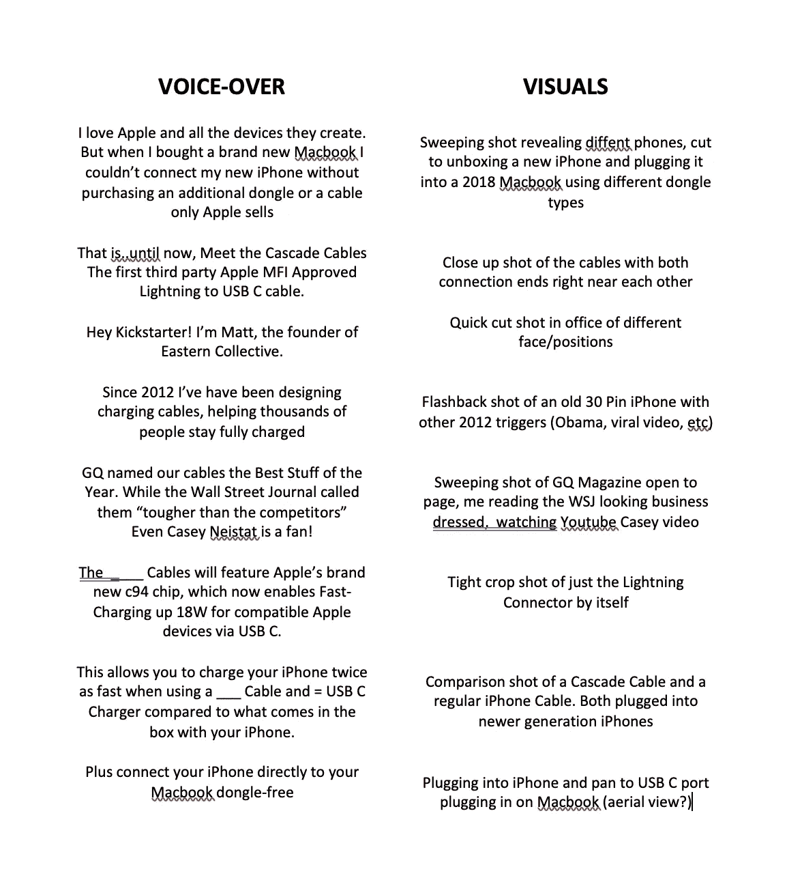
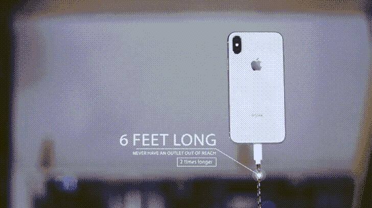

# 我是如何用最少的预算独自拍摄我的 Kickstarter 视频的

> 原文：<https://medium.com/hackernoon/how-i-filmed-my-kickstarter-video-by-myself-on-a-minimal-budget-d42819629426>

## 上个月，我花了整整三天时间在自己的公寓里拍摄我的新 Kickstarter 视频，预算很少，完全由我一个人完成。我想我应该概述一下这个过程以及我在这个过程中使用的技巧和诀窍。

我的活动在一周前发起，目前已经获得了 185%的资金！

点击此处查看活动视频: [Cascade Cables Kickstarter 活动](https://www.kickstarter.com/projects/easternco/cascade-cables-apple-mfi-lightning-to-usb-c-cables?ref=ajv490)

The Cascade Cables: MFI Lightning to USB C Cables

**租赁设备**

大多数人可能认为他们无法创作出好的视频，因为他们没有合适的设备。仅仅是入门级别的设置就可能需要数千美元。然而，租赁设备是一种非常[经济](https://hackernoon.com/tagged/economical)的方式，可以用很少的价格买到很棒的设备。

我用[LensRentals.com](https://share.lensrentals.com/x/Jg7CTd)做我的视频，租了整整三天我需要的东西。他们把它装在非常重的箱子里寄给你，并附上所有的标签，以便简单地打包，并在三天后运回。

以下是我在视频中使用的分类:

佳能 77D 相机机身—**$ 34.00**

佳能 24–70 毫米 f/2.8 镜头— **$44.00**

佳能 50 毫米 f/1.4 镜头— **$19.00**

DJI·罗宁的万向稳定器**——53.00 美元**

总计——150 美元(我放弃了保险，找到了一个免费送货的交易)

这种设置允许一个固定的 50 毫米镜头和 24-70 毫米变焦镜头有一点多样性。新佳能 77D 的评论也很棒，尤其是在视频自动对焦方面。我在下面的框架里深入了一点。

显然，如果您的视频更复杂，可能需要 3 天以上的时间，所以成本可能会更高，但这是我的下一个观点…

**策划剧本**

我查看了 Kickstarter 的其他视频，寻找我想在视频中描绘的氛围的灵感。你没有太多的时间来吸引他们的注意力，所以我想开门见山，不要说太多废话。

我创建了一个有两栏的 word 文档——配音[视觉&](https://i.imgur.com/v3Th0r6.png)。我对我想说的一些部分有一个粗略的想法，但可能不是视觉效果，反之亦然。慢慢地，我把画外音和视频镜头在纸上匹配起来。大声朗读剧本使我能够理解在我开始拍摄之前，我自己对视频可能有多长有一个粗略的想法。然后我根据需要修剪多余的部分。

从长远来看，这一规划过程有助于在租赁设备时节省资金。如果你知道你要拍什么——你可以很容易地用设备预订时间，而不会浪费时间。

**使用浅景深**

正如我提到的，我在自己的公寓里拍摄了 90%的视频。这可能听起来像一个无聊的背景，但利用你的摄像设备中的[技术](https://hackernoon.com/tagged/technology)，你可以在一个小区域内拍摄不同的镜头。

我使用的佳能 50 毫米镜头有**f/1.4 的低光圈**，这是产生聚焦前景和模糊背景的原因。使用低光圈，我能够掩盖我的周围，在[背景](https://hackernoon.com/tagged/background)中有足够的东西，以创建一个场景，但在前景中的产品上有更清晰的焦点。

我最喜欢的一个镜头是在 1:02 拍摄的，将手机挂在天花板上，在后期制作时翻转，使它们看起来是直立的。低景深有助于隐藏我的厨房在背景中完全颠倒的事实。

这样做意味着我不需要花钱租场地。并不是所有你要制作视频的产品都可以在这种类似的环境下工作，但是像公园或者你所在城镇的图书馆这样的地方可以作为你可以利用的自由空间，同时让它们看起来更有视觉娱乐性。

**电动万向架是救命恩人**

DJI 罗宁的万向节有一个轻微的学习曲线，但一旦我把它设置好了，它对我的作品是至关重要的，有几个原因。

首先，它让我在拍摄时获得更流畅的电影镜头。万向节抵消任何微小的运动，所以相机也是水平的。这比典型的手持拍摄看起来更专业。

然而，最重要的是，**您可以通过手机为相机移动**设定路径。所以你可以设定 A 点，让它移动到 B 点，最多 10 点。因此，我需要在使用该产品的镜头中，我可以设置相机的轻微移动，以平移我正在做的事情，从而在我自己无法实际创建运动时，创建别人拍摄视频的幻觉。

同样，这也是我如何实现视频的介绍镜头。我设置了穿过咖啡桌的运动路径，放下一部手机——按 go。放下第二部手机，再次按 go，一遍又一遍地重新拍摄完全相同的动作，然后编辑这些镜头，使其与手机出现在照片上的动作相匹配。

因此，我不需要雇用额外的人手来帮助拍摄视频！

**编辑视频(Youtube 是你的朋友)**

在我开始编辑视频之前，我需要找一首歌作为视频的背景音乐。首先找到歌曲将有助于设置视频的节奏，以及在哪里可以剪切镜头以匹配歌曲的节拍。AudioJungle.net 是一个伟大的免费音乐资源，一首歌的使用价格在 9-39 美元之间。

为了编辑视频，我使用了 [Adobe 的 Creative Cloud 软件](https://www.adobe.com/creativecloud.html?promoid=ZP46FD38&mv=other)(所有应用程序每月约 50 美元)。我用 After Effects 和 Premiere Pro 来编辑视频。虽然这也可能是一项艰巨的任务，但 Youtube 上有大量关于如何实现任何目标的内容和教程。

同样，VideoHive.net 的(audio jungle 的姐妹网站)有我制作视频所需的所有重叠资源。我花了 29 美元购买了 152 个“调出标题”来给视频添加动画。然后，我在 Youtube 上搜索了如何在 After Effects 中运动跟踪视频标题，在 20 分钟内，我相对轻松地完成了这个过程，在视频的不同部分重复这个过程。

颜色校正、配音编辑等等也是如此。一旦你进入 YouTube 上的兔子洞一个话题，你会惊讶于你能在短时间内学到多少。

**获得反馈**

当向你的朋友或家人发送反馈时，你会听到——哇，真棒，干得好！—很多(希望！).他们可能知道你在这个项目上花了很多时间和精力，所以他们想支持你。

**重要的是问一些客观的问题**这样他们可以给出诚实的意见，而不会觉得他们在阻挠你。“你认为我在视频的这一部分是在和 fast 说话吗”“从一个主题到另一个主题的速度可以理解其功能吗”“在这个镜头中，发生的事情是否分散了注意力”这样，你就可以更好地了解什么是有效的，什么是无效的

**概述**

总的来说，我真的很高兴视频的结局。在开始这个过程之前，我有点担心是否应该向我的视频朋友寻求帮助，但我决定第一次就投入进去。

TL；我花了 3 天时间创作了我的 Kickstarter 视频，花了 333 美元从 LensRentals.com 的 T2 租了相机设备，用这个 Word 文档预先计划了我的镜头，使用了像浅景深和在电动万向架上使用自动路径这样的相机技巧，用 AudioJungle.net 的 T7 和 VideoHive.net 的 T9 制作音乐和动画，并通过免费的 Youtube 教程学习了如何实现它们。

请随意去 AMA！

