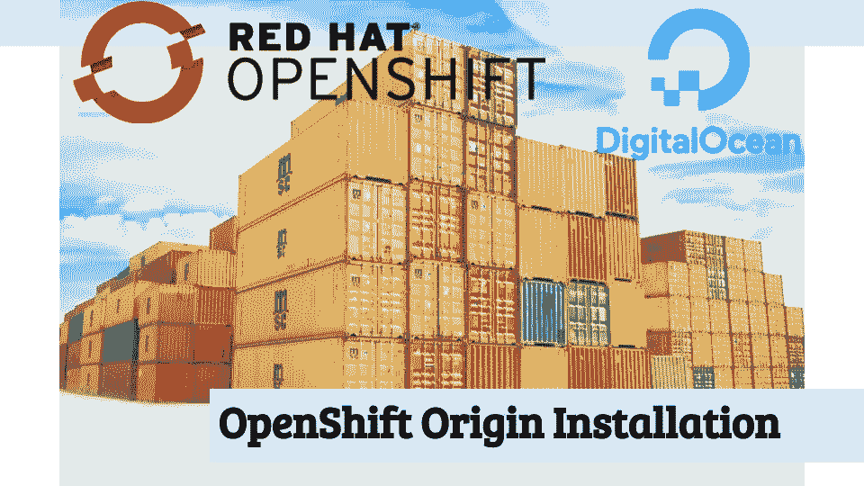
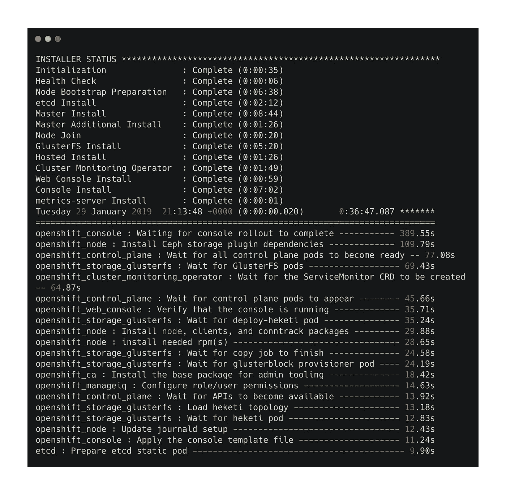

# 我如何在数字海洋上安装 OpenShift 集群

> 原文：<https://medium.com/hackernoon/how-i-installed-an-openshift-cluster-on-digitalocean-25324940df3c>



当我想浏览 OpenShift 时，我有两个选择，要么在本地使用 [Minishift](https://www.okd.io/minishift/) (之前使用[一体式虚拟机](https://blog.openshift.com/goodbye-openshift-all-in-one-vm-hello-minishift/))进行设置，要么使用“oc 集群”方法。虽然它们是很好的选择，但是如果不在真正的云环境中部署 OpenShift，你就不会有真正的体验。

# 为什么选择数字海洋？

我在基于云的设置上遇到了一些小问题，它们对我的需求来说太大了，而且带来了我并不真正需要的组件，有时还远远超出了预算。如果你检查一下运行 OpenShift 的[硬件要求](https://docs.okd.io/latest/install/prerequisites.html#hardware)，你就知道我在说什么了。

我的目标是建立一个类似生产的集群，不要太脆弱，同时也不要大到足以驱动银行的后端。我选择了像 DigitalOcean 这样的 VPS 提供商，所以我很清楚我会产生什么样的成本。我想尽可能接近 Heroku，我认为它是应用程序部署的黄金标准。

# 设置

在我开始计算成本之前，让我们快速浏览一下 OpenShift 架构。OpenShift 集群中有 3 种节点:

1.  **主节点**:一个或多个持有 OpenShift 主组件的节点，该组件处理 API 请求并进行实际的基础设施管理。如果涉及多个主机，它们由负载平衡器提供服务。这也可以包含 etcd，它充当整个集群的键值存储。
2.  **基础架构节点**:执行任何用于集群、内部 docker 注册表等功能的内务处理。
3.  **计算节点**:存放应用和服务容器的节点。

**注意**，为了保证高可用性，需要一个以上的主节点。如果您运行单个主服务器，当它关闭时，您的应用程序仍将运行，因为主服务器关闭，您将无法控制或管理任何应用程序。

此外，通过[标记适当的角色](https://docs.okd.io/latest/install/configuring_inventory_file.html#configuring-inventory-defining-node-group-and-host-mappings)，您可以让同一个节点同时充当主节点和基础设施节点，尽管在实际的生产设置中不建议这样做。

计算节点的数量取决于您将拥有的应用程序和部署的数量。您始终可以从 1 和[开始纵向扩展](https://docs.okd.io/latest/admin_guide/manage_nodes.html#adding-cluster-hosts_manage-nodes)，即在需要时向集群添加更多节点。

集群中的下一个基础架构是存储。如果你的应用程序需要某种形式的持久性(想想 MySQL DB)和其他东西，比如存储你的容器图像，你就需要存储。OpenShift 提供了多种[选项](https://docs.okd.io/latest/install_config/persistent_storage/index.html)来为集群设置存储。你可以将它与云的实际存储连接起来(比如将 EBS 用于 AWS)，或者使用云不可知的解决方案，比如 [GlusterFS](https://docs.okd.io/latest/install_config/persistent_storage/persistent_storage_glusterfs.html#install-config-persistent-storage-persistent-storage-glusterfs) 。

对于我们的集群，我选择了 3 个虚拟机，每个虚拟机有 4gb 内存(远远低于推荐的硬件)。我使用 GlusterFS 进行存储，因为它需要大量空间，所以我创建了 3 个卷，每个卷 100 Gb，装载到每个虚拟机上。

OpenShift 运行在 RedHat 风格的操作系统(如 RHEL、Centos 或 Atomic)上，需要一些先决条件。所以，我选择的虚拟机操作系统是 Centos 7 x64。

我们部署了 OpenShift 的 3.11 版本，在撰写本文时，这是最新的稳定版本。此外，OpenShift 有许多产品，如带[付费](https://www.openshift.com/products/dedicated/) [支持](https://www.openshift.com/products/container-platform/)、[在线多租户版本](https://www.openshift.com/products/online/)以及名为 [Origin](https://www.okd.io/) 的上游、前沿版本，最近更名为 OKD。我们将使用社区版，即 **OKD** 。不要让这阻止你使用 OpenShift，因为社区版和其他版本一样高性能和健壮。

# 贸易工具

我们主要使用 Ansible 和 Terraform 来安装和配置我们的 OpenShift 集群。我们假设您对这两者都不熟悉，但这对于微调设置参数会更有用一些。

# 始终可以回答

RedHat 提供了精心制作的并且[维护良好的脚本](https://github.com/openshift/openshift-ansible/)来创建和管理集群。但那是在之后的*事实上，你已经启动了基础设施，设置了 DNS，安装了先决条件和一切。我希望这种设置是一致的和可重复的，这样任何想要使用 OpenShift 的人都可以遵循相同的指令集并获得完全相同的结果。我还自动化了基础设施创建和先决条件部分。*

# 输入地形

我不知道转一个灯泡需要多少工程师，但要以可预测、一致和可重复的方式创建任何数量的复杂基础设施，只需要一名工程师，如果他们使用 [Terraform](https://www.terraform.io/) 。

Terraform 帮助您在云中创建机器，更改它们的 DNS 设置，创建卷并将其附加到机器上，所有这些都只需使用一个命令。我也可以使用 Ansible 来做同样的事情，但是与 Ansible 相比，Terraform 有一点优势。它存储系统的[先前状态](https://www.terraform.io/docs/state/)。它将输入作为系统的最终状态，并改变系统，直到达到期望的状态。这是不可行的。我仍然对 Terraform 和 Ansible 模板有一些不满，但这已经足够完成工作了。

在我们的例子中，Terraform 做两件事。它创建基础架构并生成清单文件，供 OpenShift 行动手册使用。我为什么要使用 Terraform 生成库存？

1.  基于 OpenShift Ansible 的安装的清单文件很复杂。OpenShift 包含许多可移动的部分，这意味着要进行大量的配置才能使整个系统正常工作。这部分取决于您选择运行集群的基础设施。因为 Terraform 为您创建了基础设施，所以 Terraform 为您生成库存是有意义的。你仍然可以调整转盘，但是只能在地形层面，不能在物品层面。典型的例子:[在撰写本文时，示例清单](https://github.com/openshift/openshift-ansible/blob/release-3.11/inventory/hosts.example)大约有 1k 行长(但是有完整的文档记录)。如果您想将它配置为您想要的设置，可能需要几个小时。
2.  我希望安装是可预测的、可重复的和一致的。手工编码库存是**而不是**满足所有这些标准的最好方式。另一方面，如果您向 Terraform 提供一组固定的输入，并从它为您生成的清单文件中安装集群，那么无论您在哪里运行它，每次都会得到相同的结果(前提是您使用的是相同版本的 OpenShift)。

OpenShift 的下一个版本正式[采用](https://www.reddit.com/r/openshift/comments/a50yif/openshift_4_developer_preview/ebjdztg/) Terraform 来提供集群。

首先，通过运行以下命令启动 Terraform 上下文:

```
$ terraform init
```

但是在此之前，花点时间检查一下可以为集群配置的变量，最值得注意的是，

您将用于该集群的 SSH 密钥对路径。

```
variable "public_key_path" {
  default = "~/.ssh/tf.pub"
  description = "The local public key path, e.g. ~/.ssh/id_rsa.pub"
}

variable "private_key_path" {
  default = "~/.ssh/tf"
  description = "The local private key path, e.g. ~/.ssh/id_rsa"
}
```

我建议这是你的设置独有的。

此外，虚拟机的大小和区域，

```
variable "master_size" {
  default = "4gb"
  description = "Size of the master VM"
}variable "node_size" {
  default = "4gb"
  description = "Size of the Node VMs"
}
...
variable "region" {
  default = "blr1"
  description = "The digitalOcean region where the cluster will be spun."
}
```

此外，您需要向 terraform 提供您将用于 OpenShift 的域。我们可以编辑 variables.tf 文件或使用环境变量传递它。

```
$ export TF_VAR_domain=example.com
```

**注意**这必须是你自己的域名。

这些大多是合理的违约。

然后，您向 Terraform 提供您在设置中生成的 DigitalOcean API 令牌。

```
$ export DIGITAL_OCEAN_TOKEN=abcxyz123
```

您可以通过运行以下命令来生成基础架构和清单文件:

```
$ terraform apply
```

Terraform 执行创建虚拟机、映射域、创建卷并连接它们，以及最终生成清单文件的繁重工作。第一个清单文件称为`preinstall-inventory.cfg`，包含主节点和计算节点。

```
$ ansible-playbook -u root --private-key=~/.ssh/tf -i preinstall-inventory.cfg ./pre-install/playbook.yml
```

这与您在 Terraform 变量部分指定的键相同。

# 使用 Ansible 安装 OKD

现在是获取 Ansible 脚本来设置集群的时候了。

```
git clone git@github.com:openshift/openshift-ansible.git --branch release-3.11 --depth 1
```

**注意**的`release-3.11`分支。行动手册分支约定严格遵循集群版本。此外，任何 ansible 命令都必须使用此报告中指定的 Ansible 版本运行。当我使用 Ansible 的不同版本而不是本报告中指定的版本时，我遇到了无数次问题。让我们通过创建一个 [virtualenv](https://www.pythonforbeginners.com/basics/how-to-use-python-virtualenv/) 来安装这个 repo 推荐的 Ansible。

```
$ cd openshift-ansible
$ virtualenv venv
$ source venv/bin/activate
$ pip install -r requirements.txt
$ which ansible # ensure that this is from the virtualenv
```

我们来看看 Terraform 生成的第二个库存文件。

在开始安装集群之前，您必须确保硬件和软件设置满足 OpenShift 推荐的先决条件。这不是一成不变的，我们可以根据自己的需要随意调整，就像清单中设定的那样，

```
openshift_disable_check = disk_availability,docker_storage,memory_availability,docker_image_availability
```

我们运行先决条件检查。

```
$ ansible-playbook -i ../inventory.cfg playbooks/prerequisites.yml
```

这大约需要 5-10 分钟。默认情况下，此设置安装一体化主节点(充当主节点、基础架构节点和计算节点)。

```
[masters]
1.2.3.4 openshift_ip=1.2.3.4 openshift_schedulable=true

[etcd]
1.2.3.4 openshift_ip=1.2.3.4

[nodes]
1.2.3.4 openshift_ip=1.2.3.4 openshift_schedulable=true openshift_node_group_name='node-config-all-in-one'
```

`openshift_node_group_name`是一种标记 OpenShift 节点的方法。除了主节点之外，我们还添加了 2 个计算节点。

```
[nodes]
1.2.3.4 openshift_ip=1.2.3.4 openshift_schedulable=true openshift_node_group_name='node-config-all-in-one'
2.3.4.5 openshift_ip=2.3.4.5 openshift_schedulable=true openshift_node_group_name='node-config-compute'
1.3.5.7 openshift_ip=1.3.5.7 openshift_schedulable=true openshift_node_group_name='node-config-compute'
```

持久存储由 GlusterFS 管理。OpenShift 提供了大量的持久存储选项，但是在我写这篇文章的时候，我发现 GlusterFS 是 DigitalOcean 的易用性和实用性之间的最佳选择。

现在是安装集群的最后一个行动手册。

```
$ ansible-playbook -i ../inventory.cfg playbooks/deploy_cluster.yml
```

请注意，这需要整整 30 分钟才能完成。喝咖啡休息的理想时间:)



The final Ansible report after running OpenShift installer

这个集群配置了 HTPassword 身份提供者，换句话说，就是基于简单用户名和密码的身份系统。

```
openshift_master_identity_providers=[{'name': 'htpasswd_auth', 'login': 'true', 'challenge': 'true', 'kind': 'HTPasswdPasswordIdentityProvider'}]
```

您可以将群集配置为包含多个身份提供者。例如，如果您正在为某个组织安装它，这将非常有用。

您可以使用以下命令登录到主节点

```
$ ssh -i ~/.ssh/tf root@console.<whatever domain name you gave>
```

# 安全考虑

一些设置建议创建一个[堡垒或跳转主机](https://en.wikipedia.org/wiki/Bastion_host)来 ssh 到您的集群。这涉及到创建一个小型 VM 来 ssh 到您的 OpenShift 集群，这意味着您不能从任何其他机器 ssh 到您的集群。你是否设置了这个完全取决于你。我没有在这个设置中添加堡垒主机。

另外，您会注意到 web 控制台和 OpenShift API 服务器没有有效的 HTTPS 证书。您可以稍后[在您的集群中安装您自己的证书](https://docs.okd.io/latest/install_config/certificate_customization.html)，但是为了简单起见，我已经排除了这一步。

让我们通过登录到主节点来创建一个管理员用户。

```
$ htpasswd -cb /etc/origin/master/htpasswd admin <your choice of password>
```

下一件重要的事情是为集群配置默认的存储类。虽然我们安装 GlusterFS 作为我们设置的一部分，但是我们并没有把它作为默认的存储选项。就这么办吧。

```
$ kubectl get storageclass
NAME                PROVISIONER               AGE
glusterfs-storage   kubernetes.io/glusterfs   16m$ oc patch storageclass glusterfs-storage -p '{"metadata":{"annotations":{"storageclass.beta.kubernetes.io/is-default-class":"true"}}}'
```


OpenShift login screen when you hit console URL

# 验证 OpenShift 安装

现在我们已经安装了集群，让我们验证我们的设置是否按预期工作。您的第一项检查将是确保 OpenShift 列出所有节点。

```
$ oc get nodes
```

下一步检查是确保`oc status`没有显示任何警报。

```
$ oc status
```

确保注册表和路由器盒已启动并正在运行。

```
$ oc get pods -n default
```

当我们在主节点时，让我们创建一个实际的应用程序并部署它。OpenShift 附带了一组默认模板。我们可以使用，

```
$ oc get templates -n openshift
```

首先，我们创建一个新的项目，或者一个包含我们所有应用和服务的名称空间。

```
$ oc new-project myns
```

然后，我们从 Node.js+MongoDB 模板创建一个新的应用程序，这样我们就可以验证持久性、创建和附加卷等特性。工作。

```
$ oc new-app --template=nodejs-mongo-persistent -n myns
```

您可以使用此命令实时传输日志。

```
$ oc logs -f nodejs-mongo-persistent-1-build
```

一旦应用程序部署成功，

```
$ oc get pods -n myns # ensure that we have a pod which begins with the same name as our app
$ oc get routes # to get the app URL
```

点击浏览器中的网址。它的模式将是 nodejs-mongo-persistent-myns-<your-app-domain>。</your-app-domain>

恭喜你！您已经创建并部署了自己的 OpenShift 集群，并在其上创建了第一个应用程序。你可以在这里下载用于这个设置的源代码。


The apps displayed in the web console

OpenShift 生态系统是体验企业 Kubernetes 的最佳方式之一，它不会带来太多的认知开销。但是配置和维护它会占用你的时间和精力，否则你会花在运送产品上。

这就是为什么我创建了 [ShapeBlock](https://www.shapeblock.com/) ，一个“自带服务器”的 SaaS，帮助你在自己的服务器上设置和使用 OpenShift。我将在 2 月初推出 ShapeBlock，并为早期用户提供巨大的折扣。点击这里，报名参加[的邀请，确保你也是其中一员。](https://www.shapeblock.com/)