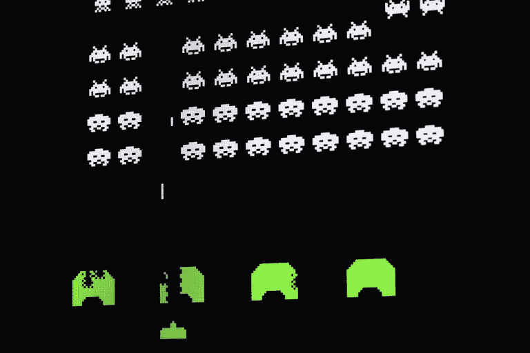
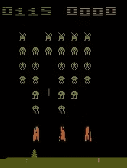
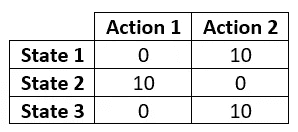

# 我如何训练一个人工智能来玩雅达利太空入侵者

> 原文：<https://medium.com/hackernoon/how-i-trained-an-ai-to-play-atari-space-invaders-b3e8756ef026>

Space Invaders

每个人都在谈论人工智能和人类智能的竞赛。AI 什么时候会完全超越人类的能力，控制我们大部分的日常生活？当人类花时间去上学和自学时，人工智能在竞争中取得优势做了什么？人工智能需要加强它的游戏！

除了笑话，人工智能中有一种技术叫做强化学习(RL)，它允许人工智能训练/教会自己如何执行某项任务。以我为例，我用 RL 训练了一个 AI 来玩雅达利版的《太空入侵者》！

在这篇文章中，我将介绍创建一个 RL 代理所涉及的概念，比如我制作的这个。如果你想看 Python 的实现，我还会附上我的代码！

## 在我们开始之前…

我将在整篇文章中使用以下术语。如果你还不熟悉它们，那么…给你！

**智能体—** 人工智能玩家。在这种情况下，将是底部的射手攻击外星人

**环境—** 智能体的完整环境(即智能体前面的障碍物和上面的外星人)

**动作—** 代理可以选择做的事情(例如向左移动、向右移动、射击、不做任何事情)

**步骤—** 选择并执行 1 个动作

**陈述—** 人工智能所处的当前情况

# 那么强化学习是如何工作的呢？

我简单提到了强化学习可以用来帮助一个 AI 训练自己，但是它实际上是如何工作的呢？在 RL 中，人工智能在一个基于奖励的系统上训练。

回想小学的时候。每次你做对了，你的老师可能会给你一块饼干或一张贴纸。这将鼓励你做更多类似的行为，因为你想要尽可能多的饼干和贴纸。每次你做错了事，你可能会得到一个暂停或失去休息，这将阻止你再次这样做。代理以非常相似的方式学习。我们设定条件，如果人工智能正确跟随，他们将获得想象中的奖励。如果他们做了错事，他们就会失去这些奖励。

当我们将此应用于太空入侵者时，代理从环境中提取观察结果，这将有助于它决定采取正确的行动。例如，如果它看到一颗子弹朝它飞来，它就会闪开！

# 我们的 AI 如何理解环境？

退一步讲，我们的 AI 是如何在第一时间“观察”环境的？它是如何识别一颗朝它飞来的子弹，甚至是子弹是什么？它能够通过使用神经网络来完成所有这些事情。

Neural Network Diagram

神经网络(NN)是模仿人脑而建立的。就像大脑有神经元在它们之间传递信息一样，神经网络有处理信息和执行操作的“节点”(白色圆圈)。在标准的神经网络中，有三种基本类型的层:输入层、隐藏层和输出层。输入层取输入，经过隐层处理，最后在输出层吐出输出。

Convolutional Neural Network Diagram

我们将使用一种特殊类型的神经网络，称为卷积神经网络(CNN)。CNN 的独特之处在于其分析图像的能力。它们包含卷积层，卷积层将图像作为输入，并逐个像素地扫描图像。每个卷积层的设计就像一个过滤器，在图像中搜索特定的东西。你可以用图层来搜索像正方形一样普通的东西，或者像鸟一样复杂的东西！

好吧，我们的人工智能可以分辨出我们周围的环境。探员小心子弹。

Static state

它往哪边走？它跑得有多快？我们能穿过去而不被击中吗？

所有这些事情都不能用静态图像来确定，所以就像我们没有这些问题的答案一样，人工智能也没有。

为了让我们的人工智能能够正确理解环境，我们需要做的最后一件事是**堆叠**图像以增加方向感。如果我们拍摄一张图像，等待几帧，再拍摄另一张图像，依此类推，我们就能够为我们的人工智能创造出类似 GIF 的东西。

4 states stacked on top of each other

看子弹朝我们飞来，以什么速度飞来，就容易多了！

# 用 Q-Learning 学习玩游戏

在这一点上，我们给了人工智能射击外星人的奖励，人工智能知道如何理解环境，但我们仍然缺少一个基本组件。人工智能如何知道在什么情况下做什么？

如果你或我来玩这个游戏，我们会有一个做什么的大致想法。射击外星人和躲避子弹，简单！但是我们怎么知道要这样做呢？从过去的经验来看，我们知道中枪是不好的，为了赢得一场比赛，你可能必须杀死所有的敌人。问题是，人工智能没有过去的经验。把它想象成一个有能力玩电子游戏的婴儿。

那么还有什么比玩游戏更好的学习游戏的方法呢？

在我们这样做之前，最好有一种方法来记住什么有效，什么无效。所以人工智能会首先创建一个叫做 Q 表的东西。

Example Q-Table

Q-Table 包含游戏中每个可能动作的一列，以及游戏中每个可能状态的一行。在他们相遇的单元格中，我们把在给定状态下做那个动作所期望的**最大未来预期报酬**。凭直觉，人工智能将总是执行能带来最高回报的动作。

我们不能指望马上知道所有未来的奖励，因为那样我们就不需要一个人工智能来玩这个游戏了。我们通过**贝尔曼方程预测这些数字。**

如果你和我一样，你可能只是看着它就头疼。为了分解它，我们从一个动作/状态对中获取奖励，并使用神经网络来预测下一个状态中的最高预期奖励。我们对每个可能的行动都这样做，并取最高值。最后，我们执行将产生计算好的奖励的行动。我们的 AI 总是领先一步！

当人工智能真正开始玩游戏时，我们使用一种叫做**ε-贪婪的训练方法。**开始时，ε的值很高。当 epsilon 很高时，AI 会随机选择它的动作，因为没有知识来作为它动作的基础。当 AI 无意中发现奖励或惩罚时，它开始将在某些状态下执行的某些动作关联为好或坏，并相应地填写 Q 表。随着训练的进行，ε的值慢慢衰减。ε的值越低，人工智能基于其 Q 表而不是随机生成 Q 表来做出决策的可能性就越大。

当ε实际上变成 0 时，人工智能应该有一个填好的 Q 表来帮助它做决定。

# 来看看我的 AI 玩太空入侵者

带着这些概念，我开发了自己的 AI 来玩太空入侵者。链接到我的代码是正确的[在这里](https://colab.research.google.com/drive/1DggF1gE3FjRu4ftYhYoxQCxLIOaxwVyw)。

总的来说，考虑到它所做的大量训练，人工智能表现得相当不错。人工智能通常需要非常长的训练时间和大量的计算能力。当你认为你的人工智能已经学会了这一切，它会遇到一个新的问题！我的人工智能最近发现，如果外星人到达底部，它可能会失败。从视频中可以看出，它完全忽略了越来越近的外星人。随着更多的训练，它应该意识到，它可以通过在外星人到达底部之前射击他们来增加总奖励，因为这将延长游戏时间。

# 关键要点

**强化学习**是一个系统，在这个系统中，人工智能因为做了正确的事情而得到奖励，因此它学习什么该做，什么不该做

**卷积神经网络**是一种特殊类型的神经网络，可以使用**卷积层**识别图像

**Q-Learning** 是人工智能玩游戏，并在一个 **Q-Table 中记录在什么状态下什么动作给予什么奖励。**经过大量训练后，他们使用“发展 Q 表”来发挥他们的最佳能力