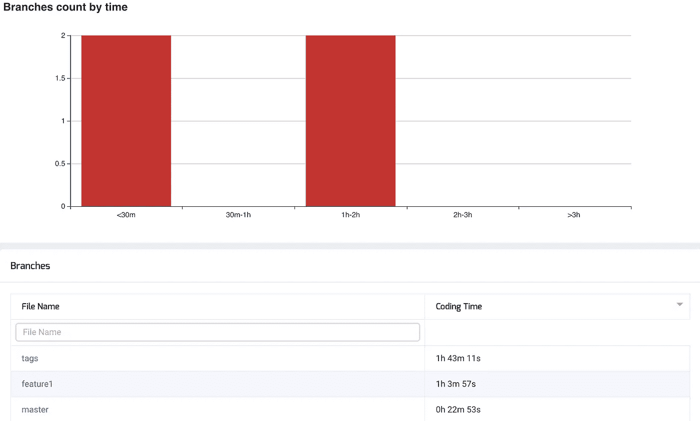
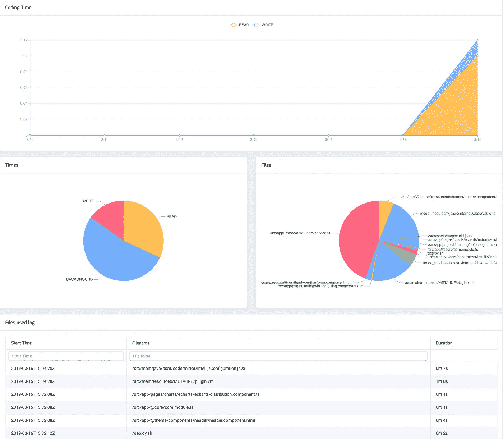
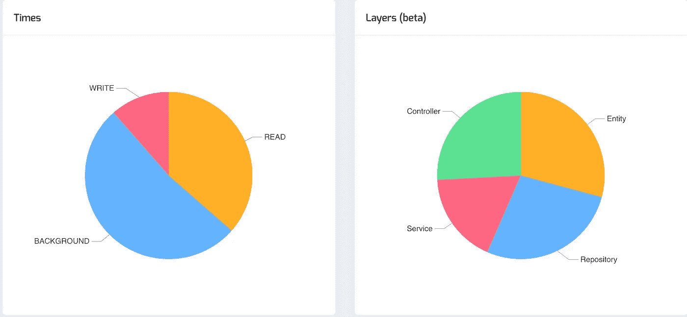
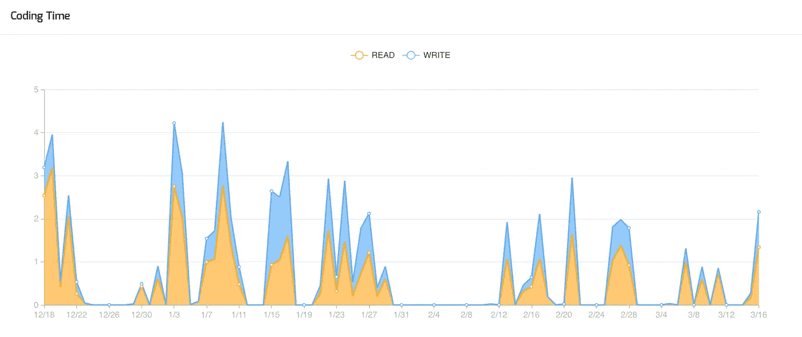

# 我如何使用时间追踪来持续改进

> 原文：<https://medium.com/hackernoon/how-i-use-time-tracking-for-continuous-improvement-e4be89ff65c0>

您听说过开发人员的时间跟踪，但是您正在充分利用收集的数据吗？每周预约 15 分钟来看看你的时间安排会对你的工作方式产生很大的影响。

开发者时间而不是控制的工具应该是关于提高你达到精通的能力。

时间追踪器不需要让你为花在编码上的时间感到自豪，或者为分心和浪费的时间感到内疚。

他们的数据可以帮助你了解你如何花费时间，并指出值得改进的地方。

以下是过去两年从几个项目中收集时间跟踪器数据后的一系列学习和观察。截图是用 [CoderMirror](https://www.codermirror.com/) 拍摄的，这是我开始的一个项目，目标是创建一个时间跟踪器，专注于开发人员的持续改进。

**探索时机**

最初，我开始查看分支。在分支和任务之间通常有 1-1 的关系，我从那里深入到细节。

当有异常值时，如果任务花费的时间比预期的长，我总是试图用记录的数据回答的第一个问题是为什么。

分支报告显示编码时间线、时间、文件和编码时访问的文件日志。通常，这足以记住关键细节，理解时间是如何花费的，为什么，并在需要时寻求解决方案。

在其他情况下，改进的关键在于更一般的报告。

通常，阅读代码和在后台使用 IDE 所花费的时间占主导地位，但编写代码的时间比例异常低通常是由于对规范理解不足、不熟悉的技术、难以扩展代码库或中断造成的。

**优先考虑改进机会**

花在层上的时间或花在领域与基础设施代码上的时间有助于排列哪种改进对您的生产力影响最大。

花在基础设施代码上的时间暗示，花时间搜索对您的问题有用的库或深入学习您选择的框架可能是很好的投资。如果你的大部分时间都花在领域代码上，这可能不会影响生产力。

同样，如果您的大部分时间都花在数据库层上，那么改进控制器可能不会提高您的生产率。

具有高读取时间的代码段是检查可读性重构在这些领域是否有用的一个指标。

一旦做出决定，就可以通过查看编码时间如何随时间变化或者比较两个选定日期之间的快照来监控其有效性。

**看大图，不仅仅是编码**

你是否观察过刚刚完成的重做工作比原来花费的时间少？经常会遇到这样的情况:对同一个形进行多次编码，你的完成时间会随着每次尝试而显著减少，有时随后的尝试会比第一次少花 90%的时间。

开发人员的时间大致分为 95%:决定做什么，理解并解决问题，找出代码行不通的原因，5%打代码。

一个常见的错误是只关注技术和只影响打字时间的措施，而忽略对你的时间有更大影响且与技术无关的行为。

完成一个特性的成本可能不在编码部分，详细的度量标准如读/写/后台计时揭示了这种模式。

在团队管理实践之外，在规范或设计阶段投入更多的时间，与领域专家交谈，绘制 CRC 图，在进入代码之前讨论替代实现，这些都是解决这种情况并帮助更快交付的有效方法。

**作为护栏的时间跟踪**

持续的自我提升需要尝试新事物，而时间指标可以准确衡量你的改变所带来的影响。

当引入新的技术或技巧时，时间跟踪是帮助你达到目标的有效性的一个衡量标准。

例如，引入一个新的库通常会影响一个应用程序层的时间，在预期的时间范围内缺乏改进可能表明该操作没有按预期工作。

另一个常见的情况是新技术或技巧应用不正确。当团队引入 TDD 或单元测试时，这种场景我已经见过好几次了。

它们是看似简单的实践，尽管很容易理解，但在实践中很难应用，因为需要时间来适应新的流程。此外，有效的单元测试需要具有适当的面向对象实践的代码，没有单元测试的代码库很可能缺少可测试的类。

我发现 20%是投入到单元测试中的时间的一个常见度量，但是在一个单元测试新手的团队中，这个数字会显著增加。监控“代码与测试”报告可以作为进一步投资单元测试培训的指导方针。

**结论**

大多数时候，我们对如何度过时间的看法以及我们应该改进什么的决定是正确的，但是面对相互竞争的任务，我们并不总是做出最好的决定。时间追踪让你质疑并再次检查你对哪些地方最有希望改进的看法。

时间指标显示你可以利用的模式可能需要很长时间，你必须做长远打算，把时间回顾变成例行公事。

一旦变成一种习惯，你将有信心决定下一步要改进什么，下一步要学习什么，客观地，通过衡量结果从过去的决定中学习。