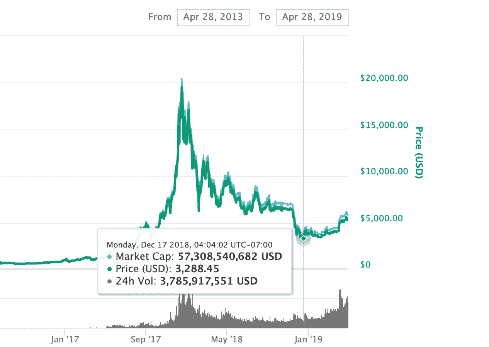

# 非理性繁荣如何将网络泡沫和加密泡沫联系在一起

> 原文：<https://medium.com/hackernoon/how-irrational-exuberance-aligned-dot-com-and-crypto-bubbles-d2f14f1d92ab>

# **简介**

几乎所有市场都会在某个时候经历泡沫。但并非所有的泡沫都是一样的，由于各种事件、炒作或对全球经济的潜在影响程度，其中一些泡沫往往会受到更多关注。

只是为了一个视角，在他们发展的某个点上，以下股票的价值出现了明显的下跌:GOPRO (GoPro): -95%，FIT(FitBit):-92%；LC(lending club):-91%；SNAP(最知名的是 Snapchat 的一个创造者):-83%；ZNGA(Zynga):-77%；TWTR(推特):-63%；SPOT(Spotify):-48%；DOCU:45%；脸书联邦储备银行:42%。

或许与臭名昭著的加密崩溃最明显的类比是网络泡沫。在互联网泡沫破裂期间，加密市值最高时下跌了 80%，而纳斯达克综合指数下跌了 78%。其他相似之处包括爆炸式增长和对底层技术能力的宏伟期望。

这是否意味着加密市场正在遵循互联网泡沫的模式？

事实上，网络泡沫和假想的加密泡沫有许多惊人的相似之处。

# **简介**

## **网络公司**

20 世纪 90 年代初，互联网迅速崛起，到 90 年代中期，家庭电脑拥有率从 15%迅速上升到 35%。由于低利率，对“下一件大事”的感觉刺激了基于互联网的公司的推出，并获得了大量投资。

## **密码**

21 世纪初，比特币及其基础技术区块链迅速崛起。几年后，越来越多的宣传，快速致富的热潮，以及分散化和不受政府干预的金融体系的想法刺激了许多区块链公司的成立，由于一些国家的经济稳定和其他国家缺乏稳定，这些公司获得了大量的投资。

# **投资 FOMO**

## **网络公司**

添加中。com 公司的名字大大提高了公司的估值。这些公司中的大多数没有利润，但是纯粹的投机和缺乏坚实的基本面导致它们的估值明显过高，以及投资者对“下一件大事”的兴趣。

## **加密**

在公司名称中添加“密码”或“区块链”字样会显著提高公司的估值。这些公司大多没有产品、稳健的商业模式或利润。然而，纯粹的投机和缺乏坚实的基本面基础导致了它们的显著高估，以及投资者对“下一件大事”的兴趣。

# **IPO 和 ICO**

## **IPO: Dot-com**

随着泡沫的增长，投资银行介入其中，从首次公开募股(IPO)中获得巨大利润，并随后招揽更多投资。

## **ICO: Crypto**

随着泡沫的增长，硬币发行公司参与进来，从首次硬币发行(ICO)中获利颇丰，融资总额达到 87 亿英镑。

# **巅峰**

## **网络公司**

许多人开始全职交易，投资者一夜之间变成了百万富翁。1995 年至 2000 年间，纳斯达克综合股票市场指数上涨了 400%，在 2000 年 3 月达到了 6 万亿美元的历史最高值。

## **加密**

在 2016 年至 2017 年期间，比特币和许多其他硬币的价格不断上涨，到 2017 年底，比特币价格升至 19k 美元。许多投资者开始全职交易，一夜之间变成了百万富翁。

# **泡沫破裂**

## **网络公司**

期望值很高，市场过于兴奋，而许多网络公司无法提出可持续的商业模式来帮助他们证明公司估值和投资资金之间至少存在一些相关性。

网络泡沫破裂发生在 2000 年 3 月，就在纳斯达克指数创下 5048 点的高点后不久。随后，英特尔、戴尔和思科等大型科技公司纷纷抛售股票，引发公众恐慌。

## 秘密党员

人们的期望很高，市场过于兴奋，而许多区块链公司无法开发出可持续的商业模式，这至少有助于证明公司估值和投资资金之间存在某种关联。

比特币价格超过 19k 美元后不久，加密泡沫于 2017 年 12 月破裂。这是许多投资者抛售比特币和其他加密资产的转折点，导致了更多的恐慌。

# **续集**

## **网络公司**

在泡沫破裂后的两年内，纳斯达克综合指数从 5048.62 点跌至 1114.11 点，相当于 77%，价值 5 万亿美元的投资消失了。

数百家公司清算了仅剩的一点资本，并于 2004 年关闭。48%的公司设法继续运营。一些设法维持下去的公司最终超过了它们最初的市值。其中包括亚马逊和谷歌。

## **密码**

数百家公司清算了他们仅剩的一点资本，并于 2019 年关闭。只有一些公司设法继续经营。其中一些遭到了监管机构的指控。

设法维持下去的公司可能会超过它们最初的市值。新的参与者正在进入这个行业。

# **共同点:网络公司&加密**

> 根据摩根士丹利的报告，加密货币价格图和纳斯达克指数图确实相关。
> 
> 在这两个历史事件中，对快速获得金钱回报的渴望和对新的破坏性技术的兴奋助长了基于 FOMO(害怕错过)的投资，最终高达 80%的跌幅。

# **后泡沫时代**

## **网络公司**

1999 年 12 月，亚马逊的股价达到了 107 美元的峰值，这是该公司在接下来的十年中第一次也是唯一一次达到峰值，随后在大约一年的时间里大幅下跌了 90%，跌至 6 美元。几乎花了十年时间才达到之前的高点。如今，AMZN 的价格为 1950 美元，比 6 美元的低点上涨了 32000%。

**密码**

崩盘后到现在，炒作已经下降，投机回到正常水平。与此同时，这些公司正在开发技术和推出新产品，而监管机构正在制定行业的监管机制。所有这些进步导致缓慢但肯定的采用。

加密市场领导者比特币(BTC)目前的交易价格略高于 5000 美元，比 2017 年 12 月约 19665 美元的历史高点下跌了 75%。

> 如果我们继续下去，在这些市场领导者的表现之间画一条直线，我们可以预测比特币惊人的未来。假设我们将比特币在所有高点之后的最低点定为 3，288.45 美元，那么 AMZN 约 32000%的增长率将使我们达到每比特币约 1，052，304 美元。

不管这个价格点有多现实，这个网络比较提供了一个我们应该考虑的观点。然而，重要的是要注意，盲目地将互联网市场领导者之一的价格与比特币进行比较是不成熟的。

# 这很重要吗？

虽然这种比较为比特币和区块链行业的未来提供了一个有趣且可能的观点，但任何努力的成果，无论是新技术、新型货币还是全新的行业，其价值最终都必须保持一致。成功因素包括效率/技术稳健性、市场采用、网络效应、对经济和行业的影响规模、团队和社区。

提供价值的范围将决定区块链产业的亚马逊和谷歌。与此同时，虽然比特币正在不断改进，但我们很可能会看到新的市场参与者进入游戏，他们唯一的愿望就是获得桂冠。

喜欢这篇文章吗？请“鼓掌”并分享，让更多的人可以找到并阅读它。