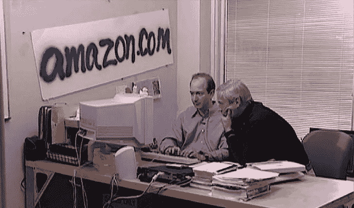
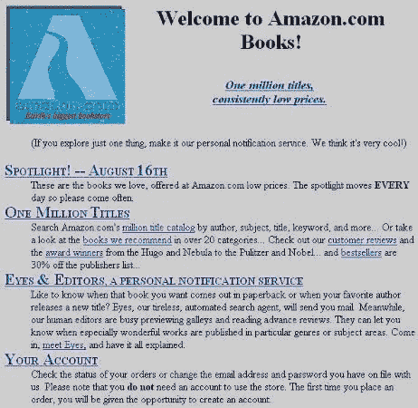
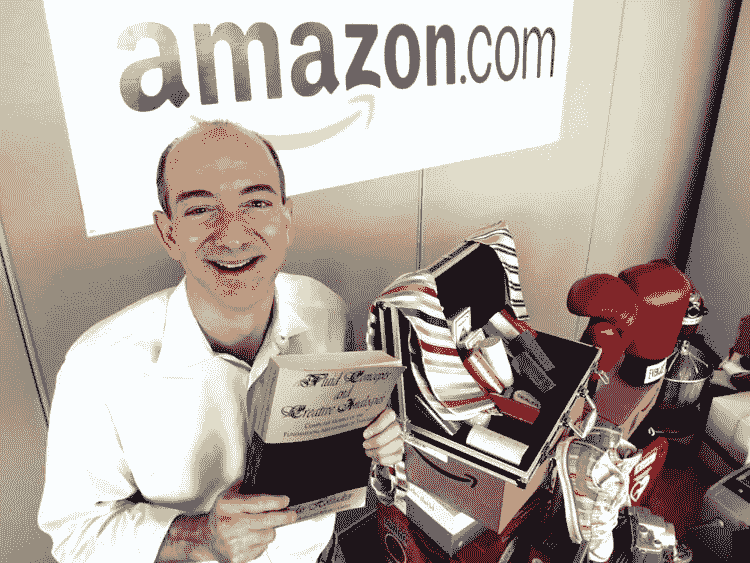

# 万亿美元公司的 14 个核心商业价值

> 原文：<https://medium.com/hackernoon/how-jeff-bezos-built-a-trillion-dollar-company-on-14-core-values-8ce2315724ec>

## 学习杰夫·贝索斯的方法

我们都熟悉亚马逊在网络领域的主导地位。到 2021 年，亚马逊预计将拥有全球在线零售市场 50%的份额。但这家成立于 1994 年的公司是如何如此快速地发展到如此惊人的规模的呢？亚马逊的创始人兼首席执行官杰夫·贝索斯将公司的成功归功于亚马逊工作文化核心价值观的牢固树立。

在最近的一次采访中，贝佐斯讨论了核心价值观在经营企业时有多重要。当被问及他是否担心亚马逊在涉足新技术领域时可能会向太多方向扩张时，他回答说，只要同样的价值观适用于每一项商业冒险，他就不怕大胆下注。

他的赌注有了回报，很大一笔。2018 年，贝索斯成为世界首富。尽管他开玩笑地说这个头衔并没有造成很大的不同，因为成为第二富有的人也不坏，他的净资产为 1120 亿美元，现在比比尔·盖茨更富有。

**早年**

亚马逊由杰夫·贝索斯于 1994 年创立。在 20 世纪 90 年代，很少有人使用互联网。然而，贝佐斯偶然发现了一个有趣的统计数据。据这位企业家说:“我发现网络使用率正以每年 2300%的速度增长。我从未见过或听说过增长如此之快的东西，建立一个拥有数百万种图书的网上书店的想法让我非常兴奋。”然而，贝佐斯很快意识到，除了书籍，亚马逊可以出售任何东西。

为了创办这家公司，30 岁的贝佐斯投资了他作为对冲基金经理的积蓄。他开车穿越全国，在华盛顿州的西雅图创办了亚马逊。他选择了亚马逊这个名字，因为它在大多数其他电子商务公司中按字母顺序排名第一。贝佐斯将亚马逊的早期描述为繁忙的周末工作日，他的团队努力接触更多的客户并让他们满意。

从那以后，亚马逊不仅仅专注于书籍或在线销售。他们已经扩展到硬件、云服务，甚至正在试验双足机器人。但贝佐斯表示，所有这些企业都有一条共同的主线:同样的 14 个核心价值观。在这里，它们都有解释和例子。

**1。顾客是第一位的**

贝佐斯表示，他在亚马逊的目标之一是成为“世界上最以客户为中心的公司”。他想提高人们对企业的期望。正如贝佐斯指出的那样，尽管顾客可能不知道他们想要更好的东西，但总有办法不断改进。以亚马逊对 Prime Air 的投资为例，这是一项旨在通过无人机快速递送包裹的服务。现在，许多人认为当天送达感觉很棒。但是一个小时内送货怎么办？如果你经常这样，你可能会非常失望，如果你订购的物品需要一整天才能到达！

**2。领导是主人**

在亚马逊，贝佐斯鼓励所有员工进行长期思考。任何领导都不应该说“那不是我的工作”为了短期结果而走捷径是不被允许的。贝佐斯是“慢慢变富计划”的倡导者，也就是所谓的长期努力工作，他开玩笑说，这对于寻找快速退休方式的企业家来说不太好卖。贝佐斯还认为，领导者应该代表整个公司行事，而不是仅仅推动他们团队的利益。在一个平衡的公司里，每个团队的利益应该是一致的。

**3。好的领导总是对的**

这一点乍一看似乎有悖常理。优秀的领导者不应该对怀疑自己和改变想法持开放态度吗？贝佐斯是这么说的，但他也指出，优秀的领导者有经验和倾听技巧来帮助他们做出伟大的决策。“熟能生巧”这句老话很好地概括了这一点如果你想成为一个伟大的领导者，那就做一个值得倾听的领导者。如果你想成为值得倾听的人，从倾听开始。最重要的是，对改变你的想法保持开放，永远不要发展自我。

**4。胸怀大志**

胸怀大志是企业家最重要的部分。从统计数据来看，更多的创业公司会失败。除非你真的很有经验，否则当你真正尝试时，大多数想法都不会那么好。这就是作为软件或硬件开发者的现实。也就是说，拥有远大的梦想是变得伟大的先决条件，并且永远如此。贝佐斯一开始以为自己只会卖书，但很快意识到亚马逊可以卖任何东西。云服务和 Kindle 都是值得的大赌注，但需要大量的时间和精力来开发。每一个巨大的成功都要为大量的失败买单，但是创业公司只需要一两个伟大的想法就可以起步。

对自己工作的潜在影响有所怀疑是人之常情。毕竟，世界上有 70 亿人…任何一个人的工作特别有影响力或真正重要的可能性有多大？贝佐斯不喜欢这种心态。当沃尔玛和其他线下商店主导零售市场时，超越 AWS 发布时的批评，专注于亚马逊的在线服务，已经取得了回报。由于贝佐斯的远见卓识，即互联网比传统零售商具有关键的分销和增长优势，并将在未来占据主导地位，亚马逊已经能够几次超越沃尔玛等以前占据主导地位的公司。

**5。发明和简化**

贝佐斯鼓励亚马逊人去别处寻找灵感来源。此外，简化和创新的现状总是得到支持。亚马逊网上商店的目标是以创新和更简单的方式获得你想要的东西。你不必开车去任何地方，甚至可以通过“一键购买”选项获得你想要的东西。过去一个小时的差事现在在电脑或电话上只需一分钟。

技术总是在变化。无论一家科技公司变得多大，拥抱新技术都帮助了亚马逊的成长。当亚马逊在 2002 年通过推出亚马逊网络服务在云服务上下了一个大赌注时，一些批评者很快称这场赌博为“可能比其他任何事情都更令人分心”，正如 2006 年 10 月《商业周刊》的一篇文章所说的那样。但事实证明，贝佐斯是对的，现在 AWS 在开发者中家喻户晓。随着 2000 年代 Web 2.0 的快速发展，对云服务的需求激增。保持创新和制造让别人的工作更容易的产品是亚马逊成功的关键。

**6。动作偏差**

在商业中，测试不同的选项并快速做出决策可以让公司保持领先。这并不意味着匆忙做出决定，但也不意味着花太多时间去尝试容易逆转的决定。有一句老话很适用:“要快，但不要急。”

**7。节俭**

亚马逊是一家互联网企业，其核心产品不言自明。当你所有的客户都在线上找你时，没有必要用华丽的办公室来吸引更多的客户。在亚马逊，贝佐斯不鼓励花费更多资源，除非是在必要的时候。拥有更多下属或更高的团队人数不会给任何人加分。

**8。赢得信任**

贝佐斯称，赢得客户和同事的信任至关重要。客户不信任你就不会回来，其他公司领导不能信任你也不会尊重你。对于像亚马逊这样的公司来说，维护一个专业的网站和良好的客户支持大有帮助。许多早期的互联网创业公司必须让早期客户相信他们在网上购买的商品会真正到达。要做到这一点，他们必须建立可靠的网络声誉，而且必须继续这样做。那是很大的工作量。正如沃伦·巴菲特所说，“建立一个声誉需要 20 年，毁掉它只需要 5 分钟。”

**9。深潜**

当做出需要深入了解的决策时，领导者不会委派问题。他们收集数据，审核他们能做的一切，并在做出决定之前寻求对问题的整体理解。当衡量标准和轶事不一致时，好的领导者会一头扎进去，试图找出不一致的地方。

**10。不同意&提交**

贝佐斯教导说，尊重他人的决定是可以的。被动地同意你周围的人，或者同意取悦你的老板或经理意味着你实际上没有看到问题的根源。即使你是房间里唯一有不同意见的人，你也应该畅所欲言。这类似于谷歌的原则，即年龄和地位在职场中无关紧要。想法的质量要重要得多。

11。抬高员工杠

贝佐斯坚持认为，雇佣和培养最优秀的人才是提高员工素质的关键。在招聘员工时，亚马逊招聘经理正在寻找与他们目前招聘的员工一样好或更好的员工。有一句老话是这么说的“和比你聪明的人在一起”，这句话在亚马逊很受重视。他们彻底审查所有员工，并与他们目前的劳动力进行比较。

**12。好奇心是关键**

如果贝佐斯在担任对冲基金经理期间从未对网络感到好奇，他可能永远不会离开自己的工作去创办亚马逊。亚马逊的许多其他原则，比如发明和大胆思考，都需要好奇心来孕育伟大的想法。事实证明，这个原则对其他创业公司也适用。脸书现在是一个庞大的社交网络，每月活跃用户超过 22.5 亿，是大学宿舍及其居住者实体目录的在线衍生产品。

**13。有高标准**

大公司的自满导致停滞和公司的死亡。看看雅虎、美国在线和其他一系列未能创新的公司的垮台就知道了。在亚马逊，员工遵循最高标准。根据贝佐斯的说法，“这不是我的工作”从来都不是员工可以接受的回答。事实上，亚马逊员工承担着如此高的责任，以至于该公司因员工过度工作而受到批评，但贝佐斯坚持认为亚马逊员工可以拥有健康的“工作生活和谐”当被问及这种批评是否改变了他对员工工作量的看法时，贝佐斯说:“我为亚马逊的文化感到自豪……我认为这是创新和开拓性工作的黄金标准文化。”

**14。交付结果**

最好的领导者总是能兑现承诺。想想你认识的最可靠的人。你大概也可以把他们身边很多以他们为榜样的其他人想出来。也许你向大学里的导师、同事或朋友寻求建议。领导者不仅是对的，而且他们知道如何及时完成工作。

今天，亚马逊是一个万亿美元的庞然大物，主导着零售和云市场。他们正在研究加密货币、未来机器人和家庭安全。未来几十年，他们还会去哪里？

在 ELIX 博客[这里](https://blog.getelix.com/)了解更多科技趋势。