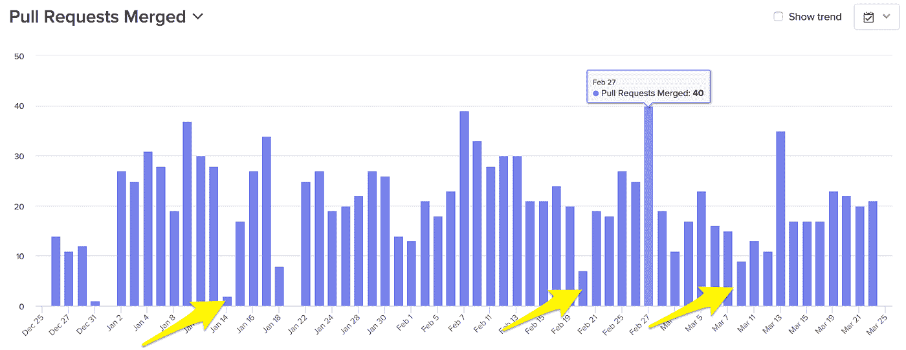
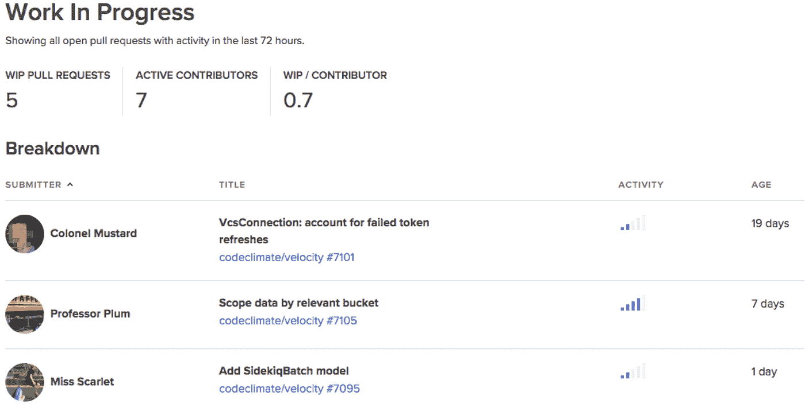

# Kickstarter 的 Mark Wunsch 如何使用工程度量来证明重构

> 原文：<https://medium.com/hackernoon/how-kickstarters-mark-wunsch-used-engineering-metrics-to-make-a-case-for-refactoring-d8a569cff581>

“有效的工程领导是以结果为导向的，”Kickstarter 的 Mark Wunsch 说。

当 Mark 第一次以工程副总裁的身份加入 Kickstarter 时，他的第一个决定是根据面向业务的目标重组工程部门。

每个 3-7 人的 scrum 团队关注不同的“本质”，或者不同的面向客户的产品部分。这有助于工程人员从商业角度理解他们的工作。马克告诉我们，“目标不是问‘代码好吗？’而是问 Kickstarter 好吗？’"

然而，工程师的观点很难与领导层沟通。

工程师经常被非技术同事看不到的问题所困扰，比如遗留代码。Kickstarter 已经存在了大约 10 年，所以代码库的很大一部分很难使用。Mark 告诉我们，“对于一个工程师来说，当一段代码变得脆弱时，这是非常明显的，但是很难提倡将工程资源用于解决技术债务。”

Mark 决定使用指标来进一步协调工程和领导力。

# 用数据诊断技术债务

每个开发人员都知道遗留代码无疑会减慢工程进度。但是，几周不发布新功能会影响公司向客户交付多少新价值。

在提出重构领导力的案例之前，Mark 决定深入探究技术债务在哪里拖慢了团队的进度。他使用工程分析工具 [Velocity](https://g.codeclimate.com/qtjuz) 来了解每个工程团队是如何工作的，以及他们可能会在哪里陷入困境**。**

Mark 从查看他的团队的每周吞吐量开始，这是通过合并的拉请求来衡量的。每当吞吐量明显低于平均水平时，他就会知道进一步调查。

*Seeing a low Pull Requests/Merged at the end of the week can be a red flag a team was stuck.*

不同于大多数工程团队中常见的主观度量，比如完成的故事点，速度度量由一个具体的工作单元来表示:拉请求。这使得 Mark 能够客观地理解，与上一次冲刺或上个月相比，scrum 团队何时真正陷入困境。

一旦发现生产率异常，Mark 就会调出一份实时报告，报告他的团队最具风险的拉动请求。打开时间较长且有大量活动(评论以及作者和审阅者之间的来回交流)的拉请求位于列表的顶部。

*An example of* [*Velocity*](https://codeclimate.com/)*’s Work In Progress which shows the old and active pull requests that may be holding up the team.*

因为应用程序中更复杂的部分往往需要更大的改动，最“活跃”的拉请求通常指向代码库中最麻烦的部分。

经过几周的调查，马克能够为他的直觉告诉他的事情找到具体的证据。“数据显示，由于遗留代码，我们的速度一直很慢，”Mark 说。

# 为工程实践带来透明度

在与管理团队的会议中，Mark 现在可以指出产出较少的几周，并证明技术债务阻碍了工程团队的主要业务目标:持续交付新功能。

为了传达团队的进展情况，他展示了一个带有趋势线的拉式请求吞吐量图表:

*A* [*Velocity*](https://g.codeclimate.com/qtjuz) *report showing Pull Requests Merged/Day, over the last 3 months.*

这有助于领导层了解 Kickstarter 在工程效率方面取得了多大的进步，以及进一步改进的机会。

Mark 还分享了周期时间(即代码从开发人员的笔记本电脑到合并到 master 的速度)。)

*A* [*Velocity*](https://g.codeclimate.com/qtjuz) *report that shows the fluctuation of Cycle time, over the last 3 months.*

周期时间是一个很好的指标，表明对代码库进行更改有多麻烦。高周期时间通常对应于一两天后的低产出，表明开发人员或团队存在某种形式的障碍。

这两个图表，以及 Mark 对他的更多技术发现的总结，让所有的领导都围绕着暂时缩减新功能，并投入更多的时间进行重构。

# 沟通工程和领导力

在花时间调查是什么遗留代码拖慢了团队之后，Mark 能够采取战略性的方法来解决技术债务。

他可以让团队首先关注最大的生产力障碍，而不是抓住机会修复任何看起来有问题的东西。工程师们很高兴，因为他们有时间返工那些一直拖他们后腿的遗留代码。当领导层看到工程速度的长期改善时，他们很高兴。重构六个月后，Kickstarter 发现合并的拉请求增加了 17%，周期时间减少了 63%。这是一个双赢的局面。

Mark 告诉我们，“能够像谈论业务指标一样谈论技术债务是非常强大的。”

如果你想**了解到底有多少技术债务拖慢了你自己的工程团队**，[试试免费 14 天的 Velocity】。](https://g.codeclimate.com/qtjuz)

【codeclimate.com】原载于