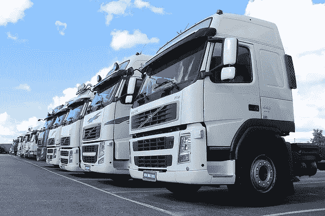

# 物流数字化将如何影响卡车运输行业？

> 原文：<https://medium.com/hackernoon/how-logistics-digitization-may-impact-the-trucking-industry-e78dab277e16>

在过去的几十年里，全球各行各业在履行职能的方式上发生了翻天覆地的变化，这主要是由于一个因素的共同作用，重新校准了一个组织内的效力和效率的深度。正是这一主要因素引发了第四次也可能是最后一次工业革命，即工业 4.0。

随着我们步入 21 世纪的第二个四分之一，数字化已经吞噬了几乎所有形式的企业，有效地改变了做事的方式和实现的手段。但是，最乌托邦式的真正数字化离我们还很遥远，只有当产品转化为服务，并开始更好地适应和响应事物的发展时，它才会发生。

在这场看似未来派的经济革命中，全球物流业是世界上每个国家经济的支柱。如果没有一个正常运转的物流产业，任何生产出来的东西都不会到达消费者手中。

但是，物流已经远远偏离了其最初定义的功能，即仅仅将货物运输给消费者和帮助商业活动。物流已经数字化。

越来越强大的数据架构遍布全国各地，使物流行业能够增强自身能力，以保证消除所有低效现象，并从其系统中清除资源浪费。

这一梦想将通过各种形式的颠覆性服务来实现，如自动化货运匹配和预测性需求分析。然而，所有这些变化只有在卡车运输业也经历一场惊人的变革时才有可能，这场变革的核心就是这些完全相同的数字化原则。

卡车运送了全国 70%以上的货物，但在当今高度互联的世界中，消费者使用他/她的智能手机，在亚马逊等大型电子商务企业的帮助下，只需轻轻一划，就可以购买从手表到 3D 打印机的任何东西，他们需要带来更多东西才能保持相关性。

这是因为，如果交付时间不向前移动以匹配交易发生的难易程度，则周期完全没有结果。

在 MHI 最近发布的 2017 年行业报告中，近 80%的顶级企业高管表示，未来五年内，全球供应链将日益数字化，主导物流领域。然而，就数字化而言，卡车运输业仍处于初始阶段，唯一的车载“连接”仪器是发动机和轮胎预测系统以及新引入的电子测井设备或 ELDs。

卡车仍有大约 95%处于“未连接”状态，这使得它无法有效地响应数字供应链对它的要求。

无人机技术、云计算甚至人工智能领域的最新进展，使物流行业不仅开始开发更好、更高效、反应更快的交付机制，还打破了将整个供应链中主要利益相关者分隔开来的壁垒，简化了沟通，并允许建立更好的需求和供应预测模型。

为了跟上这一步伐，卡车运输业必须迅速做出反应，转变其传统方式，从产品转向服务。经济中的许多人吹捧卡车运输是一种服务或(TAAS)是下一个存在巨大机会的领域。

到目前为止，在这方面的发展越来越有希望。

典型的汽车共享公司优步已经开始涉足其颠覆性服务，这种服务也适用于卡车运输行业，可以更有效地匹配空间和负载，并消除对话者，但它的努力并没有就此停止。

其子公司奥托(Otto)开发的无人驾驶卡车在美国的州际公路上首次亮相，这表明该行业可以通过降低成本和提高运营效率，从这种技术实力中受益匪浅。

即使是特斯拉，另一家专门从事自动驾驶系统和电动汽车的汽车制造公司，也展示了自己的半卡车，一次充电能够行驶约 200-300 英里，有效地使其变得非常适合于满足电子商务公司的追求，通过定制目的开发的卡车在城市和人口密集地区高效地实现当天交付。

但更重要的是，特斯拉计划为这些卡车和车辆提供所需的电力，最初免费，然后收取象征性的费用，远低于使用柴油和石油等化石燃料所需的费用。这些彻底的改革和破坏最终可能会改变当今世界的货运方式。

这还不是全部，其他技术也在测试中，最值得注意的是队列和将卡车有效连接到物联网的技术。这些技术可以通过消除不必要的附加服务，帮助卡车运输业实现创纪录的利润。

然而，如果要实现最佳盈利能力，变化的速度需要很快，并且必须考虑到相关行业不断增长的需求，无论它们是商业企业这样的老伙伴还是电子商务行业这样的新客户。这意味着试图灌输需求，并以难以置信的轻松提供定制服务。

追求所有这些目标的动机是如此强烈以至于无法放弃。新进入者将从数字化对该行业的影响中获得最大收益，因为随着货物运输成本下降和效率飙升，他们现在将更容易扩展业务。在不久的将来，[英国](https://www.ogscapital.com/)、美国、中国、印度和其他以消费为导向的人口大国的商业计划顾问将被要求制定商业计划，这些商业计划需要考虑新发现的优势，这些优势可用于在初始水平上扩大小型企业的前景。

工业 4.0 旨在通过增加利润和帮助环境形成更好、更灵活和更友好的供应链来彻底改变全球经济，而卡车运输无疑是这一巨大变化中的首要推动者。

可以轻描淡写地说，物流的数字化将影响卡车运输业。相反，卡车运输行业本身将不可避免地数字化，从而与物流行业整合，形成一个简化的全球供应链结构，能够刺激全球经济进入其自开始以来最令人难以置信和令人振奋的最终增长阶段。