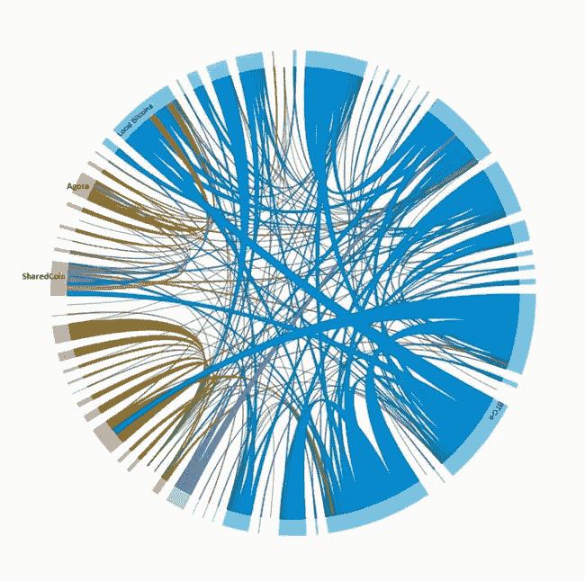
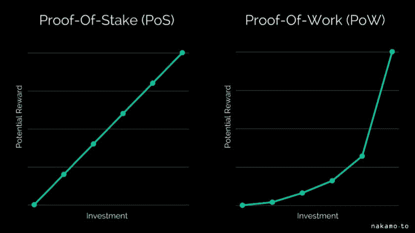
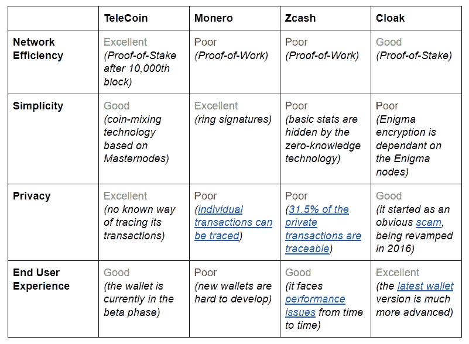

# 电源、PoS 和主节点如何共同保护您隐私

> 原文：<https://medium.com/hackernoon/how-pow-pos-and-masternodes-work-together-for-your-privacy-7dffd4aa351f>

你会把加密货币和隐私联系起来吗？你不是唯一一个。然而，你和大多数不熟悉区块链技术的人都被误导了。事实上，大多数加密货币只提供匿名的基本组成部分。

区块链是你交易的公共分类账。即使有像 [TeleCoin](https://telecoin.info/) 、 [Monero](https://www.getmonero.org/) 或 [Zcash](https://z.cash/) 这样实现不同方法的专注于隐私的硬币，在最受欢迎的情况下(比特币、以太坊和莱特币)，你只是受益于一种虚假的匿名感。当使用这些流行的硬币时，你应该是在使用一个匿名地址，没人知道你是它的主人。然而，所有进出交易的资金对任何有足够好奇心的人来说都是可见的，例如政府当局。

所以，这个过程和在没人认识你的商店里使用现金是一样的。你的交易被收款机接收(和区块链的加密货币一样)，但是没有人要求你出示身份证。你唯一能确认的就是那些无法追溯到你身上的现金账单。然而，如果有人在商店里认出你，那就改变了一切。

你的隐私受到保护，直到被证明不是这样。加密货币也是如此。如果有人能把你的比特币地址和你的身份匹配起来，你的隐私就被泄露了。

# 谁把你的隐私置于危险之中？

意识到已经有公司在开发能够在区块链上追踪数字身份的[软件，如 Polycoin、Coinalytics 和 Chainalysis(后者为执法部门提供这些调查工具)，隐私成为加密货币用户更大的担忧。](https://www.coindesk.com/chainalysis-1-6-million-europol-cybercrime)

虽然这些跟踪程序适用于大多数硬币和代币，但有一类正在不断开发技术解决方案来保护用户的隐私。这些关注隐私的硬币被设计成通过隐藏交易细节来实现默认隐私。他们仍然使用公开的分类账，这当然是分权运作的方式。唯一的变化是交易信息在一定程度上被混淆了。在网络上交易的金额仍然是公开的，但只有参与交易的人才能知道在任何给定的交易中涉及哪些地址。这听起来像是我们期望从金融交易中获得的隐私级别，对吗？

[https://www.chainalysis.com/](https://www.chainalysis.com/)

有不同且成功的方法来解决加密货币的隐私问题。以下是受欢迎的:

*   [TeleCoin](https://www.telecoin.info/) 设计了一个具有主节点功能的利益相关隐私令牌 TELE。Masternodes 用于通过硬币混合技术保护交易细节，保证零确认交易，并允许分散的区块链投票。由于他们独特的方法，我们将更详细地介绍他们的特殊解决方案。
*   [Monero](https://www.getmonero.org/) 仍然使用工作证明协议，但是他们实现了环签名，以保护参与交易者的身份。环签名用一组可能的签名者的集体签名代替了交易中的个人签名。
*   T4:Zcash 网络与通常的区块链结构没有什么不同，只是增加了一点:区块链上完全加密的数据。它允许两种类型的交易:公共交易(非加密)和私人交易(加密)。这项技术被称为零知识加密，它允许网络节点在网络共识规则下验证交易的有效性，而无需经过加密。
*   斗篷提供了两种加密方式供用户选择。一个是名为洋葱路由隐私协议(用许多层加密消息，很像洋葱)的点对点解决方案，另一个是名为 Enigma 的解决方案，其中交易数据与随机数据混在一起。在第二种情况下，只有 Enigma 节点能够识别输入和输出数据是否准确。

正如你所知，大多数加密货币只是“修补”了已经建立的区块链结构。Zcash 正在加密交易数据，但这使得它很难跟踪任何投资者都应该可以获得的简单统计数据，如当前的流通供应量。Monero 改进了交易的签名部分，但这使得为其令牌实现一个[工作钱包](https://monero.stackexchange.com/questions/3616/how-hard-is-it-to-create-a-monero-wallet-site)变得非常困难，影响了它的采用。斗篷无疑在加密方面带来了改进，但要变得可用，它还有很长的路要走。这就是 TeleCoin 与竞争对手的区别。

# 权力或职位增加隐私？

TeleCoin 与区块链基于相同的原理:一系列有数字签名的区块。转移 TELE coins 需要您在之前交易的散列和接收者的公钥上签名。所有这些交易然后被公开广播给基于共识的网络。

虽然许多硬币正在通过工作证明(PoW)协议积极达成共识，但 TeleCoin 只是在有限的时间内使用它来激励用户加入网络，成为节点，并建立社区。然而，PoW 需要昂贵的计算机计算，也称为挖掘，这在当前环境下是缓慢且低效的。只知道它是 1993 年第一个[推出的](http://www.hashcash.org/papers/pvp.pdf)，会让你认为更好的替代品可能已经在那段时间被发明出来了。这个更好的选择叫做利益证明(PoS)。从第 10000 个区块开始，TeleCoin 将切换到 PoS 协议，用户只需出示一定数量的加密货币单位的所有权，就可以参与区块创建。

[https://medium.com/nakamo-to/what-is-proof-of-stake-pos-479a04581f3a](/nakamo-to/what-is-proof-of-stake-pos-479a04581f3a)

PoS 允许电信网络进入加密货币的未来，并成为支持加密空间效率和性能的先锋。其他协议，尤其是 PoW，需要昂贵的硬件和高额的电费，而有了 PoS，TELE wallet 可以在大多数消费者的笔记本电脑上运行。例如，一个拥有现存所有硬币 1%的电视所有者将直接在网络上获得 1%的股份，这为他/她[带来每开采一个区块 0.8409 的奖励](https://www.telecoin.info/wp-content/uploads/2018/11/Telecoin_Whitepaper.pdf)。这不仅仅是获得被动收入，也是成为网络的积极参与者。

# 主节点呢？

首先，PoS 和 Masternode 技术有两个共同点:为被动收入下注硬币和保持网络安全。然而，Masternodes 通常不会创建新的块，它们只有拒绝块和验证事务的权力；主节点是一种基于 PoW 或 PoS 协议增强网络的方式。Dash 是第一个引入 Masternodes 作为 PoW 协议升级的硬币。PIVX 采取了相反的方法，沿着 PoS 使用 Masternodes。

在 TeleCoin(构建于 Dash 和 PIVX 之上)的情况下，Masternodes 虽然仍不参与块的创建，但在交易隐私方面具有重要得多的作用。

TeleCoin 主节点涉及网络的每个功能:

*   Masternodes 中持有的抵押品的混淆，即交易变得更难追踪的过程，被用于硬币混合。
*   SwiftTX 保证更快的零确认交易是可能的，因为 Masternodes 中的抵押品赌注用于在几秒钟内发送给接收方。
*   TeleCoin 的分散投票系统基于主节点的参与，在该系统中，未来的进步通过相互协商决定。

运行一个 TeleCoin 主节点[需要 10，000 个 TELE token](https://www.telecoin.info/wp-content/uploads/2018/11/Telecoin_Whitepaper.pdf)作为抵押品。由于 Masternode 参与者在整个网络中的重要性，与仅通过 PoS 协议下注相比，他们会获得稍高的奖励。作为网络的积极参与者、赌注或成为主节点没有任何限制。事实上，参与其中的每个人都有保证的回报。

# 加密货币需要隐私

随着[中国和韩国政府](https://www.scmp.com/news/china/economy/article/2111456/why-has-china-declared-war-bitcoin-and-digital-currencies)最近的行动，仍然很明显的是，隐私成为任何想要在与当局的斗争中存活下来的加密货币的一项要求。双方都将取得技术进步，加密货币和政府的跟踪软件。这就是为什么前一段时间有效的解决方案今天不再可行。我们应该寻找不同的方法和项目，这些方法和项目愿意使用今天有效的技术，这样我们就可以在明天有效的技术基础上继续发展。