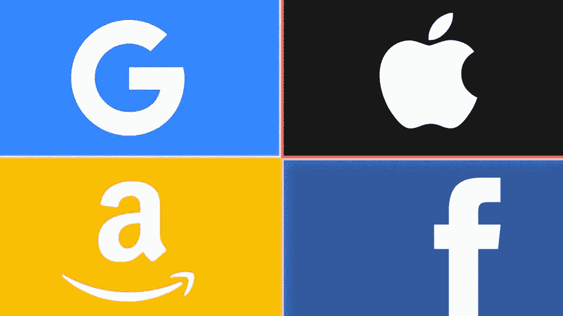
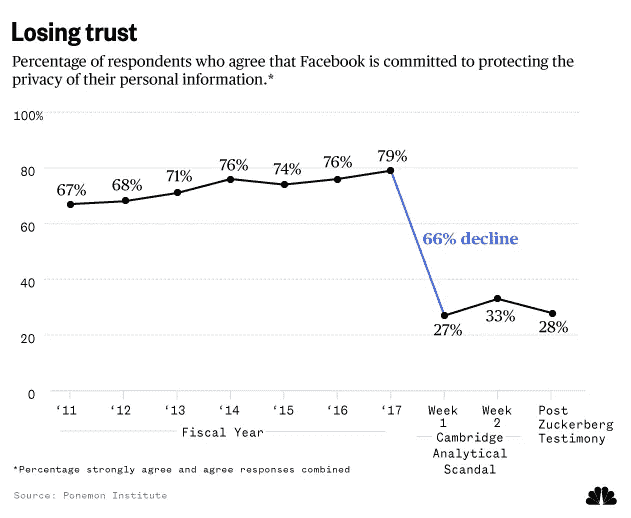
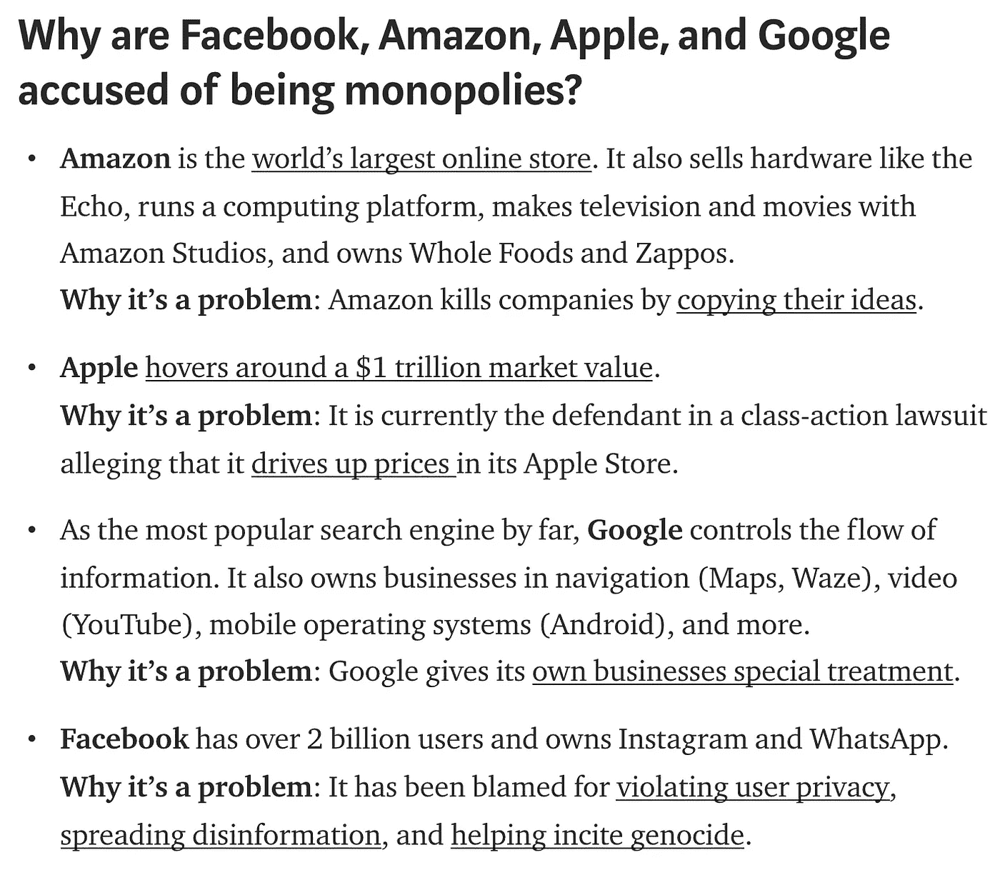
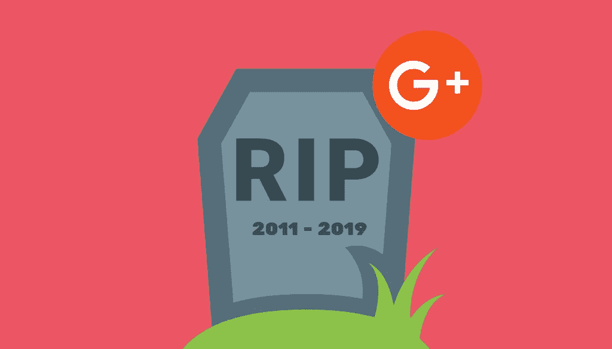
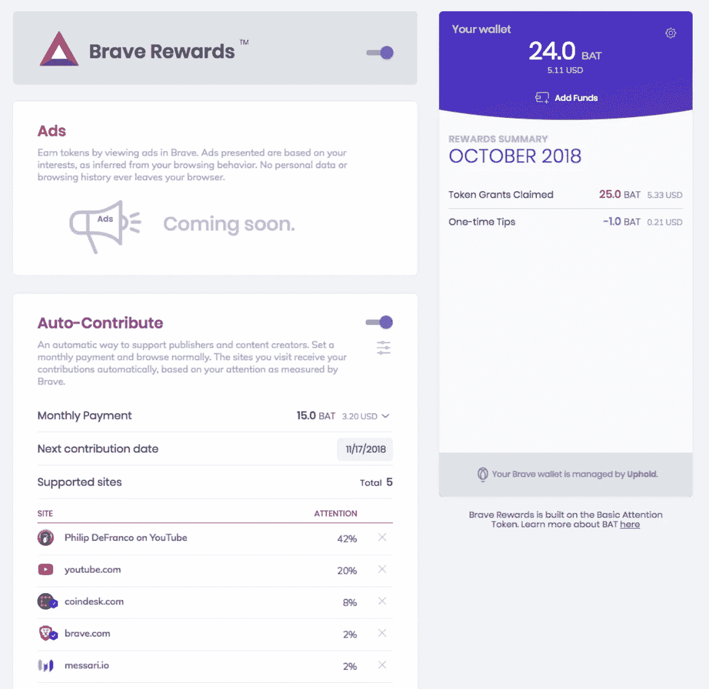

# 大型科技公司应该如何监管？

> 原文：<https://medium.com/hackernoon/how-should-big-tech-companies-be-regulated-75e9a6281510>

([source](https://www.technologyreview.com/s/613628/big-tech-breakup-regulation-antitrust-apple-amazon-google-facebook-doj-ftc-policy/))

T 他的问题是[政府](https://eugdpr.org/)和[学术界的教授](https://www.marketwatch.com/story/has-big-tech-gotten-too-big-for-our-own-good-2018-07-02)多年来一直在问的，现在这些大公司的创始人自己也在问这个问题(脸书的[克里斯·休斯](https://www.nytimes.com/2019/05/09/opinion/sunday/chris-hughes-facebook-zuckerberg.html)、微软的[比尔盖茨](https://edition.cnn.com/2019/06/24/tech/bill-gates-big-tech-regulation/index.html))，因为在过去几年发生的所有事件之后，对大型科技公司的不信任达到了空前的高度。

Facebook has been struggling to recover after Cambridge Analytical Scandal ([source](https://www.nbcnews.com/business/consumer/trust-facebook-has-dropped-51-percent-cambridge-analytica-scandal-n867011))

虽然[亚马逊很好地保留了用户的信任](https://www.vox.com/the-goods/2018/10/25/18022956/amazon-trust-survey-american-institutions-ranked-georgetown)，但是[看到他们冒险出售监控即服务](https://onezero.medium.com/amazon-is-watching-d51b20f1668a)引起了很多担忧。不难看出用户的隐私会在他们不知情的情况下被侵犯(他们已经这样做了，亚马逊的 Echo Dot 儿童版违反了联邦儿童在线隐私保护法)。

Some reasons why people are unhappy about big tech companies ([source](https://www.technologyreview.com/s/613628/big-tech-breakup-regulation-antitrust-apple-amazon-google-facebook-doj-ftc-policy/))

然而，根据传统的反垄断法，很难将这些科技公司视为垄断企业，这是有充分理由的，因为它们并不拥有每个行业的多数股权，并使定价有利于用户。毕竟，他们的服务是免费的，因为他们的商业模式依赖于出售你的数据获得收入，这不适用于任何前互联网时代的企业。

更进一步来说，[一些初创公司在被收购时没有收入](https://www.washingtonpost.com/outlook/2018/09/28/case-breaking-up-facebook-instagram/?noredirect=on&utm_term=.3280c7b770fc) (Instagram 和 Whatsapp 在被收购前没有广告)，所以[以前用来评估收购的标准，即询问消费者价格在合并后是否会增加，没有问题](https://www.washingtonpost.com/outlook/2018/09/28/case-breaking-up-facebook-instagram/?noredirect=on&utm_term=.3280c7b770fc)。

然而，大型科技公司真正主导的是**人们在互联网上的行为**。超过一半的电子商务通过亚马逊，而超过 70%的互联网流量通过谷歌和脸书。

这就是监管机构需要新标准的原因，**因为在没有明确标准的情况下，强制科技公司被起诉反垄断诉讼，也不一定能解决问题，而且会树立一个不好的先例，可能导致科技公司之间无休止的诉讼。**

今年五月，最高法院批准了一项针对苹果公司的反垄断诉讼，这使得这个问题比以往任何时候都更加重要。通过解释 iOS 用户是否是 App Store 的直接购买者，这个案例从根本上挑战了一个获胜的技术平台在选择如何经营业务方面的权利。

监管者必须记住的是，科技公司的优势不一定来自天然气和石油等有限的可用性，而是来自选择使用其服务的用户。正如谷歌前首席执行官埃里克·施密特(Eric Schmidt)曾经说过的那样，[“不使用谷歌搜索也是可能的”，因为竞争只是“一次点击的距离”](https://www.nbcbayarea.com/blogs/press-here/Schmidt-on-Antitrust-Competition-is-One-Click-Away-130300333.html)

如果科技公司在没有明确标准的情况下开始受到[事后法律(追溯性地改变法律颁布前行为的法律后果的法律)](https://en.wikipedia.org/wiki/Ex_post_facto_law)的打击，那么科技创新将会停止，公司可能无法专注于为用户提供最佳服务。

这也让新创公司的商业计划变得棘手，科技公司可能会就如何解释法律以扼杀竞争发起法律战。总的来说，这将导致更糟糕的技术产品，在这个时代，技术已经深深扎根于我们的日常生活中，许多人离不开它。

如果美国想保持竞争力，让最好的技术创新走在前面，那么**他们必须将注意力从试图在不确定的基础上对它们进行罚款转移到所有科技公司都可以预测的标准上**。这里有三个建议，我认为可以帮助启动这一进程，并有助于鼓励技术领域的更多竞争。

F 首先，**收购必须通过一个明确的标准来规范，这样就没有实体可以像脸书那样控制**27 亿用户。例如，社交平台的独特之处在于，网络的价值取决于谁在上面，而不是它是否拥有所有最好的功能。

即使是谷歌，尽管在 2011 年投资了[5 . 85 亿美元来建立和推出他们的平台](https://www.forbes.com/sites/bruceupbin/2011/06/30/google-cost-585-million-to-build-or-what-rupert-paid-for-myspace/#5a8ef44861d8)来与当时估值比谷歌低 14 倍的脸书竞争[(140 亿美元对 2000 亿美元)](https://mashable.com/2015/08/02/google-plus-history/)，在 2018 年努力获得更多用户后，还是决定关闭他们的产品。

考虑到它服役了 8 年，很难说他们不够努力。脸书失去了足够数量的用户，而且无法找到一个差异化的价值主张，让 Google+成为脸书的直接竞争对手，这足以让 Google+变得无关紧要。

Google Plus will be remembered as a reminder of what network effect could do ([source](https://bakdigital.co.uk/social-media/google-security-breach/))

因此，这意味着**任何不是直接竞争对手、功能略好于脸书的实体都可能成为巨大的威胁，因为它们可能会从脸书的网络中抢走用户，并成为新的垄断者**。这就是为什么像抖音和 Snapchat 这样的社交平台最初通过提供不同的价值主张来避免与脸书竞争。

我们在这里可以学到的教训是**这是政府应该介入的地方，并制定一个标准来确保那些可能威胁收购者的实体不应该被收购**。这很重要，因为如果脸书拥有所有其他社交平台，那么它就不再需要创新。

为了更好地理解这意味着什么，想象一下 Snapchat 确实被脸书收购的世界([脸书在 2013 年](https://www.businessinsider.com/facebook-approached-snap-in-2016-to-discuss-acquisition-2018-12)曾试图收购 Snapchat)。如果是这样的话，我们可能就不会有今天都在大量使用的 Instagram story 和增强现实功能。Snapchat 今天继续推动创新，[推出了创造性的 AR 滤镜，如性别交换和婴儿滤镜，今年 6 月应用下载量翻了一番](https://onezero.medium.com/snapchats-gender-swap-and-baby-filters-doubled-downloads-of-the-app-40a633c02ff0)。我们上一次在 Instagram 上看到下载量翻倍的创意功能是什么时候？

这就是收购 Whatsapp 和 Instagram 如此有利可图的原因。Instagram 的 1B(13 名员工，没有收入)和 Whatsapp 的 220 亿美元(55 名员工，没有收入)都是对 Instagram 的 2700 万用户、Whatsapp 的 4.2 亿用户的投资，以及这两种服务提供的不同价值主张，这些都可能威胁到脸书的网络。

通过允许这些收购，脸书不仅消除了未来的威胁，还积累了大多数用户数据，成为数字广告领域最具主导地位的玩家，无人能与之竞争。尽管在某些人看来，脸书已经大到不能倒，但确保这些收购不会再次发生，是我们保持市场竞争的第一步。

其次，数据可移植性应该成为科技公司的强制性要求。这是之前在参议院听证会上讨论过的一个话题，至今仍未实现。

数据可移植性如此重要的原因是**它将数据主权转移回用户**。如果用户觉得竞争对手有更好的服务，并且可以通过另一个平台的数据来增强，那么他们应该能够转移它，而不必保持与该平台的集成。

这确保了**公司对他们的行为负责**，如果用户失去了平台的信任，他们可以随时离开甚至删除他们在旧平台上的所有数据。如果用户离开脸书后无处可去，并且发现学习如何使用新平台很麻烦，那么数据可移植性将使这一过程变得顺畅。

此外，随着区块链产品变得越来越主流，这也将使 KYC 进程变得更加容易。拥有这些数据意味着你可以将你想分享给数字世界的大量数字历史分段，并了解你是如何成为目标的，这样你就可以看到对你有意义的广告。这为用户提供了更好的体验，因为他们可以删除个人数据或无意中获取的数据(即通过 Alexa，它总是在监听)，同时确保更好地针对企业。

这甚至可以采用 Brave browser 正在推广的商业模式，即**用户可以从他们看到并与**互动的广告中获利。这是有道理的，因为你通常是平台从中赚钱的产品。为什么你不能成为等式的一部分呢？

With Brave, you can not only monetize, but have a voice in what sites monetize ([source](https://brave.com/creators/))

如果平台想出这些用户成为受益者的创造性方式，那么它可能**创造一个新的竞争生态系统，每个人都在竞争最佳用户体验和用户信任**。用户不再需要忠于一个或另一个平台，因为转移到一个新的平台将变得非常容易。

第三，应该有由技术领袖主持的年度公开演讲和听证会，他们对这些技术企业的运作方式有着批判性的眼光，并对它们的影响有着深刻的理解。虽然有很多人称赞技术，但很少有人公开反对他们的商业实践。

很难责怪用户不知道他们是如何被利用的，因为这些信息并不容易被公众获得。我们都是可用性偏差的受害者，所以我们中的许多人都不关心服务器后面发生了什么。

因此，让像商学院教授斯科特·加洛韦、法学院教授蒂姆·吴或顶级科技记者卡拉·斯威舍这样的演讲者做一个简短的科技现状演讲，并主持大型科技公司的年度听证会，可以让公众了解正在发生的事情，并确保大型科技公司信守承诺。考虑到大型科技公司在我们日常生活中的影响力，我们努力让一切透明化是至关重要的。

Professor Galloway is no foreigner when it comes to talking about big tech ([source](https://www.google.com/search?q=scott+galloway+big+tech&rlz=1C5CHFA_enUS710US710&oq=scott+galloway+big+tech&aqs=chrome..69i57l2j69i60l2j69i61l2.3390j0j7&sourceid=chrome&ie=UTF-8))

此外，**致力于研究技术的智库应该得到政府的积极资助**，因为[曾有这样一个案例，在企业捐赠者决定断绝与该组织的所有关系后，一个批评大型技术的团队被解雇](https://www.washingtonpost.com/news/posteverything/wp/2017/08/31/i-criticized-google-it-got-me-fired-thats-how-corporate-power-works/?utm_term=.5b4258c5d6b2)。如果研究只对有钱改变公众舆论的科技公司有利，那将是危险的。

通过让了解技术领域的人来教育用户技术领域正在发生的事情，而不是让不懂技术的政府官员来问基本问题，**我们可以让公众选择他们想使用的服务。**

我对这些规定的希望是**它们将有助于推出最能满足用户需求的平台，同时对用户的信任负责**。根据对法律的“不同解释”对科技公司进行罚款，将会以更差的服务惹恼用户，并通过无休止的诉讼伤害企业。

**技术令人兴奋，因为创新取代创新，当竞争存在时，人类的聪明才智没有限制**。如果没有竞争，隐私悖论将继续存在，人们关心隐私，却不追究滥用者的责任。这就是为什么[脸书在 2018 年可能是最赚钱的一年，尽管其隐私丑闻被曝光](https://www.thearticle.com/we-all-mistrust-facebook-yet-we-go-on-using-it-why)。

即使在这些法规实施后，大型科技公司仍可能保持其主导地位，但他们做出决策的**过程将发生变化，最重要的是，与竞争对手的“一击即中”将比以往任何时候都更近**。