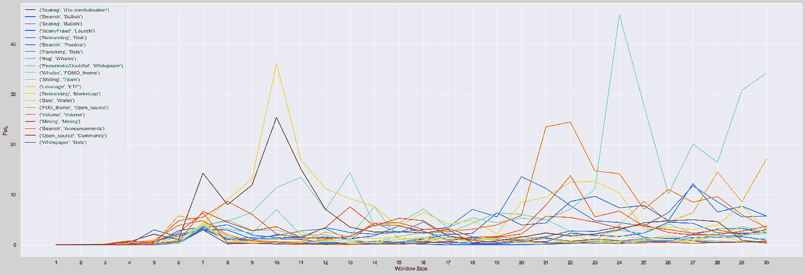
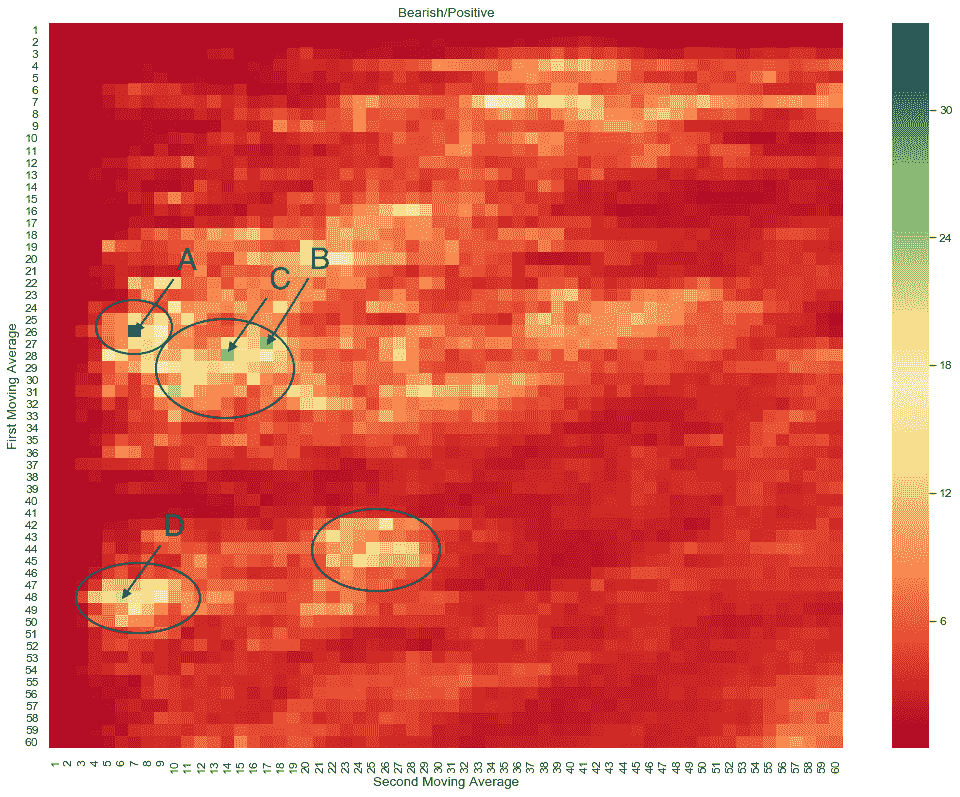
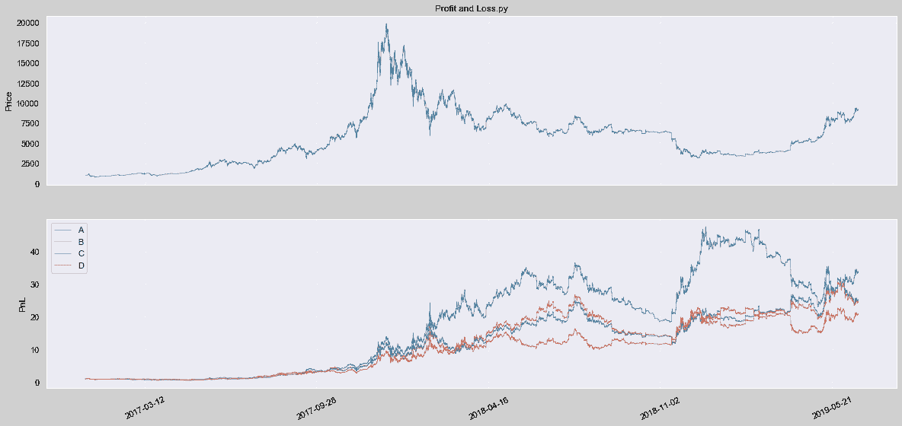

# 如何建立比特币情绪分析策略

> 原文：<https://medium.com/hackernoon/how-to-build-a-bitcoin-sentiment-analysis-strategy-yielding-2400-returns-5dec35da8e81>

> TL；DR:我们建立了一个有利可图的比特币情绪策略，在 24 个月内产生了 2400%的回报。增加交易费用使策略更加现实，同时找到最佳的情绪组合和窗口大小显著增加了回报。

在[之前的文章](https://hackernoon.com/backtesting-a-sentiment-analysis-strategy-for-bitcoin-3f79ddeb86f1)中，我们描述了如何基于[Augmento](https://www.augmento.ai/)看涨和*看跌*比特币情绪构建策略，并在 [Bitmex](https://www.bitmex.com/app/trade/XBTUSD) XBTUSD 上进行回溯测试。

这个信号是由

*   计算看涨/看跌情绪的比率
*   通过应用 7 天移动平均线平滑该信号
*   通过在平滑信号上应用第二个 7 天毫安来创建第二个信号
*   计算两者之间的差异

这产生了一个稳定的信号，我们将其转化为一项战略，在两年的时间内，PnL(利润和损失)约为 40 倍。

在本文中，我们将使用 Twitter 的比特币情绪数据，讨论如何更真实地模拟现场交易条件，以及如何进一步优化策略。我们将通过增加交易费用、选择其他情感对以及测试各种窗口大小参数来实现。

# 计入费用

我们上一篇文章中的回溯测试忽略了导致结果过于乐观的费用。为了模拟真实的交易成本，我们假设收取 0.75%的手续费(如 [Bitimex](https://www.bitmex.com/app/fees) 所示)。每执行一次多头或空头头寸，从 PnL 中扣除交易的 0.75%的费用。这显示在下面代码的最后两行中:

```
for i in steps:
   if s[i-1] > 0.0:
      pnl[i] = (p[i] / p[i-1]) * pnl[i-1]
   else if s[i-1] < 0.0:
      pnl[i] = (p[i-1] / p[i]) * pnl[i-1]
   else if s[i-1] = 0.0:
      pnl[i] = pnl[i-1]
   if sign(s[i-1]) != sign(s[i-2]):
      pnl[i] = pnl[i] — (pnl[i] * trade_fee)
```

在策略中增加费用会极大地改变 PnL。虽然上一篇文章中的*看涨/看跌*策略实现了 30 以上的 PnL，但每笔交易增加 0.75%的费用会使 PnL 降至 2.5。在接下来的章节中，我们将探讨如何优化策略的参数，以便在更现实的市场条件下也能表现良好。也就是说，a)找到比特币情绪的最佳组合，b)优化移动平均线的窗口大小。

# 寻找表现最佳的比特币情感组合

Augmento API 目前提供 93 个比特币情绪和话题的数据，相当于 8649 个话题和情绪对的可能组合。有充分的理由对它们进行测试。例如，*看跌*的情绪可能会因预期的调整而暂时高涨，但可能并不表明长期*的负面*前景。此外，将情绪(例如*消极*或*乐观*)与话题(例如*黑客*或*技术*)结合起来，可能会产生交易信号，这些信号能够在对比特币社区重要的话题背景下获得比特币社区的情绪。

目标是找到最佳的情感/主题对。这就是为什么我们对比特币情绪和话题的所有可能的 8649 种组合运行了从信号构建到回溯测试的整个过程(见上一篇文章)。对于这个测试，我们将 MAs 的窗口大小保持为 7 天不变，以便创建可能的最佳表现者的第一个列表。结果是一个巨大的 PnL 名单。

```
**Top Pnl sentiment pairs
topic/sentiment1       topic/sentiment2       PnL** Scaling                (De-)centralisation    2.972788
Bearish                Bullish                3.008512
Scaling                Bullish                3.095835
Scam_Fraud             Launch                 3.163351
Rebranding             Risk                   3.330282
Bearish                Positive               3.541391
Panicking              Bots                   3.624959
Bug                    Whales                 3.750890
Pessimistic_Doubtful   Whitepaper             3.813242
Whales                 FOMO_theme             3.869889
Shilling               Team                   3.869968
Leverage               ETF                    3.981470
Rebranding             Marketcap              4.003318
Bots                   Wallet                 4.348451
FUD_theme              Open_source            4.698155
Bearish                Announcements          6.329139
Open_source            Community              6.670214
Whitepaper             Bots                   14.288472**Here are the bottom pairs:
topic/sentiment1       topic/sentiment2       PnL** Investing/Trading      Bearish                0.000422
(De-)centralisation    Price                  0.000424
Positive               Selling                0.000434
Learning               Bearish                0.000571
Advice/Support         Bearish                0.000692
Euphoric/Excited       Long_term_investing    0.000718
Technical_analysis     Short_term_trading     0.000743
Problems_and_issues    Short_term_trading     0.000836
Learning               Good_news              0.000877
Euphoric/Excited       Short_term_trading     0.000885
Scam/Fraud             Token_economics        0.000941
Listing                Token_economics        0.000953
Problems_and_issues    Due_diligence          0.000978
Positive               Hopeful                0.001021
Problems_and_issues    Fearful/Concerned      0.001069
Use_case/Applications  Short_term_trading     0.001078
Prediction             Going_short            0.001093
Uncertain              Short_term_trading     0.001124
Technology             Short_term_trading     0.001135
Learning               Adoption               0.001171
```

有趣的是，许多表现最好的对对于主题/情绪 1 具有“负面”含义(*悲观 _ 怀疑，错误，先令，看跌)，*，而许多具有“正面”含义的主题/情绪位于主题/情绪 2 之下(*看涨*，*正面，开源)*。

搜索最佳表现对的下一步是绘制所选择的前 20 个主题/情感相对于不同窗口大小的 PnL，其中长窗口参数和短窗口参数共享一个值。我们这样做是为了了解每一对在一系列窗口参数下的行为。这里，我们寻找的是对各种参数(宽平线)反应良好的对，而不是具有最高峰值的对，因为在各种参数范围内表现良好的对更有可能对不断变化的市场条件具有鲁棒性



对于所有成对的主题，没有单一的最佳窗口大小，但是较大的窗口倾向于产生较大的 PnL。原因可能是较长的窗口可能更适合数据，尽管我们必须意识到较大的窗口大小更有可能使数据溢出。

在情感/话题对和 PnL 之间并不总是有明确的直觉。例如，*白皮书* / *机器人*获得了最高的 PnL。但是，没有理由认为*机器人*相对于*白皮书*的高提及率会产生持有多头头寸的信号。虽然*看跌* / *正*不是表现最好的一对(给出 3.54 的 PnL)，但它最符合我们的直觉，因此我们将使用这对来进一步分析窗口参数。

# 优化窗口参数

[上次](https://hackernoon.com/backtesting-a-sentiment-analysis-strategy-for-bitcoin-3f79ddeb86f1)，我们通过采用过去 7 天的 SMA 来平滑情绪数据。此外，为了生成“真实”情绪的信号，我们计算了平滑情绪的滚动平均值，也使用了 7 天的窗口。参数的选择是任意的。因此，观察我们的策略对于其他窗口参数组合的表现将会是有趣的。

在这个测试中，我们使用*看跌/积极*对 1 到 60 天之间的所有可能的多空窗口组合运行了上述策略。生成的 pnl 绘制在下面的热图中:



该图给出了跨窗口参数的策略性能，绿色表示高 pnl，红色表示低 pnl。有些“岛屿”的 PnL 比图表中的其他地方要高。这些岛屿通常位于第一条移动平均线长于第二条移动平均线的区域。因为我们希望 PnL 在参数值的范围内相似，所以我们希望在 PnL 高的区域内，但同时不作为窗口参数的函数波动太大。这些区域可以被视为“稳定的”一个很好的例子就是图表上圈出的区域。我们还绘制了所选点的性能。PnL 最高的策略使用 26 作为移动窗口的第一个参数，使用 7 作为第二个参数。



这四种策略在 2017 年的牛市和 2018 年的熊市中都表现良好。虽然策略 A 的表现似乎优于 B、C 和 D，但它似乎也不太稳定，导致大幅上涨和下跌。策略 D 看起来稳定得多，但表现不如其他三个策略。b 和 C 似乎与 D 类似稳定，但表现稍好。回头参考热图，B 和 C 也位于 PnL 较高的一个更宽更平坦的区域。出于这个原因，我们将从 C 中选择实时策略(28，14)的参数，基于大约 24 BTC 的结果回报，基于 1 BTC (2400%)的起始钱包。

# 服用类固醇的蟒蛇

使用没有任何优化的 [NumPy](https://www.numpy.org/) 和 [Python](https://www.python.org/) 运行 8649 回溯测试需要一段时间，第一次运行它需要 6 个小时。为了提高速度，我们使用了 [Numba](https://numba.pydata.org) ，这是一个 [JIT](https://en.wikipedia.org/wiki/Just-in-time_compilation) (Just In Time)编译器，它将 Python 代码编译成 c。实现 Numba 后，我们用了不超过两分钟的时间就获得了一个包含所有 8649 个 pnl 的数组。

# 结论

我们对回溯测试进行了修改并增加了费用。此外，我们还展示了如何使用其他 Augmento 主题来生成策略。在所有成对的主题中，我们确定了能够产生盈利战略的前 20 个信号。尽管其中一些不容易解释，但有些提供了很好的直观解释。我们给出了一个基于*看跌/积极*比特币情绪的信号示例，但其他有趣的信号也可能是*悲观 _ 怀疑/白皮书*或*看跌/推出*，所有这些都产生积极和相对较高的 PnL，同时为我们提供了一个自然(容易)的解释。

提出的回溯测试仍然可以改进。通过添加滑点、市场交易量等附加特征，可以使回溯测试更加稳健。此外，我们可以在每一步随机选择窗口大小，这将显示我们的策略有多稳定。我们将在下一篇文章中考虑所有这些主题。

点击查看完整代码和历史情感数据[。](https://github.com/augmento-ai/quant-reseach/blob/master/notebooks/1_backtesting_different_sentiment_pairs.ipynb)

*本文由*[*augmento . ai*](https://www.augmento.ai/)*制作，作为使用其数据的一系列入门指南的一部分，并不构成投资或交易建议。*