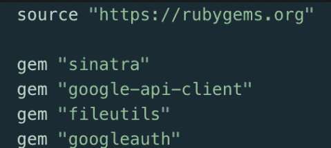
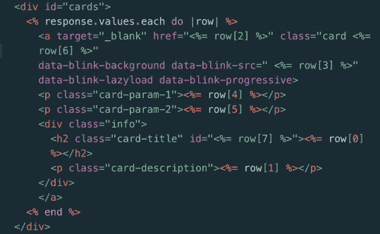

# 如何使用 Google Sheets 和 Sinatra 建立一个动态网站

> 原文：<https://medium.com/hackernoon/how-to-build-a-dynamic-website-using-google-sheets-and-sinatra-2065da1eb35a>


查看这篇文章的完整站点[这里](http://fintechpirates.com)，或者 [ProductHunt 启动页面这里](https://www.producthunt.com/posts/fintechpirates-com)。

我喜欢金融科技领域。以至于我最近在牛津大学完成了一个关于这个主题的项目！这也意味着，我发现自己试图定期查找世界各地所有与金融科技相关的会议，试图跟踪它们以及它们的所在地。最终，我认为这有点重复，于是做了任何有自尊的技术人员都会做的事情:建立一个电子表格。有一段时间，就是这样。我有了这个美妙的主电子表格，它将世界上几乎所有的[金融科技会议](http://fintechpirates.com)按照地点和月份进行了整齐的分类，我的生活再次变得简单，一切都井然有序。

不久前，我偶然看到一条推文，谈论如何通过将电子表格转变为利用所有这些数据的网站或服务，来实现一个有趣且通常有用的编码项目。丁。我们有赢家了！我最近启动了我的第一个网络项目，[WhereDoMyTaxesGo.co，](http://wheredomytaxesgo.co/)它告诉用户他们所有的税款在联邦和州一级的去向，我正在寻找另一个我可以深入研究的快捷项目。

从表面上看，这似乎很简单:建立网站，设计风格，然后以某种方式连接电子表格，作为可以从中提取信息的数据库。最初，有一些快速的势头，我有一个简单的轮廓模拟了最近非常流行的基于卡片的风格。这就是我喜欢 sinatra 作为 DSL 的原因，它真的不需要任何时间就可以让一个网站运行起来。在这种情况下，网站本身在两天内只用了几个小时就完成了。我不打算深究其中的细节，但是可以随意浏览一下[这篇关于我如何建造](https://www.jacobwhitish.com/building-where-do-my-taxes-go/)[WhereDoMyTaxesGo.co](http://wheredomytaxesgo.co/)的血淋淋的细节。

不过，我要讲的具体部分只是我如何弄清楚如何将前端网站与后端 google sheet 连接起来。这一个需要一点挖掘。我从其他开发者那里找到了一些高层次的东西，它们是一个很好的路标，但是没有任何关于 Sinatra 或 Rails 的方法来实现它。

首先是弄清楚它是如何工作的。显然，我必须找到一种方法让前端和 Google Sheet 相互交流，然后我必须在前端构建一些动态内容，这些内容可以获取数据并显示出来，而无需硬编码。这实际上比我想象的要容易得多。

原来 Google 为 Google Sheets 提供了一个 [API，基本上负责所有繁重的工作。按照快速入门指南，您将首先启用 API 并下载一个凭证文件，该文件基本上告诉 Google 您很酷，它应该会响应您的信息请求。接下来，您将对适当的 gem 进行一些快速的命令行安装。当你在做的时候，不要忘记把这个也添加到你的 gemfile 中。这是我对这个项目的看法:](https://developers.google.com/sheets/api/quickstart/ruby)



又短又甜。

继续按照 API 页面上的快速入门指南的其余部分进行操作，以确保您已经设置好了所有其他内容并正确地进行了身份验证。

假设设置正确，您应该有一个很酷的小脚本，可以从指定的 google 工作表中获取信息，并将其打印到命令行。相当酷！但不是一个充满活力的网站，嗯？

在这个阶段，我将整个 quickstart 文件切碎，并开始将其全部放入我的主 sinatra 应用程序中——从最上面的这个片段开始，它配置并初始化 API:

```
#### Begin Google API Config ####OOB_URI = 'urn:ietf:wg:oauth:2.0:oob'.freeze
APPLICATION_NAME = 'Google Sheets API Ruby Quickstart'.freeze
CREDENTIALS_PATH = 'credentials.json'.freeze
TOKEN_PATH = 'token.yaml'.freeze
SCOPE = Google::Apis::SheetsV4::AUTH_SPREADSHEETS_READONLY# Initialize the API
service = Google::Apis::SheetsV4::SheetsService.new
service.client_options.application_name = APPLICATION_NAME
service.authorization = authorize#### End Google API ####
```

我喜欢给自己留注释来表示大文件中的代码段。

前往我的项目的 routes 部分(取决于你如何设置你的 sinatra 项目，这可能是在主 app.rb 文件中，或者在一个单独的“routes”文件中)，我拿出了这一小段快速入门代码:

```
get "/" do
  spreadsheet_id = '**Enter your unique google sheet ID here**'
  range = 'conferences!A2:H'
  response = service.get_spreadsheet_values(spreadsheet_id, range) erb :index, :locals => {:response => response}
end
```

对我来说，我正在寻找的单元格的特定范围是在' spreadsheet_id '中指定的工作表的' conferences '选项卡上，我正在寻找从 A2 到 h 结尾的每个单元格。我在第一行中有标题，所以我不想包括它，但是如果你想包括第一行，那么就从' A1 '开始。冒号后的最后一个字母将是您希望 API 读取的最后一列。因此，如果你想从一个名为“wordpress”的工作表中，从 B 列的第 3 行到 D 列的末尾获取所有数据，你应该输入:“WordPress！B3:D 为您的'范围'的价值。在我的例子中，我还使用了一个名为“index”的视图，这是在“erb”行中指定的。确保将“response”设置为一个局部变量，这样您就可以访问 API 在视图中返回的数据。

接下来，我创建了一个名为 gauth.rb 的文件，它将处理快速入门文件中创建的实际授权方法:

```
@return [Google::Auth::UserRefreshCredentials] OAuth2 credentials
def authorize
  client_id = Google::Auth::ClientId.from_file(CREDENTIALS_PATH)
  token_store = Google::Auth::Stores::FileTokenStore.new(file: TOKEN_PATH)
  authorizer = Google::Auth::UserAuthorizer.new(client_id, SCOPE, token_store)
  user_id = 'default'
  credentials = authorizer.get_credentials(user_id)
  if credentials.nil?
    url = authorizer.get_authorization_url(base_url: OOB_URI)
    puts 'Open the following URL in the browser and enter the ' \
         "resulting code after authorization:\n" + url
    code = gets
    credentials = authorizer.get_and_store_credentials_from_code(
      user_id: user_id, code: code, base_url: OOB_URI
    )
  end
  credentials
end
```

这基本上告诉应用程序在哪里寻找凭证，如果没有凭证，如何创建凭证文件。然后返回调用该方法的任何代码要使用的凭据。在这种情况下，它被我们放在主 app.rb 文件中的代码的“初始化 API”部分调用。

最后，我开始了将工作表中的数据插入视图的有趣部分。在短短 12 行代码中，我创建了一个简单的小 ruby 块，它为电子表格中的每个会议创建一个信息卡片，而不管我添加了多少个会议:



这比我想象的要容易得多。Responses.values.each 将在每次调用时返回一行(以数组的形式),然后您只需指定该项在数组中的编号。因此，在这种情况下，row[3]将返回块返回的数据行中的第四项。

最终结果看起来是这样的:


点击这里查看完整的网站:[FintechPirates.com](https://fintechpirates.com/)

这就是连接 google sheet 的方法！我可以添加和删除行，这将在网站上实时反映。更好的是，我使用了 Typeform 和 Zapier 来收集读者提交的信息，这些信息会自动添加到表单中。(为了确保质量，我实际上制作了与第一个表单相同的第二个表单，用户提交的事件在那里排队等待审核，直到我能够查看它们。但即使这样，更新工作表也只是复制/粘贴的问题！)

原来如此！显然，在构建网站的完整功能方面投入了更多，但是将 sinatra 与 Google Sheets API 连接起来比我想象的要简单得多。一点点尝试和错误，它是在一个编码会话中完成的。我确信我仍然错过了一两个步骤，所以请在评论中自由提问，我会尽快回复。