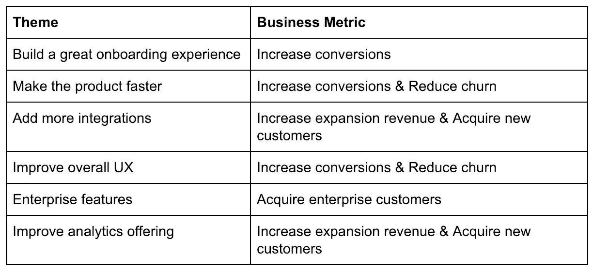
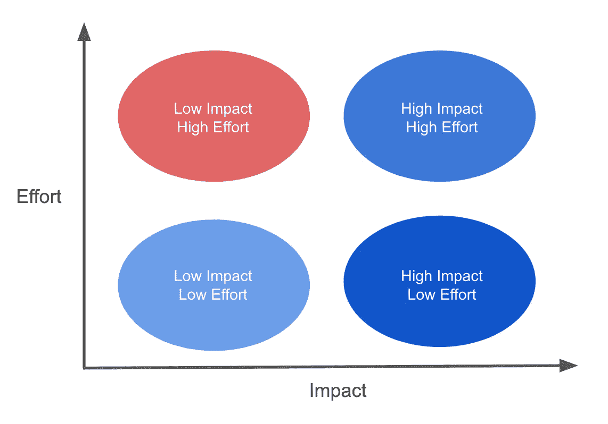

# 构建产品路线图

> 原文：<https://medium.com/hackernoon/how-to-build-a-product-roadmap-76b538923c6f>

在我的[上一篇文章](/@arpitrai/how-to-get-ideas-for-new-product-features-e6ba01c2ea27)中，我讨论了人们获得新产品功能想法的各种方式。你可能会使用[、谷歌工作表](https://docs.google.com/spreadsheets/)、微软 Excel 或项目管理工具，如[、](http://asana.com)[、](https://jira.atlassian.com/)等。或者像 [Aha](https://www.aha.io/) 或 [RoadMunk](https://roadmunk.com/) 或 [ProductPlan](https://www.productplan.com/) 这样的产品管理工具，来维护所有这些想法的仓库。随着时间的推移，这个列表会不断增加，可能会达到数百个。那么你如何决定做什么呢？现在应该开发哪个特性，以后再开发哪个？哪个功能会让你动心，哪个功能会让你分心？所有这些是如何与您的总体产品路线图以及业务目标联系在一起的？

在这篇文章中，我将介绍我构建简单有效的产品路线图的策略。本练习中得出的产品路线图将帮助您决定处理新产品功能的各种想法的顺序。您还将看到该产品路线图如何与您的业务目标紧密结合，以便您继续为现有客户增加更多价值，为您的业务增加新客户，并通过您的产品保持您的市场领导地位。

在我在 [WebEngage](https://www.webengage.com) 的角色中，我在 Google Sheets(Google 的 Excel 版本)中维护这个想法库。尽管我们使用 JIRA 进行项目管理，但我发现 JIRA 在记录这类项目的清单和构建产品路线图方面显得笨拙。Google Sheets 是构建产品路线图问题的一个简单而有效的解决方案。

新产品特性的每一个想法在这个 Google 表单中都占一行。因此，这是 Google Sheet 最初的样子:

# 第一步:对每个产品创意进行分类

每周，我会将上面列表中的每个想法分为以下四类:

*   **筹码**:这些新功能将为我们的现有客户增加价值，同时也有助于我们获得新客户。很可能我们的直接或间接竞争对手已经具备了这个特性。
*   **游戏规则改变者:**游戏规则改变者也是新功能，不同之处在于这些功能将超越我们，领先于竞争对手，并以几乎每个人都想使用我们产品的方式围绕产品制造大量轰动。在你上面的列表中，你可能只有几个这样的改变游戏规则的想法。
*   **优化**:理想情况下，这些是更小的任务，涉及以更好的方式解决一些问题，比如用户界面、UX 改进或微小的功能变化。致力于这些优化可能会帮助我们现有的客户快速或直观地解决一些问题。但这些优化很可能无助于获得新客户。
*   **干扰**:干扰是不应该考虑的想法，因为它们可能不会以任何有意义的方式使现有客户受益，也不会帮助获得新客户。

这种分类背后的想法是确保，一旦完成了优先排序，我们应该看到我们在任何时间点都在跨类别地工作。例如，在任何一个季度，我们都应该致力于*至少 1 个游戏规则改变者、3 个赌桌和 20 到 30 个优化。*如果我们只致力于*改变游戏规则的*而完全忽略*优化*，这可能会在几个月后导致产品负债和客户不满。

上面的 Google 表单为类别添加了一列，现在看起来像这样:

在我们开始下一步之前，确保你已经忽略了所有你归类为*干扰的想法。*

# 第二步:为每个产品创意指定一个主题

虽然我已经把这作为第二步，但我倾向于把这一步和第一步放在一起。

你上面的每个产品创意都符合一个主题。一个主题可以包含多个产品创意。主题是一个广义的词，它描述了它为您的客户解决的问题，并为您移动了一个业务度量。例如，以下任何项目都可以是与您的产品相关的主题:

*   打造出色的入职体验
*   让产品更快
*   添加更多集成
*   提高整体 UX
*   企业功能
*   改进分析产品

每当我们构建产品路线图时，选择主题比选择单个产品创意更容易。讨论一个主题并说*我们将建立一个伟大的入职体验* *并且我们也将使产品更快*会更容易，而不是讨论功能并说*我们将把我们的技术从 Adobe Flash 转移到 Web RTC* 或*我们将减少为新用户集成的步骤*。请注意主题和功能之间的语言差异。主题解决了它为你的客户解决的问题，并且容易被任何人理解。还要注意上面的每个主题是如何与一个或多个业务指标紧密结合的。

因此，现在让我们为列表中的每个想法添加一个主题:

# 第三步:选择你的季度主题

您的业务目标每个季度都不同。因此，您在产品中所做的工作也会因季度而异。

这就意味着你必须根据你在一个季度的业务目标，选择几个主题在这个季度进行工作。请记住，每个主题都与业务目标紧密相关。如果某个特定季度的业务特权是用最少的营销支出获得新客户，也许产品团队应该在该季度围绕主题*打造出色的入职体验*开展工作。这将确保那些已经对你的产品感兴趣的人(因此，已经注册了)也对你的产品感兴趣，因为你正在快速地将 *Aha 体验*传递给他们，让他们了解产品的价值。

如果你正在创建一个季度路线图，找出你想在那个季度做的主题。一旦你这样做了，只对那些属于你选择的主题的想法进行下面的步骤 4 和 5。

# 第四步:根据紧迫性、影响和努力程度对产品创意评分

仅选择与您在该季度相关的主题，并对所选主题中的每个想法进行评分。这个分数会告诉我们处理各种想法的确切顺序。

我每周与创始人和工程/成功领导一起进行这项评分工作，我们根据三个参数对上述每个想法进行评分，这三个参数是*紧迫性、*影响和*努力度*。

## **紧急程度**

该功能/想法对您的客户(现有的和潜在的)有多迫切？想法是否有效但不那么迫切？还是想法很有效，很迫切？请不要混淆紧迫性和想法可能产生的影响。也许一个*优化*比如一个小的 UX 改变会花你不到两个小时来实现是紧急的，因为当前的 UX 被打破了，这导致了不满意的客户。根据你对市场的看法和顾客的需求，也许一个改变游戏规则的想法比另一个更迫切。

我们按照 1 到 5 的标准对上述每个想法进行评分，5 分表示最紧急，1 分表示最不紧急。

## **影响**

你的想法对你的客户(现有的和潜在的)以及你在市场上的竞争地位有什么预期的影响？影响会大到让新功能帮你获得新客户吗？这种影响是否足以让现有客户更多地使用你的产品，甚至升级他们的订阅？这种影响是否有助于您超越竞争对手，实现/保持市场领先地位？

我们用 1 到 5 的标准对上述每个想法进行评分，5 分表示最有影响力，1 分表示最无影响力。

## **努力**

你认为这个特性需要多少开发工作？它是可以在一天内实现的，还是需要几周或几个月的努力？

我们用 1 到 5 的标准给上面的每个想法打分，5 表示付出了很多努力(一个月或更长时间)，1 表示最不努力(几个小时)。请注意，这一工作量估算并不是基于任何彻底的技术研究，而仅仅是基于 CTO 和工程主管过去与团队合作的经验。

在这一步结束时，上面的列表如下所示:

# 第五步:计算每个产品创意的总分

基于上述三个参数——*紧迫性、*影响力和*努力度、*，我们按照以下公式计算所选主题中每个产品创意的总得分:

> ***总分= 100 x 紧急程度+ 10 x 影响— 1 x 努力程度***

我们为*紧急程度(100)* 、*影响(10)* 和*努力程度(1)* 提供了这些准确的权重，因为我们应该始终首先处理最紧急、最有影响力且实施起来最省力的想法。或者简单地说，我们应该首先研究那些最容易实现的想法。这将确保我们通过快速轻松的胜利创造强大的影响力。

正如您在上面的图表中所看到的，我们应该始终先处理*影响大、工作量小的*项目，然后再处理其余项目。在所有的*高影响、低努力*项目中，我们应该先处理*高紧迫性*的项目，然后再处理其余的项目。

不用说，我们忽略了*低影响、高努力*项目，因为它们是不必要的时间浪费，几乎没有影响。

一旦我们计算出每个想法的分数，我们就按照总分的降序对列表进行排序。现在，我们将看到一个按优先顺序排列的项目列表，我们需要按照这个顺序来处理这些项目。请记住，这份按优先顺序排列的想法列表仅适用于那些属于我们为该季度选择的主题的想法。

另外，请注意，在本练习中，我们没有根据想法的类别来区分它们，即*优化、桌面赌注*和*改变游戏规则。*我们没有将*牌桌赌注*或*游戏规则改变者*置于*优化之上。在任何一个季度，你都应该确保你的工作是各种想法的最佳组合。*

在这一步结束时，我们上面的列表如下所示:

我们现在已经有了本季度的产品路线图，其中包含我们选择的主题，以及我们应该对属于这些主题的每个想法进行处理的准确优先顺序！

通过遵循这一简单的流程，我们能够轻松构建与季度业务目标紧密相关的季度产品路线图。您可以推断出同样的练习来构建每月的产品路线图，甚至是每年的产品路线图。

然而，重要的是要注意，从这个过程中产生的产品路线图并不是一成不变的。有时，您可能会发现自己在路线图中添加了不适合任何所选主题的特别任务。这是好的，只要不过度，因为过度会导致产品焦点的稀释。

其次，通过这个过程创建的路线图是一个动态的文档，它总是根据业务优先级和目标不断发展。如果需要，您应该每月或更长时间访问此路线图，以调整主题、紧迫性、影响和工作。