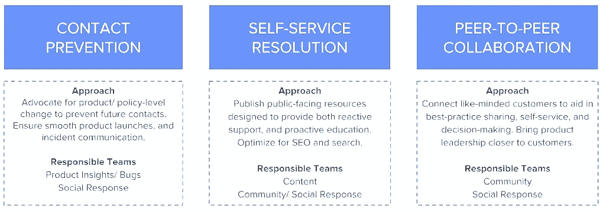

# 如何建立可扩展的客户成功战略

> 原文：<https://medium.com/hackernoon/how-to-build-a-scalable-customer-success-strategy-578b160179c>

## 来自 Square 的可扩展 CS 负责人凯蒂·科比

Caty Kobe

Caty Kobe 是 Square 可扩展客户成功项目的负责人。她管理着一个由 25 名以上员工组成的不断壮大的团队，致力于融合见解、内容和技术，为大规模客户提供主动和被动的教育资源。

客户满意度是产品成功的最终验证者。当你的客户有问题或投诉时，你回应的方式和速度非常重要。在早期，让相对较小的客户群满意是一个小团队可以做到的。

但是，对于任何没有可扩展的客户成功战略的初创公司来说，随着客户群的快速增长，保持这种水平的客户满意度是一项艰巨的任务。如果实施得当，像这样的策略可以主动预防故障单，将查询分类到自助渠道，最重要的是，允许您的团队专注于更大的项目，如服务您的顶级客户。

我们最近邀请了 Square 的可扩展客户成功负责人 Caty Kobe 与 FirstMark 家族的 CS 领导者进行交流。Square(纽约证券交易所股票代码:SQ)是金融服务技术领域的领导者，市值超过 290 亿美元，是成千上万家企业日常工作的关键工具，因此也必须尽快解决这些客户的问题。科比的团队跨越了五个独特的领域，使 Square 能够自助服务 10-12 倍于他们在 1:1 渠道中处理的支持量。

为了确保每个级别的成功，Kobe 围绕三个主要支柱组织她的团队:(1)接触预防，(2)自助解决，(3)点对点协作。

# 关注预防、解决和协作

Three Organizational Pillars (Credit: Caty Kobe, Square)

## 接触预防

第一个支柱侧重于主动防止票证被创建。为了做到这一点，Kobe 建议在更大的可扩展团队中有两个微型团队:一个负责产品洞察，一个负责 bug。

> “如果你在人们发现问题之前就阻止了它，那将允许你几乎无限地扩展。”

产品洞察团队是一个由分析师组成的小组，负责审查来自一线团队的所有客户查询数据，无论是来自一对一的交易渠道(电话或电子邮件)，还是来自更公开的一对多渠道(社交+社区平台)。他们的主要目标是全面了解数据背后发生了什么，最重要的是，是什么问题推动了最大的交易量。

bug 团队在预防性活动中扮演着同样重要的角色。他们审查*一线团队提交的每一个*bug——本质上是对 bug 进行分类和复制，以确保只有实际问题被发送到工程团队去修复。这个过滤层节省了无数的工程时间。

**关键要点:**通过关注接触预防，您不仅解决了可能花费您最多成本来解决的问题，还防止了更广泛的品牌信任和声誉损失问题，这些问题更难大规模解决。

## 自助解决方案

科比组织她的团队的第二个支柱是自助解决。如果客户可以在你的网站或应用程序中找到相关内容，并在不联系代理的情况下回答他们自己的问题，那么你不仅避免了一张昂贵的机票，还强化了该客户的积极习惯。

Kobe 的可扩展团队有一个内容部门，编写客户可能与之交互的所有面向公众的支持资源。“他们编写我们的代理使用的电子邮件模板、我们支持中心的所有文章、我们联系流程中出现的即时回答，甚至是我们的聊天机器人内容，并管理所有的库。”快速提示:科比建议在写这些内容时“像营销人员一样思考”。内容营销人员最擅长知道如何在正确的时间将特定的内容呈现在正确的人面前，这与支持内容完全一致。

除了内容团队，Kobe 还有一个社区团队，负责监控客户和 Square 在社区平台上的所有对话，并提供一个很好的双向沟通渠道。

Kobe 说,“进行所有这些对话的美妙之处不仅在于[客户]相互交谈，而且他们还分享最佳实践、技巧和其他信息。然后，我的社区团队审查所有内容，以确保评论是准确的，尤其是在产品方面。如果答案是肯定的，我们会给某些答案贴上“最佳答案”的标签，以示正式认可。"

**关键收获:**通过整合这两个系统(社区讨论+内部支持内容)并使所有内容易于搜索和优先排序，神户**一夜之间将 Square 的知识库内容量增加了两倍**。

## 对等协作

最后一个组织支柱围绕着点对点协作。Kobe 强调说，尤其是在 SMB 领域，“没有比另一个小企业更好的学习经营企业的方法了，所以我们真的很关心如何联系这些人。”

这是科比战略的另一个方面，依靠社区对 Square 和它支持的企业来说是双赢的。

Kobe 分享了一个客户的例子，她提出了一种独特的礼品卡方法，她的团队现在与更广泛的客户群分享这种方法:“我们有一个客户是一家冰淇淋店，他的客户将他通过我们购买的礼品卡作为他们孩子的预装借记卡。所以每年夏天，孩子们和家长们都会来给孩子们买礼品卡，然后每周或每月更新一次。这是一种非常有趣的利用礼品卡的方式，我们的许多其他客户都没有使用这种方式，如果不是他分享了使用礼品卡的最佳实践以及他如何在社区中使用礼品卡，我们不会发现这一点。”