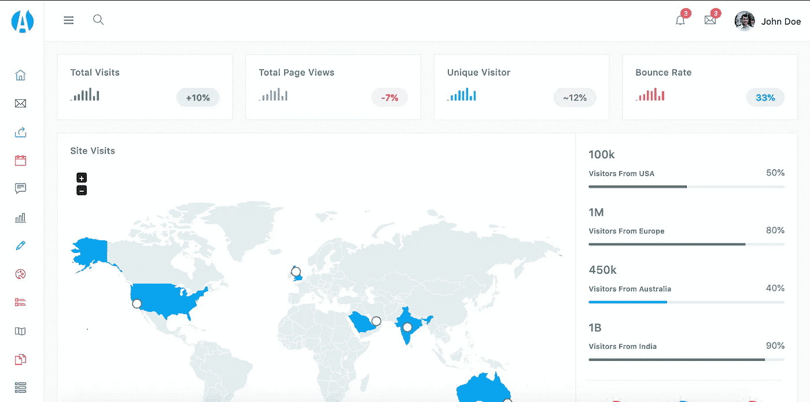
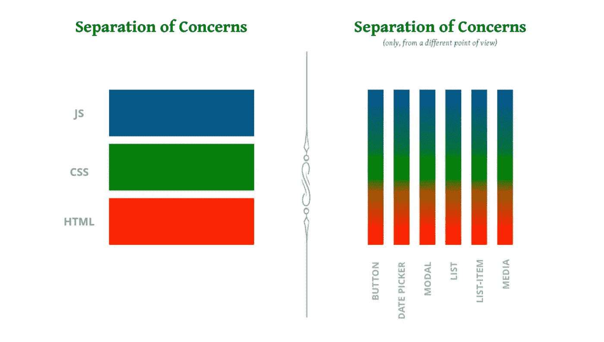

# 如何构建您的 SaaS 仪表板

> 原文：<https://medium.com/hackernoon/how-to-build-your-saass-dashboard-5e3d40dd2003>

## 你需要遵循的五个步骤——这不是火箭科学，但它可能会破坏你的产品。

我失败的企业多得数不清，但我的最后一个失败了。就像沃伦·巴菲特说的，你只需要做对一次。在这个过程中，我学会了快速出货，不再喜欢我的想法和工具。这里有一个简短的工具列表，您可以使用它快速有效地运送您的 SaaS 仪表板。

## 情况

你或者你的核心团队想出了一个新颖的算法，已经刮取并标注了一些数据等等。你认为其他人会付钱来看这个？不尽快验证这个假设会扼杀你的游戏。重新发明轮子是失败产品和破碎梦想的前沿。

不，你不是操纵木偶的大师——你不能从零开始构建一个有反应的 UI。不，你不是数据架构师——你不会仅仅通过思考就为你的用例选择杀手级数据库。

你只是一个有梦想的人。学会接受这一点，放下你的控制欲，并大量授权。当你试图在不属于你核心业务的领域定制时，一点帕累托(原则——你 80%的成功来自你 20%的努力)开始哭泣。

在健康的身体中，大脑不会告诉肝脏、心脏和肺做什么。接受有其他人/工具在某些领域比你做得更好的事实，学会授权，并经常这样做。

让我们来看几件你需要实现的事情，以从你的核心产品中获取价值。这些包括实现 UI、用户管理、处理数据和访问数据，以及最终将所有东西放在一起(架构)。当然，每一个现代应用程序都应该能够快速发布变更，所以我们将研究如何实现 CI/CD 管道。我在不到一周的时间里经历了所有这些困难，但我花了相当长的时间来完成这个过程。尽情享受吧！

## 响应式用户界面/UX

**问题**

玩 bootstrap 与您向客户销售的数据有什么关系？绝对没有，但这里有你的工程师燃烧通过无数小时来解决这个问题。

**Typeform** 甚至不能服务移动用户——那是 58%的用户浏览互联网，atm( [来源](https://www.stonetemple.com/mobile-vs-desktop-usage-study/))。它们从 2012 年就存在了。

**解决方案**

如上所述，停止重新发明轮子。去找一些能正常工作的东西，开箱即用。有很多免费的解决方案。我在我的项目中使用了[administrator](https://github.com/puikinsh/Adminator-admin-dashboard)，但是 Google 可能会进一步启发你。

它拥有你所能想象到的一切来模仿和构建一个响应迅速的管理仪表板，就像你的 SaaS 所需要的那样。

Looks decent — does it’s job. You’re not marrying it. Go for it today!

当模仿界面时，您可能想要推送到远程服务器，以便团队成员讨论它。Adminator 使用 web pack——您可以导出模拟界面的构建版本，并使用 express server 和 heroku deployment 向全世界提供构建版本！现在您已经为您的模拟获得了一个 CI/CD 管道！

## 用户管理

**问题**

用户账户的变化与你创业的核心有什么关系？！？这是一个重大的失败:index.co，由 Next Web 制作。重置密码不起作用，OAuth 集成也不起作用。我本以为每月收费 25 美元的产品会更好。

第一个拥有账户功能的网站可能出现在 20 年前。这应该不难，对吧？问问刚刚获得独角兽地位的 Auth0，他提供了一个解决方案。它仍然不能开箱即用。

**解决方案**

我发现 Firebase 在这里非常有用。它处理你所期望的一切。注册和登录有多种方法(经典的电子邮件/密码，谷歌/Fb 帐户等)。).验证电子邮件地址功能。电话号码验证。忘记密码。

它甚至配备了后端用户管理解决方案，因此您可以禁用或删除帐户。如果您想要手动批准用户，这也很有帮助—只需在用户帐户上存储一个变量，并将其默认为“notApproved”。

我遇到的另一个用例是在注册之前从用户那里收集一些数据。我通过链接到一个类型表单调查，并在表单完成时使用 webhook 解决了这个问题。

**数据存储、检索和访问控制**

**问题**

问自己“我的存储解决方案能扩展吗？”当你勉强得到你的前 20 个顾客时，这些话是不应该说的。扼杀你在 SaaS 创业的是获取客户的高成本、低生命周期价值或高流失率。我说还是因为一个就够了。

忘记意识形态，让我们先谈实践。客观地说，你所知道的最大的 nosql 部署是什么？国际足联有大约 250 台服务器运行，在 MongoDB 集群中保存数据。只有 250 台服务器。大约 100 个实例的集群在大型部署中很常见。

我承认——很少，你必须问的问题强加了一种独特的存储技术。当您的业务加速时，您可以从 125 个数据库实例增加到 48 个，最后只剩下 3 个——通过试验和选择合适的技术(参见 Adobe Behance 的用例[来源](https://www.youtube.com/watch?v=BfPDZf2wmqg))。这很重要，因为在大规模的情况下，账单会很快堆积起来。但你不在那里，所以你不用担心。

您想要的是一种将数据连接到 UI 并控制对它的访问的快捷方式。

**解决方案**

同样，我认为 Firebase 非常有用。您不需要管理数据库实例，它们已经在那里了。此外，您不需要担心从前端连接到上述数据，安全性会得到很好的保护。和 MongoDB 一样，它也是基于文档的。使用 firebase 库，只需几行代码，您就可以操作 javascript 中的数据。

可以使用访问数据的规则。重要拐点:**认证** vs **非认证**用户和**读** vs **写**。您还可以对用户进行分组，并撤销对数据库中某个文档的访问。或者，您可以明确地只允许一个用户访问某个文档。可以编写自动设置的规则(这样您就不会手动将用户与文档配对)。

一个 chron 作业可以用来将新数据推送到 Firebase。每次用户打电话检索数据时，您都可以对其进行计数并相应地收费。

**综上所述，**你要:

*   定期推送你新获得的数据
*   存储和检索数据
*   在用户界面中显示它
*   控制谁可以访问它
*   按使用量收费

如果你知道自己在做什么，这一切都可以在几天内完成。

**架构**

好了，现在你已经有了几个分散的 html、css 和 js 文件。你有一个没有实时数据的 web 应用程序——这是你的仪表板的蓝图。用户管理是有的。您还有一个管道来推送您的用户想要消费的数据。你对数据的处理是正确的。怎么把所有东西放在一起？

我建议您采用功能优先的 React 架构，使用 Redux 进行内存数据存储。这看起来是这样的。

React 将每个可视元素分离到它自己的类/文件中。你想要这个，因为你想坚持干的原则。在 adminator 中，菜单和顶栏对于页面中的所有元素都是通用的。您将希望能够使用它们，而不必每次都粘贴代码。

你会想要处理国家。我喜欢 redux——状态的改变只能通过纯函数来实现，所以一切都很好而且可以预测。在您的商店和您的 React 组件之间有一个双向绑定。

事情可能向两个方向发展:要么您的 UI 发送一个命令来更改您的数据存储和 Firebase 数据，要么您的 Firebase 数据发生更改，并且您的存储更新，这将提示 UI 进行更新。

简单干净，对吧？

功能第一的架构呢？这是一张很好的描述图:

假设您想在 React 应用程序中显示一个图表——该图表有一个可视化组件和一个数据组件。在功能优先的体系结构中，您只需要接触 Components/CustomChart 文件夹下的文件。这使得开发变得容易且可伸缩(您可以让任意数量的工程师对您的 UI 进行更改)。这样做还有很多其他的好处，我建议你开始阅读一些关于这个话题的文章。

**基础设施(CI/CD，快速部署)**

既然您已经将所有东西都放在了一起，那么是时候部署您的解决方案了。您将希望有一个临时环境—一个在进入现实世界之前进行手动测试的地方。你需要一个生产环境，在你测试了你的改变之后，你可以把它推进去。您可以通过创建两个单独的 firebase 项目来实现这一点，并通过基于变量切换凭证来对每个项目进行必要的切换。

此外，如果能有一种自动推动变化的方式就好了。您可以在 npm 中创建一个脚本来构建解决方案，导航到构建文件夹并部署**firebase**。

**结论**

虽然非常高级，我们已经跳过了所有必要的环节，向世界推出您的令人敬畏的 SaaS。我要求你在接下来的两周内做到这一点(这是可能的)。

一如既往，速度是关键——你需要测试、改进和操作漏斗，以验证你的假设。你真的在打造一款杀手级产品吗？获得客户的成本是否足够低，你为你的用户创造的价值是否足够高，从而使你的企业能够生存下去？

你越早知道越好。如果你刚刚完成核心产品的构建，并希望开始快速有效地开发它，这是我的 SaaS 产品的[仪表盘。](https://dashboardhero.dev/)