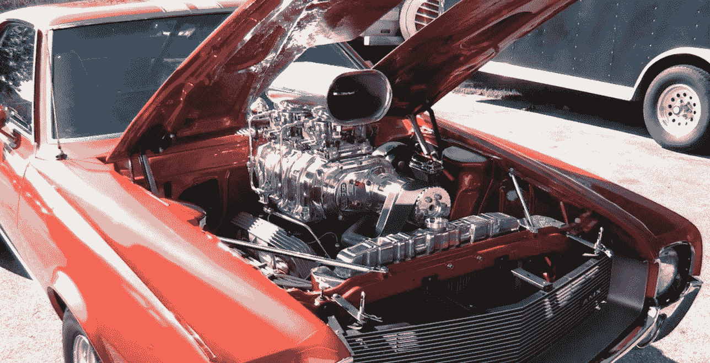
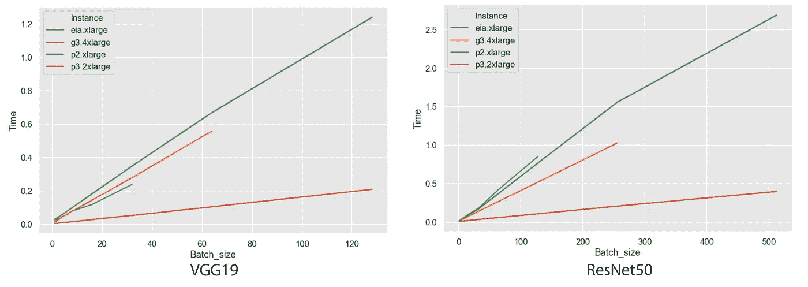
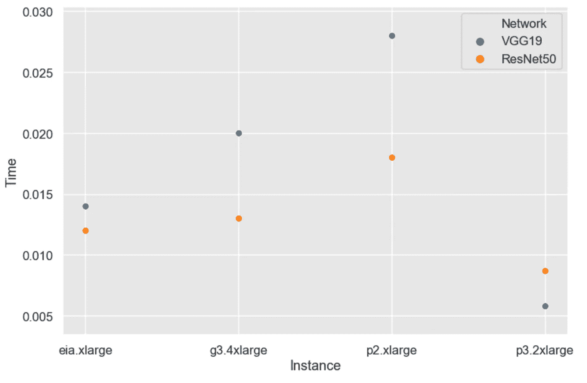
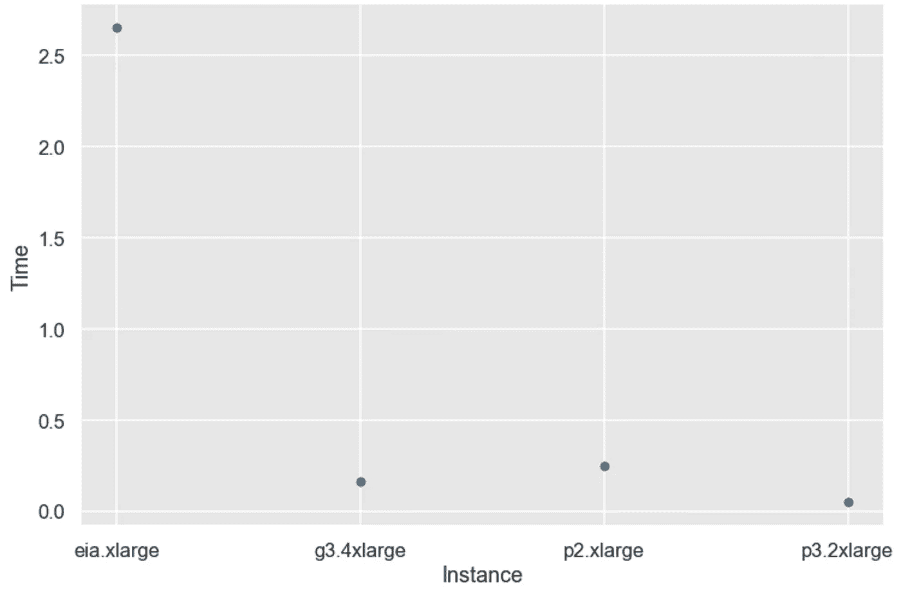
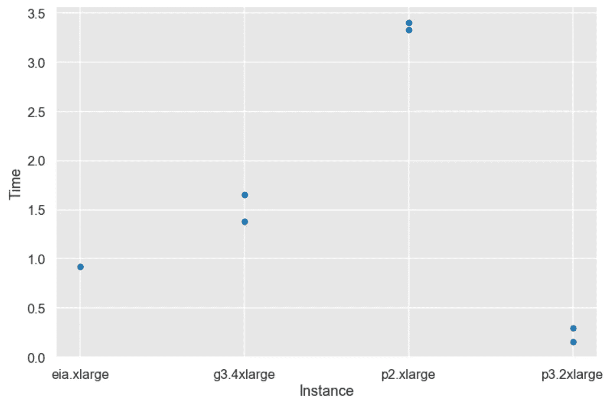

# 神经网络推理如何选择最优硬件？AWS GPUs 和弹性推理加速器的研究。

> 原文：<https://medium.com/hackernoon/how-to-choose-optimal-hardware-for-neural-network-inference-36c2188269ad>

## 我在 4 种不同的神经架构中测量了各种 AWS 硬件选项的性能，重点是推理。这是我的发现。

# 急什么？

AWS 为神经网络推理和训练提供了广泛的 GPU 设备。这里有一个众所周知的事实:90%的神经网络成本用于神经网络推理(实际使用它们)，只有 10%用于训练。所以，优化推理对业务单位经济有更大的影响。我在 Skylum Software 运营一个人工智能部门，我们为大型 B2B 企业提供基于神经网络的图像处理云解决方案。自然，推理的成本对我们很重要。

在神经网络推理上省钱包括几个阶段。

首先，当然是优化神经网络本身。有各种各样的技术——修剪和提取，量化是几个主要的。我不打算在这里讨论这个。另一种是将计算转换为 float16 精度，这需要特定的软件，这里没有几个例子。另一个是选择最佳的硬件进行推理。

## 为什么这不明显？

这里的要点很简单。我们用于训练的 GPU 和软件针对训练进行了优化，而不是推理。GPU 的内存很大，可以存储大批量的训练样本以及用于反向传播的梯度。当我们有稳定的批量数据流时，我们能够利用快速和大容量的内存，并实现接近 100%的 GPU 功率利用率。
通常在推断过程中，我们无法获得足够多的数据来将它们打包成稳定的批次流。等待足够的数据将导致对业务来说致命的延迟。因此，现实世界的推断可能适用于小批量的样本(1-4)，并侧重于延迟。这没有充分利用 GPU 的能力，使它们效率低下。经常，但不总是。

## 亚马逊的 AWS 解决方案

亚马逊想出了解决上述问题的方法——弹性推理加速器。这些是未知架构的设备(至少对我来说是这样),专门用于对小批量数据进行快速推断。它们配备了比 GPU 少得多的内存(1Gb-4Gb)和更低的处理能力，但也便宜得多。

# 性能和成本节约分析。

## 硬件和型号的选择。

为了进行这项研究，我选择了 4 种硬件设置:

*   p2.xlarge .最早的 GPU 产品。
*   p 3.4x 大型顶级 GPU 卡，完全支持 float16。
*   g3.4xlarge. GPU，内存有限(8Gb)，专注于软件的 3D 加速。不明显，但非常有趣的设备。
*   eia.large .最大的(4Gb) AWS 弹性加速器产品。

对于神经网络架构，我选择了 4 个最典型的解决方案——2 个用于图像分类，2 个用于 pix2pix 图像转换:

*   VGG19。最古老、研究最深入的建筑，虽然缓慢而庞大。
*   ResNet50。图像分类中大多数现代应用的基本结构。
*   UNet。缓慢但有效的图像分割架构。
*   EDSR。用于图像超分辨率等任务的典型神经网络。

弹性推理对软件有一套特殊的要求。目前，AWS 支持两种框架——谷歌的 TensorFlow 和亚马逊 MXNet。因为我的大部分代码都在 MXNet 中，所以我坚持使用它。

## 分类网络的测量结果。

让我们先来看看在两种截然不同的架构下，不同的硬件在批量扩展时的表现——vgg 19 和 ResNet50。

VGG19 and ResNet50 performance on different AWS hardware

哇！那很有趣。它们都随着批处理大小的增加而线性扩展(直到耗尽内存)，p3.2xlarge 在性能上处于领先地位。基于 GPU 的硬件对比，按照 NVIDIA 规格和 AWS 定价，都在意料之中。

但是，弹性推理加速器表现不同。它比 ResNet50 中的任何东西都慢，但是使用 VGG19 时性能更好。这给了我们一个线索——它针对某些类型的架构和操作进行了某种硬件优化。

但是，这些图并没有给出最低可能批次的推断性能的答案— 1。这对于实际生产性能是有意义的。让我们看看那个。

Batch=1 performance

又一个哇！这就是弹性推理的目的！在这里，EIA 显然是第二位的。p3.2xlarge 大约快 2 倍，但贵 6 倍。这里不用动脑筋——如果 10ms 的性能提升对您来说可以忽略不计，请坚持使用 EIA。但是，请记住，吞吐量将减少 2 倍(按月计算)，而成本将降低 6 倍。

对于这种类型的任务(分类),你也应该尝试低内存 EIA 实例——我认为这样可以节省更多的钱，10-15 毫秒的推理速度是一个很大的数字。

我还在 float16 上测试了推理，但是在这种情况下性能提升可以忽略不计。

## 图像分割和超分辨率。

那些是不同的野兽。UNet 通常用于更高分辨率的图像，224 像素不足以实现高质量的分割。所以，我尝试了一系列的解决方案。为了让数据具有代表性，我采用了分辨率的平方——遵循^2 法则的数量。

Image megapixels to inference time

所有硬件都遵循百万像素时间的线性趋势，弹性推理开始更加显著地丧失。让我们仔细看看一个用 500x500 像素图像进行图像分割的真实场景。

哦，哇哦！UNet 根本不是为弹性推理而创建的。金钱方面的单一推断价格如下:

*   EIA.xlarge = 0.001531 美元
*   g3.4xlarge = 0.000203 美元
*   p2.xlarge = 0.000250 美元
*   p3.2xlarge = 0.000163 美元

在这里，如果你的企业提供稳定的工作负载，并且每月 3k 不会吓跑你，那么 P3.2xlarge 是最便宜的。

## EDSR 和超分辨率

这是另一个有趣的边缘案例。

EDSR 架构的 EIA 性能要好得多(实际上是基于 ResNet 的)。EIA 在这里是一个明显的赢家。但是等等，你还记得 p3.2xlarge 的 float16 功能吗？这是一个有用的例子。这里有一个单个 500px x 500px 的成本推断。

*   EIA.xlarge = 0.000133 美元
*   g3.4xlarge = 0.000522 美元
*   p2.xlarge = 0.000833 美元
*   p3.2xlarge (float32)= 0.000252 美元
*   p 3.2x 大(浮动 16)= 0.000130 美元

全精度下的 EIA 与运行在半精度模式下的 p3.2xlarge 不相上下。
同样，如果你能使用 fp16，并且你的业务有稳定的数据流，坚持使用 p3。否则，EIA 会给你带来显著的成本效益。

## 诺塔贝纳酒店

*   在测量过程中，我做了 11 个推理循环，取最后 10 次测量的平均时间。由于机制的原因，第一次推理总是慢很多(10 倍)。
*   据我所知，我可以在 float16 模式下运行 EIA，但从未获得任何速度增益。

[为了更好的利益，我正在分享 200 个测量和数据点的所有原始数据。](https://docs.google.com/spreadsheets/d/170TDMk3jBuNDOSQ1WfscsyqkdeRuATI6Tfn1T0KW9ik/edit?usp=sharing)

**有问题别忘了鼓掌，分享，联系我。**