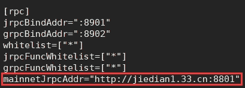
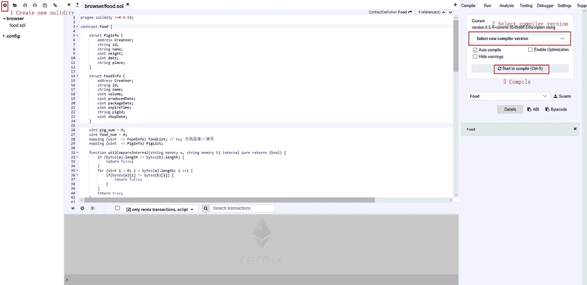
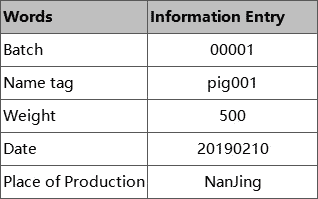
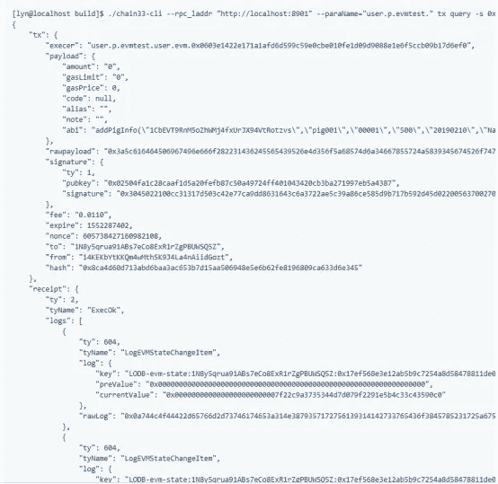
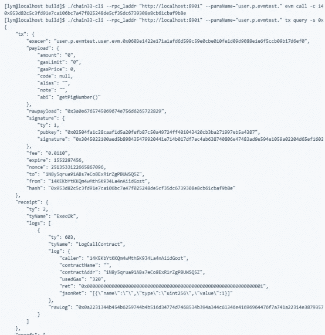
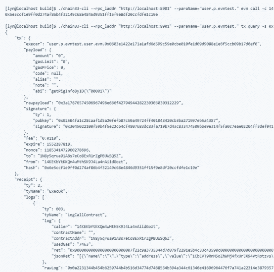

# 如何在短短 1 分钟内部署一个副链？

> 原文：<https://medium.com/hackernoon/how-to-deploy-a-parachain-in-just-1-minute-15dde9240266>

自从过去半年以来，我们已经看到了加密市场的低迷和公共链的兴起。几乎每个星期，都有很多团队宣布他们推出公共链的计划。对公链前所未有的热情，让人产生一种错觉，建立一个公链只需要设置几个节点就可以了。

然而，罗马不是一天建成的。

公链的建立并不是一件容易的事情。即使是顶级的加密货币交易所，火币在投入 3000 万 HT 开发公链(近 6 亿多人民币)后，也没有给出明确的上线日期申报。实际上，公链的开发需要非常大的 R&D 投入，以及技术团队的支持和维护成本。还有，组织大量社区成员参与节点建设和验证，成本相当高。但是，即使成本如此之高，为什么越来越多的人呼吁公共链？

# 答案是对区块链的多样化需求。

因为一个区块链网络不能满足多样化的需求。有些人倾向于建立一个私人财团，而另一些人则希望建立一个完全透明的共识网络；一些人提倡非代币的区块链生态系统，而另一些人认为代币经济是整个区块链世界的未来。因此，似乎不可能被一个区块链网络覆盖，导致对公共链的需求越来越大。

如何平衡公链需求和成本的矛盾？副链的出现。

> Parachain 是一个简单、易于扩展的区块链，其安全性由“主链”提供

副链和主链保持分离和连接的关系。在主链下，它们可以拥有自己的超级节点、状态机和事务执行能力。

# **1。什么是副链**

要了解 parachain，先说一下公链。

公链是指世界上任何人都可以随时访问系统读取数据、发送可识别交易、竞争记账的区块链。公共链通常被认为是“完全分散的”，因为没有个人或机构可以控制或篡改数据。比特币是全球第一个公链，有自己独立的钱包和区块链浏览器；以太坊是第一个拥有智能合约的公共链，因此，Dapps 成为区块链生态系统的重要组成部分。

Parachain 是 parallel public chain 的缩写，是 public chain 的另一种形式。用户可以根据提供的文档构建副链。每个 parachain 都是一个独立的区块链生态，开发者可以在其中创建自己独立的钱包、浏览器、DAPP、颁发数字证书、部署超级节点。

同时，所有数据和共识机制都存储在主链中，而执行过程(包括签名、发送和广播)可以在副链中完成。交易执行后，最终的交易哈希值需要记录在主链上，因此，主链上的数据是最权威和完整的。副链附着在主链上，同时保持相对独立，构建了整个区块链网络生态系统。

# **2。副链的优势**

*   通过大量分散的节点分布来保证整个区块链网络的安全。
*   每个副链都是平等和独立的，从而解决了拥塞问题；
*   基于底层区块链技术和公链的功能，企业不需要花钱进行高成本的公链建设和维护；
*   Parachain 具有超级节点部署功能；
*   能快速开发对接 N 种 DAPP，能快速发行 N 种代币；
*   利用公链的公授权经济模式，帮助企业拓展商业生态，抢占互联网市场；
*   支持代码开源；

# **3。如何在短短 1 分钟内构建平行链**

paravhains 的概念还是比较新的，首先由 Polkadot 提出。在中国，这一概念最早是由富扎美科技有限公司提出的，后来百度(https://en.wikipedia.org/wiki/Baidu)在其白皮书中也引用了这一概念。尽管这一概念和区块链技术越来越受到重视，但在副链上的应用仍然很少。

幸运的是，我们终于在 parachain 上找到了一个关于食品溯源的应用案例。所以今天，我们将使用这个案例来说明如何构建一个 parachain 并在其上创建智能合约。

有以下四个主要步骤:

*   环境部署
*   合同汇编
*   合同创建
*   合同呼叫

**3.1 环境部署**

*   获取文件

*wget https://bty . OSS-AP-southeast-1 . aliyuncs . com/chain 33/parachain . tar . gz*

*   使减压

*塔尔 zxvf paraChain.tar.gz*

*   配置文件修改

*ParaRemoteGrpcClient* 条目的值为:

101.37.227.226:8802，39.97.20.242:8802，47.107.15.126:8802，jiedian2.33.cn

*mainnetJrpcAddr* 的值为:“http://jiedian1.33.cn:8801”

修改如下:

*   启动 chain33 流程

cd 副链。chain33 -f chain33.para.toml

**3.2 合同编制**

要使用 solidity 编译器编译合同，可以使用以下工具:Remix-ide 和 Intellij-Solidity

这里我们以 Remix-ide 为例。

创建一个新的 solidity 契约，并选择要编译的编译器版本。

Souce: [https://chain.33.cn/document/126](https://chain.33.cn/document/126)

编译成功后，你可以使用 ABI，字节码来创建合同。

**3.3 合同创建**

使用 chain33-cli 中的命令行创建契约(因为 abi 和 bin 的字段太长，所以使用 abiInfo 和 binInfo 代替)。

*【Lyn @ localhost build】$。/chain 33-CLI—RPC _ laddr " http://localhost:8901 "-paraName = " user . p . EVM test . " EVM create—sol food . sol-c 14kekbytkqm 4 wmt HSK 9j 4 la 4 naiidgozt-f 0.1 0x 0603 e 1422 e 171 a FD 6d 599 c 59 e 0 CBE 010 Fe 1d 09d 9088 E1 E6 F5 cc b 09 b 17 d6e f 0*

根据返回的哈希值查看合同创建详细信息。

Since the code is too long, the complete one can be seen in github [https://github.com/lynAzrael/L/blob/master/share/solidity/food_trace.md#3-%E5%90%88%E7%BA%A6%E7%9A%84%E5%88%9B%E5%BB%BA](https://github.com/lynAzrael/L/blob/master/share/solidity/food_trace.md#3-%E5%90%88%E7%BA%A6%E7%9A%84%E5%88%9B%E5%BB%BA)

**3.4 合同调用—信息录入**

先以猪肉信息录入为例。

使用 chain33-cli 输入信息

*【Lyn @ localhost build】$。/chain 33-CLI—RPC _ laddr " http://localhost:8901 "-paraName = " user . p . EVM test . " EVM call-c 14kekbytkqm 4 wmt HSK 9j 4 la 4 naiidgozt-e " user . p . EVM test . user . EVM . 0x 0603 e 1422 e 171 a FD 6d 599 c 59 E0 CBE 010 Fe 1d 09d 9088 e 1e 6 f 5 cc b 09 b 17 d6e f 0 "-b " add*

检查食品信息是否通过哈希成功添加

Since the code is too long, the complete one can be seen in github [https://github.com/lynAzrael/L/blob/master/share/solidity/food_trace.md#411-%E7%8C%AA%E8%82%89%E4%BF%A1%E6%81%AF%E5%BD%95%E5%85%A5](https://github.com/lynAzrael/L/blob/master/share/solidity/food_trace.md#411-%E7%8C%AA%E8%82%89%E4%BF%A1%E6%81%AF%E5%BD%95%E5%85%A5)

。/chain 33-CLI EVM call-c " "-f " "-e " EVM 约定地址"-b "abi "

Since the code is too long, the complete one can be seen in github [https://github.com/lynAzrael/L/blob/master/share/solidity/food_trace.md#411-%E7%8C%AA%E8%82%89%E4%BF%A1%E6%81%AF%E5%BD%95%E5%85%A5](https://github.com/lynAzrael/L/blob/master/share/solidity/food_trace.md#411-%E7%8C%AA%E8%82%89%E4%BF%A1%E6%81%AF%E5%BD%95%E5%85%A5)

**3.5 合同调用—信息查询**

以火腿原料(猪肉)为例

使用 foodInfo 中查询的 pidId 进行进一步的信息查询

Since the code is too long, the complete one can be seen in github [https://github.com/lynAzrael/L/blob/master/share/solidity/food_trace.md#423-%E7%81%AB%E8%85%BF%E5%8E%9F%E6%9D%90%E6%96%99%E7%8C%AA%E8%82%89%E4%BF%A1%E6%81%AF%E6%9F%A5%E8%AF%A2](https://github.com/lynAzrael/L/blob/master/share/solidity/food_trace.md#423-%E7%81%AB%E8%85%BF%E5%8E%9F%E6%9D%90%E6%96%99%E7%8C%AA%E8%82%89%E4%BF%A1%E6%81%AF%E6%9F%A5%E8%AF%A2)

# **4。结论**

Parachain 具有很强的可扩展性，并配备了公共链功能，如独立的区块链浏览器，加密钱包。用户可以开发 Dapps 并在副链上发行代币。如上所述，食品可追溯性是一个很好的例子，向您展示如何构建一个副链并在其上创建智能契约。

有关 parachain 的更多信息，请关注我们。

推特:福扎美

网站:33.cn

github:[https://github.com/33cn/chain33](https://github.com/33cn/chain33)