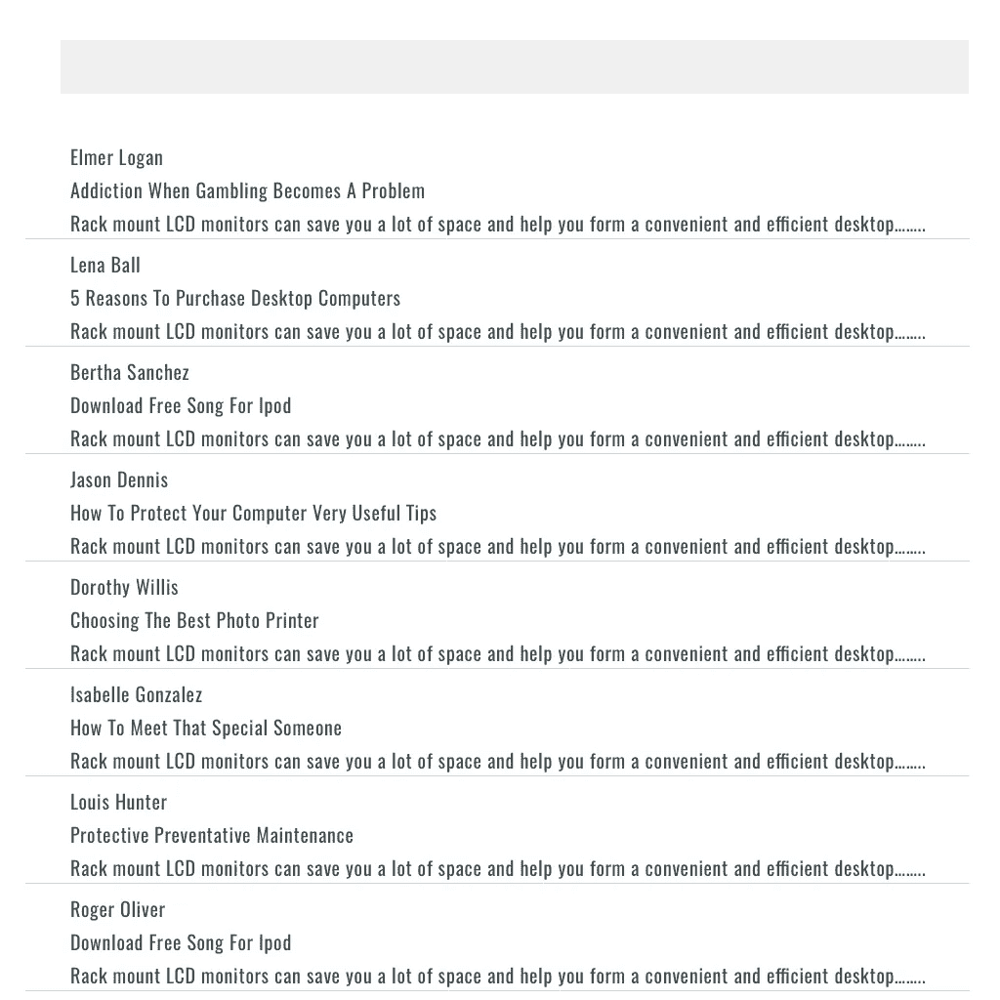
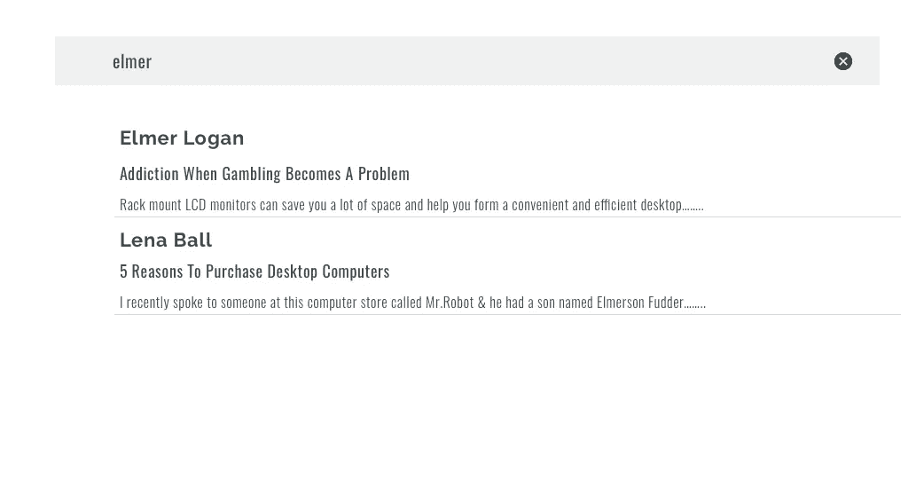
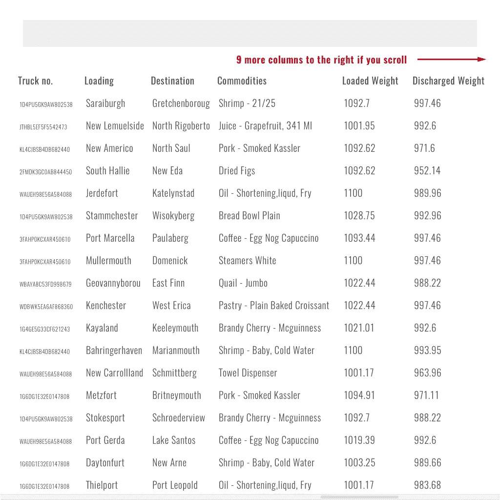
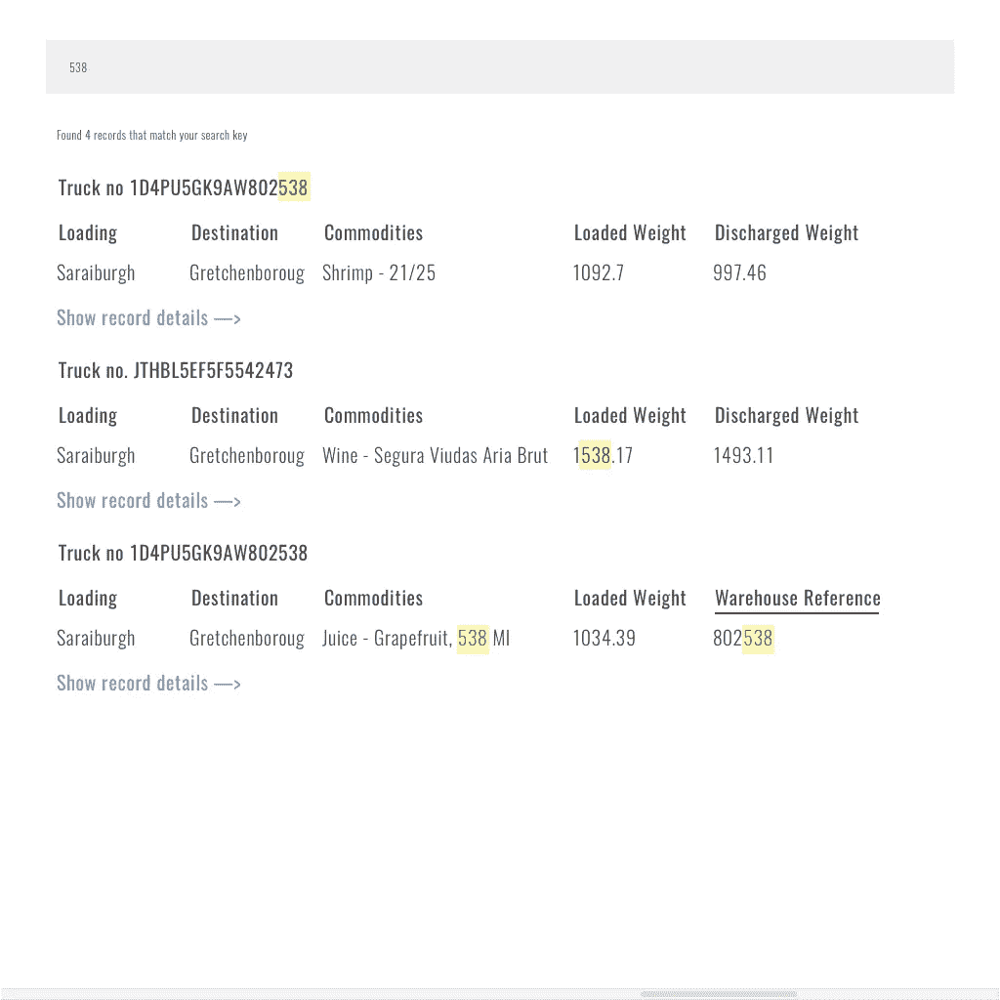

# 如何为你的产品设计和构建优秀的列表界面

> 原文：<https://medium.com/hackernoon/how-to-design-and-build-great-listing-screens-for-your-product-c82ff0bdb4d5>

Photo by [chuttersnap](https://unsplash.com/photos/AG2Ct_DqCh0?utm_source=unsplash&utm_medium=referral&utm_content=creditCopyText) on [Unsplash](https://unsplash.com/search/photos/rows-of-light?utm_source=unsplash&utm_medium=referral&utm_content=creditCopyText)

列表屏幕:每个人都在使用它们，没有人会想太多。在我的一生中，我见过各种各样的列表屏幕，从畸形到极简。这篇文章提炼了一些常见的问题、解决方案和帮助他们提高效率的想法。如果你读了这篇文章，你会得到什么:

*   介绍
*   组织数据
*   分页和排序
*   优化数据可读性
*   设计有效的搜索和过滤
*   粒度与概览列表页面
*   表演
*   从列表页面重定向到列表页面

# 什么是列表页面？

列表页面如名称状态一样为用户列出数据。让我们看一些来自企业和消费者世界的例子:

## 消费者示例

*   亚马逊——当你输入要搜索的内容时，这个页面会列出产品。
*   Gmail——列出您所有电子邮件的登录页面
*   Pinterest —显示图像的磁贴

## 企业示例

*   物流管理软件中的卡车列表
*   人力资源管理系统中的员工列表
*   CRM 软件中的客户列表
*   会计软件中的发票清单等。关键要素

列表页面的关键元素包括:

**数据** —你的页面主要列出的东西。这可以是数据的行、块或卡片。

**过滤器—** 过滤器帮助用户找到他们想要的东西。这些可以是在线过滤器或过滤器面板或通用搜索。

**动作—** 这些可以是菜单中的按钮或操作。动作是用户对列表中的一个或多个项目所做的特定事情。例如:归档邮件，处理发票清单上的付款，根据卡车标记收到的货物等。

## 在列表页面中组织数据

列表页面的一个关键挑战是，随着时间的推移，它们会变得很大。用户开始努力寻找他们需要的东西，开发人员开始努力提高性能。我们先来了解一下用户的挣扎。

一个简单相关的例子是你的 Gmail 收件箱。想象一下，如果你的收件箱没有标签或者搜索栏，你会有一个从第一天开始的邮件列表。这立即产生了一些要求:

需要将列表分成可管理的块:让我们假设一个用户在他/她的收件箱中有 1000 封邮件。如果必须一次获取并显示所有 1000 个，将会导致两个问题:

*   在用户不向下滚动的情况下，屏幕一次只能显示大约 20 条记录。
*   如果邮件没有分类，即以随机顺序出现，新邮件可能在任何地方。存在用户错过邮件的风险。

这两个问题可以转化为两个产品特性:

分页(Pagination)—分页是将数据在网页间分开的过程。这解决了一个主要问题——除了用户在第一页上看到的内容之外，查询不必获取任何其他内容。这意味着该列表可以一次加载 20 个项目，从而减少用户的加载时间。当用户向下滚动或单击 next 时，将加载下一组记录。

**排序** —即使有分页，如果邮件没有排序，新邮件也有可能出现在第 7 页而不是第 1 页。这意味着用户不可能知道它在哪里。这迫使用户浏览几页(如果不是全部的话)来查找新邮件。如果我们按接收日期排序，那么最新的邮件会出现在最上面，新邮件总是会最先出现。

## 分页和排序的问题

我见过系统不正确地实现分页和排序。考虑到系统需要允许用户根据他们的需求进行排序。一个经典的例子是，电子商务网站允许你按价格、受欢迎程度或相关性进行排序。分页获取按照与搜索词的相关性排序的前 20 个产品。现在，用户希望按价格对列表进行排序——从低到高。这种排序必须应用于整个结果集，而不是显示的 20 个产品。

***产品经理提示:*** 通过查看使用数据优化默认排序。如果用户总是覆盖默认排序，请更改它。目标是减少不必要的服务器调用，让用户满意。

找出最常用的排序模式，并将其设置为默认模式。这可能是最简单的方法。更精确的方法是创建群组，并找出哪个群组更喜欢什么样的排序顺序。根据他/她所属的群组在用户级别设置顺序。

有几种分页和排序模式，各有利弊。我将在另一篇文章中讨论这些内容。请记住，如果你正在设计或建立一个列表页面，一定要记住数量。总是知道问题的答案:

> 用户需要查看多少条记录才能高效地完成工作？

## 数据管理

列表页面最重要的特性是可读性。随着时间的推移，数据堆积到一定程度，排序和过滤不再是可行的解决方案。用户需要更好的解决方案来管理数据。

让我们暂时回到 Gmail 收件箱的例子。如果你假设一个普通人每天收到 20 封新邮件，一年就是 720 封，三年就是 2160 封。如果假设上个月的电子邮件是最相关的，那仍然是 30 页@每页 20 封电子邮件。这就是种族隔离的由来。现在，假设我将电子邮件分为促销邮件、社交邮件和主要邮件。这就完全不同了。现在我有 3 个标签&总共 60 封电子邮件可以访问。更好的是，我知道我需要专注于初选。尽管搜索栏是一个很好的帮助，但最好不要使用它，除非没有找到电子邮件的替代方法。事实上，如果我在第一页找不到我要找的东西，我应该只使用搜索栏。

基于状态的隔离对于企业和事务系统非常有效。让我们看几个例子:

*   申请人跟踪系统中的候选人列表—列表页面根据候选人在管道中的状态分为多个选项卡:电话面试、技术面试、经理面试、已录用
*   运输管理系统中的卡车列表—列表页面根据其状态分为多个选项卡:运输中、装载中、已交付
*   会计系统中的发票列表-列表页面根据其付款状态分为多个选项卡:未付、已付、过期或根据类别:应收款、应付款

谷歌对 Gmail 问题的解决方案非常巧妙。他们的标签是通过机器学习完成的分类。

*注意:*如果您正在处理的状态超过 5 个，选项卡可能会变得无用。你不希望用户必须滚动才能找到相关的选项卡，可访问性是关键。如果你正在处理一个需要在手机上运行的应用程序，你可能需要更仔细地考虑标签。或者用不同的设计模式替换它们。

# 视觉层次

这深入了设计的世界。这取决于用户能够多快地找到他/她想要的东西。数据必须被很好的区分，以至于在没有意识到的情况下发现了它。为了理解视觉层次，拿一份报纸，观察不同的部分。

*   粗体大字体的标题
*   用引号和斜体突出强调，以引起人们对自己的注意
*   较小字体的内容
*   段落等。

看看上面的两个例子，调整文本大小和粗细可以增强可读性。我过去使用过的大多数企业列表屏幕都没有这样的层次结构。这有两个原因:

*   不同动机的利益相关者使用相同的列表页面。
*   记录是行和列。

稍后我将深入探讨这两个问题。

> 对于任何包含大量数据的列表，使记录可识别是必须的。这是一项艰巨的工作，需要更深入地了解每个用户在屏幕上做什么。
> 
> 这似乎是显而易见的，但大多数人宁愿跳过这一方面，将数据提供给用户。他们让用户知道如何使用它。

# 搜索栏

搜索栏在列表页面上很有用，但是也有一些事情需要注意和考虑。

*   **搜索必须是通用的**——无论用户输入什么，搜索都应该返回结果。它必须跨列执行通配符搜索。
*   **记录被退回的原因应该是可以发现的**。这意味着，如果我输入一个关键字进行搜索，当我看到返回的结果时，找到该记录的原因一定是显而易见的。这通常是通过突出显示以卡片或平铺方式列出记录的现代列表页面来实现的。

Unclear Search Results

Highlighted Search results

在上面的例子中，第一个图像显示了两个搜索结果。为什么返回第二个结果不是很明显。通过突出显示，这变得很明显。当列表页面是平面表格结构时，这就不那么容易做到了——我将在下一点中解决这个问题。

如果列表页面上的数据很大，比如说每行包含 15 个字段，那么很难理解为什么会返回一条记录。这应该使用不同的设计范例来完成。在正常情况下，搜索返回的列表看起来与列表页面完全一样，只是记录更少。如果一开始有 10 条记录，搜索将返回 2 行，但是列表的显示方式没有改变。看上面的例子。

现在，看看下面的例子，它显示了搜索前后的列表页面。

List page with 15 columns before search

Search results on List page

正如在上面的模型中看到的，搜索结果以一种风格显示给用户，这种风格允许他们对数据进行分类并进一步深入。我用红色给字段加了下划线，以表明所显示的列可以是上下文特定的。

## 在多个字段中搜索

我经常看到用户想要搜索特定字段中的值。例如，在上面的屏幕截图中，用户希望只在仓单编号或卡车编号中搜索“538”。这就成了一个问题，因为这个特性在整个字段集上起通配符搜索的作用。解决这个问题的一种方法是允许用户使用特定类型的关键字来搜索特定的信息。例如，Gmail 允许将“发件人:sheshank”作为搜索关键字，这将获取从 Sheshank 收到的所有电子邮件。

另一个技巧:如果搜索关键字有多个字符串，可以用任何分隔符分割搜索关键字，并在每个字符串上使用通配符。例如，如果搜索关键字=“通配符”，系统应该将其拆分为“通配符”和“卡”，并在基础数据集中搜索这两个关键字。

注意:这些功能通常不会被发现，所以如果你的目标受众不是很懂技术，这些功能永远不会被使用。

我能想到其他几个在实现搜索时可能会犯的错误，但这本身就证明了一个帖子是正确的。继续前进…

# 数据与粒度数据概述

这一条非常具体到企业产品。通常，列表屏幕是用户花费大部分时间的地方。他们从列表页面发起交易或后续操作。在这种情况下，用户通常需要大量关于交易的信息，以便他们可以过滤和查找数据。如果两个不同的利益相关者出于不同的动机使用同一个列表页面，页面设计会变得非常复杂。每个利益相关者在采取下一步行动之前希望看到的细节是不同的。让我们举一个例子:

物流公司 ABC 有两个部门需要查看货运信息:

*   **交通规划部门** —需要查看一个列表，他们可以使用该列表来确定卡车的状态、装载的货物、装载的重量、目的地以及其他大量信息。
*   **会计部** —需要查看需要向客户开具发票的卡车清单。他们需要看到客户姓名、路线和产品。

在讨论这个场景之前，我将解释另一个相关的概念。用户在点击之前需要看到多少&为什么？

嗯，这取决于谁在点击。回到卡车的例子，后勤人员可能需要看到大量的信息来计划他的下一步行动，而客户团队需要看到有限的信息。

> 这一切都归结于用户研究。在大多数情况下，我们建立一个适合所有用途的列表。这导致了没有利益相关者会高兴的情况。

那么为什么这是一个问题呢？大多数基于事务的系统使用关系数据库在表中存储数据，在父子关系中，有几个表在一个事务中受到影响。

例如，一辆卡车可以在多个目的地之间运送多种商品。如果假设您需要获取装货和卸货地点的地点和重量，那么您已经创建了至少一组父表和子表。为了查询任何记录，您需要多个连接，这最终会降低性能。最终，查询和索引的性能调优只能做到这一步。系统会变慢，用起来会很痛苦。

现在让我们把这个和我们最初的问题联系起来。有两个利益相关者团队使用同一个列表——一个需要关于交易的详细信息，另一个需要高级信息。粒度信息意味着传统 RDBMS 系统中更多的连接。随着时间的推移，列表的性能会降低。为了提高性能，产品将不得不接受调用，从列表中删除减慢速度的信息。这将阻碍物流用户做出决定。如果你不这样做，会计部门会发现它很慢，提高发票将成为一种痛苦。

解决方案很清楚，不要混淆关注点，建立一个适合所有人的列表。

> 没有人能预测事情将来会如何发展。以这样一种方式设计，即每个列表都可以为其自己的利益相关者成熟。

有时，在同一个团队中会有许多需要不同类型信息的涉众。继续构建单独的概览和粒度信息列表。就性能而言，确保您的开发人员从第一天起就知道这可能是一个问题。他们可以实现适当的解决方案，如创建视图、缓存、编写存储过程以从底层连接填充扁平表、分区表、归档等。随着技术的发展，开发者有了很多技术，比如缓存到像 Elastic & Algolia 这样的工具来解决搜索和列表问题。总结一下:

*   不要试图构建一个既显示粒度信息又显示概览信息的列表。
*   不要混淆利益相关者的关注&建立一个适合所有人的清单。
*   分析数量&在开始时与开发者讨论列表和搜索。

# 从列表页面重定向到列表页面

这是列表页面用户体验的另一个被忽视的方面。这主要是因为没有从头到尾考虑流程。我将通过两个例子来解释这个问题。

**问题 1:在动作完成后重定向到适当的列表页面**

假设你在 gmail 上，你写了一封新邮件并发送出去，成功完成后 gmail 会带你去已发送邮件，而不是让你呆在收件箱里。将用户带到已发送的项目可以是确认邮件实际上已经发送的一种方式。实际上，用户并不是这样工作的，他们想继续阅读或回复邮件。所以正确的做法应该是把它们放在收件箱里，并附上确认邮件状态的祝酒辞。

在 gmail 的例子中——范例很明显，用户必须呆在收件箱中，但对于其他应用程序来说，情况可能不是这样。以电子商务网站为例，起点是产品列表，交易以销售结束。如果系统在完成后将用户导航到产品列表，这将毫无意义。在企业应用程序中，这变得非常复杂。在起始事务上可以发生几个后续事务。根据后续行动是否即时和/或由同一人完成，重定向设计会发生变化。

*规则:*除非有充分的理由，否则不要将用户重定向到与交易源不同的位置。

**问题 2:交易完成后保留过滤器**

想象一下，你在 gmail 上搜索“UX 最佳实践”,收到 15 封邮件。你点击了第三封邮件，因为它可能是你要找的那封，但不是那封，所以你点击了返回。现在，您丢失了您搜索的内容，需要再次键入您的搜索词。幸运的是，gmail 不存在这个问题，但是很多企业应用程序存在这个问题。通常，用户会键入过滤标准，系统会返回一组记录，用户打开其中一个记录，当他/她返回时，过滤标准会丢失。这对使用者造成的刺激非常大。尤其是当它发生在他们全天交易的列表上时。

规则:始终保留搜索过滤器，以防用户在查看一些详细信息后返回列表页面。

注意:这需要提前向您的工程团队提及，以便他们可以设计系统来实现这一点。

所以现在你有了，一个基于我所看到和犯过的很多错误的建立列表页面的指南。

如果你喜欢阅读这篇文章，你可以阅读我在其他主题上的类似文章:

*   如何[设计角色](https://hackernoon.com/how-to-design-roles-and-access-controls-in-your-product-7dfe65518def) &访问控制
*   如何设计一流的[用户注册流程](https://hackernoon.com/how-to-build-kick-ass-user-registration-flows-for-your-product-9c8e1c24931)