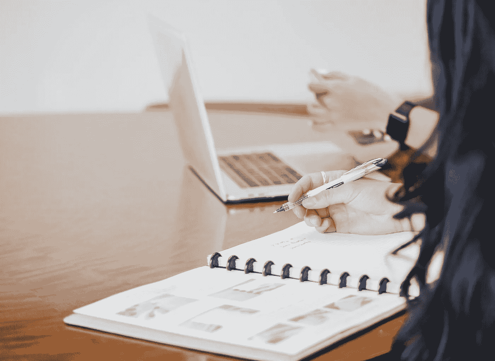

# 如何做好用户访谈

> 原文：<https://medium.com/hackernoon/how-to-do-great-user-interviews-7cd8a6a9e7bf>

用户访谈有助于发现为什么用户会有某个问题，以及你的设计是否正确地解决了这个问题。打乱产品开发的这个阶段可能会导致信息的缺乏，甚至是错误的信息，而这些信息是你做出产品决策的基础。这将是一个代价高昂的错误。作为用户体验设计师或产品经理，采访用户是你需要掌握的一项非常特殊的技能。确保你的产品团队中总有一个人擅长这项技能。

用户访谈可以在多个产品阶段使用:发现并深入了解用户的问题，发现你当前产品的问题，或者在完全构建之前测试新的原型。让我们来看看如何准备面试，如何创建面试模板和面试技巧。

# **准备用户访谈**

用户访谈是为了了解人们为什么做或想某事。他们需要强有力的互动和提出更深层次的问题来揭示潜在的推理。这就是为什么我们总是一对一地进行面对面的用户访谈。

**采访用户的最佳数量通常是 5 个**，但可能会根据你的采访主题的复杂程度而变化。核心指导方针是不断采访更多的用户，直到没有新的信息被发现，并且发现似乎只是重复。

面对面的采访通常最有效的方法是邀请用户到你的办公室。提供 50 美元的亚马逊优惠券可以大大增加你的邀请邮件的回复。最后，有人会放弃一个小时的时间来拜访你，而补偿是很重要的。这也确保了你不仅能让你最铁杆的粉丝来拜访你，还能潜在地影响面试。

对采访进行录音会非常有助于你事后做笔记。这样你就可以真正关注这个人，而不是打断面试做笔记。我们通常设置一台带有网络摄像头的笔记本电脑来记录用户，并记录桌面或移动应用程序上的操作。

# **制作面试模板**

下面是我在 [GUTS tickets](http://www.guts.tickets) 最近一次用户采访中使用的模板示例。虽然有些问题可能特定于我们的产品和行业，但问题的一般结构和类型可用作创建您自己的面试模板的基础。

我在这里做的采访是一个任务驱动的原型采访，我们和用户一起测试一个模拟原型，以发现他们将如何使用一个新功能。通常用户与你产品的互动与预期的不同。您的发现甚至可能导致在关键的变更被做出并再次测试之前不构建整个产品。

正如你在下面的模板中看到的，我们以一个强烈的积极欢迎开始介绍部分。确保这个人明白没有错误的答案，目标是学习改进产品。要明确的是，这不是一个“采访”发表在任何地方。

在一般背景部分，你试图找到更多关于你面试的特定类型的人的信息。这可以帮助你创建你的产品所针对的人物角色。在本节中，您还将重点关注发现某人当前的行为。让你的产品符合用户当前的行为总是比强迫他们改变行为更容易。

测试原型时，最好只给出任务，观察用户如何完成。你不应该问他们会如何使用你的产品，因为这会引发用户给出对你没什么价值的社交需求答案。通过分配任务和观察他们做什么，你可以真正了解他们会做什么，并看到他们在哪里努力理解你的 UX 或文案。

面试时千万不要问封闭的或暗示性的问题。如果你真的有一些问题想问，那就留到面试结束时再问。

> **简介**
> 
> -很高兴您来到这里，并希望帮助我们改进产品！
> 
> 答案没有好坏之分，我们只是想学习
> 
> -本次采访仅供内部使用
> 
> -我们想把它记录下来，以便更好地记录我们学到的东西
> 
> **一般背景(用户的角色和当前行为)**
> 
> -你能告诉我一些关于你自己的事吗？
> 
> -在过去 12 个月中，您参加过哪些活动/剧院/音乐会/音乐节？
> 
> -你为什么选择参加这个活动？
> 
> -你和谁一起去的？
> 
> -你是如何安排跟团的？你能给我介绍一下吗？
> 
> **原型介绍**
> 
> -接下来，我们将让你测试新产品，给你几项任务
> 
> -同样，没有好的或错误的答案，你可以完全诚实
> 
> -当你注意到事情并采取行动时，请大声思考
> 
> -大声提出你的问题(但我只会在最后回答)
> 
> **任务**
> 
> -你收到了一个朋友的消息，你认为这是关于什么的？
> 
> -你能为你们两个买票并解释你们是做什么的吗？
> 
> -你注意到了什么？为什么？
> 
> **汇报**
> 
> -总体而言，您对此次体验有何感受？
> 
> -你认为这是给谁的？
> 
> -你经历过的最好的奖励计划是什么？为什么？
> 
> -邀请朋友参加活动，您想要什么作为奖励？

# **使用开放式问题，询问过去的行为**

要发现用户决策背后的真正原因和驱动力，你必须问许多开放性的问题。这些问题从为什么、做什么和如何开始。不要用简单的是或否来回答问题。你的目标是让用户尽可能多地说话。

问为什么，为什么，为什么，并使用后续问题来深入挖掘用户的动机和推理。有时你只会在访谈结束时发现用户的关键驱动力。保持敏锐，真诚地对它们感兴趣。不要害怕使用沉默，等待对方开始说话。实际上，使用沉默常常能很好地让人们开口说话。

**询问真实的过往行为。而不是问“你会怎么打开盒子？”，问“你能告诉我你上次是怎么打开盒子的吗？”**。这通常会对人们当前的行为给出更加现实的答案。当问他们“如何”做某事时，答案通常被这个人理想化了，并不代表他们在现实中做了什么。对此要非常小心，因为你不应该根据从错误的问题中收集到的信息得出结论。

**问:**

*   你能告诉我更多关于你上次是怎么做的吗？
*   你干嘛这样？

**DONT 问:**

*   你会使用这个功能吗？
*   你喜欢这个吗？
*   你会如何使用该产品？

现在去获得那些见解吧。祝你面试好运！

*图片来源:unsplash.com*