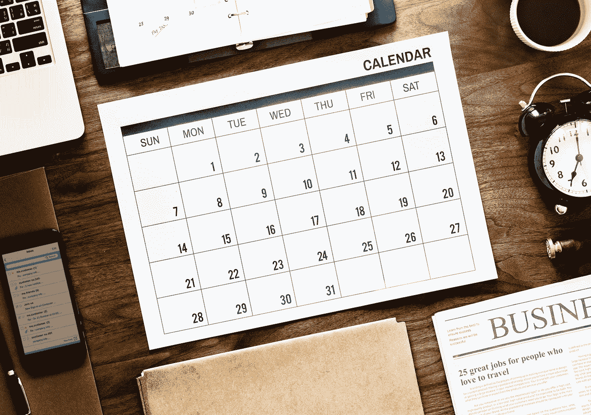

# 如何用免费的 iPhone 和 iOS 应用来管理时间

> 原文：<https://medium.com/hackernoon/how-to-hack-time-management-with-free-iphone-and-mac-apps-b45e30ae681c>

## 你知道你在哪里以及如何度过宝贵的时间吗？

Photo by [Aron Visuals](https://unsplash.com/@aronvisuals?utm_source=medium&utm_medium=referral) on [Unsplash](https://unsplash.com?utm_source=medium&utm_medium=referral)

我们有应用程序来跟踪我们花的每一分钱，以及我们偏离预算的程度。为什么我们不遵循与时间相同的原则呢？

金钱是一种可再生资源。时间？没有那么多。

为什么我们不利用科技来优化我们的生活，以实现这个不可否认的事实呢？

忘记 Toggle 和其他类似律师的应用程序，这些应用程序要求你记录你每分钟都在做什么，这样应用程序才能真正工作。

接下来是一种更有效(或懒惰)的方法来创建您实际可以使用的时间审计。

# 我用于时间审计的三个应用程序

## [**1。生命周期**](http://www.northcube.com/lifecycle/)

记录你花在通勤、睡觉和去每个地方的时间。为了设置它，一开始我每周花大约 3-7 分钟输入我在一个特定的地点做什么，但是随着时间的推移，每周 2-3 分钟就足够了。毫无疑问，这是我在 2018 年发现的最好的应用程序(我已经使用它的哥哥 [SleepCycle](https://www.sleepcycle.com/) 好几年了)。

 [## 生命周期-自动跟踪你的时间

### 生命周期自动跟踪你的时间，并绘制你的生活。仅使用 1%的电池。

www.northcube.com](http://www.northcube.com/lifecycle/) 

## **2。屏幕时间**

许多人还没有意识到这项功能是苹果公司去年自动安装在他们的 iPhones 上的。这是一个非常酷的功能，你可以在设置中打开，这样你不仅可以跟踪你一天和一周在 iPhone 上花了多少时间，还可以跟踪每个类别花了多少时间(例如:“社交网络”和“阅读和参考”是我最大的两个类别)。

你还可以用它来安排 iPhone 的停机时间(只有你选择的应用程序可用)，以及为某些应用程序甚至类别设置时间限制(例如，我对所有社交媒体的限制是 15 分钟——超过这个时间后，应用程序就会被“锁定”——尽管我可以选择再点击解锁 15 分钟，或者我可以选择忽略我一整天的限制)。

## [**3。**救援时间](https://www.rescuetime.com/)

我从 2008 年开始就在我的电脑上安装了这个版本，由于几年来他们都没有 Mac 版本，所以我很纠结。(他们去年发布了他们的 IOS 应用——但显然它有一些问题，它不再跟踪 IOS 上的屏幕时间。现在 IOS 应用程序仍然存在，但它所做的是报告与我的电脑相关的一切。)

免费版很棒:它不仅能跟踪我在 Mac 上花费的时间，而且我喜欢它能如此容易地确定哪些类型的网站或应用程序是分散注意力的时间，哪些不是。我每天、每周或每月都会收到一份“生产率得分”,报告相当不错。如果你想试用这个应用程序，并把你的时间审计到一个新的水平，免费版本将允许设置三个目标。

 [## RescueTime:在现代工作场所保持高效和快乐的时间管理软件

### 一项个人分析服务，向您展示您如何支配时间，并提供帮助您提高工作效率的工具。

www.rescuetime.com](https://www.rescuetime.com/) 

Photo by [rawpixel.com](https://www.pexels.com/@rawpixel?utm_content=attributionCopyText&utm_medium=referral&utm_source=pexels) from [Pexels](https://www.pexels.com/photo/flat-lay-photography-of-calendar-1020323/?utm_content=attributionCopyText&utm_medium=referral&utm_source=pexels)

# 我遵循的简单步骤

正如任何产品或过程一样，如果有太多的摩擦，我不会留下来——这就是为什么我创建和遵循的系统非常简单明了。这是我懒惰的大脑和身体实施 impactful 的唯一方法。

# **1。每日签到:** <一分钟

*   每天晚上，我都会查看屏幕时间，看看我在 iPhone 上花了多少时间，并评估我是否在目标时间内。
*   这有助于我做出承诺，让自己更有自知之明，这样第二天我就能做得更好。

# **2。每周反思:2–7 分钟**

**屏幕时间:**我问自己以下问题，所有问题都在一个屏幕上回答(标签“过去 7 天”包含所有内容)。这最多需要一两分钟。

*   a)我本周的日均得分是否低于上周？如果答案是否定的，继续跟进:想想发生了什么，为什么。
*   b)检查花在“社交网络”和“娱乐”上的总时间，并为此感到难过(创造奇迹)。
*   c)我最常用的三个应用程序是什么？他们应该吗？
*   d)接车后最先使用的前三个 app 是什么？这很能说明我的冲动。正如詹姆斯·克莱尔所说，这个习惯可能只需要两秒钟，就像解锁我的 iPhone，但之后我可能会在 Instagram 上浪费 10 到 20 分钟。一个非常简单的习惯决定了接下来的几分钟，所以我需要关注这个问题，它开始意识到接机后打开了哪些应用程序。

生命周期:我每周可以花一到五分钟在这个应用上(取决于我这周去了多少新地方，这是下面的第一点)。

*   a)我向下滚动到“你在这里做了什么？”所以我可以告诉应用程序我在未分类的地方在哪里做了什么(因为它已经知道我在那个地方花了几分钟或几小时，只需要链接到一个活动)。这很简单，因为出现了一种谷歌地图，它会问你两个问题:
    -我，你在哪里？它会自动告诉你附近的地方(由 Foursquare 提供支持),你可以从中选择，或者你可以很容易地输入“姻亲”,例如特定的地理位置。
    -二。你做了什么？预先建立的活动以特殊图标的颜色显示，或者您可以非常容易地添加新的活动。
*   b)我查看了出现在主屏幕上的以下四个图表(用时不到一分钟):
    -一、每日余额有三个图表:我一周在家度过了多少小时？我睡了多长时间(与我每天的平均睡眠时间相比)？我在工作或与工作相关的活动上花了多少时间？
    -二。运动图表告诉我我走了多少、跑了多少或骑了多少(如果你用你的 iPhone 游泳，它也是有效的),并将其与前一周以及我每周的累计平均值进行比较。

# 3.每月审计时间:10-15 分钟

我每天的一分钟和每周的活动(每周日 2-7 分钟)都有一个目的。在每天的每一分钟里，我都会注意到自己是如何利用或浪费时间来让第二天变得更好的。如果我不每天都做，我会在月底惊讶于花在某些活动上的时间，这样我就没有借口看不到它的到来。随着每周日的几分钟，我减少了花在告诉 LifeCycle 我去了哪里，做了什么(我记得很清楚)上的时间。

**在我的月度审计中，我检查了以下问题，并做了记录和行动:**

**生命周期:**我在这款应用上花了大约 8 分钟进行月度审计，但是如果你决定一些对我来说重要的事情对你来说不是优先事项，你可以做得更快。

*   我首先点击顶部饼状图上的“工作”,向下滚动查看:1)我在哪里度过我的时间，2)我每天的平均时间，以及 3)我的月平均时间与累计平均时间的比较。
*   如果我有时间并且很好奇，我可以对饼状图中的其他活动做同样的事情，但通常我只检查“工作”、“家庭”、“交通”、“上下班”和“回家”。
*   独特的位置。只是为了好玩。我喜欢知道我的宇宙/泡泡的大小。
*   本月最受欢迎的前 5 个访问以及每个访问的时间。他们是故意的吗？它们与我的优先事项一致吗？
*   每月余额。它是嵌入到一个简单图形中的三个图形。我可以看到从 8 月份开始(应用程序推出时)我每个月在家、睡觉和健身的时间，以了解我的趋势。帮助我做出有意识的决定。
*   通勤时间。它被分成三个不同的部分“通勤上班”、“交通”(这是我一天中的所有事情，不在家里开始或结束)和“通勤回家”。这是我理解上个月听了这么多播客的原因，并决定我是否可以做出调整。
*   跌宕起伏。喜欢这个。例如，我知道在 12 月份，我和家人在一起的时间比平时多了 175%,我回家的通勤时间减少了一半，这是我 11 月份审计的结果，我决定下午在离家近的地方工作，以避免交通堵塞，这样我就可以每天早点和家人在一起。

**改期。**我检查了以下内容:

*   生产力得分。我这个月的平均工资是多少？比上个月好吗？比我累积的平均值好？
*   检查蓝色(非常有效率)和红色(非常分散注意力)的比率，思考为什么这个月比上个月更好或更差
*   查看“每月焦点”。我可以看到我在工作时间和下班时间花最多时间的网站或应用程序，以及在上面花了多少时间。我的工作时间里有不该有的东西吗？
*   目标。我达到了我想要的“所有生产时间”的小时数了吗？「分心时间」是不是太多了？如果是，是哪些应用程序或网站导致了这种情况？
*   如果我有时间或者有心情，我可以花几分钟查看其他报告，但这并不是我每月审计的一部分。

Screentime 只能报告今天和之前七天的情况，所以我不会在月度审计中使用它。糟透了。

## 进行“时间审计”非常简单，而且有很多好处。你可能认为你有明确的优先事项，但是时间审计可以告诉你——事实上——你是如何度过时间的，你宝贵的时间去了哪里。

## 这让你对如何生活有更多的想法。

# **值得特别提及的应用**

[**瞬间。**](http://inthemoment.io) 我在放映前用过这个，现在还没擦掉——说我多愁善感吧。

 [## 瞬间——无手机。更多的生命。

### 瞬间把时间还给你。我们都发现自己迷失在手机中，把宝贵的时间花在不在…

in mement . io](https://inthemoment.io/) 

[**定时**](https://timingapp.com/) **。**和 RescueTime 做的一样，但是有一些很酷的额外特性(并且报告更好)。但是在“创建你的系统”方面需要更多的努力，可以这么说，他们没有免费版本，只有试用版。他们的付费版本很贵。

 [## 计时:高效专业人士和自由职业者的最佳自动 Mac 时间跟踪器

### 定时通过自动跟踪您的时间来帮助您计算更多的时间。它记录应用程序、网站和文档。没有更多的…

timingapp.com](https://timingapp.com/) 

[**时间审核**](https://timeauditapp.com/) **。**我已经试用这个应用程序一段时间了，喜欢它能做的许多事情和所有的报告，这是一个很棒的应用程序。不利的一面是，它要求你的日历上“排满”你正在做的事情。如果这个应用程序能够以某种方式使用生命周期来补充它，那就太好了。

 [## 时间审计

### 审核你花的时间！忘记使用无聊的电子表格，让 TimeAudit 引导您跟踪您的活动…

timeauditapp.com](https://timeauditapp.com/) 

[**天马行空。**](https://flexibits.com/fantastical) 有些人可能会说它看起来就像你的 iPhone 或 Mac 的日历，不值得。我开始用最少的努力使用它，正是因为相似的外观和感觉。

## 请随时评论或问我任何问题！希望我清楚我是如何进行时间审计的。这真的很简单。和许多简单的事情一样，挑战在于坚持不懈地去做。

## 祝你好运！