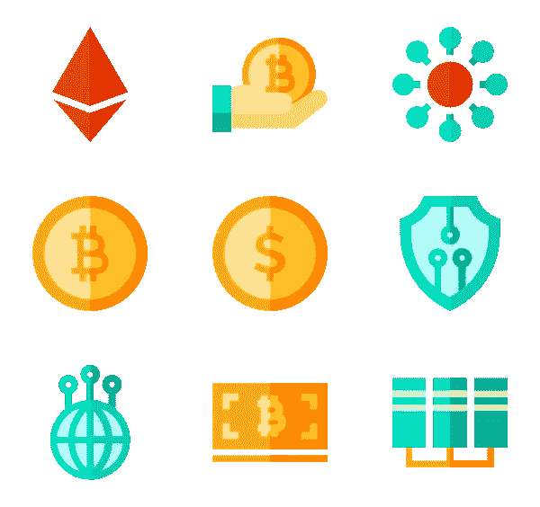

# 如何处理你的税收加密货币挖掘

> 原文：<https://medium.com/hackernoon/how-to-handle-cryptocurrency-mining-on-your-taxes-bd665a0efc57>

出于税收目的，从采矿中获得的加密货币以两种方式处理。其他因素也会发挥作用，这取决于你的采矿作业是作为一个商业实体还是仅仅作为一种爱好。这篇文章对这两个应税事件进行了分类，并解释了报告加密和比特币采矿交易对税收的影响。

# 1.从采矿中获得的加密被视为收入

你需要知道的第一个税收事件是采矿收入。当你挖掘硬币时，你在硬币被“创造”到你的账户的当天就有了收入，按照当天的交换价值。

例如，如果你在 2018 年 6 月 15 日成功开采了 0.25 ETH，那么你的收入就是 0.25 ETH 在 2018 年 6 月 15 日的[美元](https://hackernoon.com/tagged/usd)价值。这个收入需要上报。

如果您没有跟踪您收到 mined crypto 的所有特定日期的美元公平市场价值，您可以简单地将您的采矿交易上传到 [**crypto 税务软件**](https://www.cryptotrader.tax/) 中，以自动接收包含此数据的 [**报告**](https://www.cryptotrader.tax/cryptocurrency-tax-reports) 。

# 2.交易或出售你挖掘的密码

因为出于税收目的，加密被视为 [**财产**](https://www.cryptotrader.tax/blog/the-traders-guide-to-cryptocurrency-taxes) ，所以它就像股票、债券和房地产一样受资本损益规则的约束。

因此，当您“出售”或“交易”您开采的加密货币时，您实现了需要在 8949 表格 [**上报告的资产的资本利得或损失。**](https://www.cryptotrader.tax/cryptocurrency-tax-reports)

要深入了解美国国税局如何处理加密货币的税务问题，请阅读我们的文章 [**点击**](https://www.cryptotrader.tax/blog/the-traders-guide-to-cryptocurrency-taxes) 。

# 一个例子:

您于 2018 年 3 月 1 日成功开采 1 枚比特币。当时，假设这个比特币价值 7000 美元。一个月后，你通过以 7500 美元的价格出售这些开采出来的比特币来套现。

在这个例子中，你将在 2018 年的纳税申报单上申报 7000 美元的收入。你还会报告 500 美元的资本收益——因为你的资产在出售前增值了。

我们也假设你属于 24%的所得税范围。

在这种情况下，你将欠 1，680 美元的所得税(7，000 * 0.24)。

因为你的资本利得是 [**短期**](https://turbotax.intuit.com/tax-tips/investments-and-taxes/guide-to-short-term-vs-long-term-capital-gains-taxes-brokerage-accounts-etc/L7KCu9etn) (持有不到一年)，你的资本利得也将按照你的边际税率征税，在这种情况下是 24%。所以你还欠 120 美元的资本利得税(500 * 0.24)。

从这次采矿活动中，你总共欠 1800 美元(1680+120)的税款

# 如果我的密码在我卖掉之前就贬值了怎么办？

比方说，在上面的例子中，你的比特币在卖出前跌到了 6000 美元。在这种情况下，你招致资本损失，而不是资本收益。这一损失将从你的应纳税收入中扣除(达到一定的门槛)，实际上会为你的税单省钱。我们在这里 写了一篇完整的文章，解释如何处理 [**用于税务目的的加密损失。**](https://www.cryptotrader.tax/blog/how-to-handle-your-bitcoin-and-crypto-losses-for-tax-purposes)

# 作为爱好的比特币挖矿与作为生意的挖矿

如果你将挖掘加密货币作为一种 [**爱好**](https://www.irs.gov/newsroom/hobby-or-business-irs-offers-tips-to-decide) ，你将在 1040 表格 [**的第 21 行把赚取的硬币价值作为“其他收入”计入。您扣除与采矿相关的任何费用的能力是有限的——费用是根据 2%规则逐项扣除的。**](https://www.irs.gov/forms-pubs/about-form-1040)

另一方面，如果你以企业实体的身份经营采矿业务，你将在 [**附表 C**](https://www.irs.gov/forms-pubs/about-schedule-c-form-1040) 中报告收入。在这种情况下，你可以完全扣除与你的业务相关的费用(如果你能证明的话)。该业务的净利润需缴纳所得税和个体户税。

不确定你的操作应该被认为是一项业务还是一种爱好？请看下面这篇来自美国国税局的文章，这里解释了两个**。**

# **费用——商务还是业余爱好**

**就费用而言，如果你的采矿业务被设置为附表 C 业务，你可以为你购买的计算机设备(作为折旧，遵守所有规则)和你的其他费用(主要是电费，可能是家庭办公室)扣除费用。但你需要能够证明这些费用，比如用一个单独的电表，或者至少把你的电脑设备插到一个便携式电表上，这样你就可以知道你的电费有多少是用在你的业务上的。**

**除非你的支出非常高，否则它们很可能无法抵消你作为附表 C 业务支付的额外**个体户税，所以如果你将收入报告为业余爱好收入，而忘记支出，你很可能会少缴税。****

****如果你的情况很复杂，与一个合格的 [**秘密税务专家**](https://www.cryptotrader.tax/crypto-tax-accountants) 交谈来分解你的选择可能对你有好处。****

# ****加密税务软件****

****处理挖掘和交易加密货币所带来的数据可能会很快成为一项耗时的任务。 [**密码商。Tax**](https://www.cryptotrader.tax/) 是一款税务软件，成千上万的加密货币矿工使用该软件在交易时有效地将他们开采的硬币与美元价值进行协调。此外，该应用程序将自动为您的资本损益交易生成 8949 表格。****

****这里的 是指一份完整的报表由 [**组成。**](https://www.cryptotrader.tax/cryptocurrency-tax-reports)****

****您可以将这份生成的报告交给您的税务专家进行归档，或者只需将它们上传到纳税申报软件，如 [**TurboTax**](https://www.cryptotrader.tax/blog/how-to-file-your-cryptocurrency-taxes-with-turbotax) 。****

******本文仅供参考，不应被理解为税务或投资建议。请向您自己的税务专家、注册会计师或税务律师咨询如何对待数字货币的征税问题。*****

*****原载于*[*www . cryptotrader . tax*](https://www.cryptotrader.tax/blog/how-to-handle-cryptocurrency-mining-on-your-taxes)*。*****