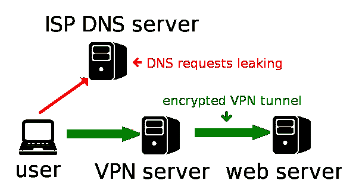
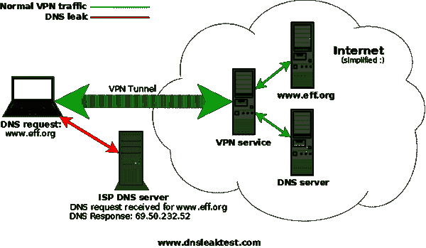
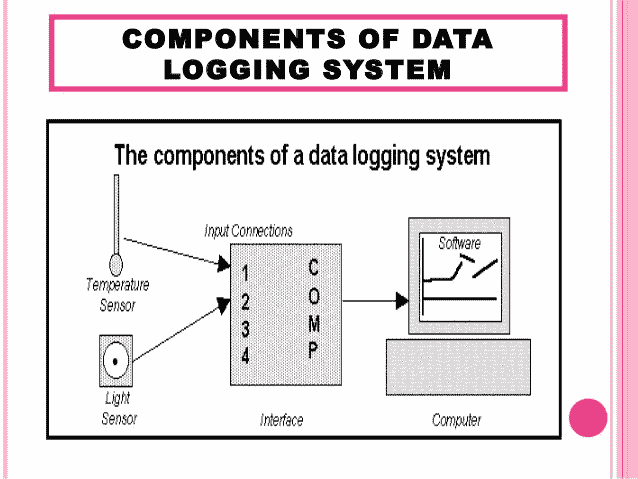

# 如何识别和防止 DNS 泄漏

> 原文：<https://medium.com/hackernoon/how-to-identify-and-prevent-dns-leaks-5fa659130a41>

VPN([虚拟专用网](https://www.cisco.com/c/en/us/products/security/vpn-endpoint-security-clients/what-is-vpn.html))为在线匿名提供了一种简单的方式。只需点击几下，它就可以掩盖你的位置，隐藏你的在线活动，避免被窥探。然而，VPN 并不是万无一失的；即使在 VPN 打开的情况下，DNS 泄漏也可能使您暴露在外。DNS(动态名称系统)将 IP 地址与用户访问过的 URL 联系起来。网站向 DNS 服务器(包含 URL)发送请求，然后 DNS 服务器将请求指向适当的 IP 地址。

VPN 提供匿名 DNS 服务器，从而确保目标网站或 URL 不会获取您的公共 IP 地址。换句话说，请求不是直接通过你的网络浏览器发送的，而是通过 VPN 发送的，因此攻击者或 ISP 几乎不可能监控你的连接。当浏览器直接发送 DNS 请求，从而忽略 VPN 时，就会发生 DNS 泄漏。尽管链接看起来是加密的或匿名的，但 ISP 将能够跟踪你的在线状态。这是你不想冒的风险，尤其是如果你担心你的网络安全的话。这里有一些关于如何防止 DNS 泄漏的提示和技巧。

## **1。执行泄漏测试**

识别 DNS 漏洞并不总是容易的。一些应用程序可能选择不使用 VPN 的 DNS 服务器，因此直接通过 ISP 提供的 DNS 进行连接。运行一个 [DNS 泄漏测试可以帮助你确定你的连接状态。你需要做的就是访问 cryptoip.info 来运行测试。测试应该显示是否有泄漏。](https://www.proxyrack.com/dns-leak-test/)

## **2。更改默认 DNS 服务器**

您的电脑很可能会使用 ISP 提供的默认 DNS 服务器。改变你的 DNS 服务器将是一个好主意，即使你并不担心泄漏。改变你的域名系统的一个好处是，你将能够获得更快的连接速度。请确保选择能够提供最佳性能、安全性和防止 DNS 泄漏的 DNS 服务器。

## **3。选择带 DNS 泄漏保护的 VPN**

购买 VPN 时请这样做。一个好的 VPN 应该已经激活了这个功能，或者在设置页面上提供一个选项。具有此功能的 VPN 监控您的连接，以确保没有 DNS 泄漏。为了更好的效率和可靠性，所有的连接都通过 VPN 的服务器。

## **4。投资一个 VPN 监控软件**

在您的系统中安装 VPN 监控软件可能是防止 DNS 泄漏的解决方案。这些软件只提供付费选项。如果你担心你的网上安全和 DNS 泄露的可能性，那么 VPN 监控软件是必备的。

## **5。禁用 Teredo**

这个特性在基于 Windows 的系统中很普遍。Teredo 支持两种 IP 协议之间的通信，有时会导致 DNS 泄漏。因此，禁用 teredo 有助于防止可能的 DNS 泄漏。为此，您需要输入几个命令。以管理员身份进入命令空间，然后键入“netsh interface teredo set state disabled”。如果您想在将来再次激活 teredo，只需在 CMD 中键入“netsh interface teredo set type = default”。

仅仅有一个 VPN 并不能保证你 100%匿名上网。DNS 泄露会让你暴露在 ISP 和其他窥探的目光下。然而，通过遵循上面概述的提示来限制 DNS 泄漏的机会有助于防止这种情况发生。如果您已经安装了 VPN，请检查它是否提供了 DNS 监控选项以改进功能。如果没有，你可以投资一个好的 VPN 监控软件来强制所有的连接通过 VPN

# **在 VPN 中寻找什么**

## **加密和协议**

使用 VPN 有很多原因，您需要考虑哪种服务最适合您的需求。大多数使用它们的人都担心安全性。这就是为什么您需要检查 VPN 提供商是否提供了最好的加密。

谈到安全性，最好的协议之一是 OpenVPN，它提供了加密和速度。还有其他一些协议，但这被认为是最先进的。顶级 VPN 提供商也推荐并使用它。

## **数据记录**

VPN 经常被用来保护你的隐私，但是如果你不小心的话，你可能最终会得到一个存储你所有数据的 VPN 服务。这可能包括您访问的网站、连接时间戳、您的地址和您的付款信息。在您开户之前，请务必阅读该服务的隐私政策。你也应该在 VPN 提供商的网站上寻找不允许登录的信息。

## **对免费说不**

有一些免费的 VPN 服务，但它们通常很慢，不可靠。同样需要注意的是，这个世界上没有什么是真正免费的。VPN 是一种服务器，您的计算机通过它来访问互联网。

这是要花钱的，如果一家公司提供免费服务，你将会牺牲其他东西。这可能是你的数据和隐私。如果安全和隐私是你使用 VPN 的原因，你最好每月付费。

该服务的价格将根据您获得的功能和连接数量而有所不同。如果你选择年计划，价格通常会比月计划更合理。你也可以通过一些提供商提供的免费试用来测试 VPN 服务。

## **服务器数量**

使用 VPN 的一个常见原因是访问受地理限制的内容。脸书和网飞在一些国家受到限制。VPN 将能够帮助您毫无问题地访问它们。还有一些东西在某些国家更受欢迎，对用户有吸引力，比如 P2P。

底线是在你注册之前检查 VPN 服务器的位置。你需要确保它们满足你的需求。如果你想要一个 VPN 来访问 BBC iPlayer，你需要一个有英国服务器的服务。

## **允许的连接数**

另一个要考虑的因素是 VPN 提供商允许的连接数。您不想为您的设备单独付费。市场上的许多提供商将提供跨多个平台的服务，并允许一个平台上有多个连接。这通常是同样低的每月或每年的价格。

## **平台兼容性**

顶级 VPN 提供商将在 Windows、macOS、Android 和 iOS 上提供服务。但是，您仍然需要确保提供者支持您想要运行服务的所有平台。访问您平台的专用应用程序将使使用 VPN 变得更加容易。