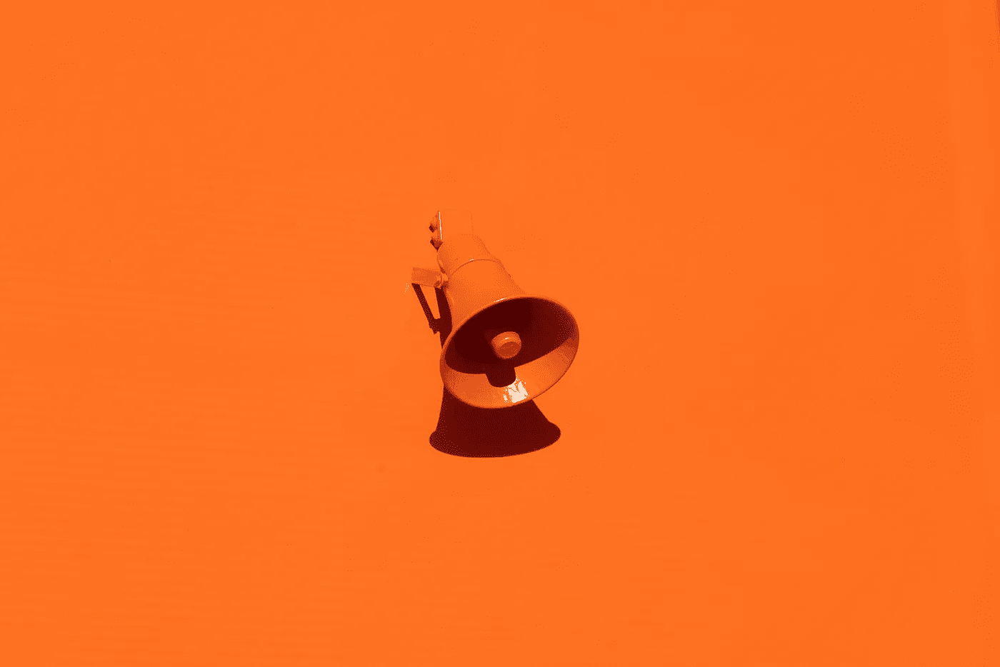
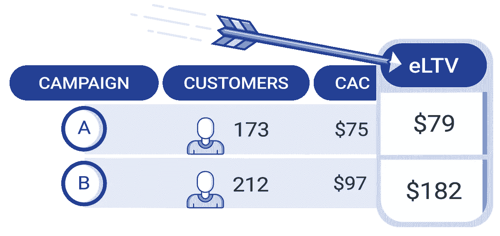

# 如何利用你的营销预算增加你的 LTV

> 原文：<https://medium.com/hackernoon/how-to-leverage-your-marketing-budget-to-increase-your-ltv-99e89c82db1>

Photo by [Oleg Laptev](https://unsplash.com/photos/QRKJwE6yfJo?utm_source=unsplash&utm_medium=referral&utm_content=creditCopyText) on [Unsplash](https://unsplash.com/search/photos/megaphone?utm_source=unsplash&utm_medium=referral&utm_content=creditCopyText)

谈到营销，你可能会认为减少支出——无论是总体支出还是单个客户支出——是公司的最佳选择。毕竟，你有生意要做，有预算要维持。对吗？

这可能不像你想的那样千篇一律…继续阅读，了解如何利用数据战略性地选择在哪里以及如何再投资营销，并获得更好的结果。

# 简而言之:当你做得对的时候，花更多的钱可以得到不成比例的结果

在[的另一篇文章](https://hackernoon.com/the-profit-leak-you-might-not-be-tracking-and-how-to-fix-it-21a8d3fbc800)中，我谈到了这样一个场景:一家假设的企业使用减少非自愿流失的策略，将流失率降低了 1.5%。在这个例子中，客户流失率降低 1.5%导致客户终身价值(LTV)增加 43%，从 780 美元增加到 1114 美元。

**现在，让我们在这个场景的基础上再增加一些假设:**

*   有问题的企业最初从 780 美元的 LTV 中拨出 200 美元用于营销和获得新客户。
*   他们每天可以获得 1000 名客户，每人 200 美元。

不错吧？他们已经将大约 25%的客户 LTV 用于营销。但是，如果他们增加营销支出来配合 LTV 的增长，会发生什么呢？指定用于营销的 200 美元，当增加 43%时，变成 280 美元。

在市场营销中，增加支出——只要计划和实施得当——可以产生非凡的效果。例如，在 Rebilly，我们与一些公司合作，这些公司每天花费超过 100 万美元来瞄准他们的受众。这种购买力可以释放一些重要的机会。

# 好消息是:你不必花那么多钱就能看到好处

一个更现实的场景是选择每天以 28 美元的价格获得 500 个客户，或者每天以 20 美元的价格获得 100 个客户。选择(和教训)是明确的。

上述例子的要点是双重的:

1.  首先，像股票和债券一样，将利润再投资于营销可以释放乘数效应。
2.  第二，企业主甚至营销人员往往过于关注优化以获得最低的总体客户获取成本(CAC)，而忽略了更大的图景。

## CAC vs. CPL:有什么区别，哪个更重要？

如果你是营销和广告缩略语的新手，你可能会对 CAC(客户获取成本)和 CPL(每条线索的成本)之间的区别感到有点困惑。它们在计算方式上是相似的:

*   CAC 的计算方法是将总广告支出除以该支出带来的新客户数量(100 美元支出/ 8 个客户= 12.50 美元 CAC)
*   CPL 的计算方法是将总广告支出除以通过该支出获得的潜在客户数量(100 美元支出/ 10 个潜在客户= 10 美元 CPL)

唯一的区别是 CPL 追踪的是*潜在客户*，而不是实际客户。如果有人点击广告，订阅你的时事通讯，或者输入他们的数据打电话咨询，那么这是用 CPL 衡量的；如果他们成为客户，这有助于你的 CAC 指标。你的 CAC 可能会高于你的 CPL，因为大多数企业不会 100%转化他们的销售线索。

# 要了解这一点，让我们来看两个广告活动:

哪个活动更好？大多数人会猜测是活动 a。从表面上看，它确实更好看。

**然而在现实中，你只能看到画面的一部分。**现在，假设您收集了更多的数据，那么您可以估计在这些活动中获得的每个客户的终身价值(eLTV)。

呀。**在这种情况下，活动 A 只能勉强收回成本，而活动 B 的广告支出回报将翻倍。**

然而，如果没有这些数据，大多数营销经理会削减活动 B 的开支，仅仅因为它的 CAC 更高。其结果是，公司将花费超过必要的费用，并可能很快耗尽预算，因为客户的 LTV 几乎不能覆盖购买成本。

**然而，在活动 B 上花费更多会导致公司的现金回流逐渐增加。**如果你的营销预算随着销售额和利润的增加而增加，这是普遍建议的，这意味着你将有更多的资金可用，更快地获得更多的客户，这就是复利发挥作用的地方。

# 要明确的是，教训不是总是再投资在最高的 CAC 活动…

那将是可笑的。取而代之的是，使用一个务实的、数据驱动的决策过程:**不要仅仅因为花费更多或转换速度较慢就取消整个活动。**纵观全局，看看是什么让你的业务获得了最大的长期价值，然后把钱投进去。

# 另一种优化方法:按群组分析

现在你知道了低 CAC 从长远来看并不总是最好的，让我们来谈谈你可以优化营销支出的其他方法。继续优化您的绩效的最佳方式之一是创建“团队”，或领导小组，然后查看他们之间的指标差异。

**群体只是一群潜在客户或客户，出于营销和报告目的，你将他们视为一个整体。**示例群组可能是:

*   黄金计划会员
*   已试用但未购买的销售线索
*   通过脸书广告获得的客户
*   从关联公司 A 获得的客户
*   2018 年 1 月加入的客户

在上面的活动 A 和活动 B 示例中，活动是我们的群组。谈到你自己的营销，你可以为任何你想优化的东西创建群组。

当你在进行重大改变的过程中，比如重新设计你的订阅网站或大幅修改会员权益，你通常会将时间段作为你的群组。这样，您就可以衡量变更前后的性能差异。您还可以将营销活动视为群组，以比较每个营销活动中转化的客户的总体初始购买价值、LTV 和流失率。

# 如果你想开始优化你的营销，这里有两个最好的方法:

**第一:为你所有的潜在客户创建群组**

大多数营销组织跟踪每条线索的成本和每名客户的成本。但是，很多时候，一旦被收购，他们就不再跟踪客户了。取而代之的是，创建一个团队，根据他们的来源跟踪每一个的*(一直到特定的营销活动、联盟等)，并且**在他们转化之后继续跟踪他们。【Rebilly 内置了销售线索来源和细分市场，使这一过程变得更加简单— [点击](https://www.rebilly.com/product/reporting-automation/)了解更多关于这些功能的信息。***

为什么要这么做？**像这样跟踪一群人，能让你长期洞察哪些营销渠道对你来说最高效、最有效、最实惠、*和*最有利可图。**它们还有助于减少欺诈。小心那些以低成本给你带来大量潜在客户，但却导致客户终身价值显著低于正常水平(一半或更多)的来源。这有时意味着代销商使用的营销信息和策略可能不光明正大。(简而言之，他们的做法可能具有欺骗性。)

**二:再投资最佳营销渠道**

当你在经营订阅业务的其他基石上工作时，不要忘记将你收益的健康部分再投资于产生最佳长期结果的主要来源(CAC、LTV 等)。).

它的工作原理类似于复利:

*   优化越多，赚得越多。
*   你赚得越多，你的营销就越多。
*   你营销的越多，你获得的顾客就越多。
*   你获得的顾客越多，你的利润就越多。

# 经营基于订阅的业务很容易让人变得目光短浅。

但是，当你过多地关注获取新客户，而对减少客户流失、优化定价和减少欺诈关注过少时，你最终可能会损害而不是帮助你的业务。

相反，采取全面的方法来发展更健康、更有利可图的用户群。首先要确保你不会因为不自觉的流失而失去客户。之后，优化您的定价和网站，同时努力减少退款并提高欺诈防范能力。然后，你可以将从所有这些活动中获得的收益再投资到高性能的营销活动中…看着你的业务更上一层楼。

*本帖原载于*[*the Rebilly blog*](https://www.rebilly.com/blog/data-based-marketing-can-increase-ltv/)*。*