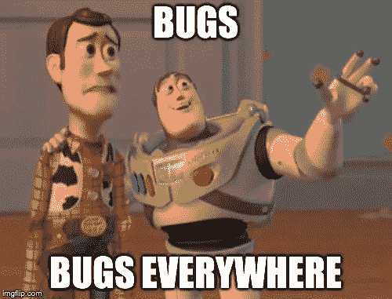

# 让其他开发人员讨厌和你一起工作的 8 个简单步骤

> 原文：<https://medium.com/hackernoon/how-to-make-other-developers-hate-to-work-with-you-a920e3adab3a>

我们都看过那些 10x [开发商](https://hackernoon.com/tagged/developer) [文章](https://hackernoon.com/tagged/articles)(我写了一些——罪有应得！).所以，如果你想知道你需要在哪些方面努力提高，你有足够的资源。但是我很少看到关于开发人员不应该做什么或者不应该做什么的文章。实际上，这可能是等式中最重要的部分！

所以，早该如此了，以下是我认为你应该尽快去做的最重要的行为，如果你做了其中任何一件事的话；).为什么？你可能不知道，但你的同事可能会因此而恨你，因为你很可能会对团队的整体生产力产生负面影响——至少是这样！

如果你的团队中有这样的开发人员，也许值得在你的 Slack 团队频道上分享这篇文章——只是出于一般的兴趣，你知道😉！

我会试着从影响最大到影响最小排列列表的优先顺序。对我来说，我的目标是开始讨论这个清单，并对它进行优先排序。所以请大家评论。

# 1.自大

在我看来，这是第一个。你不能和一个只顾自己的开发者一起工作。我甚至可以说:

> 只要你愿意承担责任并从错误中学习，你就不是一个糟糕的开发人员。

傲慢使你认为你的代码是完美的。你甚至会责怪客户愚蠢，让他们的程序崩溃，而不是反思你的软件为什么会崩溃。这就是你得到的:

但是对你的队友来说也是混乱的，不可读的代码。

傲慢的问题在于它是一种会阻止你进步的行为。不要再傲慢了，否则你就没戏了。

你们中的一些人可能已经知道邓宁-克鲁格效应。我们会在列表中多次提到这种效应。下面是解释这一现象的图表:

傲慢的问题是 1)开发人员不知道他们在“愚蠢之山”的顶峰，2)他们会停留在那里。

# 2.交付工作的草率

开发人员可以通过许多方式展示他们交付的代码的草率。我们都知道至少有一个开发人员:

*   给变量起一个隐晦的名字，或者至多是不言自明的
*   在函数名中输入错别字
*   在代码中保留旧的、过时的注释
*   显示了数据类型和数据结构的糟糕选择
*   尽管多次被告知要运行代码格式化程序，但还是懒得去运行它
*   忽略 IDE 警告
*   复制和粘贴 StackOverflow 代码，而不理解它或调整解决方案以适应他们自己的代码
*   不需要花时间记录代码(没有人想阅读整个函数或文件来理解它做什么)
*   不能正确处理错误
*   使用过多的依赖项，并且不假思索地更新它们
*   懒得理解添加到代码中的库或工具，可能会留下明显的问题
*   将总是坚持遵循“最佳实践”，而不理解为什么那些实践被认为是“最佳的”(没有适合每个团队的最佳实践)

别这么开发商。他们惹恼了他们的同事。他们拖慢了整个团队的开发过程，要求他们的队友在他们的代码审查上花费不必要的时间。他们的团队会害怕那些代码审查，会变得不耐烦(我们仍然是人类)，并且错误会漏网。

解决这个问题的最好方法是让这些开发人员开始为他们的工作感到自豪(不要与第一点中提到的傲慢相混淆。

# 3.不尊重别人的时间

开发人员最讨厌的两件事是打断和不必要的会议。这并不奇怪，因为会议只是计划好的干扰。开发人员不容易回到中断前的状态。他们需要进入发展的心态，然后慢慢追溯到他们离开的地方。每个开发人员都知道这一点。

所以，这里有一些你可以不尊重同事的时间和效率的方法:

*   为了不重要的事情，打断另一个明显处于状态的开发人员；
*   开会经常迟到，这是一个明确的选择——不管别人怎么说。要么参与者必须等待所有人都在那里才能开始会议，要么他们在没有后期开发人员的情况下开始会议。在后一种情况下，他或她需要在某个时候跟上进度，因此会损失一些时间，而迟到无论如何都会打乱会议的流程；
*   开会时东拉西扯。或者，如果观众中有非编码人员，不愿意适应观众，浪费整个观众的时间，因为任何观点都需要再次解释。

# 4.持续的消极

大多数开发人员都是热情的人，但有时你可能有机会(或不幸)与一个消极的人共事。消极是会传染的。如果有人抱怨，它会把注意力集中在事情的负面。

他们会批评所做的每一个选择:例如语言，尽管大多数时候，这些开发人员显然处于愚蠢之巅(在邓宁-克鲁格效应中)。

不要误解我；应该有一些建设性意见形式的批评。例如，一个 Scala 开发人员可以和一个 Java 开发人员谈论承诺，说，“好吧，你的语言没有我的好:p .但是你可以尝试 CompletableFuture 来体验一下什么是 monad。我会让你看看你能用它做什么。”但不幸的是，这种友好的态度现在已经很少见了。

# 5.贪欲

我相信你们都曾经见过一个开发人员窃取一个团队的成果。这可以通过给管理层发电子邮件、一对一的谈话或其他不直接的方式来实现。

开发者最看重的是能力。把别人的功劳据为己有就是把别人的能力据为己有，从他或她身上拿走。这在我的清单上排在很高的位置，因为我觉得它制造了很多紧张和不信任。

对于贪婪的开发者来说，这样的策略可能会产生短期的可见性。但长此以往，他们会被疏远。其他团队成员将改进他们的沟通，以更好地突出他们的贡献。毕竟，有很多方法可以给予信任。

# 6.无视团队

软件工程是与设计师、产品经理和其他开发人员合作完成的。如果你不想让别人进入浩克模式，翻桌子，尊重别人的投入和工作是必要的。例如:

*   “如何做”文档:许多程序员对每一行代码都做了注释，却没有描述它为什么要做它正在做的事情。如果程序中有一个 bug，而你偶然发现了这段代码，你不知道从哪里开始。
*   实现丑陋或不符合规格的用户界面“因为他们不是设计师”
*   不要向产品经理提及 UX 问题，因为这不是他们工作的一部分。忽略大局将使软件难以使用，维护成本高，并且与其他组件不一致。
*   不试图理解设计或产品决策是如何做出的。然后继续问同样的不相关的问题——没有改善。
*   不考虑其他团队成员的优先依赖性，让他们陷入困境。
*   使用一个新的工具/库而不警告任何队友。这可能会导致不可预见的问题。

# 7.不清楚

工程团队解决问题。他们利用自己的技术能力来构建功能/修复 bug 以解决这些问题。一些开发人员忘记了这一点，他们会:

*   对技术话题进行哲学思考，而不是专注于问题
*   固执地争论技术话题，而不考虑最初的问题(当然，在构建问题的解决方案时，你确实需要争论)
*   对那些技术话题进行冗长的讨论，但依赖于他们自己的观点(而不是事实——事实解决问题，而不是观点)

当然，有了代码，你可以对同一个问题有几种解决方案，但是要么有效，要么无效；没有中间环节。例如，有了 focus，您可以通过在沙箱中试验代码来轻松减少所有的不确定性。但是缺乏专注浪费了每个人的时间和生产力。

# 8.缺乏问责

如上所述，代码要么有效，要么无效……但它需要与队友添加到代码库中的所有代码结合使用。软件工程可能是当今世界上协作性最强的工作。您编写的任何代码都将与其他开发人员的代码交互。

所以，为了让你的团队工作得更好，你需要责任感。当然，代码评审不会让你逃避任何事情。但是责任是一种态度。

例如，不负责任的开发人员会提供借口而不是解决方案。这些借口可能包括时间限制或任务的复杂性。没有人想听借口；他们想了解解决问题的步骤。借口不邀请别人帮忙或提供任务进展的良好画面。

这是我的清单。如果你想到什么，请随意添加，或者建议不同的重要性顺序。

# 如果你的团队中有一个这样的人，该怎么办

你应该知道的第一件事是，这意味着你的经理没有做好他们的工作。如果他们被认为是可辅导的，那么问题应该已经被发现并且有问题的开发人员应该被辅导。如果糟糕的开发人员仍然影响团队，经理应该给出警告并做出艰难的决定。

> 一个团队有一个糟糕的开发人员，比起有一个糟糕的元素，少一个开发人员要好得多。

不懂这个的管理者就是不懂软件工程的管理者。你有一个糟糕经理的案例，但那是另一篇文章；).

那你是做什么的？我认为这个问题应该在你与你的经理的一对一谈话中提出，这样他们就可以解决这个问题。如果你的经理什么都不做，你有几个选择:看看开发人员是否可以被辅导，自己承担(在其他队友的合作下)，或者更换团队/公司。希望这篇文章可以帮助说服上述开发人员成为一个更好的合作者。

# 在你走之前…

你觉得这篇文章有趣吗？请按住👏说“谢谢”并帮助别人找到它！
如果您对关于**我们在** [**Airbyte**](http://airbyte.io) **用我们所有的知识**打造世界级组织的旅程的文章感兴趣，请订阅我们的时事通讯！

在 Twitter 上关注我，保持联系。谢谢大家！

*原载于 2019 年 2 月 20 日*[*anaxi.com*](https://anaxi.com/blog/2019/02/20/how-to-make-other-developers-hate-to-work-with-you/)*。*