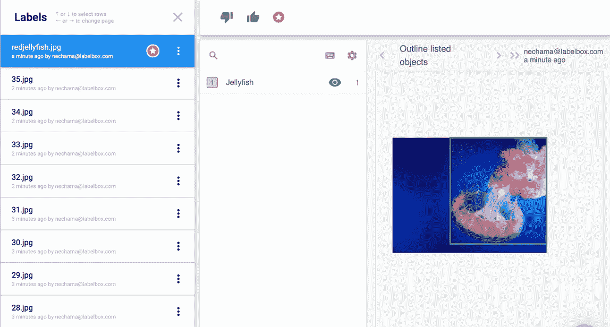
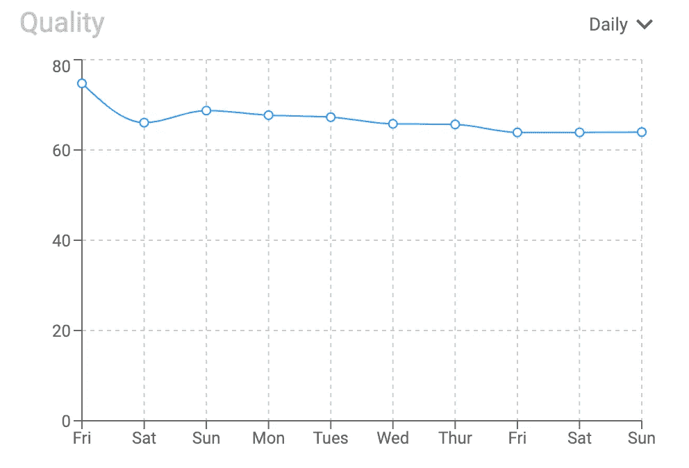
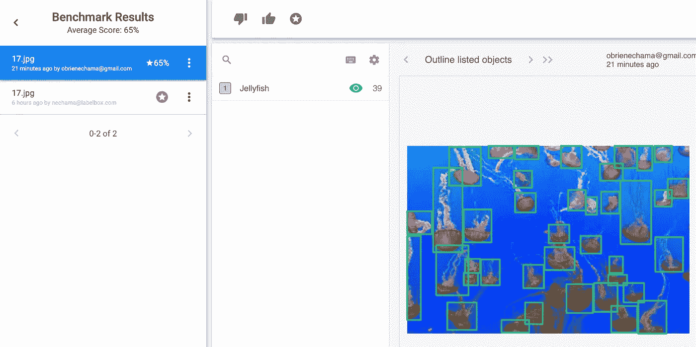
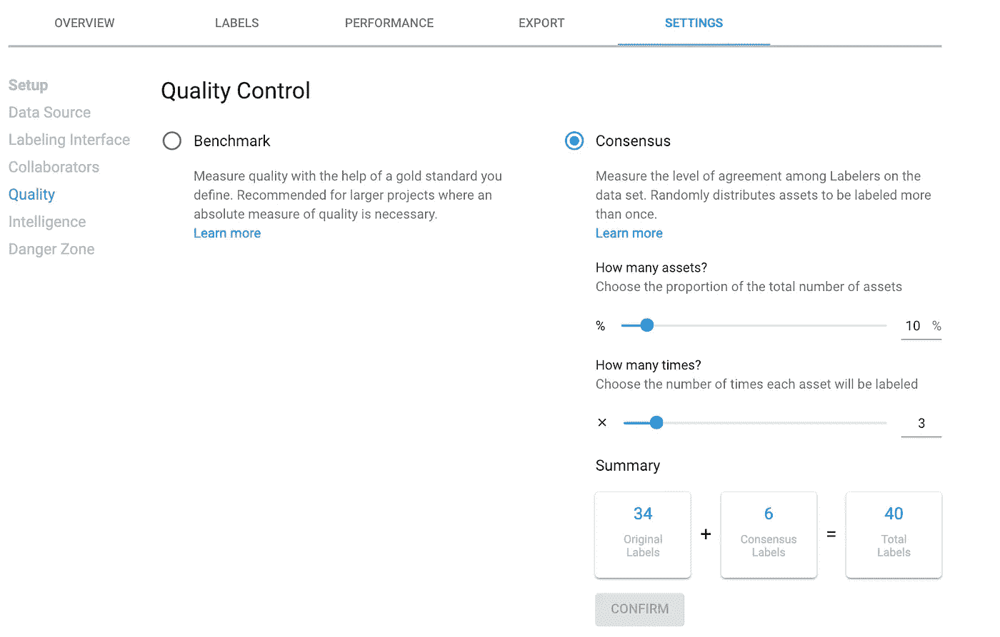

# 训练机器学习模型时如何衡量质量

> 原文：<https://medium.com/hackernoon/how-to-measure-quality-when-training-machine-learning-models-cc9196dd377a>

## 深入探讨基准、共识和评审

> 最初发表于[blog.labelbox.com](https://blog.labelbox.com/)

训练数据质量对于机器学习模型的性能至关重要。质量由标签数据的一致性和准确性来衡量。计算培训数据质量的行业标准方法是基准(又称黄金标准)、共识和审查。作为人工智能领域的一名数据科学家，你工作的一个重要部分就是找出这些质量保证程序的什么组合适合你的项目。

在本文中，您将了解到:

*   质量、一致性和准确性的定义及其重要性
*   量化质量的行业标准方法
*   自动化质量保证流程的最先进工具

# 一致性与准确性

质量由一致性和准确性组成。不仅仅是一个标签有多正确，还有它正确的频率。本节描述了测量一致性和准确性的行业标准方法。

一致性是标签标注彼此一致的程度。一致性通过确保标签以一致的方式正确或不正确来防止随机噪声。一致性是通过[共识](https://support.labelbox.com/docs/how-consensus-works)算法来衡量的。如果没有先进的人工智能工具的自动化，这个过程是手动的、时间密集型的，并且是安全责任。由于标签可能总是正确的，也可能总是错误的，仅仅高一致性不足以完全解释质量。

准确性衡量一个标签与“基本事实”的接近程度。基本事实数据是由知识专家或数据科学家标记的训练数据的子集，用于测试注释器的准确性。精度通过[基准](https://support.labelbox.com/v1.1/docs/benchmarks)测量。基准测试使数据科学家能够监控其数据的整体质量，然后通过洞察贴标机工作的准确性来调查和排除任何潜在的质量下降。

[复习](https://support.labelbox.com/docs/how-to-review)是保证准确性的另一种方法。一旦标签完成，一个值得信赖的专家审查标签的准确性。审查通常通过目测抽查标签来进行，但有些项目会审查所有标签。审查通常用于识别贴标过程中的低准确性和不一致性，而基准通常用于了解贴标机的性能。

基准往往是最便宜的质量保证选择，因为它涉及最少的重叠工作。然而，它仅捕获训练数据集的子集。共识和审查可能比彼此更贵或更便宜，这取决于共识设置和审查级别(两者都可以测试 0-100%的数据集，并具有多个标签重叠)。

# 质量工作流程

理想情况下，质量保证是一个自动化的过程，在整个培训数据开发和改进过程中持续运行。利用 Labelbox 的一致性和基准特性，您可以自动化一致性和准确性测试。这些测试允许您定制要测试的数据的百分比，以及标注测试数据的标签数量。对于许多数据科学家来说，发现一个项目的质量保证测试的最佳组合通常是一个紧急的过程，在这个过程中，通过实验来获得清晰度。

# 基准

# 基准工作流

1.  通过主演一个现有的标签创建一个新的基准
2.  (自动)贴标机以随机的时间间隔进行基准测试
3.  跟踪你的项目的整体质量，并深入任何偏差，无论是通过标签(3a)还是通过基准(3b)。

*提示:许多人发现跟随示例，用免费版的* [*Labelbox*](https://labelbox.com) *亲自尝试一下是很有帮助的。*

# 基准示例

下面是一个简单的水母项目来举例说明上面总结的基准工作流。这个项目使用一个矩形边界框，但是有多边形和点选项，可以更好地调整形状。一旦开始一个项目并标记了地面真实数据，就可以用基准星来标记标签。

由于贴标机是随机进行基准测试的，因此您可以使用总体质量图来监控项目质量。

要解决质量下降的问题，您可以通过贴标机或基准测试来探索性能。

系统较差的贴标机性能通常表示较差的指令，而某些数据的较差性能通常表示边缘情况。数据科学家利用这些价值来帮助他们改善贴标机的使用和教育过程。

通过点击准确率为 65%的基准，可以看到拥挤的水母图像，并与基准进行比较。

虽然它们非常相似，但标签往往在每个边界框中包含多少触手的问题上意见不一。在这里，您可以编辑或删除标签，并将其重新排队。

数据标注是一个迭代的过程。通常，当我们对项目越来越熟悉时，我们认为应该贴上什么标签的想法会发生变化。例如，也许一开始给整个水母贴上标签是有意义的。然而，很有可能非常细的长语声触须会扰乱模型，而不是提高它的性能。该模型可能会开始识别任何一条线，特别是照片边缘附近的线，以及被遮挡的水母，而它很可能只是水下植物碎片或海葵的卷须。因为这不是一个公认的问题，从数字和视觉上监控和迭代训练数据的能力经常被低估。

# 共识；一致

[共识](https://support.labelbox.com/docs/how-consensus-works)测量多个注释者(人或机器)之间的一致率。共识分数是通过将同意标签的总和除以每个资产的标签总数来计算的。

# 共识工作流

1.  启用共识并自定义共识参数
2.  (自动)随机标签以随机间隔分布在贴标机上
3.  跟踪整体一致性，并通过查看单个贴标机和标签共识分数来调查任何质量下降

# 共识范例

要配置共识，您可以自定义训练数据的百分比和要测试的贴标机数量。

监控与共识直方图的整体一致性。

按资产细分共识分数。您可以在这里比较特定图像的标签。这是研究和开发的合作部分，使人工智能团队能够在项目上创新。分歧点可以是从其他角度思考问题的机会，这反过来可以激发新的解决方案。

通常情况下，数据标签会有一个敏捷的发展过程。通常，生产中最成功的人工智能模型的标签任务会随着时间的推移而演变，以更好地适应它们的用例。这意味着，随着视觉工程师对问题越来越熟悉，他们能够分解问题，并通过模型为其他模型管理图像来逐步解决问题，从而提高效率。换句话说，有效的建模通过创建原子任务的生产线来发挥机器的重复和精确优势。

# 回顾

通过人机之间的紧密反馈回路来控制数据，使团队能够构建优秀的 ML 应用程序。可视化数据是至关重要的，不仅是为了解决质量问题，也是为了深入理解机器学习问题并为其开发复杂的解决方案。

# 审核工作流程

审核是一个手动而非自动化的过程。这是让人们保持知情的一部分。

1.  选择要查看的标签
2.  检查、修改或重新排列标签

# 回顾示例

过滤选项有助于管理人员对要检查的标签进行优先排序。如下图所示，可用的过滤器包括标签、共识分数、标签包含等。

审查者通常是表现最好的贴标机或内部知识专家。要查看标签，有拇指向上和向下图标。审查者也可以选择当场修改或更正标签。此外，单击三个垂直点允许您删除标签并将其重新排队，在适用时查看基准，并复制链接以发送给其他合作者。

# 结论

创建训练数据通常是构建机器学习应用程序最昂贵的组件之一。正确地监控训练数据质量可以增加第一次获得高性能模型的机会。而且，第一次就获得正确的标签(一次通过的质量)比发现和重做工作来解决问题的成本要低得多。世界一流的工具唾手可得，您可以确保您的标签保持所需的质量水平，以获得您想要的建模结果。

借助质量保证流程，数据科学家可以:

*   监控培训数据的整体一致性和准确性
*   快速解决质量问题
*   改进贴标机说明、登机和培训
*   更好地了解他们项目的具体情况，包括标注什么和如何标注

# Labelbox 入门

访问[www.labelbox.com](http://labelbox.com/)免费探索 Labelbox，或[与我们的团队成员之一](https://labelbox.com/sales)谈论适合您业务的企业解决方案。