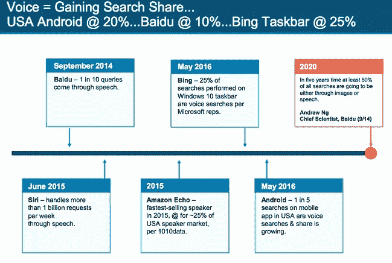
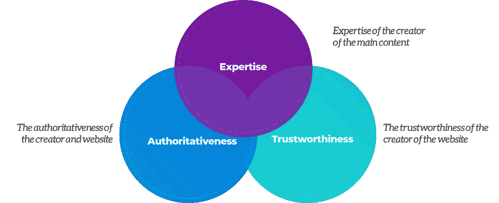

# 如何优先考虑你的搜索引擎优化工作

> 原文：<https://medium.com/hackernoon/how-to-prioritize-your-seo-efforts-right-now-c83a899288e8>

Source: Pixabay

谷歌算法更新的极快速度会把你的网站推到边缘。谷歌一直在做最好的更新，SEO 也一直在试图超越发生的变化。

去年年底，与移动和速度相关的更新让我们有些人大吃一惊。这些改变了我们构建 SEO 活动的方式。以下是你现在应该关注的搜索内容:

# 移动优先索引

Source: moz.com

自 2018 年 3 月[以来，移动优先索引一直是人们谈论的话题。一言以蔽之，它意味着谷歌将优先考虑任何网站的移动版本进行抓取和索引。当然，这一重大转变让 SEO 世界陷入了混乱。但具体来说，这种转变只针对索引，而不是排名。索引并不影响网站的排名。那么移动优先索引会挑战哪些因素呢？如果你有一个响应式的网站，移动版和桌面版的内容都一样，你就不用太担心了。但是当你的手机版本的内容比桌面少的时候可能会有问题。通常由于空间和尺寸的原因，这样的事情会发生。如果丢失的内容包括主要的排名信号，你的网页可能会在谷歌搜索结果中找到。为了降低风险，你应该运行](https://webmasters.googleblog.com/2018/03/rolling-out-mobile-first-indexing.html)[谷歌手机友好测试](https://search.google.com/test/mobile-friendly)并解决问题。

# 语音搜索

source: kpcb internet trends

语音搜索允许用户对着设备说话，而不是在搜索框中键入关键字。随着智能手机数量的增加，语音搜索应用程序，如 Siri、谷歌助手和 Cortana，显然越来越受欢迎，而且速度非常快。Google Home、Amazon Echo 和 Alexa 等设备也让语音搜索成为家庭中必不可少的一部分。根据 campaignlive 发布的一份报告，到 2020 年，语音搜索将覆盖所有搜索的 50%。此外，30%的查询将由语音助手回答。根据 [FutureOn](https://www.futureon.com/) (数字油田解决方案提供商)——如果你想为未来做好准备，你需要为搜索引擎采用语音搜索优化技术。语音搜索需要一个完全不同的搜索引擎优化策略，这里有一些你应该开始应用:

谷歌的特色片段:谷歌喜欢语音查询的简短回答，平均显示 29 个单词的结果。瞄准谷歌的特色片段可以让你在谷歌语音搜索中获得最高搜索结果。

**本地 SEO** : [39%的语音搜索](https://edit.co.uk/blog/google-voice-search-stats-growth-trends/)是关于本地商业信息的。你应该随时更新你的本地企业名录。你可以通过在线评论和使用模式来优化它。这里的[复习生成工具](https://www.scoremyreviews.com)可以帮你搞定。使用这些工具，你可以优化你的本地搜索引擎优化营销来获得更多的客户。

响应能力:大多数语音搜索都是通过手机完成的，所以不用说你的网站应该是手机友好的。

# 搜索引擎优化的人工智能

人工智能(AI)在相当长的一段时间里一直是热门词汇。人工智能和机器学习是 SERP 背后的技术。甚至[谷歌的 RankBrain 的](https://neilpatel.com/blog/how-rankbrain-works/)技术也是基于人工智能，这使得搜索结果更加人性化。RankBrain 理解抓取的内容的含义，并对不明确的查询提出建议。这有助于谷歌改善搜索结果。两年前，桑德尔·皮帅概述了谷歌作为“人工智能优先”公司的计划。我们应该做好准备，并期待谷歌搜索发生巨大变化，因为人工智能可能是未来谷歌搜索算法的核心。谷歌明白人工智能可以提供更好的结果，因此，他们正在这方面加快步伐。根据 [Winston Nguyen](https://bitcoinseo.services/) (比特币 SEO 专家)的说法——如果搜索营销人员想抓住机会，他们需要密切关注人工智能的进步。目前，人工智能可以帮助我们应对我们面临的搜索引擎优化挑战。这里有三个关键点，人工智能可以用来提高搜索引擎优化性能:

**洞察力**:人工智能可以准备和理解数据模式，这是人类永远无法做到的。它有助于获得新的见解，而这些见解可能从未被发现过。

**自动化** : SEO 需要长时间的大量关注和劳动。使用人工智能，我们可以自动化一些任务，如技术审计，标签管理，内部链接等。也许在未来，甚至[链接的建立](https://outreachmonks.com/link-building-services/)都可以通过人工智能来完成。

个性化:每个消费者都是不同的，使用人工智能，搜索营销人员可以为每个人开发有用和相关的体验。

# 内容相关性和质量

Source: Forbes

对于我们提出的每个查询，搜索引擎访问它们的索引库，并显示最符合用户要求的结果。每天有超过 300 万的博客被发表，更好的排名是一个棘手的问题。2018 年 8 月，谷歌推出了一项核心算法更新，SEO world 将其命名为“医疗更新”。甚至许多大网站都受到了影响，失去了成千上万的有机流量。但是这些网站有一个共同点——它们有低质量的内容。这里的解决方案是 E-A-T 内容。

E-A-T 代表:

**专长**:指网站所有者需要展示主要内容作者的专长。

**权威性**:如果你是网站所有者，你应该被授权主持。

**可信度**:用户应该信任 MC 的创建者或公司。

有了 E-A-T，在搜索结果中排名靠前的机会会增加。

# 结论性想法:

随着移动使用的增加，语音驱动的搜索占主导地位，但我们必须继续生成相关内容，以满足搜索者的意图。随着互联网的发展和变得拥挤，搜索引擎优化将不会是一场容易取胜的战斗。