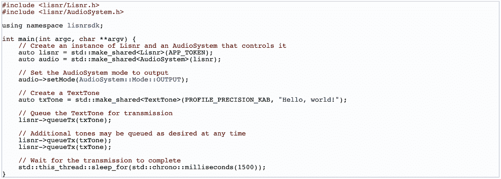
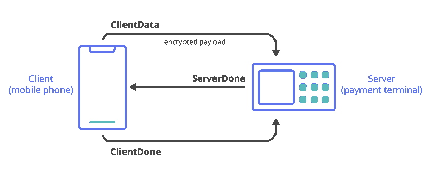
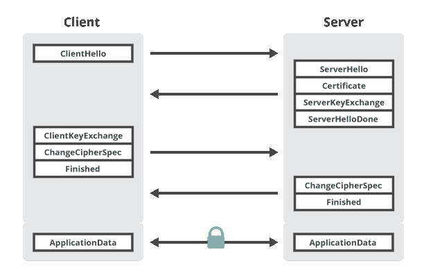

# 如何使用超声波技术发送和接收数据、付款等。

> 原文：<https://medium.com/hackernoon/how-to-send-and-receive-data-payments-and-more-using-ultrasonic-technology-f1de6a45e350>

(如果您有兴趣将 LISNR 的超声波数据平台集成到您的移动、IOT 或零售支付产品中。请[在这里](https://lisnr.com/contact/)联系我们。)

# 以音速发现数据和支付

移动支付的采用率正在上升。事实上，大多数智能手机用户，78%的人，已经使用他们的移动设备进行了[购物](https://mobileecosystemforum.com/2017/01/30/two-in-five-shoppers-use-their-phones-to-pay-in-store/)。然而，使用 LISNR 的超声波数据平台可以增强传统移动支付的安全性，以保护敏感的支付信息。

有没有比传统移动支付方式更安全的支付数据传输方式？答案就在超声波技术中。

## LISNR 超声波数据平台:它是如何工作的？

客户使用他们的移动设备发起移动支付，例如在百货商店买东西。通过 [LISNR 的技术](https://lisnr.com/technology/)，超声波数据传输发生，通过扬声器或麦克风实现移动设备和销售点支付终端之间的安全双向通信。

根据使用情况，可听或不可听的音调在设备之间发送加密数据，以创建安全通信。LISNR 使用 KAB 或 Kilo 音频位，具有每秒 1，000 位的吞吐量，通过音频跨带宽发送数据。每个音频信号都有三个部分:前同步码、报头和有效载荷。

*   **前同步码:**信号音前同步码宣布存在信号音，开始 SDK 解调。
*   **头:**头包含关于有效负载和安全逻辑的元数据。
*   **有效载荷:**有效载荷是信号音中实际包含数据的部分。

LISNR 的开发套件允许设备在各种平台上利用超声波技术，实现音调调制和解调。LISNR 目前支持以下平台:

*   机器人
*   ios
*   Linux 操作系统
*   Windows 操作系统
*   树莓派
*   亚马逊 Alexa
*   马科斯

## 这是来自我们的 Linux SDK 文档的实际示例代码:

你可以在这里通过 GitHub [找到其他示例代码。](https://github.com/LISNR)

在幕后，LISNR 在使用超声波完成支付时提供了两种不同的安全方法，RSA 加密的有效载荷和 TLS 1.2。

# 双向超声波支付与传统移动支付解决方案

LISNR 的超声波技术是一种安全介质，使零售商、商家和卡网络能够创建安全的支付体验，这可能是最安全的支付方式。怎么会？LISNR 的超声波支付解决方案是第一个可以发回确认的双向交换，而其他所有方法都是单向的。

现有的支付解决方案，如 EMV、刷卡和 NFC，大多都是单向的，无法创建离线[握手](https://docs.microsoft.com/en-us/windows/desktop/secauthn/tls-handshake-protocol)。相反，他们将数据发送到云中，这增加了支付数据被暴露的潜在风险。

超声波技术利用声音传输信用卡信息，不会被截获或记录数据。握手是在两个设备之间本地完成的，无需在线连接。本地握手允许零售商添加其他因素，而无需通过令牌化和加密的信用卡数据、邻近数据、生物特征信息等将握手暴露给云。

由此产生的握手包括多个认证因素，与传统的单向支付技术相比，安全性更高。

# **超声波支付是如何工作的？**

LISNR 双向原型在客户和商家之间架起了支付的桥梁。在共享敏感支付凭证的情况下，我们使用类似的安全级别进行交换，例如 TLS(传输层安全性)。

## **RSA 加密的有效载荷原型**

在 RSA 加密的有效载荷原型中，移动设备创建包含信用卡数据的数据消息，并用终端的公共 RSA 密钥对其进行加密。然后，数据被广播并由支付终端接收，支付终端是唯一能够解密消息的设备。

解密数据后，服务器用 ServerDone 消息进行响应，该消息也可用于传达传输中的错误。这个原型拥有很高的安全性，因为只有服务器可以解密关键的支付数据。另外，它很快。

## **TLS 1.2 原型**

在 TLS 或传输层安全性 1.2 原型中，会执行完整的握手和数据传输。握手被描述为移动设备和终端之间的通信，其确定用于加密通信的[密码套件](https://docs.microsoft.com/en-us/windows/desktop/secauthn/cipher-suites-in-schannel)。在传输数据之前，会对服务器进行验证并建立安全连接。

TLS 1.2 是一个行业公认的协议，没有数据限制。握手不能重放，因此完全安全。

# RSA 和 TLS 的主要区别是什么？

当使用 RSA 协议时，实施需要预先交换 RSA 密钥，这将需要预先规划。TLS 协议包括一个密钥交换，因此两个客户端可以进行通信。因此，TLS 需要更长的时间才能完成。

使用 LISNR 的双向超声波解决方案，客户和关键业务数据都得到保护。移动设备到服务器的通信是加密的，进一步保护了任何带有扬声器的移动设备上的客户信用卡信息。

# 现在，您也可以创建一种更安全的支付方式

通过 LISNR 的双向超声波支付解决方案和作为使能器的软件，最终用户可以集成 LISNR 的超声波接近平台，以创建最安全的方式来接受移动支付。要了解更多关于 LISNR 双向解决方案的信息，请联系我们。

# 关于伊森·泰因克

Ethan Tyink, Embedded Engineer at LISNR

Ethan 在普渡大学获得了计算机科学的本科学位，并在辛辛那提大学获得了计算机科学的硕士学位，重点是网络安全和嵌入式系统。他是一名专注于网络安全的全栈通才，自 2018 年离开诺斯罗普·格鲁曼公司以来一直是 LISNR 的嵌入式工程师。他使用 C++/C，Objective-C，Java，Perl，Python。如果您对移动应用安全、恶意软件逆向工程、恶意软件检测和预防、加密网络安全、嵌入式系统和分布式系统感兴趣，请联系他。

# 关于 LISNR

LISNR 是音速的数据。LISNR 支持无缝支付体验，通过最先进的超声波数据平台连接线上到线下的客户旅程。这是通过安全和可扩展的软件解决方案实现的，该解决方案使用标准扬声器和麦克风上的声音在设备之间发送微通信。

Data at the speed of sound.

如今，Visa、捷豹路虎、Ticketmaster 和美国政府都信任我们的解决方案，相信它能够在互联设备之间传输数据。LISNR 成立于 2012 年，在加利福尼亚州奥克兰和俄亥俄州辛辛那提设有办事处。主要投资者包括 Visa、英特尔、Jump Capital、R/GA 和 Synchrony Financial。

在 LISNR.com/resources/developers[了解更多信息](https://lisnr.com/resources/developers/)