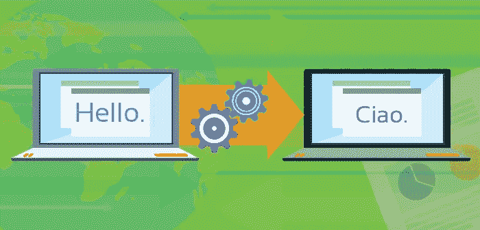

# 翻译如何影响网络开发

> 原文：<https://medium.com/hackernoon/how-translation-impacts-web-development-a752b5be7871>

不是每种语言结构都和英语一样。作为说英语的人，很容易忘记这个看似常识性的事实。语言不同，刻字文字不同，文字风格也因语言不同而不同。大多数设计人员和开发人员并没有记住这一点，并认为一旦他们平台上的文本被翻译，它就能很好地适应他们为英语版本设计的模板。可悲的是，事情并不总是这样发展。文本在翻译时会收缩和扩张，如果你不考虑这一点，你的整个设计可能会崩溃和分崩离析。

每种语言都是独一无二的

每种语言都不一样。即使有共同祖先的语言也是不同的。写的时候，单词占用的长度会有所不同。例如，如果你拿起任何一本双语杂志，看看单词所占的空间，你会发现尽管两种文本说的完全一样，但它们所占的空间明显不同。这是为什么呢？原因很简单。每种语言都有独特的语法结构。例如，英语中有表示性别、介词、冠词等的特定单词。所有这些都占用空间。此外，这些词不能与任何其他词连接，所以句子需要隔开。间距也占空间。还有其他语言，比如斯瓦希里语，这里的性别，介词，冠词等。可以直接加在名词上。

此外，译文往往比原文更长。为什么？有些词没有对应词，需要解释，或者可能包含了特定文化的元素，对说这种语言的人来说非常有意义，但在翻译中意义丢失了，需要详细解释。

这些只是翻译会影响你的文字长度的一些原因。作为一家 web 开发公司，在设计容器时，你需要记住这一点。英语可能非常合适，但其他任何东西都会崩溃。例如，英语“Like”在荷兰语中翻译为“vind ik leuk ”,这对脸书和他们著名的 Like Button 构成了挑战。外来语言也存在类似的问题。他们的文字比拉丁文字占据更多的空间。想想日本、中国和泰国的文字，等等。

如果你正在开发一个需要翻译的网站，明智的做法是记住翻译过程会以上述方式影响你的网站。得到的文本可能明显更短或更长。如果要翻译成非拉丁文文本，字符也会更大。你只能把它们缩小到这个程度，你需要在设计中考虑这种可能性。

**那么网页设计师能做些什么呢？**

作为一名设计师或网站开发公司，你可以做几件事来抵消翻译对你的项目的影响。

**创建灵活的布局**

这是至关重要的。你的布局应该能够扩展和收缩其内容。你应该试着把你的内容和布局分开，这样在编辑内容的时候，布局就不会受到负面影响。将内容从布局中分离出来，让您可以根据需要灵活调整字体大小和行高。

**在你的容器周围留出一些额外的空间**

当您创建文本框容器时，请确保在它周围留出一些空间，以防文本被翻译并且需要利用额外的空间。这给你留下了灵活的空间。因为对于大多数类似的拉丁语言，扩展是最小的，额外的空间可能足以解决添加的问题。

**让声誉好的翻译公司参与你的项目**

每个人都有需要振作一下的时候。为了获得最佳效果，寻求翻译公司的帮助是一个好主意，比如提供额外的专业知识的日译公司。不要使用谷歌翻译来翻译你的网页。

对于网络开发公司来说，一个很好的经验法则是记住你的内容越小，翻译需要的额外空间就越大。翻译 10 个字符的文本可能会占用原始文本当前占用空间的 100%到 200%。70 个字符的文本可能只多占 30%。相应地计划。