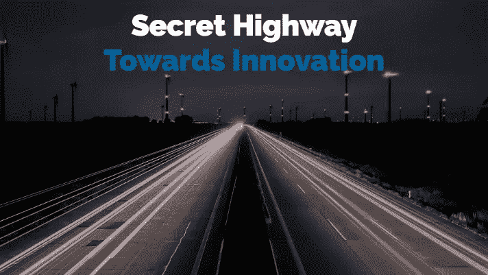
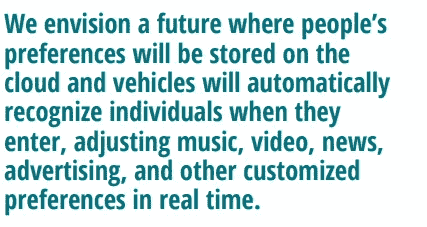
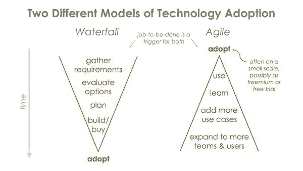
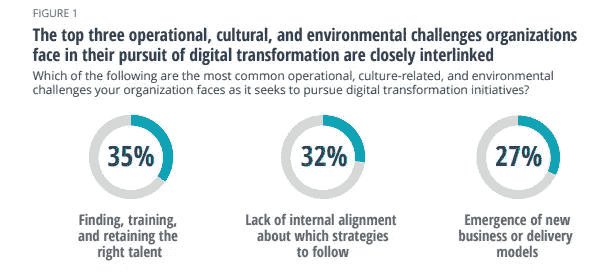

# 供应链和基础设施等不性感的东西将如何震撼你的世界

> 原文：<https://medium.com/hackernoon/how-un-sexy-things-like-supply-chains-and-infrastructure-will-rock-your-world-e28869d664c5>

## 以及科技创业公司应该关注的领域

我们都知道优步很性感。

AirBnB 很性感，还有无数让我们一刷就能点餐的外卖应用。如今，它们代表着创新。

但是，在我们所有关于颠覆的讨论中，我们忘记了那些最慢、最抗拒变革的行业。那些与最终消费者没有直接关系，但是决定着供应和运营的所有事情。

当商店经理只需在屏幕上轻轻一扫，就可以安排仓储和库存检查时，会发生什么？

海运集装箱什么时候能因为巧妙利用传感器而自动通关、确认提单？

当卡车转向电动甚至无人驾驶，无数次加油停车的需求突然结束？

## **让我们从最后一个问题开始:**

仅在美国就有大约 11 万个加油站。随着城市化的开始，这个数字每年都在下降。我没有考虑欧洲或其他发达国家，这只是美国。

现在想想这些加油站周围的所有微型经济。

一些小城镇的整个经济都建立在国道上的旅行者身上——卡车司机之类的人在那里花钱。我们谈论的是成千上万人创业和投资的利基市场。

他们会在我们这一代消失。

取而代之的是睡在汽车/卡车里，同时带你去你想去的地方。

能够在你定制的健身车里看电影、工作，甚至锻炼。数字创新和软件将永远改变物理世界(道路和景观)。

## **基础设施变化最慢，但永远不会逆转。**

为什么不去加油站？

优步已经按需提供汽车。让一大群共享汽车停在城市外面，按照设定的时间间隔接送你，然后返回基地，不是更便宜吗？我们已经可以做到这一点，而且随着时间的推移只会越来越容易。

你以为加油站很重要吗？停车是一个 1000 亿美元的产业。

许多人已经倾向于租房而不是买房，他们将会放弃租房。

汽车发明后，我们再也没有回到狭窄的马车路。

按照同样的逻辑，一旦需求下降，我们不太可能有理由回到个人或共享停车场。

## **这些不仅仅是我的随意思考。**

我之前在看最新的 [*德勤关于工业 4.0*](https://www2.deloitte.com/insights/us/en/deloitte-review.html) 的评论，他们在讨论自动驾驶汽车潜在的基础设施变化。移动技术的发展意味着几十年后我们的城市将会大不相同。

今年年初，无人驾驶投资已经超过 16 亿英镑。这个行业正在成长。

德勤在第 97 页是这样说的:

他们还在谈论当涉及到数字创新时，供应链高管是如何置身于决策圈之外的。

与其他人相比，与物流接触最多的公司人员较少参与对话。

这意味着人们不知道会发生什么。

## 他们只是开始意识到可能性。

如果你认为大公司处于所有事情的风口浪尖，那就再想想吧。根据德勤的说法，一半的高管只是在**计划**引入传感器、机器人和机器人自动化。

也就是说，我们已经拥有的技术，而不是一些看不见的神童研究。

这些高管中只有 15%认为有必要从根本上改变他们工作场所的技能组合。

然而，大多数人(90%以上)认为数字创新是重中之重。

“数字创新”的概念是从“改善业务流程”和“效率”的角度来看的。不要让你的整个操作颠倒过来，而这正是这项技术实际做的。你不能保持传统的“ *9/5 上班打卡下班*”的工作心态，同时不断学习新的软件栈和引入新的方法。

## **欢迎来到技术采用的敏捷与瀑布问题。**

阅读 Scott Brinker 关于这方面的伟大文章。

I nicked this picture from him. Seriously, click the link above and look into how Martech Man describes this topic.

这适用于今天的“性感”行业。

软件开发、新兴技术，以及像斯科特这样的人，市场营销都处于数字创新的前沿。

但是，想想如果我们开始将这些模型应用到供应链管理等不那么吸引人的领域，会发生什么。当我们开始快速试验各种车队管理技术、文档自动化等等时。

物流和基础设施是最植根于物理世界的。一旦我们开始大大简化这些过程，商品和服务的价格将会直线下降。

-集装箱运输可以在一个仪表板上进行规划，无需与货运代理或线路代理进行数周的规划。

-空运货物由 Skyscanner 等物流工具自动提取和管理。

-数十亿美元的关税不再流向经纪商，开始慢慢流入监管机构批准的软件解决方案。

## **这些都是已经有可能的事情。我没有编造任何新的东西。**

我们只需要将“性感”的消费技术应用到更传统的企业对企业的管理职位上。在这方面，有些人走在了其他人的前面，但大型的官僚化组织总体上落后于形势。

他们更喜欢“优化”流程，而不是完全取消流程。

这就是为什么精益创业公司在紧要关头领先的原因。

大多数已经采用了敏捷管理，他们的劳动力已经由训练有素的人组成，可以做很多小实验，而不是几个大赌注。

Here is another conversation starter from page 49 of the same Deloitte review.

看这个中间的短语。"*在遵循哪些策略方面缺乏内部一致性*"

这是“ ***的委婉说法，有太多的可能性让我们感到麻痹***

亲爱的创业公司创始人，你(希望)没有这个问题。您可以快速适应和试验，而没有大型组织所具有的滞后和延迟问题。利用这一点。

## **回到我们开始探索的地方**

去不性感的领域，帮助他们变得性感。德勤和这些组织谈过吗？他们是你的主要市场，就在那里。在他们最薄弱的地方渴望清晰和适应能力。

这通常与物流、招聘和数字分销有关。想想你如何调整你的产品和价值主张来帮助他们。

这些市场的巨大需求只会在全球范围内持续增长。这对创始人和投资者都有好处:

不要追逐性感的消费科技和“大众化”，不管那是什么意思。

相反，看看你是否能在最少探索的地方促成改变。有 b2b 利基市场，甚至从来没有看到一些软件开发人员可以从他们的地下室做什么。

让他们尝尝，好吗？

如果你想策划进入这些市场的正确方法，亚历克斯·帕廷将在这里。