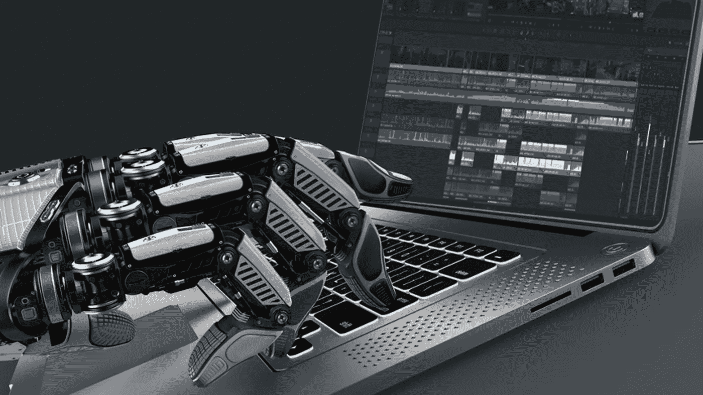
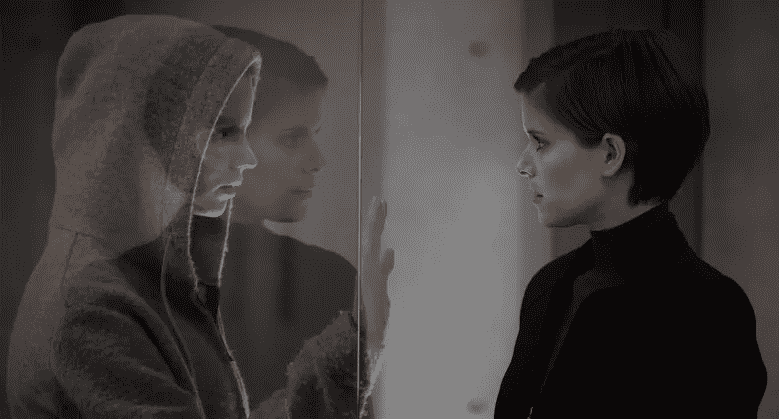

# 视频行业如何利用人工智能的力量

> 原文：<https://medium.com/hackernoon/how-video-industry-is-leveraging-the-power-of-ai-3086aeac4dd>

当人们听到人工智能这个术语时，他们开始想象驾驶汽车和类似人类的机器人，甚至没有意识到人工智能已经被用于许多领域。包括视频制作在内的许多行业都在尝试这种变革性的技术。有趣的是，人工智能已经能够通过让用户比以往更快更有效地拍摄和编辑视频来影响视频行业。

人工智能现在是媒体市场上最受欢迎的工具。你的顾客很有眼光。根据一份报告，观众在看完视频后购买产品的可能性增加了 85%。因此，初创公司已经开始向人工智能扔钱，用于视频监管。从高级视频[介绍制作](https://www.renderforest.com/intro-videos)到自动化视频编辑，技术让事情变得更简单。甚至像 YouTube 和网飞这样的巨头也已经适应了人工智能，以获得更好的用户体验。如果你在电影或视频制作行业从事创意工作，人工智能将在未来几年对你的工作方式产生重大影响。

很明显，视频作为一种市场力量正在爆炸，营销人员非常清楚这一事实。[87%的数字营销人员使用视频进行营销。从数据分析到拍摄，这项革命性的技术正在改变视频行业过去的工作方式。](https://www.wordstream.com/blog/ws/2017/03/08/video-marketing-statistics)

# 视频监管

2016 年，IBM Research 使用他们的沃森超级计算机为一部恐怖电影*摩根*开发了有史以来第一部 [*认知电影预告片*](https://www.ibm.com/blogs/think/2016/08/cognitive-movie-trailer/) 。沃森利用人工智能创造了一部电影预告片，让观众坐在座位的边缘。它使用机器学习来分析许多预告片，并使用其知识来为电影提供最佳预告片。

这个演示表明，人工智能可以对视频管理产生积极的影响。毫无疑问，这将为编辑节省大量时间。如果必须由人工编辑手动完成，观看和管理视频片段可能需要几个小时或几天。但是人工智能能够在很短的时间内做到这一点。剪辑完成后，人类编辑可以看一看并创建最终产品。

当然，人工智能可以帮助编辑管理视频。在某些情况下，它可以完全独立工作，无需人工干预。以谷歌剪辑为例。它内置了机器学习功能，可以让你捕捉最精彩的瞬间。它了解对你最重要的人，并录制小片段。它还足够聪明，能够识别闪电、面部表情等令人兴奋的事件。这样你就不会错过任何时刻。

# 计算机生成的图像

CGI 在这部电影的制作中一直扮演着重要的角色。人工智能可以帮助增强 CGI，使它看起来更真实。当与 CGI 结合使用时，AI 可以创造奇迹。大多数现代 CGI 都利用了这种技术。Snapchat 是 AI 与 CGI 结合使用的一个很好的例子。

嗯，你可能不会碰巧想知道当你在玩 Snapchat 过滤器时，技术层面上到底发生了什么。当你交换面孔，把你的特征变得残忍时，这一切都是人工智能在幕后操纵。过滤器使用图像处理进行图像转换。

这还不是全部。人工智能和机器学习也用于其他几个项目，提供更真实的背景和数字角色。的确，使用人工智能，生成的图像可以更加真实和复杂。

# 自动化视频编辑

人工智能编辑器已经在市场上取得了成功。苹果的“回忆”使用人工智能来策划美丽的剪辑。它扫描并创建最有意义的照片和视频的可爱短片。您也可以自己创建剪辑。你所要做的就是选择一个相册，选择一种音乐风格，并选择你的剪辑长度。您的视频将在几秒钟内创建完毕。

还有一个强大的工具叫做 Magisto。与苹果的《回忆》相比，它有更高级的效果和过渡。它使用情感感知技术，允许用户创建一部引发正确情感反应的电影。用户选择照片或视频，选择音乐和编辑风格，Magisto 创建一部表达情感情绪的电影。

视频编辑可以在 Premiere Pro 中使用颜色匹配，即[自动匹配镜头之间的颜色](https://helpx.adobe.com/premiere-pro/using/color-workflows.html#color-match)。

# 执行其他视频任务

人工智能驱动的无人机能够实现令人难以置信的壮举。军方不是唯一使用无人机的人，它也不仅仅是游乐园的玩物。DJI Phantom 4 等设备由先进的人工智能算法提供支持，这些算法不仅可以捕捉物体，同时将它们保持在框架的中心，而且它们还能够通过使用传感器，在没有人类干预的情况下克服障碍。它可以帮助人类摄影师，让他们的工作变得更加容易。毫无疑问，摄影师会记录重要的事件，帮助他捕捉完美的瞬间。然而，人工智能系统正在开发中，可以搜索镜头，找到亮点和最佳时刻。如上所述，Google Clips 和 IBM Watson 已经证明了这确实是可能的。

人工智能具有很大的潜力，它可以在很多方面改变视频行业。通过帮助他们更快地制作视频，这肯定会推动视频制作向前发展。此外，看看它在未来几年如何改变这个行业也很有趣。