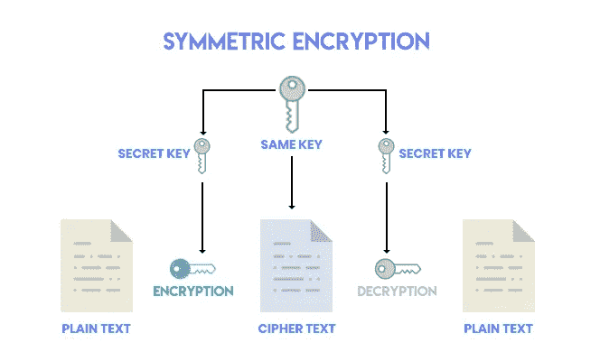
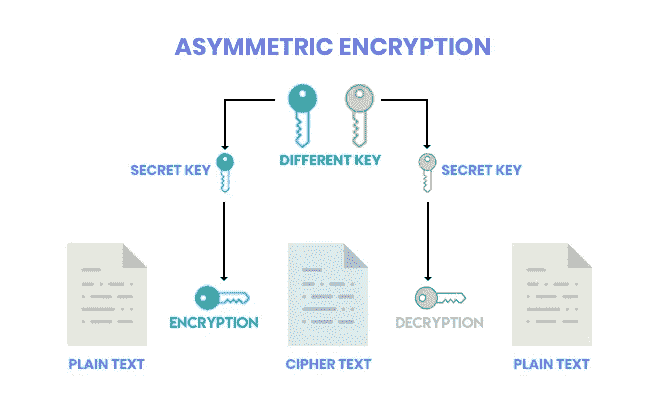

# WhatsApp 的安全机制如何从其他加密中脱颖而出

> 原文：<https://medium.com/hackernoon/how-whatsapps-security-mechanism-stands-out-from-other-encryptions-6dd4b2a72a3c>

***“发现 WhatsApp 安全是最高级别的加密，不允许黑客溜进个人和群聊”***

就用户群而言，世界上最大的消息应用程序为其全球 10 亿用户更新了其安全功能“端到端加密”。WhatsApp 包含了安全范围中的棘手元素，其中针对群组聊天和个人的加密是非常困难和棘手的加密。

当 WhatsApp 增加最高安全级别时，它提出了在全球范围内遇到数字通信的隐私问题。

# 加密历史一瞥

*   WhatsApp 在 2014 年发布了加入“脸书”的信息，这成为社交应用经历的最具历史意义的变化之一。
*   后来，在 2016 年，WhatsApp 在博客中宣布，它将开始与母公司脸书分享有限的信息或数据。
*   2016 年 8 月，WhatsApp 推出了端到端加密，称两个用户之间的消息默认是加密的。这些信息是完全加密的，这意味着你是唯一可以阅读这些信息的人，即使是 WhatsApp、脸书或其他任何人。
*   后来 WhatsApp 更新了一个法律页面，申明“你的信息是你的，我们无论如何都不能阅读。”我们构建了端到端加密、安全功能和隐私保护，一旦交付就不会存储。
*   马克·扎克伯格说，我们在 WhatsApp 上看不到你的任何内容，这些内容都是完全加密的。
*   但访问 WhatsApp 聊天和通话记录的可能性是存在的。没有证据表明它以前做过。但是一名安卓用户发现[他们的通话记录和短信数据被脸书](https://www.theverge.com/2018/3/25/17160944/facebook-call-history-sms-data-collection-android)收集了。

# 群聊保密性的重大缺陷

德国波鸿鲁尔大学的一组研究人员发现了 WhatsApp 安全性的重大漏洞。他们说，任何控制服务器的人都可以不经管理员允许，毫不费力地将新用户插入群中。

***“群组的保密性被完全打破，非授权用户可以获取并阅读所有消息”***

如果群组和两方通信都是端到端加密，则应防止新成员的添加，否则，加密的价值将完全降低。

随着国家安全和隐私之间的激烈斗争越来越不可信。政府和特勤局要求 WhatsApp 等加密信息服务允许他们访问可疑恐怖分子信息的用户数据。说到实际行动，加密是怎么回事？

# 什么是加密，它是如何工作的？

加密只是两个用户在安全平台上交换消息的一种方式。这是 WhatsApp 使用的早期安全系统。进入它的实际工作，让我们考虑用户“A”想要以安全的方式与用户“B”发送消息。它把信息放进盒子里，用钥匙锁上。锁定的消息被发送给她的用户“B ”,在那里他只能用他自己的有效密钥打开和阅读消息。

为了与新的人通信，共享密钥是适用的，这仍然是安全的。公钥用于解锁并证明用户的身份，私钥与用户在一起。

# 你应该知道端到端加密的观察

当用户“A”想要发送消息给用户“B”时，明文用密钥加密以产生密文。一旦该过程结束，密文使用相同的密钥来恢复明文。这是以前的加密模型中遵循的过程。

WhatsApp 不是使用一个密钥，而是使用两个密钥，一个密钥加密数据，另一个密钥解密。

这里有一个私钥，你自己保存，叫做私钥，除了私钥持有者，没有人能解密消息。这就是 WhatsApp 中端到端加密和[聊天安全](https://www.mirrorfly.com/chat-security.php)的工作原理。

# 结论:

市场上开发的每一个软件，总有一个后门。如果 WhatsApp 在软件中加入后门，那么它将不再是一个安全的信息平台。实际问题不在于取消 WhatsApp 中的端到端加密，而在于其他第三方机构或黑客如何获取私人信息或为自己的目的使用该平台，这将为普通人丢失自己的私人信息创造机会。