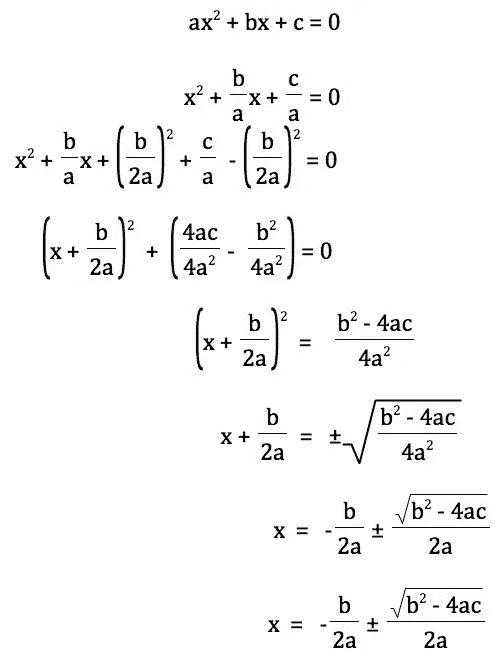

# 你的工作如何削弱你的技术技能

> 原文：<https://medium.com/hackernoon/how-your-job-may-be-crippling-your-tech-skills-1b1b7a8ff3fd>

## 对简单的机载和故障安全环境的渴望使开发人员陷入自我毁灭的安逸之中。

现代软件应用程序是巨大的。即使是小公司的产品也可以由一层又一层的抽象组成。根据您最密切合作的图层，您可能会错过很多内容。

Photo by [Markus Spiske](https://unsplash.com/@markusspiske?utm_source=medium&utm_medium=referral) on [Unsplash](https://unsplash.com?utm_source=medium&utm_medium=referral)

这篇文章不是关于在你公司的技术堆栈中学习一种新的语言或框架，也不是建议他们使用新的、更现代的语言或框架。这篇文章是关于确保精通你所擅长的任何部分——以及知道避免专攻什么。以下是几种你的工作可能会阻碍你职业发展的情况，以及如何避免这些情况。

# 专有编程语言

有些公司投入大量的时间和资源来制作自己的内部语言。这些语言是专有的——这意味着关于它们的任何信息都不能离开公司的围墙。这样做的风险应该是显而易见的:

*   你不能将这些技能转移到另一份工作中，因为没有其他公司可以使用这项技术。你甚至可能被禁止在面试和电话屏幕上谈论关于它的细节
*   掌握这些语言隐含着“沉没成本”。

任何时候你花在学习、开发和潜在掌握一门专有语言上的时间，都是你本可以花在学习更有市场、更广泛使用的东西上的时间。您可以更深入地研究算法、开源技术或最热门的新 JavaScript 框架。

逃离这个陷阱的唯一真正的方法是离开并找到另一份工作。然而，请记住，在这样的环境中工作时，您仍然可以提高您的软技能和编码最佳实践。

# 内部实现和抽象

这种情况要模糊得多，所以请允许我引用两个个人轶事。

在我的第一份工作中，我沉迷于 SQL 开发，该开发旨在将数据输入到公司的主要应用程序中。我从未接触过这个应用程序、它的 API、文档，甚至它的技术栈。这是一个“黑匣子”的缩影，以至于我们甚至这样称呼它。我离职时对 SQL 有很强的理解，但缺乏该产品的任何前端知识，包括它如何与我的工作交互。所有这一切都是因为**我对**被公司试图将开发人员的任务相互分离的做法感到舒服。

最近一年多来，我每天都在 Apache MapReduce 框架内工作。对于那些不知道的人来说:MapReduce 作业有 3 个主要组件:一个 Mapper、一个 Reducer 和一个 Runner。这些组件构成了任何 MapReduce 工作的核心，我完全不知道如何直接配置它们。我的团队已经围绕 MapReduce 编写了他们自己的包装框架，我对此非常熟悉……但不了解底层实现。**这才是你真正的危险**。

从你雇主的角度来看，这是一个巨大的利好。复杂框架之上更多的抽象意味着新开发人员可以更快地加入进来，更快地编写代码，并且比在纯实现之上开发时产生更少的错误。应该鼓励团队降低复杂性，并在日常开发中实现安全措施、包装器和易用脚本。关键是:理解底层实现是你的责任，然后欣赏你曾经视为拐杖的抽象。这不是你的团队的错，他们在抽象复杂性方面做得很好——这是你屈服于你的前任为你设计的舒适环境的错。

这个概念的完美例证就是高中代数。几乎你在课堂上学习的每个方程和概念现在都可以通过快速的 [Wolfram-Alpha](https://www.wolframalpha.com/) 搜索来解决，但是这是不允许的。在使用计算器之前，你必须学习长除法；在接受二次公式之前，你必须通过 c [完成二次函数](https://www.mathsisfun.com/algebra/quadratic-equation-derivation.html)的平方来发现它。

Proof of the quadratic formula

就像代数课一样:我们首先需要研究我们使用的方程的底层解，只有在此之后，我们才能真正欣赏我们的抽象。做不到这一点会导致我所说的技术自信的明显缺乏。真正了解他们所使用的框架的开发人员和仅仅知道如何使用它们的开发人员之间有着明显的区别。当然，你可以生存，甚至繁荣，只要理解表面上的东西，但你我都知道你能做的不止这些。

Nobody wants just the tip…

# 永远不要停止学习

我职业生涯的转折点是当我从:

> 我知道的足够多，可以在我目前的职位上发挥作用

收件人:

> 如果我选择一个专长**并且** **精通它**，我可以在我目前的角色和未来的角色中**最有效**

带着这种新的心态，我终于摆脱了一份将我锁定在暗淡未来的工作，通过实际了解我所利用的技术，我与我的日常开发项目变得更加紧密，并在这个过程中方便地将我的工资增加了一倍。

以下是你可以(也应该)采取的步骤，以达到工程自我实现:

# 选择专业

专业化的开发者远比一般化的开发者更有市场。过去，我错误地申请了几十份“软件开发”的工作，在简历中塞满了我接触过的每一种语言或框架，其中包括 HTML/CSS。这让我一事无成，因为当我努力表现得像个“万事通”时，我却把自己表现得像个“什么都不懂的大师”。

你会发现，即使你的专业不完全符合职位的招聘要求，你仍然会被考虑，因为你明显的专业知识和消化复杂技术的能力。换句话说:那些专业化的人比通才更能证明自己，而且这种证明更加明显。下面是我在简历上看到的两个候选人技能组合的例子:

> **技术技能:** Java、Ruby、SQL、Apache Hadoop (HDFS、MapReduce、Spark、Cassandra)、Linux (zsh)、Vim、Git
> 
> **技术技能:** Java、Ruby、Python、Bash、SQL、C、C++、C#、HTML、CSS、Flask、算法、数据结构、SASS、JavaScript、CoffeeScript、Rails、PHP、AWS、S3、Redshift、Linux、Mac、Windows、Microsoft Office、吉拉、Github、IntelliJ、Eclipse

作为面试官:后者尖叫着“这些我大概都不知道，只是把我接触过的每一项技术都写了下来”。它们包括微软办公软件，Github(如网站中所示..而不是“Git”这个工具)，以及可怕的“HTML/CSS”。

前者看起来更强大:它们暗示了一种核心能力，vim 的微妙包含和它们的 shell 偏好表明它们在命令行上很舒服。这位候选人有明确的专业分工，我也更容易理解他的技能。

惊喜！这两个候选人都是我，只有一个以上的方法导致严重的面试，我会让你猜是哪一个。此外，不要把微软 Office 放在你的技术简历上，或者任何你不能备份的技能——相信我。

# 永远不要停止阅读——永远不要停止做

你未来的钥匙已经写下，只等你去拿，就这么简单。书籍包含了你掌握职业所需的所有知识，你所需要的只是真正去阅读它们。

无数的开发人员毕业后认为他们的工作将教会他们所有需要知道的东西。正如我们已经表明的，这是一种极其危险的安慰！通过积极主动地继续你的教育，你已经准备得更充分，更有市场，最终会比那些选择落后的人更有知识。指南、课程、书籍、文档、开源项目和 API 都是可以深入研究的重要内容来源。

阅读本身是一个惊人的开始，但光靠阅读是不够的。发展你技能的关键是“只管做”。你决定编码什么并不重要，但是你需要把你新学到的技能用于巩固它们。刚看完一本关于 MapReduce 的书？太棒了！现在，开始在一些著名的[样本天气数据](https://www.ncdc.noaa.gov/cdo-web/datasets)上编写 MapReduce 作业。

这个行业是一个永远不会停止改进的行业，所以你也不应该——以免你发现自己被困在一个小隔间里，维护一个建立在过时框架上的遗留应用程序。如果你只能从这篇文章中得到一样东西，那就是:

> 对你未来最好的投资是投资于你自己