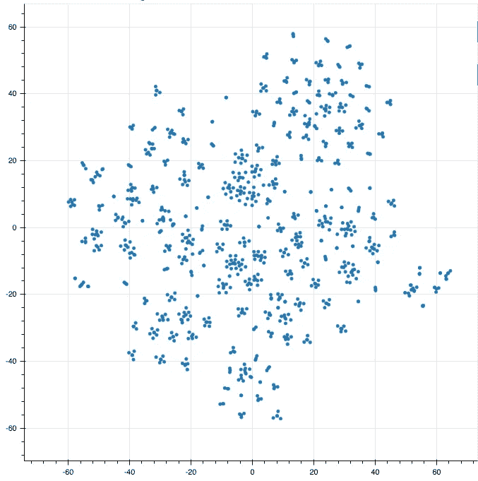

# 你最喜欢的书在一个 VR 世界里如何比较？

> 原文：<https://medium.com/hackernoon/https-hackernoon-com-how-do-your-favorite-books-compare-in-a-vr-world-1807cc7f4e2e>

## 使用空间嵌入可视化语义关系

Semantic Spatial Embedding in VR

# 🔍探索内容(传统方式)

如果你可以用数字方式搜索你自己的图书馆里的书，你会怎么做？

简单的文本搜索可能有效，但这种方法通常只能回答“这些术语在我的书中的什么地方提到过？”

有些问题很难通过文本搜索来回答:

1.  我如何找到某些关键词可能不存在的内容？
2.  我所有的书是如何相互关联的？
3.  哪本书是我还没有读过的，是一个好的开始？

这些问题试图访问内容中的“语义”或“意义”,而不考虑实际使用的单词。

## 超越简单的文本搜索

[**尤尼康**](https://www.unicon.net/) (我最优秀的雇主)授权我花一些时间创建一个概念证明，帮助客户导航**自然语言处理** ( **NLP** )领域，以及如何利用文本语料库中隐藏的语义信息。

[Unicon, Inc. is a leading provider of technology consulting, services, and support for the education industry that works with clients to find solutions to meet business challenges.](https://www.unicon.net/about/contact?source=Web%20Site&source_description=Contact%20Us)

[**Unicon**](https://www.unicon.net/)**还绿色点亮了一个虚拟现实( [VR](https://hackernoon.com/tagged/vr) )体验，进一步照亮探索语义信息的力量。**

**为了这个概念的初步证明，我用了 14 本我已经读过(或者听过)的书😅).熟悉内容将有助于我验证机器学习和布局算法是正确的。**

**这些书都是非虚构的，涵盖了科学/数学主题，只有一本传记除外(你会发现这本书非常显眼)。**

# **📈提取语义信息**

**从文本中提取语义信息现在是自然语言处理中的一种常见做法。机器学习算法遍历文档集合，并为每个文档分配一个语义值(向量)。然后，通过比较它们的语义向量，可以将文本的每个部分与任何其他部分进行语义比较。**

**以下是我们考虑用于为每个文档/节点生成语义向量的机器学习算法:**

*   **[**潜狄氏分配**](https://en.wikipedia.org/wiki/Latent_Dirichlet_allocation)**
*   **[**Doc2Vec**](/scaleabout/a-gentle-introduction-to-doc2vec-db3e8c0cce5e)**
*   **[**LDA2Vec**](https://www.youtube.com/watch?v=eHcBeVnAiD4) 来自 [@chrisemoody](https://twitter.com/chrisemoody)**

**最终，选择了 Doc2Vec，因为它为可视化中的发现提供了更好的机会。Doc2Vec 专注于生成语义向量，其中两个向量的接近度仅取决于语义相似度，而不取决于对特定主题的额外引力，如 LDA 和 LDA2Vec。**

**我们决定为每本书的目录中每个有意义的条目分配自己的语义向量，而不是将每本书作为一个文档输入 Doc2Vec。这将允许在每本书的层次结构中的每一层进行语义比较。**

**Doc2Vec 提供了语义向量。下一步是使它们可用于可视化。**

# **🏝语义信息的️空间嵌入**

**Doc2Vec 生成的语义向量有 300 个维度。人类可以有效地想象 2 或 3 维。这意味着需要将 300 维向量压缩到 3 维或更少，以使可视化对用户友好。**

**t-SNE([t-分布式随机邻居嵌入](https://lvdmaaten.github.io/tsne/))是第一个考虑的降维算法。它提供了令人难以置信的结果:**

****

**T-SNE Projection of Semantic Vectors**

## **主题与以书为中心的布局**

**T-SNE 提供了一个以主题为中心的布局，这在大多数当前的语义探索应用程序中很常见。我们意识到我们没有利用每本书给我们的所有信息，所以我们使用了一种定制的力布局算法，其中边和节点力取决于所有节点之间的语义相似性以及一本书内节点之间的关系。**

**采用定制的“以书为中心”布局有以下好处:**

1.  **作者花了大量时间组织他们的章节，我们希望保存和利用这些信息。**
2.  **通过在布局中保留书籍结构，用户可以使用他们对某些书籍的熟悉程度作为可视化的起点。这可以允许更快的定位和对用户已经熟悉的事物的更好的感觉。**

**这种布局失去了 T-SNE 提供的主题分组的一些重点，但我们找到了替代方法(见下面的视频)来展示这些信息。**

****

**Custom Force Layout Approach for 2D Embedding of Semantic Vectors**

# **🔥虚拟现实中语义信息的可视化**

**现在是时候对我们生成的空间嵌入进行可视化了。**

**我们决定创建一个舒适的岛屿，每个节点都是生长在岛上的一棵树。这提供了一个允许用户利用“[记忆宫殿](https://en.wikipedia.org/wiki/Method_of_loci)”效应来增强信息回忆的景观。**

**为了使岛屿更有趣，使用嵌入数据生成了“高度图”和“splat 图”,以在地形上添加更多细节。**

****

**Splat Map & Height Map**

**splat 贴图中的不同颜色用于渲染地形上的不同纹理。**

**高度图决定了岛屿的高程剖面。值越亮，高程越高。在他们的书的层次结构中较高的节点周围的地形较高。例如，代表整本书的根节点应该在山顶，而当书在地形上展开时，它的章节应该放在较低的位置。**

**从那以后，就是在虚拟现实应用中迭代设计和交互的问题了。Unity 用于开发 VR 应用程序，Oculus GO 是 VR 体验的目标耳机。**

**这是该应用程序的预览:**

# **🥇结果**

**很快很明显，概念证明有助于回答我们之前的语义导向问题:**

## **1 —我如何找到某些关键词可能不存在的内容？**

**节点的语义分组使得定位区域开始查找与所讨论的主题语义相似的内容变得相当容易。该应用程序允许您找到一个代表您感兴趣的主题的熟悉节点。然后可以探索岛上附近的节点，或者突出显示其他书籍中具有语义相似性的节点。**

## **2 —我所有的书是如何相互关联的？**

**看看下面的图片。神经科学、图论、混沌和信息论的主题被画出来以包含它们的相关书籍:**

****

*   **请注意，在左边，沃尔特·伊萨克森的书《史蒂夫·乔布斯传》单独摆放着。它与其他书籍在语义上没有任何实质性的重叠。**
*   **网络科学和神经科学主题的交集包括一本名为[“大脑网络”的书，作者是奥拉夫·斯博恩斯](https://www.amazon.com/Networks-Brain-Press-Olaf-Sporns-dp-0262014696/dp/0262014696/ref=mt_hardcover?_encoding=UTF8&me=&qid=1546880511)。这本书探讨了如何利用网络科学来研究大脑。哇！**
*   **概率和统计领域正好位于所有科学主题的中间。我倾向于认为概率是一切的基础，所以很高兴看到语义和布局算法与我一致:-)**

## **3——我还没有读过的书中，哪一本是一个好的开始？**

**对于那些可能没有阅读过地图中的一本书或多本书的人来说，他们可以快速挑选出一本与他们已经阅读过的书重叠的书，并且根据它们在语义上的定位来看起来很有趣！**

## **奖励——记忆宫殿效应**

**虚拟现实体验提供了利用我们大脑空间编码能力的好处。在虚拟现实体验中花费最少的时间后，我发现回忆岛上书籍的布局是微不足道的。这就像任何人画自己家的地图一样简单。这也给我提供了回忆书籍中几乎所有语义相似之处的机会！**

# **🔭从这里去哪里？**

**这一概念验证的结果令人振奋。它为现有的知识体系提供了一个全新的视角，并激发了更多关于如何扩大其影响的想法:**

1.  **允许用户将白板放在岛上，并在上面写下他们的想法和绘画。**
2.  **为用户提供跨新语料库的阅读计划，利用语义优化知识获取。用户可以将节点标记为完成，这样他们就可以看到他们的进度，并预测新的主题和已经涵盖的主题之间的联系。**
3.  **利用 VR 头戴设备的语音功能对文本进行语音搜索，以找到相关的语义区域。**
4.  **突出通过语义相似的节点链接的多本书的路径(*这可能会导致学生根据语义相似性写论文的有趣练习，以将多种资源联系在一起*)。**

**这些只是我们突然想到的几个新想法。你认为这种方法还能帮助人们探索他们的内容吗？**

## **👏**喜欢这篇文章吗？给它几个掌声，帮助别人发现它！****

**有没有 **EdTech** 的挑战？[让 Unicon 知道](https://www.unicon.net/about/contact?source=Web%20Site&source_description=Contact%20Us)！**

****

**[Unicon, Inc. is a leading provider of technology consulting, services, and support for the education industry that works with clients to find solutions to meet business challenges.](https://www.unicon.net/about/contact?source=Web%20Site&source_description=Contact%20Us)**