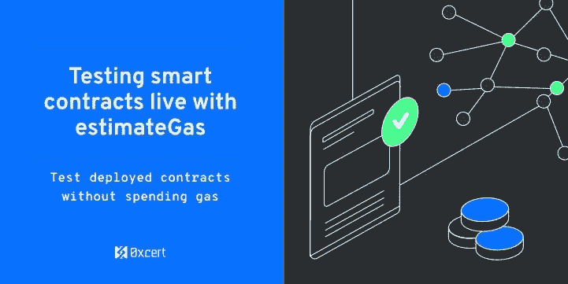
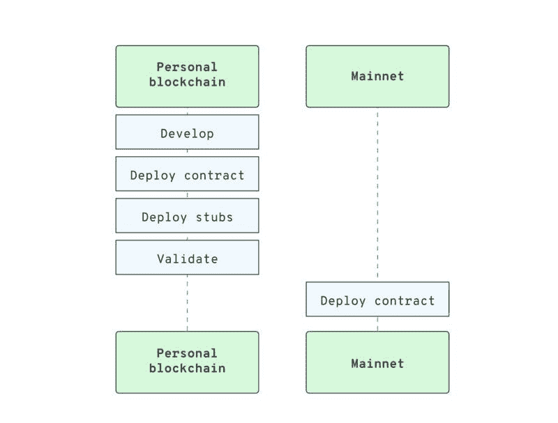
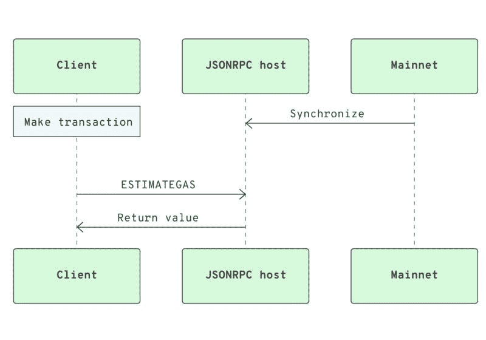

# 使用 ESTIMATEGAS 实时测试智能合约

> 原文：<https://medium.com/hackernoon/https-medium-com-momannn-live-testing-smart-contracts-with-estimategas-f45429086c3a>



*作者:* [*威廉*](https://github.com/fulldecent) *，* [*塔德杰*](https://github.com/MoMannn)

本文介绍了一种技术，您可以用它来以任意方式测试任何已部署的契约，而不需要花费任何精力。它可以在以太坊主网、广域网、以太坊 Ropsten、超级账本挖洞、权威证明网络、私有链和所有其他基于以太坊虚拟机的网络上运行。

**这项新技术首先用** [**ERC-721 验证机**](https://erc721validator.org/) **进行了演示，它对松露不起作用。**

在以下情况下，这种技术可以帮助您:

*   您的合同部署太复杂，无法使用松露
*   你正在测试别人的契约，可能无法访问它的源代码
*   您想要批量测试已部署的契约，而不管它们是如何部署的
*   你对以太坊黄皮书中不寻常的东西和错误感兴趣

注意:我们在这篇文章中已经写了所有的 Solidity 例子，它们可以被复制粘贴并用 [Remix](https://remix.ethereum.org/#optimize=false) 编译。页面示例使用 Web3 并需要元掩码。

# 洁净室测试与现场测试

洁净室测试方法是大多数专业智能合约开发人员的首选。它便宜(不花汽油)，快速(不等待交易)，并且提供可重复的结果。与 Ganache(个人区块链)相结合，Truffle 是这种方法最著名的工具:



几种情况可能会妨碍您使用这种技术。例如，您的合同可能需要实时测试数据(不可重复)来确认特定的代码路径工作正常。可能是您的部署过程太复杂，无法使用 Truffle。也许，你想测试一个没有源代码的契约的兼容性。或者，你的 CEO 让你在测试用例完成之前部署一个智能合同。

**实时测试**是一种新的方法，允许您在访问所有 Mainnet 数据的同时，对 Mainnet 上的智能合约执行验证测试。


当然，您也可以将存根部署到 Mainnet。然而，这可能会导致不必要的昂贵和缓慢。另请注意，在此设置中，验证流程可以完全访问所有 Mainnet 合同和数据。

# 使用已部署的合同进行测试

**实时测试技术**可以通过将一个为测试而明确编写的智能契约部署到 Mainnet，然后调用该契约来执行。

在我们的第一个例子中，我们将测试 Su Squares(721 合同)是否提供 10，000 个令牌的总供应量。( [Su Squares](https://etherscan.io/address/0xE9e3F9cfc1A64DFca53614a0182CFAD56c10624F#code) 部署了精确的 10，000 个不可替换令牌，并且打算总是包含这些令牌)。

请注意，我们选择 10，000 个令牌供应测试是因为它允许对该技术进行简单的演示。同样的技术可以应用在更复杂的测试中。

```
pragma solidity 0.5.6;
import "https://github.com/0xcert/ethereum-erc721/src/contracts/tokens/erc721-enumerable.sol";
contract SuSquaresTests
{
  ERC721Enumerable testSubject;
  */**
   * @notice Deploy test contract with a subject to be used for all tests.
   */*
  constructor(
    address _testSubject
  )
    public
  {
    testSubject = ERC721Enumerable(_testSubject);
  }
  */**
   * @notice Test token supply invariant.
   */*
  function testIsTotalSupply10000()
    external
    view
    returns (bool testResult)
  {
    testResult = testSubject.totalSupply() == 10000;
  }
}
```

这个合约已经部署在 Mainnet 上了，你可以在[0x 37d 3 BF fed 6 f 784 D2 CB 5542 bb9d 9007 c 16 e 5938 df](https://etherscan.io/address/0x37d3bffed6f784d2cb5542bb9d9007c16e5938df)玩。

出于某种原因，该测试执行需要更改 Mainnet 状态的操作。这使得测试的部署和运行成本都很高。此外，测试需要时间来执行(由于一个块的确认)。

在下一章中，我们将删除其中一项费用。

# 使用估计气体的测试

我们可以通过使用标准以太坊客户端 JSON-RPC(以及扩展 Web3.js)的内置特性，即 **ESTIMATEGAS** ，来消除执行这个测试函数的成本。

在下图中，“客户端”是指 Geth/Parity 控制台会话、Truffle 或使用 web3.js 的 web 浏览器。



[**estimate gas**](https://github.com/ethereum/wiki/wiki/JSON-RPC#eth_estimategas)**的参数相当于进行一次普通交易，只是你不必签字，它会交付用气量。(如果使用了所有气体，也有可能出现错误/失败的测试结果)。简而言之， **estimateGas** 的运行方式与进行交易时完全相同，但是它提供了关于交易成本的信息，而不是提交交易。**

**您还应该注意到，如果在一个交易中运行 **estimateGas** ，那么返回的 Gas 量将等于一个区块中可用的 gas 总量。**

**考虑到这一点，我们可以改变上面的测试案例，以便测试结果由所用的气体量来表示:**

```
*/**
  * @notice Test token supply invariant.
  */*
function testIsTotalSupply10000()
  external
{
  require(testSubject.totalSupply() == 10000);
}
```

**在这个新版本中，如果测试失败，消耗的气体将代表可用气体的总量。**

**现在我们已经建立了一种方法来运行任意的测试用例，而不需要在每次使用它们时付费。在下一部分中，我们还将消除部署合同的费用。但在继续之前，我们必须违反以太坊黄皮书中的一项声明。**

# **单一事务模式**

**当前版本的[以太坊黄皮书](https://ethereum.github.io/yellowpaper/paper.pdf)(所有以太坊客户都应遵循的规范)指出:**

> ***【只有】两种类型的交易:导致消息呼叫的交易和导致创建具有相关代码的新账户的交易(非正式地称为“合同创建”)。***

**这实际上是不准确的，因为我们已经检查过的以太坊参考实现——Geth、奇偶校验以及我们知道的所有其他实现——都允许第三种类型的交易。我们将滥用这一事实，以便我们可以重构测试契约，立即执行测试用例并返回结果——而不需要实际部署契约。**

**我们如何做到这一点？通过将测试用例移到构造函数中。**

```
pragma solidity 0.5.6;
import "https://github.com/0xcert/ethereum-erc721/src/contracts/tokens/erc721-enumerable.sol";
contract SuSquaresTests
{
  */**
   * @notice Deploy test contract with a subject to be used for all tests.
   */*
  constructor(
    ERC721Enumerable _testSubject
  )
    public
  {
    testIsTotalSupply10000(_testSubject);
  }
  */**
   * @notice Test token supply invariant.
   */*
  function testIsTotalSupply10000(
    ERC721Enumerable _testSubject
  )
    public
  {
    require(_testSubject.totalSupply() == 10000);
  }
}
```

**这个例子违反了 Ethereum 黄皮书规范，因为创建契约的事务也执行了对该契约的消息调用。一个调用甚至可以创建多个契约，并对这些契约执行多个消息调用，稍后我们将在存根示例中展示这一点。**

**首先，您必须将这个契约编译成字节码。以下是如何使用 Remix IDE 实现这一点:**

****

```
<html>
<head>
  <title>Estimate gas tests</title>
</head>
<body>
  <script src="https://cdn.jsdelivr.net/gh/ethereum/web3.js@1.0.0-beta.34/dist/web3.min.js" type="text/javascript"></script>
  <script>
    if (typeof window.web3 !== "undefined" && typeof window.web3.currentProvider !== "undefined") {
      var web3 = new Web3(window.web3.currentProvider);
    } else {
      alert("No web3");
    }
    const abi = [
      {
        "constant": false,
        "inputs": [
          {
            "name": "_testSubject",
            "type": "address"
          }
        ],
        "name": "testIsTotalSupply10000",
        "outputs": [],
        "payable": false,
        "stateMutability": "nonpayable",
        "type": "function"
      },
      {
        "inputs": [
          {
            "name": "_testSubject",
            "type": "address"
          }
        ],
        "payable": false,
        "stateMutability": "nonpayable",
        "type": "constructor"
      }
    ];
    const bytecode = "0x608060405234801561001057600080fd5b5060405160208061021d8339810180604052602081101561003057600080fd5b81019080805190602001909291905050506100508161005660201b60201c565b506100e7565b6127108173ffffffffffffffffffffffffffffffffffffffff166318160ddd6040518163ffffffff1660e01b815260040160206040518083038186803b15801561009f57600080fd5b505afa1580156100b3573d6000803e3d6000fd5b505050506040513d60208110156100c957600080fd5b8101908080519060200190929190505050146100e457600080fd5b50565b610127806100f66000396000f3fe6080604052348015600f57600080fd5b506004361060285760003560e01c806347d54a4514602d575b600080fd5b606c60048036036020811015604157600080fd5b81019080803573ffffffffffffffffffffffffffffffffffffffff169060200190929190505050606e565b005b6127108173ffffffffffffffffffffffffffffffffffffffff166318160ddd6040518163ffffffff1660e01b815260040160206040518083038186803b15801560b657600080fd5b505afa15801560c9573d6000803e3d6000fd5b505050506040513d602081101560de57600080fd5b81019080805190602001909291905050501460f857600080fd5b5056fea165627a7a723058201eaa86ca0d93585836b0d06315ab78c83079efff596c1a0417c5195ad0fc9e2d0029";
    async function test(){
      const contract = new web3.eth.Contract(abi);
      const contractAddress = document.getElementById("contractAddress").value;
      *// First we check max gas limit.*
      let gasLimit = 8000029;
      await web3.eth.getBlock("latest", false, (error, result) => {
        gasLimit = result.gasLimit;
      });
      contract.deploy({
        data: bytecode,
        arguments: [contractAddress]
      }).estimateGas({
        from: '0xc02aaa39b223fe8d0a0e5c4f27ead9083c756cc2'
      }, (err, gas) => {
        *// If there is no error and gas is bellow has limit the test succedded.*
        if (err === null && gas < gasLimit) {
          document.getElementById("console").innerHTML = "Contract has 10000 tokens."
        } else {
          document.getElementById("console").innerHTML = "Contract does NOT have 10000 tokens."
        }
      });
    }
  </script>
  <h3>Testing if ERC-721 enumerable contract has a total supply of 10.000.</h3>
  <h4>Quick copy contract addresses for tests:</h4>
  <b>Su Squares (passing test): </b>0xE9e3F9cfc1A64DFca53614a0182CFAD56c10624F <br/>
  <b>Axie Infinity (failing test): </b>0xf5b0a3efb8e8e4c201e2a935f110eaaf3ffecb8d <br/><br/>
  <input id="contractAddress" type="text" placeholder="Input contract address" />
  <button onclick="test()">Test</button>
  <p id="console"></p>
</body>
</html>
```

**这是一个用 Solidity 编写的任意测试用例。它可以针对任意契约调用，可以使用任意数据并任意调用其他契约。**

**哦，另外:**

**这个测试用例可以在任何 EVM 网络上运行，比如以太坊主网、Wanchain、以太坊 Ropsten、Hyperledger Burrow、权威证明网络以及私有链。**

# **存根和工件**

**存根是一个特定的、附加的契约，只需要它来验证测试主题契约。例如，如果您想要验证 ERC-721 合同传输令牌的能力，您将需要一个可以接收令牌的合同。你可以在 0xcert 查看一个完全开发的[例子。](https://github.com/0xcert/erc721-validator/blob/096d04b01dec172576743fe6131df1fb45f33f24/contracts/validator.sol#L578)**

**下面是一个 ERC-721 接收器短截线的基本示例。您应该注意到，这个示例假设契约拥有一个令牌。您可以通过我们在下一节中描述的几种方式来实现这一点。“给予者”技术也已经在 0xcert 示例中实现，这里链接的是。**

```
pragma solidity 0.5.6;
import "https://github.com/0xcert/ethereum-erc721/src/contracts/tokens/erc721.sol";
import "https://github.com/0xcert/ethereum-erc721/src/contracts/tokens/erc721-token-receiver.sol";
contract StubsAndArtifacts
{
  */**
   * @notice Deploy test contract with subject to be used for all tests.
   */*
  constructor(
    ERC721 _testSubject,
    uint256 _tokenId
  )
    public
  {
    *// This test assumes that this contract owns that particular _tokenId. You first*
    *// need to get a token. There are multiple ways to achieve this like "buying" it*
    *// before running test or using "the giver" technique.  All of this is explained*
    *// below in the article.*
    testDoesCorrectlyTransferData(_testSubject, _tokenId);
  }
  function testDoesCorrectlyTransferData(
    ERC721 _testSubject,
    uint256 _tokenId
  )
    public
  {
    StubTokenReceiver stub = new StubTokenReceiver();
    *// we expect failure*
    _testSubject.safeTransferFrom(address(this), address(stub), _tokenId, "ffff");
  }
}
contract StubTokenReceiver is
  ERC721TokenReceiver
{
  bytes4 constant FAKE_MAGIC_ON_ERC721_RECEIVED = 0xb5eb7a03;
  */**
   * @dev Receive token and map id to contract address (which is parsed from data).
   */*
  function onERC721Received(
    address _operator,
    address _from,
    uint256 _tokenId,
    bytes memory _data
  )
    public
    returns(bytes4)
  {
    return FAKE_MAGIC_ON_ERC721_RECEIVED;
  }
}
```

**以同样的方式，您可以使用实时测试技术部署存根，您也可以测试契约部署。**

# **限制**

**所展示的技术提供了一种测试已部署契约的非常需要的方法，但是并不是没有限制的。我们需要承认局限性，并为一些问题提供解决方案。**

**智能合约[事件](https://solidity.readthedocs.io/en/v0.4.24/contracts.html#events)不能从合约中访问，因此，在不实际执行交易的情况下，无法测试它们。这意味着用**估算气体**无法测试是否有事件发出。**

**如果您正在测试令牌传输之类的东西，该怎么办？要能够转移代币，您需要是代币的所有者或批准方。这对 **estimateGas** 来说不成问题，因为它不需要用私钥签名，因此可以从任何地址运行。这样，即使您没有令牌的私钥，也可以作为实际拥有令牌的地址运行事务。**

**在没有任何令牌所有者输入的情况下，在 ERC-721 契约中测试**safetransforfrom**方法怎么样？在这种情况下，您需要一个类似于在**存根和工件**部分中描述的接收器，并且具有接收令牌的能力。优选地，您会想要添加多个具有不同类型的通过/失败测试的接收器。你可以用最小的成本解决这个问题。您所要做的就是创建和部署一些将作为接收者测试的契约。一旦它们被部署，你可以测试任何 ERC-721 契约**safetransformfrom**，，只要你知道那个契约的一个现有 ID，并且如果契约支持可枚举扩展，这个方法可以产生直接的结果。**

**实际上，它是这样工作的:您通过令牌 ID 找到令牌所有者，并使用您已经部署的测试契约的目的地在 **safeTransferFrom** 上创建一个 **estimateGas** 。为了向您展示它有多简单，我们已经编译了这个方法的一个工作示例，您可以在这里检查。**

**如果案例涉及需要提供批准/所有权的多方，该怎么办？嗯，这是一个限制，不能总是完全无气解决。不过，这里有两个例子来说明如何做到这一点:**

1.  **如果你想测试一个你不拥有或尚未铸造的 ERC-721 资产，但该资产在 [OpenSea](https://opensea.io/) 上出售，你的测试用例可以作为 WETH 账户运行(有 200 万乙醚可用)。在 OpenSea 上购买令牌后，您可以随意使用该令牌。**
2.  **另一种方法是[给予者契约](https://github.com/0xcert/erc721-validator/blob/master/contracts/validator.sol#L1060)方法。这种方法并不是完全免费的，但它使令牌完全安全。您可以检查 [ERC-721 验证器](https://erc721validator.org/)来查看这种方法的运行。**

# **结论**

****活体测试技术**提供了一个完整的**替代使用洁净室工具**如松露进行测试。这种新方法使网络的整个状态对您的测试用例可用。由于测试主题的部署方式在您的案例中并不重要，您可以非常容易地针对许多部署的契约运行单个测试套件。**

## **阅读圈问题**

*   **在洁净室方法和现场测试方法中，哪种测试情况会更好？**
*   **活体测试的引入是否限制了松露和类似工具的有用性？**
*   **使用实时测试方法研究安全漏洞有什么好处？**
*   **(以太坊)网络客户端可以做哪些改变来简化实时测试？**
*   **以太坊黄皮书是字面上的错误，还是这是一种人为的解释？**

***本文以及所描述的方法和代码片段是 ERC-721 标准的主要作者*[*William entri ken*](https://github.com/fulldecent)*和 0xcert 的主要区块链工程师*[*Tadej Vengust*](https://github.com/MoMannn)*的工作成果。***

**[**检查 ERC-721 验证器如何工作**](https://erc721validator.org/)[**检查用 GitHub 上的 estimateGas 进行现场测试的完整代码**](https://github.com/fulldecent/live-testing-with-estimateGas/) **[**检查验证器示例**](https://fulldecent.github.io/live-testing-with-estimateGas/validator-example.html)****

****

**Visit and star our [GitHub repository](https://github.com/0xcert/framework).**