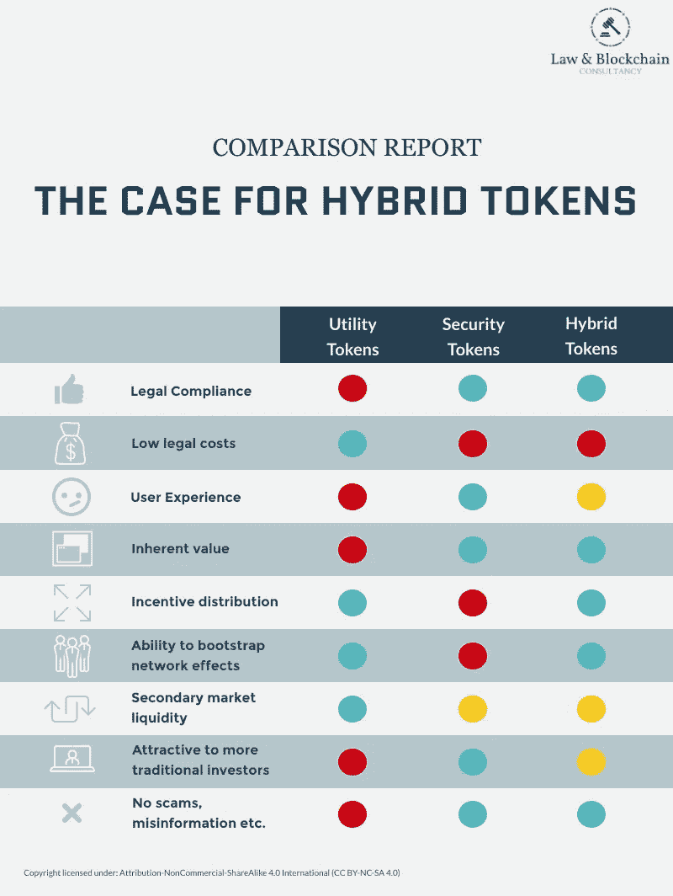
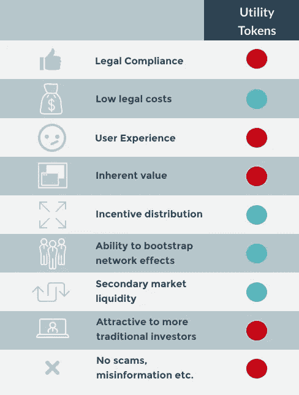
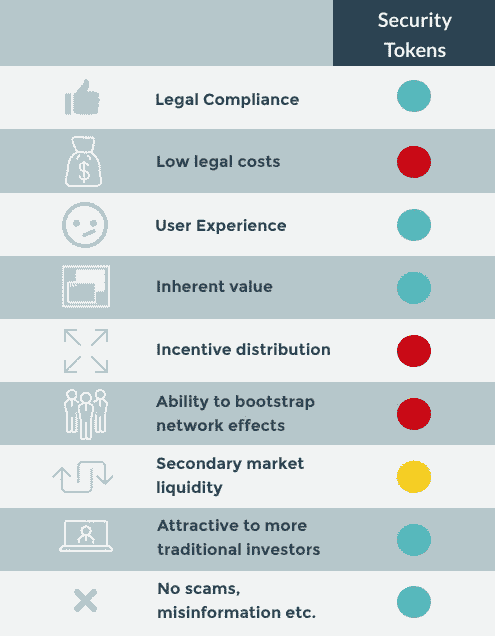
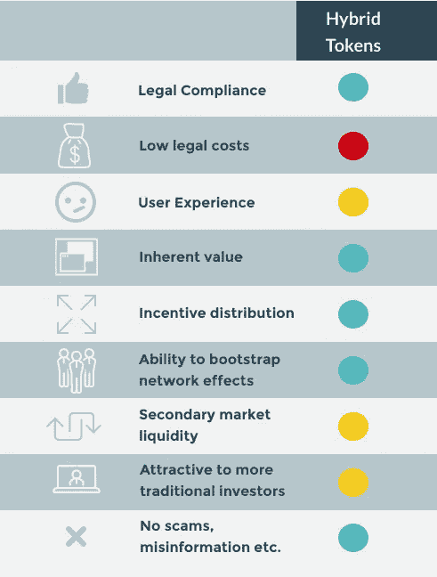

# 为什么混合令牌优于实用令牌

> 原文：<https://medium.com/hackernoon/hybrid-tokens-are-superior-to-utility-tokens-heres-why-3bec287c465>

## 比较实用令牌、安全令牌和混合令牌

我看到许多文章宣称最初的硬币提供的死亡。事实上，ICO 的融资量确实大幅下降。与此同时，许多人称赞安全令牌产品(STO)是“下一件大事”。新的炒作，会让人措手不及。然而，许多人误解了 ICOs 和 STO 的区别。更多的人低估了实用令牌和安全令牌之间的区别。同时，混合令牌大多被忽略了…它们不应该被忽略。在这篇文章中，我将快速比较实用令牌和安全令牌，然后证明混合令牌结合了两者的优点。

A quick TLDR for the lazy ones.

# ico 和实用程序令牌

公用令牌是一种令牌，通常用作支付或访问分散式应用、网络或服务的手段。发行者在初始硬币发行期间创建预定数量的代币，并出售给投资者/用户。通常，访问由相应的区块链网络、服务或分散式应用提供的任何公用事业(或为商品或服务付费)的唯一方式是通过发行者自己的令牌。

公用事业代币是一种(对创始人非常友好的)筹集资金的机制。效用令牌的优势在于它们能够引导网络采用。虽然早期购买代币可能不会给投资者带来很多效用，但这种效用的缺乏可以通过巨大的潜在财务收益来弥补。毕竟，创建的令牌数量有限，没有创建更多令牌的选项，这意味着如果协议/网络/应用程序的效用增加，需求也应该增加。在供应量保持不变的情况下，这在理论上应该会导致代币的价格上涨。

用户、顾问、开发者和发行者都希望增加整个生态系统的价值，因为这增加了他们的代币的价值。事实上，各方都被激励去帮助建立生态系统，并提供嘴对嘴的广告。任何早期效用的缺失都会被潜在的财务增长所弥补。这很重要，因为它有助于引导用户采用。网络、协议或市场只有在其他人使用时才有价值。如果其他人不使用 linkedin，它就没有任何意义。如果没有人在卖东西，尝试在易趣上买东西是没有意义的。公用事业代币给早期用户带来的财务优势有助于解决这个先有鸡还是先有蛋的问题。[【1】](#_ftn1)

然而，实用令牌模型通常会给只对使用网络服务感兴趣的最终用户带来一个大问题:不稳定性。举例来说，如果我要使用一个分散的类似超级用户的服务，我不想在我的钱包里放一个仅仅因为糟糕的市场环境而损失 80%价值的令牌。如果我明天要去旅行，我甚至不希望我钱包里的代币到那时会贬值 20%。易变会导致可怕的用户体验。[【2】](#_ftn2)

The pro’s and con’s of utility tokens

公用令牌的另一个大问题是它们的监管性质。不遵守证券法和投资者与发行者之间的大量信息不对称使得投资者难以正确评估项目的成功和风险。这导致了公用事业代币发行者对其未来的大量虚假陈述，以及许多骗局。由于公用事业代币是一种(相对)新的工具形式，传统的估价方法也不能适用。

事实上，参与 ICO 的各方都从不断上涨的象征性估值中获利，再加上巨大的信息不对称，这是一个问题。缺乏对发行者运营的了解导致了这样一种情况，即对于经济上理性的发行者(其本身保留了代币)来说，最佳策略是(至少在短期内)让人们相信代币的效用将会有很大的需求，而不是实际建立一个成功的 dApp、网络或生态系统。然后他们可以从代币的升值中获利。如果每个人都采用这种策略，一个市场就会变成一场营销大喊大赛，出现许多毫无意义的“战略创新伙伴关系”和大胆的主张，这在 2017 年的 ICO 泡沫中发挥了很大作用。这是大多数 ICO 公司从未实现真正采用的主要原因之一。

# **sto 和安全令牌**

由于上述问题，有必要考虑不同的代币供应模式。证券代币发行很有意思，因为它解决了 ico 问题的主要根源:发行者和投资者之间的信息不对称。

在证券代币发行中，代币也是由项目/创业公司发行来筹集资金的。然而，该令牌并不作为解锁未来效用的稀缺资源。相反，安全令牌向其持有者提供了某种经济权利。例如，这些权利可以采取对发行人的利润或收入的权利的形式。代币也可以代表股票、债券或其他基础资产的所有权。

The pro’s and con’s of security tokens

在几乎所有的司法管辖区，这自然会导致证券法的严格适用。这些条款一般规定发行证券是非法的，除非起草具体的信息文件。此类“注册文件”(美国)或“招股说明书”(欧盟)提供了有关发行工具、发行人、其财务历史、其核心活动和投资者所涉风险的信息。这些信息必须完全准确，完整，不以任何方式误导。事实上，发行人对这些文件中的遗漏、虚假陈述或不准确负有责任。[3]这些信息的披露确保了投资者不会被误导或欺骗，从而使证券代币成为更安全的投资者。

简而言之:安全令牌不仅仅是基于未经证实的经济模型和炒作的一堆空话。相反，作为潜在现实世界资产或收入流的结果，安全令牌具有更明确的内在价值。投资者收到的关于发行者和代币发行本身的信息要好得多。此外，由于安全令牌模型在方法上更为保守，它可能对传统投资者、(企业)风投和其他风险偏好较低的投资者更具吸引力。

现在，有人可能会认为发行者应该只发行安全令牌而不是实用令牌。然而，安全令牌和实用令牌具有非常不同的应用。虽然两者都被用作筹款的手段，但公用代币旨在创建一个生态系统和支付手段。另一方面，安全代币可以被视为仅仅是一种传统的经济权利发行，但现在在区块链。换句话说，sto 和 ico(通常)有非常不同的用例。

与 ico 相比，sto 也没有协调各方之间的激励，通常也不会带来任何显著的积极网络效应。安全令牌没有广泛分布在生态系统中的所有各方，不能在不受监管的市场上交易，也不能在区块链网络中用于公用事业。相反，sto 仅仅是一种筹资技巧。通常，将它们视为中小企业的迷你 IPO 更为合适。它们是对创业/扩大规模的传统融资的替代或补充。

传统上，扩大规模会分批出售股权:

*   3F 回合(朋友、家人、傻瓜)
*   预播种
*   种子
*   种子后
*   系列 A
*   系列 B、C 等。
*   通过首次公开募股或企业风险存在

每一轮融资都会筹集到更多的资金。这种模式中的投资者(天使和风险投资家)锁定他们的投资，直到 IPO 或公司以某种方式被收购，这需要 8-12 年。STO 最好放在种子后轮和 A 或 B 系列之间的某个地方，这取决于 STO 的大小。

安全代币的一大承诺是，新兴的安全代币二级市场将为投资者提供流动性。换句话说，早期投资者的投资不会被锁定 8-12 年。相反，股权可以在 STO 后不久易手。虽然 sto 的“流动性承诺”可能是早期风险融资的一个有影响的演变，但它仍然只是一个承诺。流动性充足的全球资本市场是否会出现，还有待观察。许多方面目前都在竞相提供所需的市场基础设施。[4]

# **混合代币**

如前所述，安全令牌不是实用令牌的替代品:STO 是一个完全不同的模型，与 ICO 有着不同的应用。

发行安全令牌所需的法律合规性确保了 ICO 市场遇到的问题不适用于 sto。发行人对其在要求的信息披露文件中的(错误)陈述负责，并必须遵守法律。然而，关于生态系统/网络/市场中所有利益相关者的联合的效用令牌的优势在安全令牌模型中没有保留。

因此，将这两种模型结合起来创建一个令牌(提供)结构是有意义的，它利用了两个世界的优点。介绍:混合令牌。

混合代币借用了公用代币(甚至是加密货币)的元素。与公用令牌一样，创建了有限的供应。这些令牌可用于从网络或分散式应用程序解锁该实用程序，从而充当某个网络内的交换手段。就像效用令牌一样，当网络变得更广泛地被采用时，通过混合令牌的价值增值，额外的潜在财务收益减轻了令牌持有者在这种应用或网络中缺乏早期效用的情况。

然而，与此同时，混合代币给予代币持有者某种经济权利。例如，这可以采取发行人业务中的额外利润权或股权的形式。然而，它也可能采取对网络内某些收入流的权利的形式。

> 一个混合代币的有趣例子是币安硬币(BNB)，它可以用来支付币安交易所的交易费用。当使用 BNB 支付这些交易费用时，令牌持有者在交易所获得交易费用的折扣。此外，币安交易所通过“焚烧”BNB 代币将其 20%的利润重新分配给代币持有者，从而减少代币的总供应量，这实质上是将被焚烧代币的价值分配给所有其他代币持有者*。[5]*

简而言之，混合代币可以提供类似股权的特征，如投票权、股息和股权*以及*保留公用代币最重要的特征:平台使用量的增加仍会导致代币价格的直接上涨。

那么获得的优势是什么呢？

混合代币附带的经济权利确保可以应用更传统的估价方法来计算代币的真实价值。包含股息或收益权应该对具有长期观点的投资者更具吸引力，而不是那些寻求快速获利的投资者。与此同时，发行者更有动力专注于采用，因为投资者正在寻找收入或利润分配不断增长的项目，而不是寻找社交媒体上最热门的标志。与公用设施代币相比，这些都将导致易失性的降低，从而改善那些不愿意使用易失性工具来解锁服务或公用设施的消费者的用户体验。

最重要的是，将经济权利附加到公用事业代币(产生混合代币)会将代币发行本身纳入证券法的范畴。这意味着发行人必须遵守通常适用于证券(或证券代币)发行的所有要求。如前所述，强制性信息披露确保投资者不会(轻易)被欺骗或误导。

# **结论**

本质上，设计代币是一种利益的平衡行为。该实用模型最适合利用过度的市场流动性，引导代币的初始采用，并在生态系统的所有利益相关者之间分配激励。然而，大多数实用令牌模型存在固有的缺陷，并且不符合证券法。

证券代币发行是一种不同用例的筹资技术。这应被视为金融工具发行基础设施的创新，有可能为目前流动性不足的投资创造更具流动性的市场。

混合令牌模型试图结合两种令牌类型的最佳特征。它兼有公用事业权标和安全权标的优点，因为激励措施在所有行为者之间分配，而证券法的适用应消除不良行为者。

就个人而言，我希望看到工业界更多地转向混合令牌模型。坦率地说，我对混合令牌模型没有占领市场感到惊讶。当然，在法律合规方面，涉及的成本更多。然而，如果一家发行公司不能拿出保护投资者所需的资金，它可能就不应该得到任何回报。

当然，与全面注册或发行招股说明书相比，特定的法律结构和有限的披露制度可以降低成本。通过' [*法律和区块链咨询公司*](https://www.lawandblockchain.eu/consultancy) *'* 我帮助公司浏览金融和证券法，并帮助构建合法合规的令牌产品。

原谅不要脸的自插。

> 如果你喜欢这篇文章，为什么不留下一些掌声呢！**点击并按住那个按钮是相当令人满意的。**

[【1】](#_ftnref1)梅特卡夫**定律**指出一个(电信)**网络**的**效应**与系统连接用户数(n2)的平方成正比。这条定律同样适用于市场、社交网络和协议。

对消费者来说，合理的做法是只在他打算在旅行时购买旅行代金券，这导致人们实际上并不持有代金券。反过来，这导致令牌在生态系统内以“高速度”移动，从而增加了波动性。操纵代币价格的难度也大大增加了。毕竟，一个仅仅起到交换媒介作用的代币可以从一个价格均衡被推到下一个价格均衡(由于 MV=PQ 方程[)。当然，有许多方法可以增加长期持有代币的动机，而不必冒险进入证券法的领域。参见 Kyle Samani 关于 token 模型的文章:](/newtown-partners/velocity-of-tokens-26b313303b77)[https://multi coin . capital/2018/02/13/new-models-utility-tokens/](https://multicoin.capital/2018/02/13/new-models-utility-tokens/)

[3]存在发布这些信息披露的豁免。在美国，例如注册 CF、注册 D、注册 A(+)和注册 S 产品。欧盟的招股说明书指令和法规同样对私人发行、金融机构发行和小额发行有豁免。

[4]关于一级市场发行，参见例如 Securitize、Harbor、Polymath、Swarm。二级市场发行，看 tZero，OpenFinance，还有直布罗陀证券交易所，马耳他证券交易所，纳斯达克的 dx.Exchange 的努力。

[5]即使币安没有登记任何注册声明或招股说明书，BNB 焚烧计划在很大程度上类似于股票回购或股息分配。根据美国的豪威测试，这种代币有资格成为一种证券，在一些欧盟成员国也可能成为一种证券。即便如此，BNB 还是非常成功。