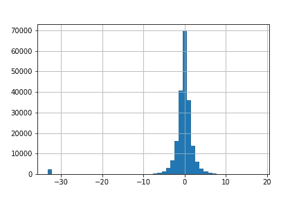

# 我发现了一万种行不通的方法

> 原文：<https://medium.com/hackernoon/i-found-10-000-ways-that-didnt-work-b01794b42e3b>

## 从卡格尔比赛中得到的启示


Protip: If you overfit enough, you will get great results on your training data

我投入了大量时间的第一次 Kaggle 比赛尘埃落定，尽管离令人垂涎的冠军位置还很远，但我达到了我为我的个人资料页面赢得第一枚奖牌的目标，甚至因为在比赛中排名前 2%而获得了银牌，在 4000 多个参赛团队中排名第 58。

然而，除了最终排名之外，比赛还提供了一些关于竞争数据科学和一般数据科学的有益经验，我将这些经验记录下来，希望能帮助其他人避免犯我犯过的同样的错误。从别人的错误中学习毕竟是最好的策略，因为你没有时间自己犯所有的错误。

# 1.你并不特别。你不是美丽独特的雪花

从简单开始，从可用的内核中获得灵感，并通读竞赛论坛。你在早期有一个别人没有想到的天才突破性想法的可能性是非常小的。

首先不要做的事情包括:

*   从[的 Prod2Vec](https://arxiv.org/pdf/1607.07326.pdf) 论文中获得灵感，尝试 word2vec 嵌入或各种类别，作为第一个简单特性聚合之后的第一件事。
*   看看这是如何不起作用的，花很多时间在相同类别的 t-SNE 维数减少上，即使你使用的是在非离群集上训练的自动编码器。


This 50/50 sample of outliers and non-outliers might look promising, but the extreme imbalance of the dataset adds too much noice for it to yield anything useful in the end

*   [场感知因子分解机](https://www.csie.ntu.edu.tw/~cjlin/papers/ffm.pdf)。尝试一下肯定很有趣，通读一下这篇论文，但是试图把它硬塞进这个问题是不合适的。
*   滚动窗口时间序列特征。试图捕捉客户行为随时间变化的时间方面。我仍然喜欢这个想法，尽管它没有在这个数据集上成功，而且在我探索一些更简单的特征工程想法之前，它是一个我走得太远的兔子洞。

尽管如此，这么多失败的实验对未来意味着很多有益的学习。我可以用托马斯·爱迪生不朽的话来总结整个经历:

> 我没有失败。我刚刚发现了一万种行不通的方法。

与其讨论什么不该做，不如让我们继续讨论如何更好地打发时间。

# 2.了解您的数据

我知道，我知道。这是如此初级，以至于提出来感觉很傻。尽管如此，在粗略的数据探索之后，继续进行模型构建是如此容易，如果数据包含一些曲线球，你将最终在一个无望的原因上花费大量时间。



Distribution of target variable. Is this a regression or classification task?

请务必通读数据描述，写下您的疑问，并尝试回答它们。

在时髦的 ML 圈子里，如今每个人都想给自己贴上数据科学家而不是数据分析师的标签。尽管如此，我还是要说，在大多数情况下，对数据的透彻理解要比你可能使用的任何花哨的算法有价值得多。

# 3.(与数据泄露的)斗争是真实的

你有这个绝妙的想法，计算每个商家的异常值可能性，并将其作为回归模型的特征。你在你的 train 和 val 场景中看到惊人的结果，在测试场景中看到可怕的暴行。发生了什么事？

堆叠模型是强大的，也许不经常用于生产用例，但肯定会在 Kaggle 竞争中挤出最后三分之一的小数损失减少。如果你没有自律和谨慎，你最终会搬起石头砸自己的脚。在你疯狂之前，确保你已经阅读了关于数据泄露和 T2 模型堆叠的内容。

# 4.深度学习不会自动解决你所有的问题

尽管深度学习有时被宣传为终极解决方案，但仍有大量问题，其他算法在实践中表现更好。

通过回归和分类方面的数据集组合，梯度增强树模型明显领先于神经网络，由于目标变量的非连续分布，神经网络很难收敛于稳定的最小值。

基于树的模型还有一个很大的好处，它不像许多其他模型那样基于相同的正态性的[假设，这意味着你不必做那么多的数据准备。如果你决定对神经网络感兴趣，从随机森林和/或梯度推进机器开始会给你一个很好的基准。](http://www.simafore.com/blog/bid/62333/4-key-advantages-of-using-decision-trees-for-predictive-analytics)

说真的， [LightGBM](https://lightgbm.readthedocs.io/en/latest/) 有多好简直是疯了。

# 5.迭代速度超过正确性

有了大数据集和大量要素，一切都会变慢。一个完整的训练迭代的速度等于你可以多快地运行一个实验来验证你是在正确的轨道上还是在浪费时间，所以这是一个大问题。因此，你应该一直留意如何消除多余的工作。

第一步是存储聚集的特性，这样如果没有任何变化，您就不必在每次训练运行时重新创建它们，这样您就可以在不同的测试中轻松地混合和匹配不同的特性组合。

此外，对于许多意图和目的来说，处理数据子集已经足够好了，而且要快得多。如果可能的话，在分析过程中使用较小的样本来评估想法，并相信[大数定律](https://en.wikipedia.org/wiki/Law_of_large_numbers)样本具有一定的代表性。

对于迭代速度相对于绝对正确性的效率，一个恰当的比喻是小批量梯度下降如何比每次学习迭代使用全部数据更快地收敛。

# 6.…所有的部分都很重要

在交互式编程范式赋予的自由以错误的顺序结束之前，或者您意识到您不小心更改了用于生成特性集的代码，这些特性集为您带来了出色的结果，而现在您却不知道如何重新创建它们，在 Jupyter 笔记本中耍无赖的情况只会持续很久。他们说的没错，权力越大，责任越大，在工作中帮助我获得更好结构的两件事是:

*   确保将每个实验使用的相关超参数设置和功能组合与交叉验证结果一起存储。
*   使用版本控制，以便在遇到死胡同时能够回到早期状态。

我当前的工作流程；导入包含稳定代码的本地包，并在笔记本中使用自动重新加载，以便自动检测和拾取文件中的更改。朱庇特魔法；

```
%load_ext autoreload
%autoreload 2
```

一旦成功，您就可以在笔记本中原型化新的逻辑和功能，同时从您的包中调用所有稳定的逻辑。当你发现一个新的逻辑值得保存时，直接把它移到你的包中，确保在翻译过程中没有丢失任何东西，然后提交。如果与实验相关，可以在提交消息中存储当前的 CrossVal。

# 结论或:我是如何学会停止担忧并爱上炸弹的

比赛结束后，公共排行榜和私人排行榜产生了巨大的变化，起初我非常惊讶地发现自己一夜之间进步了不少。

然而，当我检查提交的作品时，当我意识到我的最后两个候选作品实际上并不是我最好的作品时，我觉得我脚下的土地消失了。如果我选择了最佳的最终提交，我在最终排名中仍然高出 20 位左右(这里可以忽略一个事实，那就是对于一大群人来说，这可能是真的)。

类似地，当浏览解释顶级团队提交的论坛时，我意识到所有这些简单的事情，我只是没有想到会进一步改进我的模型。执着于这种假设不会产生任何有成效的东西，反而太容易了。


If I had only…

一个更有建设性的途径是练习正念，试着放下任何遗憾。一旦该说的都说了，该做的都做了，没有什么是你可以改变的，你最好还是专注于尽可能多地向所有伟大的头脑学习，在比赛结束后在论坛上分享他们的见解和策略。

那么我的下一步是什么？为了简单起见，我将以开头的方式结束这篇文章，引用一句鼓舞人心的话，因为总会有人说得比你更好。这一次，我最喜欢引用老狐狸塞缪尔贝克特的一句话；

> 再试一次。再次失败。失败更好。