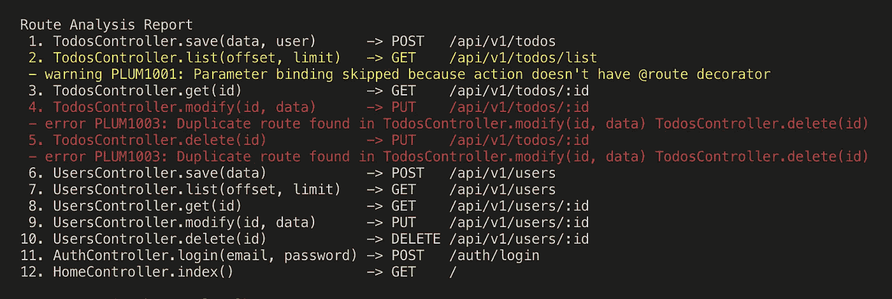
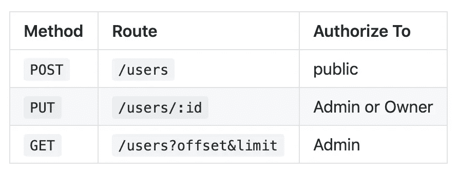

# 我花了一年时间重新发明了一个 Node.js 框架

> 原文：<https://medium.com/hackernoon/i-spent-a-year-to-reinvent-a-node-js-framework-b3b0b1602ad5>

最近我花了将近一年的时间，利用业余时间为 Node.js 开发了一个服务器端的 TypeScript 框架。该框架主要是为我的内部项目构建的，帮助我使用 TypeScript 轻松创建 restful api。

这个框架被命名为 [Plumier](https://github.com/plumier/plumier) ，它的灵感来自于生长在我房间前的一朵美丽的花鸡蛋花。鸡蛋花取自发现鸡蛋花的法国植物学家查尔斯·普卢米尔的名字。我喜欢这个名字，因为它在 GitHub 和搜索引擎上听起来完全是独一无二的。

Plumeria — Image by [tengyi chiu](https://pixabay.com/users/kevin7635-2636225/?utm_source=link-attribution&utm_medium=referral&utm_campaign=image&utm_content=1420998) from [Pixabay](https://pixabay.com/?utm_source=link-attribution&utm_medium=referral&utm_campaign=image&utm_content=1420998)

# 为什么是另一个框架？

我不是住在山洞里，我知道外面有十几个这样的 TypeScript 框架，其中一些非常成熟，甚至已经有了 LTS 版本。

我花了一些时间在一些使用服务器端 TypeScript 框架的项目上工作，感觉很好，我们有很多已经成熟的选择，并且有很好的社区。但我仍然有一种感觉，有一些技术需求和规范使它值得再创建一个。

这个故事将是我对当前框架如何不适合我的需求以及 Plumier 如何带来不同的解决方案作为替代的主观看法。

# 原因 1 —框架内的最佳实践

如果你看看现在的类型脚本框架，比如说 Nest、LoopBack 4、类型堆栈路由控制器等等，你会熟悉它们的卖点:依赖注入、关注点分离、可靠原则等等。几乎所有的 TypeScript 框架都添加了来自企业级应用程序的最佳实践。我知道大多数 TypeScript 用户来自 C#用户，他们可能渴望听到这些技术也可以用于 TypeScript。

尽管我热爱面向对象和设计模式，甚至为我的内部项目编写[我自己的 IoC 容器](https://github.com/ktutnik/my-own-ioc-container)。但是在我看来，框架应该给程序员如何设计他们的代码或者如何解决他们的问题带来更多的自由。主要重点应该是提供基本功能，如验证、数据转换、授权等，使最简单的实现保持简单、健壮、安全和快速。将设计模式和最佳实践添加到一个框架中是一个很好的卖点，但是会使简单的实现变得不再简单，并且会形成一个陡峭的学习曲线。

## 在 Plumier 上是如何实现的？

Plumier 倾向于一个非个人化的框架。主要的想法是如何让你的工作做得更快，正确地工作，并在如何解决你的案件上带来自由。它遵循 Express 的精神，最简单的 Plumier 应用程序只包含两个部分，一个控制器和一个应用程序启动，如下例所示。

上面的代码将在`http://localhost:8000/say/hello?name=<string>&age=<number>`托管一个 json 服务，接收姓名和年龄参数。这个设置显示了使用 Plumier 时需要遵循的最低框架。默认情况下，Plumier 将在`./controller`目录中查找控制器，但是为了清楚起见，在这个例子中，控制器打算与应用程序启动在同一个文件中。

Plumier 不支持开箱即用的依赖注入，但它提供了一个可扩展的依赖解析器，可以被覆盖，并使使用您最喜欢的依赖注入框架作为自定义依赖解析器成为可能。

Plumier 不会带来限制，也不会给出如何在控制器内部解决问题的默认解决方案，您可以自由地从控制器内部直接访问数据库，或者将您的逻辑分离到服务层，因为这两种方法都是有效的，并且可以在 JavaScript 世界中轻松地进行单元测试或集成测试。

# 原因 2 —类型脚本反射

TypeScript 实际上具有强大的反射功能。如果你已经知道 [decorators](https://www.typescriptlang.org/docs/handbook/decorators.html) 你可能听说过 TypeScript 编译器选项`emitDecoratorMetadata`。发出装饰元数据使使用 TypeScript 创建的 JavaScript 应用程序能够在运行时识别类型，但仅限于装饰声明。此功能在数据转换或验证过程中非常有用。它省略了手动创建转换模式或配置的需要，因为框架已经有足够的关于数据类型的知识。

另一个事实是，大多数 TypeScript 框架增加了对 JS 用户的支持，使得在框架中使用普通 JS 或 Babel 成为可能。在我看来，TypeScript 框架不应该增加对 JS 用户支持，因为 JavaScript 缺乏声明性的数据类型知识，因此需要另一种配置来定义某些数据类型，这使得在使用 TypeScript 实现时变得重复和冗长。作为一个例子，让我们来看看 LoopBack 4 的数据验证实现[，这里描述](https://strongloop.com/strongblog/fundamental-validations-for-http-requests/)。

从 TypeScript 的角度来看，上述代码包含可以简化的重复代码和冗长配置。

1.  `id`参数类型显然是数字类型，应该不需要特别定义。
2.  Url 参数`id`和方法参数`id`同名并且绑定了相同的值，框架应该有办法自动绑定它们。
3.  由于其数据类型(类)，参数显然可绑定到请求体。框架应该有一个自动分配给请求体的方法。

我知道 LoopBack 4 支持多种方式来配置控制器，不仅仅是使用 decorators。但是在我看来，自从 LoopBack 4 使用 TypeScript 作为其主要开发语言以来，没有人给出更简单的方法。

## 在 Plumier 上是如何实现的？

Plumier 使用名为 [tinspector](https://github.com/plumier/tinspector) 的专用反射库从头开始构建，它使 Plumier 可以进行丰富的元编程功能，如[路线生成](https://plumierjs.com/docs/overview#routing)、[参数绑定](https://plumierjs.com/docs/overview#parameter-binding)、[静态分析](https://www.npmjs.com/package/plumier#friendly)等，这使得开发 restful api 更容易，装饰者更少，代码更干净。以下是之前的 LoopBack 4 示例，但版本更丰富。

Plumier 使用约定优先于配置来从控制器名、方法名和参数名生成路由。从而使更加干净的控制器。在后台，有三个进程支持这一特性。

1.  在启动过程中，路由生成器将根据控制器名称、方法装饰器和参数生成路由。基于上述控制器，路线生成器将生成`PUT /todo/:id`。
2.  对于每个请求参数，binder 将使用[名称绑定](https://plumierjs.com/docs/refs/parameter-binding#name-binding)将`id` url 参数分配给方法的`id`参数。然后使用[模型绑定](https://plumierjs.com/docs/refs/parameter-binding#model-binding)给请求体分配方法的`todo`参数。请注意，Plumier 有各种方法使用一些[优先级](https://plumierjs.com/docs/refs/parameter-binding#behavior)将参数与请求参数或请求体绑定。
3.  转换器和验证器会将适当的`id`值转换成数字，并将请求体转换成适当的`todo`参数数据类型。如果有任何数据不能转换成适当的类型，Plumier 将自动用 http status 400 和信息性错误消息来响应。

这三个过程是已经激活的更华丽的关键特性，而无需指定任何配置。

## 静态分析

使用 TypeScript 反射功能的另一个更好的特性是启动时的静态控制器分析。静态分析意味着该功能分析控制器以发现任何问题，而不必运行控制器。使用这个功能 Plumier 可以给出信息性的错误信息，如果在应用程序启动时立即发现一些问题，如下图所示

如上图所示，Plumier 有一些预定义的静态分析来自动检测应用程序运行时可能导致问题的问题，例如:重复的路由、导致数据转换失败的缺少装饰符、参数化路由上缺少支持参数等。如果生成的路由数量增加，可以更容易地发现问题并立即修复，则此消息很重要。

## 控制器继承

控制器继承不是 Plumier 的一个特性，相反，它只是一个额外的证据，证明使用适当的反射库不会限制我们自然地使用框架。这种行为目前[在早期版本的 Nest 上出现了问题](https://github.com/nestjs/nest/issues/228)。并且[在路由控制器上不支持](https://github.com/typestack/routing-controllers/issues/147)。

即使控制器继承是有争议的，Plumier 免费支持它也很好。下面是一个例子，说明如何为一个控制器创建基类，提供基本功能，并在派生类中继承它们。

上面的代码将生成两条路由`POST /cats`和`GET /cats/:id`，两条路由都将从`AnimalsBase`类继承方法。在`CatsController`类上，我们手动覆盖 add 方法来通知 Plumier 关于 Plumier 将用于验证和数据转换的域数据类型。

# 原因 3 —授权

开发 API 时，授权是最重要的方面。一旦部署到云中，您不能让您的数据安全只依赖于客户端安全，因为用户应该能够直接访问 API，而不必使用 UI。

授权往往是复杂而棘手的，根据我在控制器内部的经验，安全性所需的代码比业务流程或与数据库的交互更多。例如，对于用户注册 API，我们需要指定对 API url 的特定访问，如下所示。

授予 Public 和 Admin 访问权限很容易，但是授予 Owner 或 Admin 访问权限有点棘手，足以使控制器变得混乱。另一个问题是对每个方法和角色使用相同的 DTO(数据传输对象)是不安全的。考虑一个 DTO，上面的 POST 和 PATCH 方法如下所示。

上面的代码显示 DTO 包含敏感数据`role`,可以被所有授权角色修改，包括用户本身。使用上述 DTO 将需要控制器上的另一个逻辑来检查当前登录角色。这是一个琐碎且重复的任务，会让控制器看起来很混乱。

## 在 Plumier 上是如何实现的？

Plumier 具有声明式授权，可以轻松保护 rest 资源，也可以被覆盖以提供自定义授权。对于基于用户角色的简单授权，Plumier 提供了一个简单的`authorize`装饰器，如下所示

上面的代码是基于前面表格中描述的需求的 Plumier 授权实现。`POST /users`授权给公众，`GET /users?offset&limit`授权给管理员。

## 自定义授权

正如我们上一期在`PATCH /users`上为所有者或管理员提供授权一样，Plumier 提供了自定义函数来轻松创建自定义装饰器来授权如下所示的方法

上面的代码显示了我们使用`authorize.custom`函数创建了一个名为`ownerOrAdmin`的定制装饰器。实现非常简单，我们检查当前登录用户角色是 Admin 还是当前用户是数据的所有者(decorator 应用的方法的第一个参数与当前登录用户 id 匹配)。

使用上面的技巧，我们能够创建可重用的解决方案，它可以应用于具有相同签名的其他方法。或者，我们可以通过使用回调参数中提供的控制器元数据来实现更健壮的控制器间共享。

Plumier 在自定义授权回调参数中提供了各种信息，如 Koa 上下文、登录用户、用户角色、当前控制器或方法元数据等，这些信息对程序授权逻辑非常重要。

## 域授权

上一节的另一个问题是控制器方法和角色共享相同的 DTO，这导致增加额外的逻辑来检查当前的登录角色。Plumier 提供了域授权来授权某个用户设置如下所示的域属性值。

如果当前登录角色不是管理员，使用上述配置，并且发送包含`role`字段的请求将导致 Plumier 自动返回 http 状态 401(未授权)和信息性消息。

使用声明式授权很好，因为它可以很容易地从控制器或域中进行检查，并且需要更少的编程工作和更干净的代码。

## 授权分析报告

前面提到 Plumier 有一个静态控制器分析来显示启动过程中的一些问题。启用授权模块时，静态分析将显示关于授权的额外信息，如下图所示。

如果我们错误地配置了一个方法，并且错误地访问了一些角色，以上的分析足以很容易地发现问题。这种分析旨在使应用程序的安全性和授权易于审查。

# 原因 4 —中间件渠道

中间件管道是关于中间件如何使用执行链彼此执行的过程。大多数框架都有自己的中间件管道逻辑。这个逻辑主要影响中间件实现复杂性。

Express 具有相对简单的中间件管道逻辑，因为 Express 是在 Node.js 的早期版本中创建的，它不使用 async 等现代 JavaScript 语言功能，这使得 Express 中间件无法等待下一次中间件执行，从而导致一些问题:

1.  中间件不知道下一个中间件何时完成执行。
2.  中间件不知道下一次执行的结果。
3.  中间件不知道下一次执行是否成功，是否抛出错误

由于上述限制，创建相对简单的中间件变得复杂且有问题，例如修改来自内部中间件的先前的中间件响应或者[计算响应时间](https://stackoverflow.com/questions/18538537/time-requests-in-nodejs-express)需要第三方中间件。Express 主要由 TypeScript 框架使用，并且大多数继承了相同的问题。

## 在 Plumier 上是如何实现的？

Plumier 有自己的中间件管道来管理请求和 ActionResult，使用类似于 Koa 中间件管道的类似堆栈的序列。中间件等待下一次调用的执行(可以是另一个中间件或控制器执行)，这使得它对下一次调用有完全的控制权。

Plumier 中间件是一个实现中间件接口的类型脚本类。进行下一次调用的最简单的 Plumier 中间件如下

上面的代码展示了最简单的 Plumier 中间件，它提供了一个合适的调用对象来进行下一个过程。通过使用合适的调用对象，中间件可以完全控制下一次调用。它可以使用某些条件执行下一次调用，比如在继续之前检查登录用户或检查某些查询字符串。此外，中间件可以修改将用于创建 http 响应的执行结果，例如修改响应主体、响应状态等。

通过使用 Plumier 中间件管道，在 Plumier 中创建中间件相对更简单。例如对于全局错误处理如下

上面的代码只是一个例子，展示了如何从中间件内部使用 try-catch 来捕获下一个流程的错误。注意，Plumier 已经提供了一个全局错误处理程序，所以您不需要自己创建它。另一个例子是计算响应时间很简单，如下所示

上面的代码显示了我们使用`[console.time](https://developer.mozilla.org/en-US/docs/Web/API/Console/time)`打印响应时间，以便在下一次调用前后轻松地将时间戳打印到控制台。

# 支持 GitHub 上的项目

框架有自己的优点和缺点，它基于设计决策。我向这里提到的所有框架的创建者和维护者致以最崇高的敬意，感谢他们的辛勤工作和出色工作。Plumier 生来不是为了与他们竞争，而是带来了一个新的和新鲜的想法，作为一个容易开发和安全的 restful api 的替代方案，同时在程序员如何解决他们的问题上给予自由。

目前，这是我为 Plumier 制作的第一个出版物，因为它在一年前首次开发，到目前为止，它在 GitHub 上只有 30 颗星，其中大部分来自我的朋友。如果你一直读到这里，并且你认为你喜欢这个框架，请帮助把它推广到全世界，欢迎你去[项目库](https://github.com/plumier/plumier)给个星支持一下。

它现在仍在 BETA 8 中，但已经足够稳定，可以在生产中使用。将来会支持很多，比如开放 Api 和 Swager，实时等等，你可以在 [Github 问题](https://github.com/plumier/plumier/issues)上查看更多。谢谢你的时间，我期待你在这个项目中的贡献。