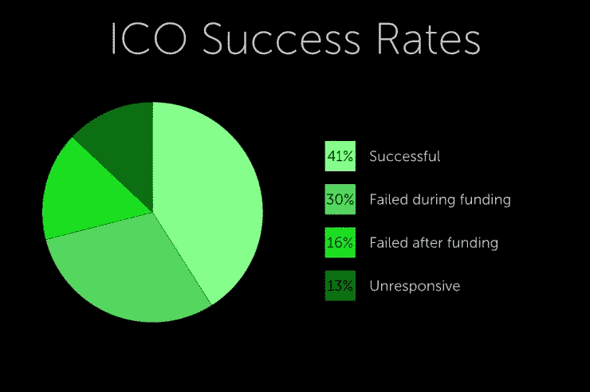
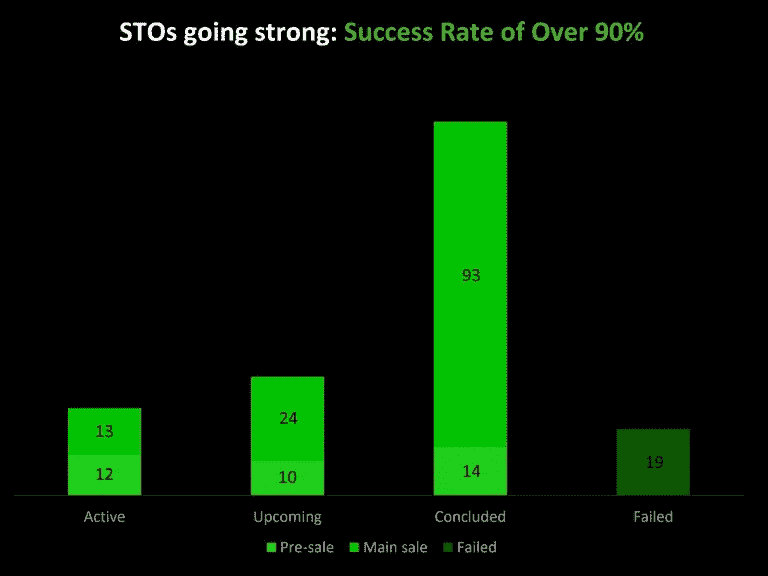
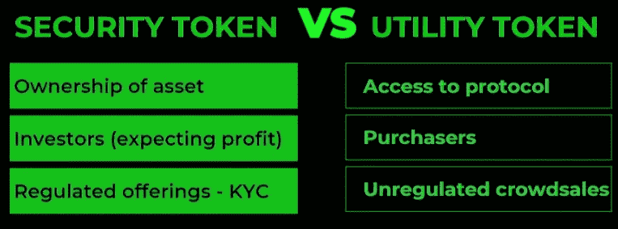

# ICO 到 STO 的进化完成了。那么，有什么区别呢？

> 原文：<https://medium.com/hackernoon/ico-to-sto-evolution-is-complete-so-whats-the-difference-b45942408c03>

在区块链行业，现在有很多关于用一种新的、更合法的吸引投资的方法——STO——取代 ICO 的讨论。然而，这绝对不是什么全新的东西。在 ICO 的全盛时期，用证券代币进入市场并不流行，即使是现在，许多项目和投资者自己也并不总是理解其中的区别。在这篇文章中，我将解释 STO 和 ICO 的根本区别。

为了理解安全令牌和实用令牌之间的区别，有必要理解它们的本质，最重要的是，它们的用途和用例。

公用令牌的原则是让其持有者直接访问发行令牌的公司的产品和服务。此外，重要的是要理解，作为一种工具，它并不意味着作为一种投资。系统内必须有特定的用例；在某些情况下，对产品或服务的折扣或奖励是可能的，但也仅限于项目本身。

例如，这种类型的代币并不赋予一个人分享公司利润的权利。因此，假设公用代币不属于证券法的管辖范围。这极大地促进了项目走向 ICO 的过程，特别是在法律方面，极大地扩大了潜在代币购买者的基础。

然而，可以假设，随着创业公司的发展，这种令牌的价格(和价值)可能会随着对产品或项目服务需求的增加而增加。因此，代币的效用并没有阻止项目从代币销售中收取巨额费用，而是允许代币的购买者在二级市场上转售代币，从而增加或损失资本。

然而，大量的诈骗艺术家很快被吸引到这个行业，这不仅适用于那些以这样或那样的方式试图欺骗和/或窃取项目的人。项目本身往往会带着相当虚幻的想法去找 ICO，只有一个目的——吸引和募集投资。然后，在实践中，普通投资者对此根本没有保护。许多项目没有实现他们既定的计划或承诺，有些项目干脆完全消失或放弃进一步发展。

在结束我对 ICO 的讨论时，我必须说我认为这种为项目筹集资金的方法有其存在的充分理由，并且很可能会以这样或那样的形式继续下去。好的、可靠的项目，加上正确的记号经济学和市场营销，将会在他们自己的社区中继续繁荣，并且总会有他们的投资者。此外，肯定会有一些项目，对于这些项目来说，公用事业权标是一种合适的投资模式，而且它在本质上是真正实用的。事实上，这种情况已经逐渐让市场开始寻找一种折中方案，通过保护投资者的利益来让他们受益。

很明显，所有市场参与者都在从 ICO 模式转向 STO 模式以吸引投资。这个问题是在一次与 Artur Boytsov 的私人谈话中提出的，Artur boyt SOV 是 Priority Token(T1)的副总裁，根据发表在[黑客正午](https://hackernoon.com/top-ico-marketing-agencies-pr-firms-cb2b2deec52a)和[比特币主义者](https://bitcoinist.com/top-10-ico-marketing-agencies/)的评估，该机构是前三大机构之一。阿图尔说，STO 或 IEO 的今天正显示出项目及其投资者的优异成绩。

# STO 模式出现了

从筹款的幕后，STO 现在已经出现在舞台上。同样，在 ICO 的活跃激增期间，市场上出现了安全令牌，这种吸引投资的方法已经讨论了很长时间。然而，在很大程度上，直到最近，公司更多地表达了对 ICO 的偏好。坦率地说，这通常可以解释为不愿意为投资者提供重大利益(我将在后面谈到)，同样重要的是，不愿意经历更复杂的法律框架，如果你正确地进入 STO，这是必需的。

**那么，什么是安全令牌产品，什么是安全令牌？**

事实上，安全代币可以等同于证券。例如，它们可以赋予所有者所有权，并受到相应的监管。因此，在美国，SEC 裁定证券代币与标准证券受相同的联邦法律管辖。

这种类型的令牌可以由公司资产支持，例如股票、收取股息的权利或投票权。而且，对于相信该公司的投资者来说，这无疑是一种更透明、更安全的投资方式。

由于金融监管机构将这些类型的代币视为证券，因此它们的持有者受到了保护，最重要的是，他们被赋予了物权。

# 安全令牌有三种主要类别:

## 股票代币

当用这种类型的代币发行 STO 时，每张代币相当于公司的股票，从而给予所有者平等的投票权和分红权；这些所有者被认为在各方面都与实际股东平等。

## 储备资产代币

这些适合于销售实物商品的组织，如房地产、黄金等。因此，代币可以受到基础资产储备的保护。

## 债务代币

与股票或资产的代币化相反，这种代币证券本质上是一种债务本票，随后从投资者手中回购这些代币。

如你所见，这些分类与经典股票市场非常相似。此外，更多的时候，STO 向他们的投资者提供真正的利益:股息、股权、投票权、利润分配权、赎回权(回购权)等等。

# 谁投资 STO？

除了代币的功能之外，它们还有几个非常重要的特征，其中一些将通过 STO 发行的代币与通过 ICO 发行的代币区分开来。

首先，安全令牌必须在适当的金融机构注册，包括在发行者所在国家和潜在销售地区拥有管辖权的机构(例如，美国的 SEC)。这是一个主要优势，因为它为投资者提供了额外的安全性和透明度。然而，为了遵守这个市场的财务条例和规则，这大大增加了项目的法律费用。

其次，证券代币在监管方面等同于证券的事实限制了可以投资这种代币的投资者类型。事实上，只有合格的投资者才能投资。

这缩小了 STO 上市的可能性。大多数 ICO 都是面向吸引最大数量的投资者，没有资本或地理限制。另一方面，平均而言，每个 STO 投资者的投资额要比 ICO 投资者大得多。与此同时，一些 STO 投资者的名字如此出名，以至于他们的资金支持这一事实本身就可能成为一家初创公司的绝佳媒体机会。

这种更为合法的投资类型总是会导致一些限制，这些限制对于普通大众或小型私人投资者来说意义重大，但对于专业投资者来说，已经是家常便饭了。

# 另一个选择——IEO

ICO 的另一种替代方案正在出现——首次公开发行(IEO)。这些吸引投资的方法之间的主要区别在于交易所的关键作用，它从最有前途和最可行的项目中进行选择。15 家加密交易所已经以某种方式开始在他们的网站上使用 IEO 投资模式。

对于 ICO，代币可能不会立即在交易所上市，而是在代币销售完成几个月后上市。就 IEO 而言，交易所从一开始就是替代代币销售组织者的重要合作伙伴。因此，组织者发行代币并将其发送到交易所。反过来，交易所将数字资产分配给感兴趣的投资者，这些投资者是交易平台的验证用户。

与通常的 ICO 投资者通过智能合约发送资金不同，IEO 参与者需要在交易所注册(通常需要经过验证)，将资金转移到一个账户，一旦代币销售开始，就直接从交易所购买硬币。

交易所和 IEO 的组织者之间的协议可能包含各种条件:每个投资者的代币最大销售量、预定的资产价格、硬上限和软上限、销售的百分比和交易大厅的固定金额、营销成本的分配等。

你可以在我为 Hacker Noon 写的[文章](https://hackernoon.com/initial-exchange-offering-the-next-popular-fundraising-scheme-in-crypto-aa1c58679b98)中读到更多关于 IEO 的内容，也可以在 Artur Boytsov 的[文章](https://cryptopotato.com/7-must-have-keys-for-a-project-looking-to-conduct-an-ieo/)中做更多的研究。