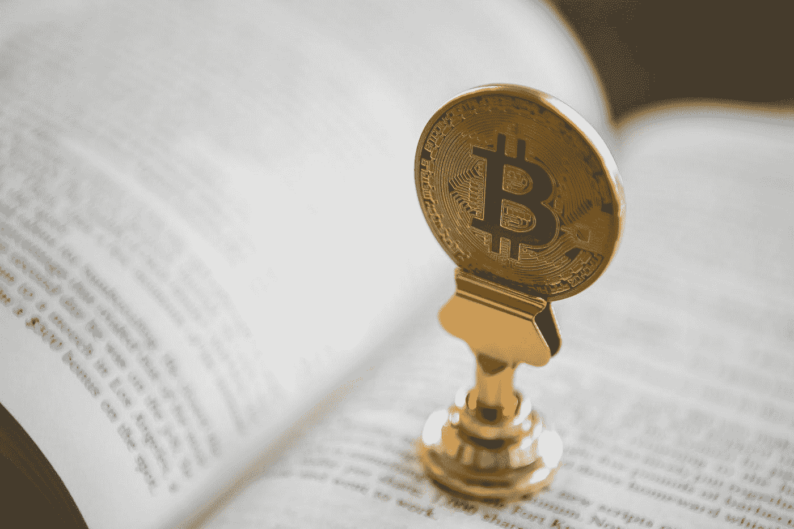
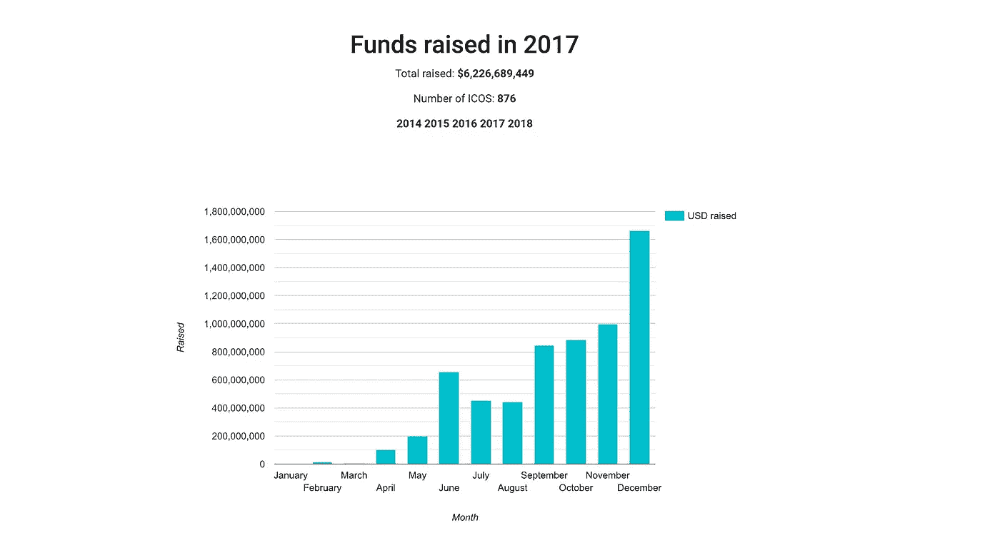
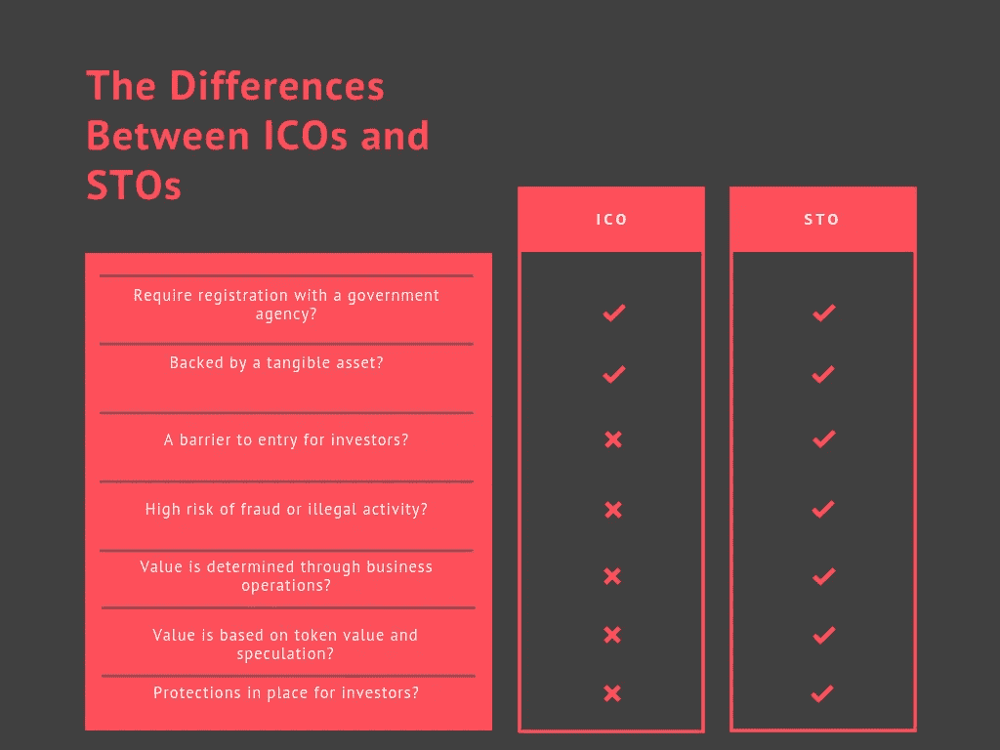

# ICO vs STO:所有你需要知道的关于加密世界的新筹款方法。

> 原文：<https://medium.com/hackernoon/ico-vs-sto-all-you-need-to-know-about-the-new-fundraising-method-in-the-crypto-world-54a1a43a08d6>

目前在加密社区中有一场激烈的争论。这场争论围绕着一种为区块链项目筹集资金的新方法的出现，这种方法被称为 T2 证券发行(STO)。

有些人认为，STOs，最终将**完全** **取代**最初最初的硬币发行(ICOs)。其他人认为，目前形式的 sto 实际上剥夺了通过 ICO 提供的许多原始的积极因素。

在本指南中，我们将探索 ico 和 sto 之间的主要区别，以便您可以了解加密领域的新筹款方法。

## **什么是 ICO？**

首先，我们将从简要解释什么是 ICO 开始。
在传统投资领域，ICO 非常类似于 IPO。ico 本身是一种筹资方式，寻求建立新产品或服务的公司将寻求外部投资来帮助他们的风险投资。运营 ICO 的公司将通过各种形式的营销来实现这一目标。

作为投资的交换，投资者将获得一定数量的加密货币[令牌，这些令牌是 ICO 独有的。投资者可以使用传统的法定货币或其他代币。](https://hackernoon.com/tagged/cryptocurrency)

投资者买入该项目，希望代币的价值会从基价开始上涨。然后，他们会希望以后交易代币来获利。

公司将主要使用 ICO 来避免正常筹资方法所涉及的严格监管程序(既昂贵又耗时)。

ICO 的结构也有多种不同的方式。每个代币可以有一个正常的统一价格，在 ICO 期间不会改变，或者单个代币的价值可以在 ICO 期间根据在该轮融资中收到的金额增加。

对于一个企业来说，发布 ICO 非常简单，因为出于某种考虑，有许多不同的平台愿意主办你的 ICO 发布会。

ICO 提供的便利和自由导致了区块链行业的繁荣，2017 年，通过 ICO 筹集的资金超过了 62 亿美元。

ICO funds raised at 2017 by ICOs. Stats by [ICOdata](https://www.icodata.io/stats/2017)

像任何事情一样，总有一个陷阱。由于 ICO 不受监管的特性，它们非常容易受到欺诈活动的影响，大量投资者被鲨鱼式的企业骗走了钱，这些企业会创建 ICO，然后拿钱走人。此外，由于没有对 ico 的监管，被盗的钱几乎永远无法追回。

这些统计数据非常糟糕。根据 [Satis Group LLC](https://satisgroup.io/) 的一项研究，他们分析的 81%的 ico 被发现是骗局。除此之外，6%的人失败了，5%的人陷入黑暗，只有 8%的人在交易所交易。这对投资者来说不是很好的机会。

这也是大量投资者一直对投资 ico 犹豫不决的原因之一。他们觉得被骗的风险很高，以至于不能保证潜在的回报。

## **什么是 STO？**

现在，我们将简要地详细介绍什么是 STO。

每当解释什么是 STO 时，解释什么是安全性总是很重要的。

> *“就金融而言，证券是一种证书或其他金融工具，具有内在的货币价值。然后，这些证券可以由交易所进行交易，交易所将作为交易的经纪人，或者它们可以直接在点对点之间进行交易。这些证券然后被分为两个子类，股权和债务证券。这实际上是拥有一家公司的一部分，而不是实际上把它据为己有。”*

公司利用这种方式向投资者提供部分业务，以换取短期现金注入，帮助他们实现最新目标和计划。投资者也有权获得利润、股息和利率。

> 因此，安全令牌是一种加密令牌，它可以授权所有者分享企业利润、企业本身的股份或其他形式的奖励，以换取他们自己的钱。

安全令牌也必须满足 Howey 测试的要求，才能被视为安全令牌。这些要求是在 [SEC 诉 W.J. Howey Co. 1946](https://www.casebriefs.com/blog/law/securities-regulation/securities-regulation-keyed-to-coffee/definitions-of-security-and-exempted-securities/securities-and-exchange-commission-v-w-j-howey-co/) 一案中确立的。

**要求如下:**

*   这涉及到金钱的投资。
*   人们期望从投资中获利。
*   这笔钱投资于一家普通企业。
*   利润来自发起人或第三方。

s to 总是由某种形式的有形资产支持，这有助于防止投资者成为欺诈性商业行为的牺牲品。
由于 sto 被归类为证券，因此它们也受发行所在国家和投资者所在国家的证券法规的约束。例如，如果你在美国开了一家 STO T4，你有一个来自英国的投资者，你必须遵守美国证券交易委员会(SEC)和英国金融行为监管局的规定。

**在美国，您需要向**[**SEC**](https://www.sec.gov/)**注册，这意味着您需要向他们提供以下信息:**

*   对贵公司财产和业务目的的描述。
*   你所提供的证券的描述。
*   关于你的管理结构的信息。
*   由独立会计师确认的公司财务报表。

这意味着在启动 STO 时，您需要寻求**法律支持**来帮助您正确理解所需的监管实践。

所有这些法律上的繁文缛节可能会很昂贵，然而，它也为寻求投资的企业提供了保护。**由于 STO 的投资者必须经过身份识别，因此投资者利用您的业务进行非法货币活动的可能性较小。这有助于维护你企业的形象，并能防止你陷入任何法律纠纷。**

sto 的法律后果意味着投资者的进入会有一点障碍。在美国，当你在证券交易委员会注册 STO 时，你需要申请豁免以寻求投资。目前，所有的 sto 都是根据[法规 D 豁免](https://www.investopedia.com/terms/r/regulationd.asp)注册的。这意味着在美国，只有合格的投资者才能向你的企业投资。

尽管如此，通过 s to 向投资者提供你的业务仍然比在你的国家的股票市场进行首次公开募股的传统方法更具成本效益。与传统方法相比，管理成本要低得多，需要跨越的监管关卡也少得多。

此外，当你有正确的设置，你有你的 STO 正确营销，安全令牌可以非常容易地在你选择的交易所交易。它们比传统的公司股票要简单得多，也比 ico 更安全。

sto 也有助于为密码世界提供更好的声誉。正如我们之前提到的，这是因为目前 ico 是欺诈者的温床。由于 sto 更受监管的性质，他们使得代币发行对投资者来说更可信。预计这将有助于代币发行运动在未来扩大规模。

这些因素导致许多人预测 sto 将在未来几年取代 ico。另一些人认为，它们违背了 ico 的初衷，因为它们受制于法规和繁文缛节。

sto 已经为企业带来了一些大动作。例如，crypto-exchange [LXDX](https://www.lxdx.co/) 提供了 10%的业务，可以通过 500 万个安全令牌购买。他们以每枚 1 欧元的价格出售这些代币，这为他们带来了 500 万美元的收入。随着时间的推移，我们会看到比这大得多的 sto，时间会证明，他们是否能够超过 filecoin 筹集的资金。

# **ico 和 sto 的区别:**

现在您已经读到这里，您可能意识到 ico 和 sto 之间有很多不同之处，尽管它们有相似之处。因此，我们制作了一个简单易懂的表格，清楚地展示了这两种融资方式的异同。

