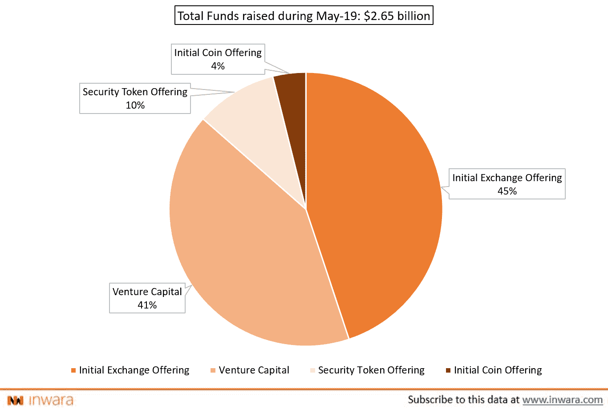
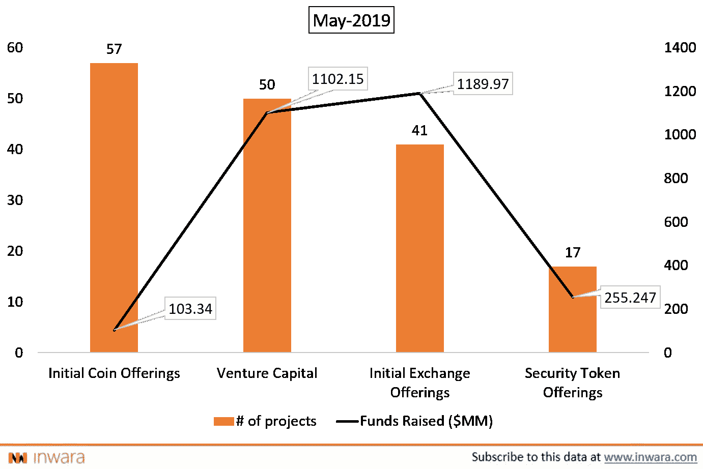
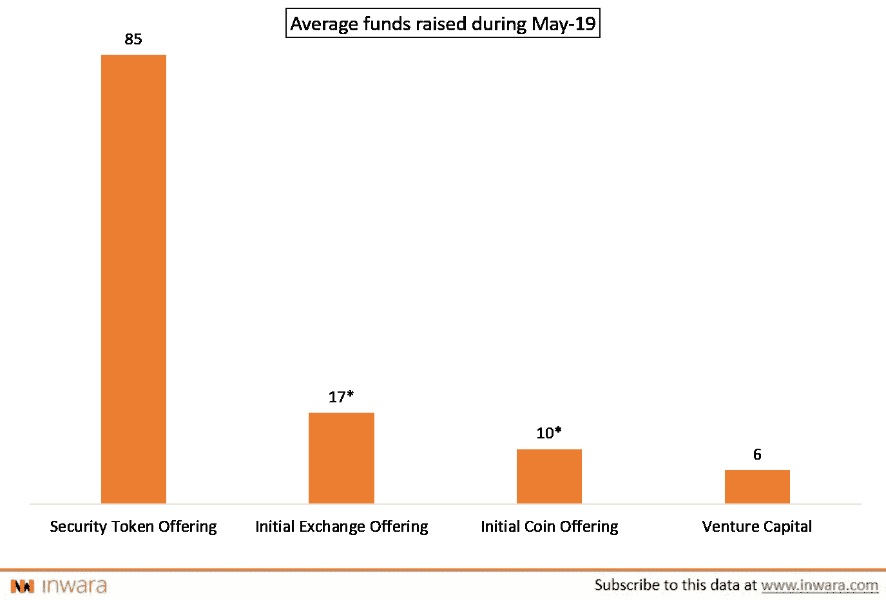

# IEO Vs STO Vs ICO；令牌化募捐的比较。哪个更好？

> 原文：<https://medium.com/hackernoon/ieo-vs-sto-vs-ico-a-comparison-of-tokenized-fundraising-which-one-is-better-ab71b1c2a32b>

Photo by [Farzad Nazifi](https://unsplash.com/@euwars?utm_source=unsplash&utm_medium=referral&utm_content=creditCopyText) on [Unsplash](https://unsplash.com/search/photos/startup-business?utm_source=unsplash&utm_medium=referral&utm_content=creditCopyText)

最初，只有 ICO，后来出现了 sto(所谓的 ICO 杀手)，现在又有了 ieo。区块链和加密领域似乎并不缺少模糊相似的首字母缩写词。尽管相似，但每个缩写都代表了不同的筹资模式，有其独特的特点。

本质上，所有的筹资模式都允许企业家/组织通过利用互联网和区块链技术直接从投资者那里筹集资本。

[Source](https://www.inwara.com/report/inwara-monthly-report-may-2019)

> 根据 InWara 的[月度报告](https://www.inwara.com/report/inwara-monthly-report-may-2019)，利用这些筹资模式的企业家/组织已经筹集了多达 15.5 亿美元——接近 2019 年 5 月区块链和加密领域筹集的总资金的 59%。

*那么让我们简单地深入了解一下每个模型的意义。*

**首次公开募股(ICO)**——第一批脱离传统风险投资或首次公开募股方式的融资模式之一。ICO 的组织者发行加密货币代币(传统上是公用代币),在线出售给投资者以换取资金。投资者可以使用这些“公用事业代币”来获得 ICO 组织者承诺开发的产品/服务。通常，ICO 组织者是区块链和加密初创公司，旨在将他们的产品带到这个行业。

ICO 模式取得了巨大的成功(就资金筹集而言，有效性仍有待评判)，迄今为止，ICO 项目已经筹集了惊人的 250 亿美元，其中超过 95%的资金是在过去两年中筹集的([来源](http://inwara.com/))。但是唉，ICOs 不可思议的成功并没有持续多久。在众多 ICO 退出骗局和心怀恶意的 ICO 组织者的推动下，投资者很快对 ICO 失去了兴趣。除此之外，ico 在美国、中国和韩国等国家面临重大监管挫折。

[**证券代币发行**](https://www.inwara.com/report/security-token-offerings)**【STOs】**—顾名思义，STO 向其投资者提供证券代币，不同于 ico 中的公用事业代币。*因此，在我们讨论什么是安全令牌之前，什么是安全令牌？*

证券是一种金融工具，代表其基础资产的所有权。因此，安全令牌由持有一定货币价值的基础资产支持。这不是什么革命性的东西，证券已经存在很长时间了，随着数字时代的到来，像股票这样的证券投资开始获得数字证书。

那么什么是安全令牌呢？

想象一种传统的“安全”，但由加密令牌表示并存储在区块链上，这就是安全令牌。

**首次公开募股(IEOs)——**令牌化筹资经济的最新创新。从某种意义上说，ieo 与 ico 非常相似，它们包含许多相同的核心原则，如投资者进入门槛低、使用非资产支持的公用事业令牌等。

但关键的是，ieo 是由第三方组织(通常是加密交易所)发起的，而不是由项目本身发起的。这些加密交换实际上成为了 IEO 项目的“发射台”。*想象一下“Kickstarter”要不是区块链和加密项目。*

这就是主要的符号化筹款模式的要点。那么，彼此之间的竞争如何呢？正如你已经在图 1 中看到的，ieo 是一股不可忽视的力量，sto 紧随其后。另一方面，ico 的日子要好过得多。

[Source](https://www.inwara.com/report/inwara-monthly-report-may-2019)

> 有趣的是，57 个 ICO 项目仅筹集了 1.03 亿美元，虽然这不是一个小壮举，但与 IEOs 筹集的 11.8 亿美元和 sto 筹集的 2.55 亿美元相比，这就相形见绌了。

[Source](https://www.inwara.com/report/inwara-monthly-report-may-2019)

平均而言，sto 的表现优于其他任何筹资模式。对于 sto 来说，每个项目平均筹集的资金为 8，500 万美元，而对于 ieo 和 ico 来说，这个数字仅为 1，700 万美元和 1，000 万美元。有趣的是，这三种模式的表现都优于传统风险投资。