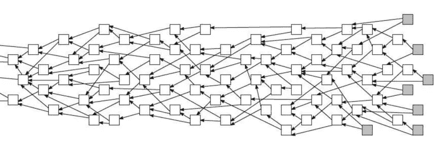
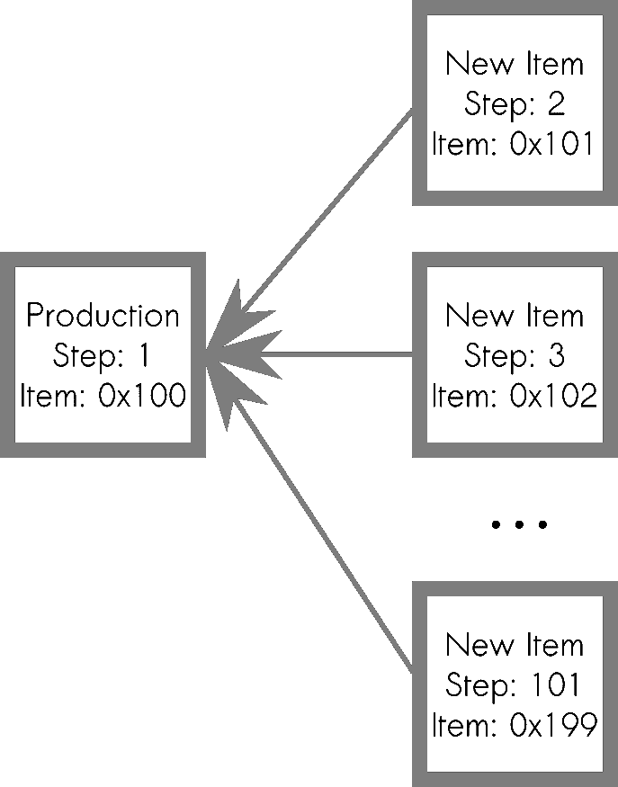
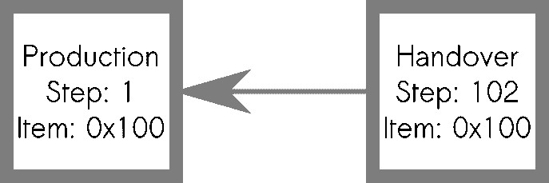
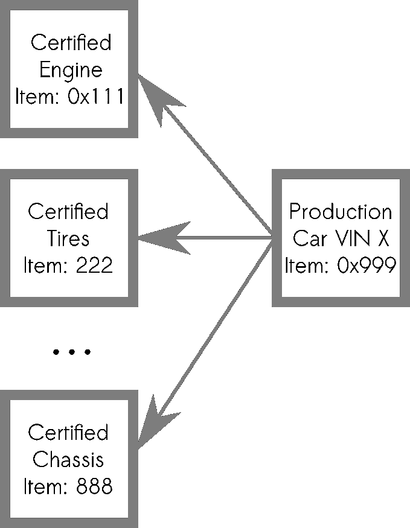

# 在以太坊区块链上实现供应链

> 原文：<https://medium.com/hackernoon/implementing-a-supply-chain-in-the-ethereum-blockchain-dcc91ea718ab>


Photo by Tom Fisk from Pexels

> 当消费者购买丰田汽车时，他们不仅仅是购买轿车、卡车或货车。他们信任我们公司。—丰田章男

# 介绍

供应链一直被排在应该被区块链技术破坏的用例的前列。其主要原因是，供应链是由参与者组成的大型分布式网络，彼此不信任，欺诈盛行。没有一个行业参与者可以真正声称确切地知道他们产品的生命周期，从摇篮到摇篮。协调来自供应链所有组成部分的数据确实很难，而且抓住提供虚假信息的人的几率很低。

在 [TechHQ](https://www.techhq.io/) 中，我们参与了许多供应链解决方案的设计，在本文中，我将展示一个基于区块链的供应链数据库的简单[实现，其中的数据可以被认为是完整和正确的。](https://github.com/HQ20/SupplyChain/tree/cce7ea154e7dec9972183b717d4360a25a42fc13)

# 概念设计

我们解决方案的核心是将供应链的数据表示为有向无环图。许多人建议使用 ERC721 令牌来完成这项任务，乍一看，这似乎是个好主意。ERC721 令牌具有唯一可识别性和不可分割性，因此很容易认为一个令牌可以代表一个通过供应链转手的零件。

然而，ERC721 令牌非常侧重于移交部分，而不是提供所代表的项目的历史的简单使用。另一个问题是，尽管 ERC721 令牌是不可分割的，但供应链通常处理总是可分割的原材料，以及太麻烦而无法单独跟踪的成批物品。



Figure 1: A Directed Acyclic Graph

在这个解决方案中，我们将脱离物理项目作为令牌的表示，而是将重点放在这些物理项目的生命周期上，包括对它们进行分区和组合。我们的基本数据元素将是一个**步骤**，它将代表某个特定时间某个项目的事件，该项目是某个供应链的一部分。一些示例步骤可能是:

*   项目的生产。
*   专家对某一项目的鉴定。
*   项目的装运。
*   生产蓝图生产物品。
*   蓝图的更新。
*   将原材料转变成不同的产品。
*   物品的销毁或回收。

在一个成熟的解决方案中，每一步都会记录相当多的数据点，但是在这个例子中，我们将只关注其中的三个。

1.  按顺序分配的唯一步骤标识符。
2.  步骤引用的项目的唯一标识符，由用户选择。
3.  紧接在被创建的步骤之前的步骤。

项目标识符指的是一个物理项目，如果项目本身发生了实质性的变化，它将从它的引用开始一步一步地改变。例如，一批物料可能具有 0x100 标识符，然后从该批物料中，我们可以生产 100 件标识符为 0x100 到 0x199 的物料。所有这些生产出来的产品在供应链中都有自己的步骤，所有这些产品都指向最后一个已知的步骤 0x100，即用于生产它们的材料。



Figure 2: Partition

一个步骤并不总是意味着一个新的项目标识符。在前面的例子中，假设在制造所有这些零件的过程中有大量的剩余材料，这些剩余材料被卖给了其他公司。将为 0x100 创建一个新步骤来表示这种换手，它将指向 0x100 的最后一个已知步骤。任何与项目相关的新事件必须始终指向其最后一个已知步骤。



Figure 3: Transformation

组合的行为是相似的，如果几个项目被组合，那么将会创建一个步骤，该步骤的标识符不同于所有这些项目，并且所有这些项目都是前面的步骤。



Figure 4: Composition

这些简单的规则创建了一个有向无环图，可以很容易地向后遍历，找到一个项目的生命周期，回到它的原材料。通过为曾经创建的所有项目保留最后步骤的索引，我们还可以向前遍历图形。有了这两个动作，我们就有了整个供应链的完整视图，从任何物品开始，找到所有其他相关物品及其历史。

在我们开始实现之前，重要的是要注意为什么这是一个区块链应用程序，以及它与仅仅在数据库中记录所有这些数据有什么不同。

该解决方案不支持更改或删除事件，它是一个由分布式区块链保证不会被篡改的仅附加数据库。存储在该数据库中的所有信息也是经过签名的，因此任何引入虚假信息的恶意行为者都需要考虑到，虚假信息将永远与他的标识符相关联。最后，由于区块链是分布式的和抗失败的，一些对平台失去兴趣的利益相关者不会损害其有效性。

简而言之，这一解决方案成为一个易于使用、值得信赖和强大的系统，用于大规模跟踪供应链。我们可以用大约一百行代码来构建原型。

# 履行

SupplyChain.sol 的数据结构仅限于:

1.  普通合同。
2.  表示步骤的结构，它保存项目、引用和步骤创建者。
3.  创建的步骤总数的计数器。
4.  创建的所有步骤的映射。
5.  指向每个项目最后创建的步骤的映射。

```
pragma solidity ^0.5.0;import "openzeppelin-solidity/contracts/math/SafeMath.sol";/**
* @title Supply Chain
* @author Alberto Cuesta Canada
* @notice Implements a basic compositional supply chain contract.
*/contract SupplyChain {
   using SafeMath for uint256; event StepCreated(uint256 step); /**
    * @notice Supply chain step data. By chaining these and not 
    * allowing them to be modified afterwards we create an Acyclic
    * Directed Graph.
    * @dev The step id is not stored in the Step itself because it
    * is always previously available to whoever looks for the step.
    * @param creator The creator of this step.
    * @param item The id of the object that this step refers to.
    * @param precedents The step ids preceding this one in the
    * supply chain.
    */
   struct Step {
       address creator;
       uint256 item;
       uint256[] precedents;
   } /**
    * @notice All steps are accessible through a mapping keyed by
    * the step ids. Recursive structs are not supported in solidity.
    */
   mapping(uint256 => Step) public steps; /**
    * @notice Step counter
    */
   uint256 public totalSteps; /**
    * @notice Mapping from item id to the last step in the lifecycle 
    * of that item.
    */
   mapping(uint256 => uint256) public lastSteps;
```

SupplyChain.sol 的方法仅限于:

1.  一种附加新步骤的方法，该方法遵守项和引用项的规则，并更新计数器和索引。
2.  一个帮助器方法，用于确定一个步骤是否可以追加到。
3.  从 step 结构中解包引用的帮助器方法。

```
 /**
    * @notice A method to create a new supply chain step. The 
    * msg.sender is recorded as the creator of the step, which might
    * possibly mean creator of the underlying asset as well.
    * @param _item The item id that this step is for. This must be
    * either the item of one of the steps in _precedents, or an id
    * that has never been used before.
    * @param _precedents An array of the step ids for steps
    * considered to be predecessors to this one. Often this would 
    * just mean that the event refers to the same asset as the event 
    * pointed to, but for other steps it could point to other
    * different assets.
    * @return The step id of the step created.
    */
   function newStep(uint256 _item, uint256[] memory _precedents)
       public
       returns(uint256)
   {
       for (uint i = 0; i < _precedents.length; i++){
           require(
               isLastStep(_precedents[i]), 
               "Append only on last steps."
           );
       }
       bool repeatInstance = false;
       for (uint i = 0; i < _precedents.length; i++){
           if (steps[_precedents[i]].item == _item) {
               repeatInstance = true;
               break;
           }
       }
       if (!repeatInstance){
           require(lastSteps[_item] == 0, "Instance not valid.");
       }

       steps[totalSteps] = Step(
           msg.sender,
           _item,
           _precedents
       );
       uint256 step = totalSteps;
       totalSteps += 1;
       lastSteps[_item] = step;
       emit StepCreated(step);
       return step;
   } /**
    * @notice A method to verify whether a step is the last of an 
    * item.
    * @param _step The step id of the step to verify.
    * @return Whether a step is the last of an item.
    */
   function isLastStep(uint256 _step)
       public
       view
       returns(bool)
   {
       return lastSteps[steps[_step].item] == _step;
   } /**
    * @notice A method to retrieve the precedents of a step.
    * @param _step The step id of the step to retrieve precedents
    * for.
    * @return An array with the step ids of the precedent steps.
    */
   function getprecedents(uint256 _step)
       public
       view
       returns(uint256[] memory)
   {
       return steps[_step].precedents;
   }
}
```

# 测试

在区块链，不变性也意味着你的错误会永远困扰着你，这就是为什么我会对我的合同进行彻底的测试。对于 SupplyChain.sol，我很满意这一组 9 个测试，它们确保了有向无环图的构建和查询。您可以仔细阅读 HQ20 github 资源库，了解关于它们的详细信息。

```
Contract: SupplyChain
    Steps
      ✓ newStep creates a step. (90ms)
      ✓ newStep creates chains. (160ms)
      ✓ newStep maintains lastSteps. (121ms)
      ✓ append only on last steps (107ms)
      ✓ newStep allows multiple precedents. (136ms)
      ✓ item must be unique or the same as a precedent. (114ms)
      ✓ newStep records step creator. (128ms)
      ✓ newStep records item. (165ms)
      ✓ lastSteps records item. (138ms) 9 passing (2s)
```

# 结论

在本文中，我们展示了以太坊供应链的一个简单而强大的实现。虽然以前的大部分实现都基于 ERC721 令牌，但是我们决定实现一个文档注册表，该注册表被构造为没有任何加密货币功能的有向非循环图。

我们选择的实现允许轻松地将供应链中的任何项目的生命周期恢复到它们的开始。前端可以插入更高级的查询和过滤功能。

我们的实施所服务的用例包括任何供应链中最棘手的一些问题，例如:

*   找到受缺陷生产流程影响的确切客户，以便进行有针对性的召回。
*   通过可靠的认证流程确保整个供应链的合法性。
*   供应链的透明度，以实现更高效、更可控的旅程。

当然，这是一个非常简单的方法，它只显示了一个有向无环图可以很容易地构建，并且它可以以一种有用的方式表示供应链。这个实现中的一个巨大缺口是，任何人都可以在任何项目的生命周期中添加步骤，只要他们知道项目标识符。在本系列的下一篇文章中，我们将构建基于角色的访问控制功能，这将使我们能够保护数据并准确地表示供应链中的物品移交。

# 谢谢

感谢[安东尼奥·费雷拉](https://www.linkedin.com/in/antonioferreira)对供应链行业的深刻见解，感谢[贝尔纳多·维埃拉](https://www.linkedin.com/in/obernardovieira/)对编写这个例子的支持。

*原载于* [*TechHQ*](https://www.techhq.io/8049/implementing-supply-chain-ethereum/) *博客。*