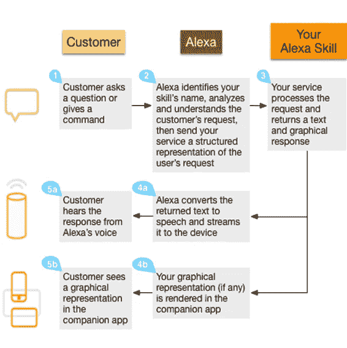

# 30 分钟提高你的语音应用！

> 原文：<https://medium.com/hackernoon/improve-your-voice-application-in-30-minutes-665b74d3b7ba>


Photo by [Lukas Blazek](https://unsplash.com/@goumbik?utm_source=medium&utm_medium=referral) on [Unsplash](https://unsplash.com?utm_source=medium&utm_medium=referral)

所以你决定为 Alexa 或谷歌开发一个应用程序？恭喜你！许多人从阅读技术文档、教程和示例代码开始。我知道三年前我为 Alexa 写第一个应用程序的时候我是这么想的。这是一个诱人的方法，尤其是对于一个技术爱好者来说。但是我想让你停下来，花 30 分钟来提高你的语音应用程序的客户参与度，然后再写一行代码。怎么会？和其他人一起测试你的语言模型。

在构建语音应用程序时，许多从语音中获取上下文的繁重工作都是由平台提供商完成的。Alexa 和谷歌提供了复杂的算法来完成这种语音转换。但是你仍然需要为他们的平台提供训练短语(**话语**)以及这些话语如何映射到你的代码的不同 JSON 请求(**意图**)的蓝图。花点时间与人一起测试这些训练短语，以确保你达到了客户的期望。



Customer interaction with your Alexa skill

让我们考虑建立一项技能，让客户订购比萨饼。我们希望支持几种不同的场景:

*   顾客应该能够告诉我们他们想要哪种比萨饼，包括比萨饼的大小和类型(“大香肠比萨饼”)
*   他们需要表明他们是来取披萨还是需要外卖
*   他们需要在听到总数后确认订单。

作为这项技能的设计者，我最初的方法是通过这些步骤的线性流程，语言模型有点像这样:

```
**OrderIntent** (in response to the question "What would you like to order?")
  "I'd like a {Size} {Type} pizza"
  "Can I get a {Size} {Type} pizza?"
  "Let's go with a {Size} {Type} pizza"
  "a {Size} {Type} pizza"
Note that {Size} would be small, medium, or large; {Type} would be pepperoni, sausage, Hawaiian, etc. If either of these is not provided, we'll prompt the user to fill the slot ("What size pizza would you like?")**DeliveryIntent** (in response to the question "Would you like pick-up or delivery?")
  "Pick up"
  "I'll pick it up"
  "Delivery"
  "I'd like it delivered"
  "Let's deliver it"**Yes/No** (built-in intents in response to the question "Your total is $x. Would you like to place this order?")
```

似乎很直接。语音平台提供了一种简单的方法来播种这些话语，这将向代码发送一个针对特定意图的 JSON 请求。但是声音是独特的。语音意味着自由、自然的对话。一个好的第三方应用程序应该允许人们以自然的、对话的语气完成他们的任务。你不需要花哨的工具或布局来测试你的模型— **只要观察人们如何用你的技巧交谈**。与您的团队或客户一起尝试。进入一个没有机器、没有先入之见、没有设计的房间，让人们完成一项任务。

我这么做是为了披萨技能——我和我的 5 个朋友和同事聊过，请他们用我的技能点一份披萨。当然，这并不是一轮严格的市场测试，但只用了 30 分钟，我就发现了我的语言模型没有涵盖的几个场景:

> 一大份浇有意大利香肠的
> 
> 我想要一个薄皮的大香肠比萨饼。
> 
> 我能点一个大的意大利香肠比萨饼和大蒜面包棒吗？
> 
> 我想要两个大的意大利香肠比萨饼，一大杯可乐和一些鸡翅
> 
> 我想要一个夏威夷比萨饼，但只要一半——另一半只要菠萝
> 
> 你有多大的比萨饼？

对顾客是想取披萨还是送披萨的回答与我的模型一致。这可能是因为问题指定了两个可用选项，使得提供创造性的回答不自然。值得注意的是，有一个人要求在这一步重复订单，强调添加这一意图并回复正在处理的订单详细信息可能是有用的。

现在，您可能不希望在初始版本中包含对所有这些交互的支持。但这些确实突出了客户在与你的技能互动时的期望。这些应该在你的语言模型、对话流中解决，作为欢迎信息的一部分来设定期望值(“我现在可以为你下披萨订单，如果你想定制订单，请直接致电我们的商店”)，或者作为帮助信息的一部分。我和顾客的一次谈话陷入了一个循环，因为顾客不停地问有什么尺寸的比萨饼(对此我反复说“对不起，我不明白你的意思。你能再说一遍吗？”).如果客户反复提到您的代码无法处理的问题，主动提供帮助是打破这种循环的一个好方法。

因此，下次你开始编写一个吸引人的应用程序，让人类与机器交流时，先花点时间，把重点放在人类方面。