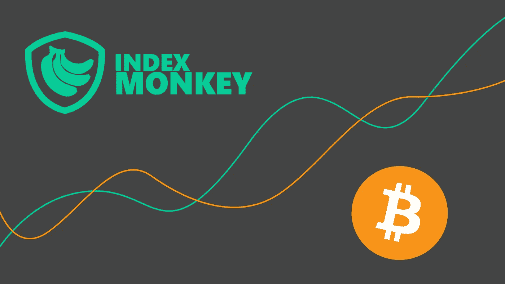
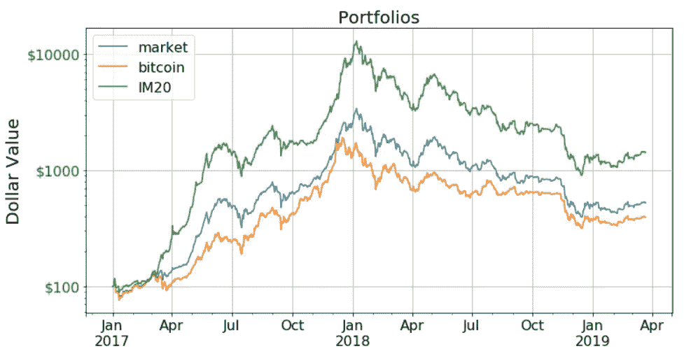
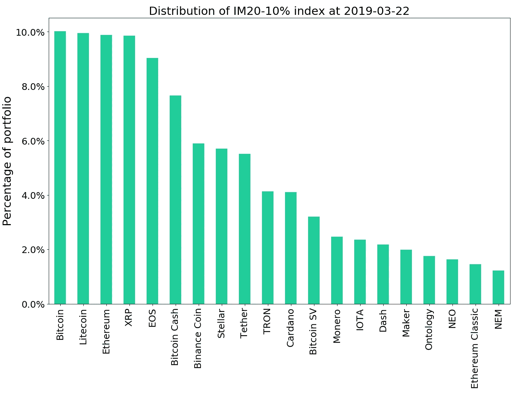
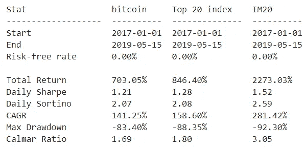
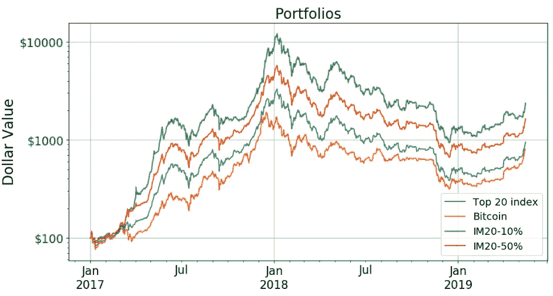
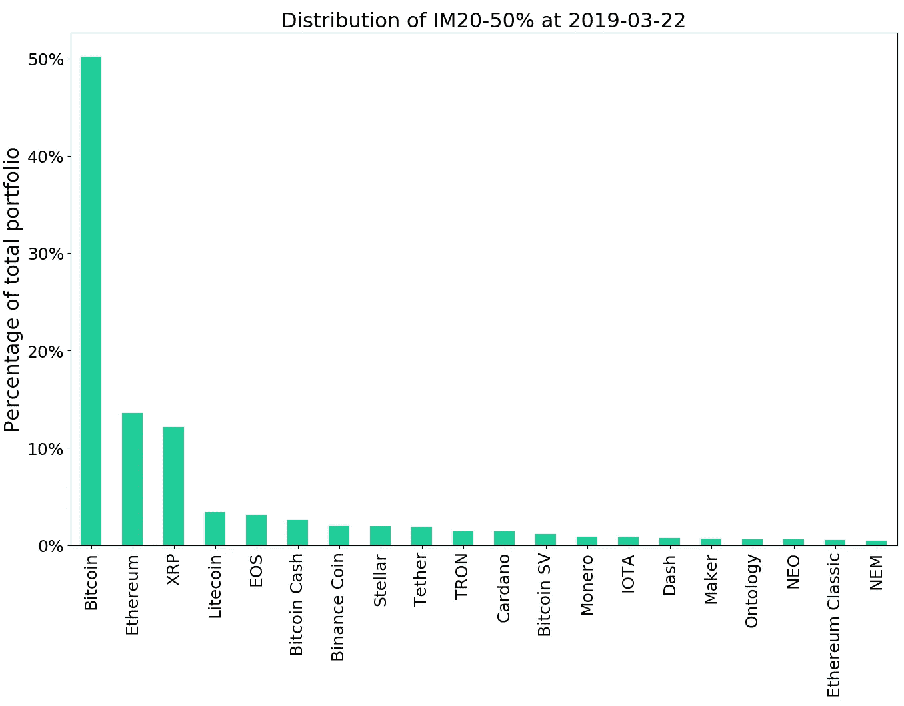
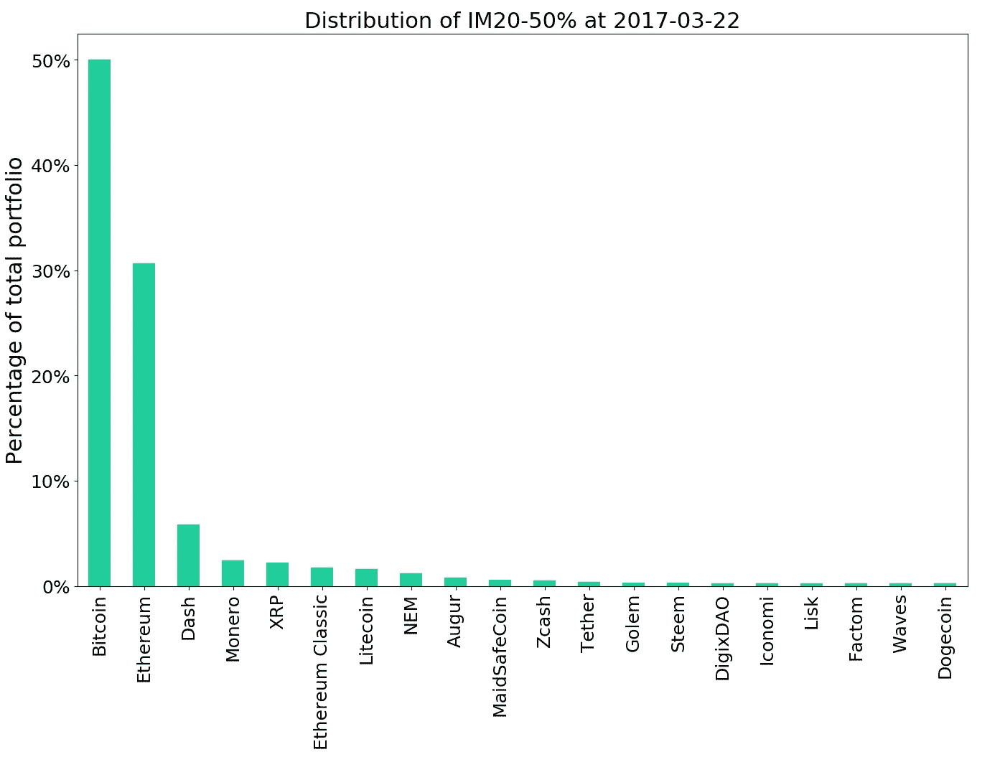
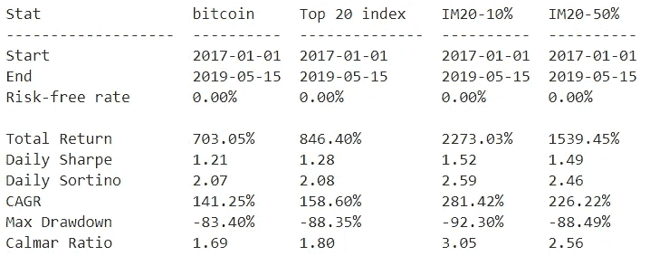

# 提高加密货币市场的回报。

> 原文：<https://medium.com/hackernoon/increase-returns-in-the-cryptocurrency-market-52f597cae72c>

我们将探索一个简单的解决方案，通过修改我们在上一篇文章中制作的加密货币指数来增加投资加密货币的回报。

> 请注意，自从上一篇文章以来，我没有包括新的数据。这是为了让感兴趣的人可以很容易地将其与之前的帖子进行比较。

在此之前的****一文中，我们探讨了一个基本指数可能是什么样子，以及它通常如何优于简单投资于单一资产，如比特币。它提供了不容易出现人为偏见的多样化，限制了风险因素。****

****但是，如果有人想在不涉及 24/7 主动管理的情况下增加指数的风险/回报，该怎么办？通常，这是通过为索引应用一些额外的规则来实现的。****

********

****Log scale sneak peek chart that was at the end of [the last post](https://hackernoon.com/why-a-crypto-index-wins-in-the-long-run-59f921ff4c14).****

# ****市值较小的资产****

****增加回报的一种方法是增加指数对较小市值资产的敞口。这意味着将资金从拥有大部分加密货币市场总价值的资产转移到拥有较少市场总价值的资产。****

****例如，在 2019 年 3 月 22 日，比特币持有约 50%的市场价值。这意味着它将持有反映市场的指数的 50%左右。****

****如果我们**限制每项资产**的最大百分比，然后**将差额**重新分配给其他资产，会发生什么？让我们从限制在 10%开始，看看会发生什么。****

********

****With 10% maximum per position in the index, the index is named IM20 for now.****

****该条形图显示，与比特币相比，更多的资金流向了市值更小的资产。如开始的回溯测试所示，这增加了回报率，因为 [*市值较小的资产往往回报率较高* s.](https://www.investopedia.com/terms/s/smallfirmeffect.asp) *****

********

****但是没有什么是免费的，包括更高的回报。你可能已经注意到最大提款高于市场。根据你衡量风险的方式，这可能会增加你的风险。但我们为这种风险获得了更高的回报。****

****因此，在这种情况下，风险和回报是密切相关的。为了进一步探究这一点，让我们看一下当天和当月的平均支出。除此之外，我们还将检查一个月内**的平均收益**是否上涨，以及一个月内的平均损失**是否下跌。******

********

****Market, Bitcoin, and IM20\. In that order.****

****现在，让我们看看当我们尝试同样的想法时，这是否成立，但我们将尝试 50%的限制，而不是 10%的限制，看看会发生什么。理想情况下，它的表现介于正常指数和 10%限制指数之间，这意味着它的风险/回报按照我们的预期进行调整。****

********

****现在让我们检查一下 50%的限制，以及这个指数的多样化是什么样的。与 10%的指数相比，这种差异是否会相当极端？****

********

****比特币在这方面处于领先地位，但较小的硬币也有自己的份额。正好 50/50，50%投资比特币，50%投资以下 19 个最大的项目。这种程度的多样化是我们的目标，在这种情况下，比特币的投资组合份额是 10%上限指数的 5 倍。****

****但是 50%的限制看起来很不一样，如果我们回到过去。上面的条形图显示了 2019 年 3 月 22 日的 50%限制指数。让我们回到两年前，看看它是什么样子。****

********

****在这里，我们看到以太坊以约 30%的投资组合领先于替代币，比特币仍占 50%。该指数表现如我们所愿，我们可以继续检查它的性能统计数据。****

********

****All the way to the right we can see the 50% limit index.****

****因此，总之，改变指数中头寸的最大百分比会对风险和回报产生影响。通过调整多样化水平，你可以随心所欲地让指数更具防御性或攻击性。****

****如果你想使用指数投资组合，请在 IndexMonkey.comT3[T5**免费加入我们的**。我们创建了一个仪表板，让您创建和管理自己的指数投资组合，自动化和免费。](https://indexmonkey.com/)****

********

****[https://indexmonkey.com/](https://indexmonkey.com/)****

> *****小企业效应基于以下研究(pdf): [来源](http://www.business.unr.edu/faculty/liuc/files/BADM742/Banz_sizeeffect_1980.pdf)。有更多最近的研究，但几乎所有的都是基于这个。****
> 
> ****在下一篇文章中，我将加入新的数据。在过去的两个月里发生了很多事情，我很好奇在回溯测试中会是什么样子。如果你想建议一些与指数相关的回溯测试主题，请发邮件给我****
> 
> ****这篇文章不是投资建议。你应该选择根据自己的条件，在你了解的资产和项目范围内进行投资。市场非常不稳定，这为短期和长期投资提供了机会，但在任何情况下都不能保证回报或结果。如果你决定投资，确保你已经彻底研究过，并且对你正在做的事情有信心。****