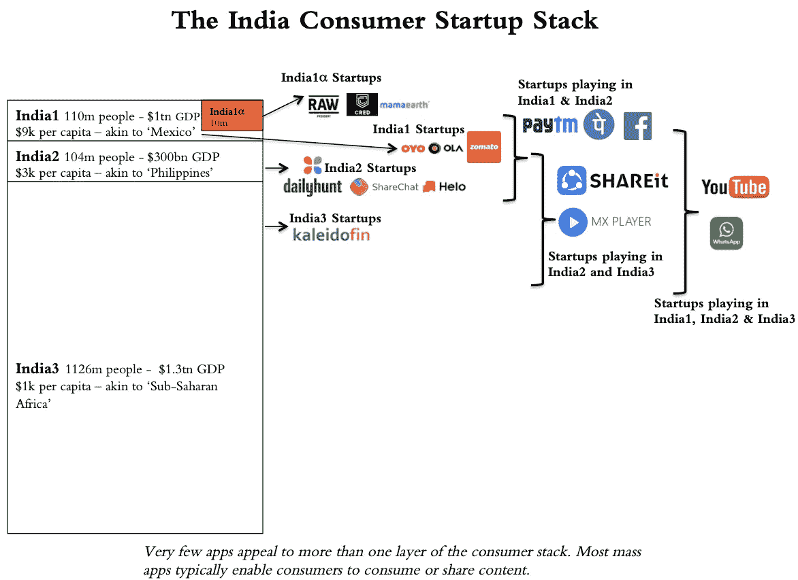
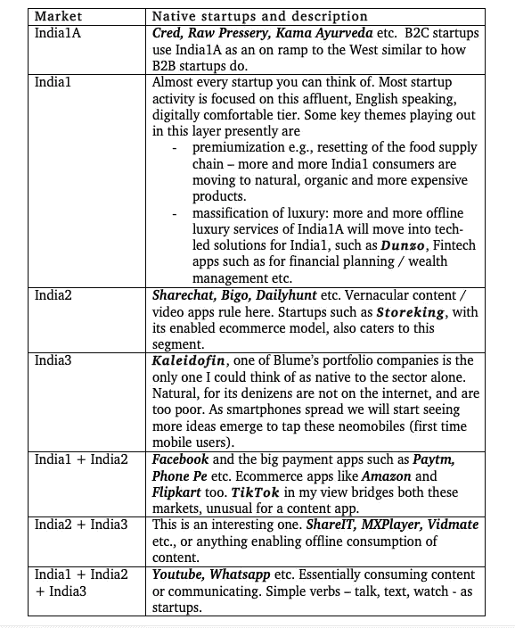
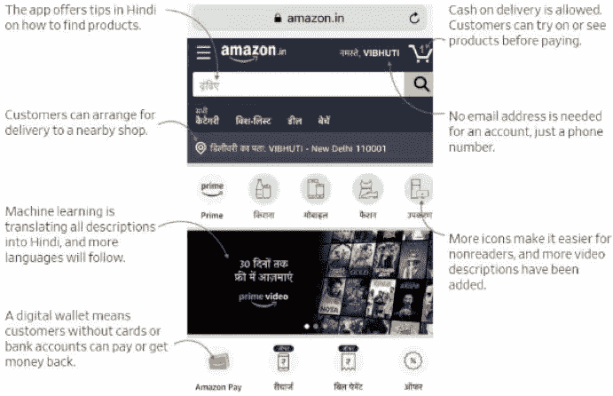

# 印度 1、鳄梨创业和产品市场契合度

> 原文：<https://medium.com/hackernoon/india1-avocado-startups-product-market-fit-dbfb7a8b2ef6>

我最近遇到了一款准约会应用的创始人，这款应用可以通过在活动中与陌生人见面来发现朋友。我们放弃了它们，主要是因为虽然我们可以看到它有可能在大都市或至少是我们大都市的富裕地区“起飞”，但我们看不到它在印度 2(即在二三线城市中不讲英语的不太富裕的印度)如何运作，从而扩大成为一种大众产品。我们问:在印度的小镇上，几乎每个人都认识每个人(至少在上层社会)，一个能够与陌生人互动的应用程序能工作吗？一种旨在从场馆收入中提成的收入模式会在较小的城市奏效吗？在这些城市，不需要营销的场馆可能屈指可数。

几乎所有的约会应用都是如此，这些应用都是印度本地的，印度是英语世界，像我们这样的人居住在地铁里。事实上，他们生活在一个更为罕见的世界里，我喜欢称之为印度阿尔法世界，一个冷榨咖啡和有机食品的世界，一个网飞和苹果设备的世界，一个尼科巴服装和 IB 学校的世界。我的年轻同事 Sanchita Bamnote 把迎合这个市场的一系列创业公司、Creds、Raw Presserys 和 MamaEarths 称为“鳄梨创业公司”，以象征奢侈的水果命名。

## **鳄梨创业公司和星巴克规则**

现在，奢侈品细分市场存在于大多数新兴市场。巴基斯坦、孟加拉国、尼日利亚、菲律宾都有自己的超级富豪，因此服务经济迎合了他们的需求。但印度与众不同之处在于富豪阶层的庞大规模，相当于中欧一些国家的规模。拥有约 1.1 亿人口的印度 1，甚至是拥有约 1，000 万人口的印度 1，000 万人口的印度 1，000 万人口的印度 1，000 万人口的印度 1，000 万人口的印度 1，000 万人口的印度 1，000 万人口的印度 1，000 万人口的印度 1，000 万人口的印度 1，000 万人口的印度 1，000 万人口的印度 1，都是巨大的市场，可以支撑这一类别的本土品牌的创造和发展。

这些本土品牌，无论是 Zomato、Oyo、Ola 等印度品牌，还是 Raw Pressery、Epigamia、TeaBox 等更为稀有的鳄梨初创企业，都发现向海外扩张远比向印度其他地区扩张容易。我喜欢把印度想象成法比安迪亚商店周围所有口袋的集合体，被圈在这个尽管武断的界限之内。(最近一次统计显示，T2 大约有 266 家法比安迪亚商店，包括在波莱奇和哈尔瓦尼等地；所以这不是最理想的标准，但应该大致如此)。同样，我把印度的七个星巴克城市视为印度 1 Alpha 的极限。除了这七个城市和它们的限制，鳄梨创业公司没有多少市场，很难找到[产品市场适合(PMF)](https://en.wikipedia.org/wiki/Product/market_fit) 。

## **印度可以被理解为一个四层消费者堆栈**

因此，看待印度的一个好方法是将其视为一个四级市场，每一级都能够支持一系列本土初创公司，这些公司努力向市场以外扩张。每个市场都有其独特的受众群体、价格敏感度、文化属性和竞争动态。产品在一个市场的市场适应性(以下简称 PMF)不会自动转化为在另一个市场的适应性。如果说有什么产品适合一个市场，那么在另一个市场取得成功就更难了。在印度 1 和印度 2 都获得成功的产品屈指可数，通常都有通用案例(Youtube、Whatsapp、Flipkart 等)。

这张图展示了印度消费者群体以及每一层中的初创企业。

让我们看看每一层中的杰出创业公司，以及是什么推动了它们的发展。

## **你如何在一个堆栈的各层之间移动？**

大多数创业公司从印度起步，然后试图进军印度。很少有人成功。首先，在像萨特那这样的小镇上，可能没有像优步这样的自然用例。要么是 Satna 可能没有足够的按需服务需求，要么是即使有，租用出租车的摩擦可能比在地铁中低得多，也就是说，要么是没有市场，要么是不需要您推销的产品来解决该市场中消费者的需求。“要做的工作”可能有其他(现有的)方法，如果不是更好，也是一样好。因此，基本原则是:只有当你的产品试图解决的问题有足够大的市场时，在印度 PMF 才有可能，而且你的产品是满足市场需求的最佳途径。

然后就是语言的问题。专为印度设计的应用程序 1 假设具备良好的英语能力和对 UI 的本地理解(例如，购物车和放大镜图标的含义)。同样的不一定成立。亚马逊发现[许多印度用户将放大镜或搜索图标误认为乒乓球拍](https://www.wsj.com/articles/amazon-to-win-in-booming-rural-india-reinvents-itself-11546196176)！以英语为主的界面也减少了摩擦，易于采用。(我在[去年写的一篇文章](https://blog.usejournal.com/india2-english-tax-and-building-for-the-next-billion-users-198701f0a7a6)中将此称为英国税收)。

尽管如此，还是有一些成功的例子——pay TM、Flipkart、抖音、脸书都从印度搬到了印度。就 Tiktok 而言，它在两个市场的波动没有 PMF 那么大。这些初创企业是如何从印度 1 过渡到印度 2 的？

首先，如果你的产品迎合了一种普遍的需求，比如支付，或者与他人联系/保持联系，也就是说，市场足够大，那么它就会有所帮助。然而，并非所有产品都能解决普遍需求，或具有普遍的使用案例，如支付和电子商务应用，这意味着巨大的市场，因此理论上只有一小部分具有广泛使用案例的印度应用才能打入印度 2。

但不仅仅是市场要大。甚至像电子商务应用程序这样的应用程序，也很难扩展到印度 2。只有当他们能够调整产品以减少摩擦，并成为完成工作的最佳方式时，他们才能取得成功。那么，这些产品调整是什么？

## **让您的产品适应印度市场**

让我列举一些流行的方法。

**(1)将产品的一些元素转移到线下，比如亚马逊**与在 Storeking 合作中所做的事情，或者 Flipkart 在货到付款方面所做的事情

对于电子商务来说，交易尤其是支付是最大的摩擦，如果你能把它从网上转移到线下解决，比如用 Storeking(启用电子商务)或货到付款，尽管成本相对较高，但这是有意义的，因为它大幅提高了转化率。

这是一个合理的普遍规则，可以推动你的应用或创业服务在印度的消费和使用 2。将你的应用程序部分离线，通常是那些对印度消费者摩擦相对较大的部分，比如客户获取或转化(支付)。Byju 的/ Toppr 在这点上做的很好，客户获取和转化都是当面，但是发货是线上。

**(2)使用本地语言而非英语，并修改用户界面以适应**本地口味。这是显而易见的，所以我不会说更多，除了我仍然在寻找更多的印度 1 应用程序的例子，这些应用程序为印度 2 修改了它们的应用程序

这里有一个关于亚马逊如何通过《华尔街日报》为印度修改其应用程序的例子。

Amazon Hindi app teardown

**(3)让 app 离线工作。**

Ola 可以让你离线预定出租车，印度的 Youtube 可以让你下载视频稍后观看。这在一个互联网质量参差不齐的市场上是有意义的，除了地铁之外，wifi 根本不存在。

Ola ‘offline’ cab booking service

**(4)通过减少功能集使应用程序精简，以帮助刺激使用。**

Android Go 的推出刺激了一系列精简应用，包括来自脸书、优步、Youtube 等的应用。精简的功能集创建了一个 MVP(最小可行产品),它下载起来更容易、更便宜，使用起来也相对简单。至少这是个想法。

有些时候，即使应用程序发现成功的 PMF 也需要减少或降低它们的功能等。Whatsapp 在这方面就是一个很好的例子。

它在印度 1 和印度 2 很容易找到 PMF，但当它进入印度 3 时，它开始面临 neomobiles(我为新手机用户创造的词)如何使用和感知它的挑战。通过 whatsapp 传播的谣言导致[暴徒杀害无辜的人](https://www.buzzfeednews.com/article/pranavdixit/whatsapp-destroyed-village-lynchings-rainpada-india)。由于这些事件，也为了阻止 whatsapp 被武器化用于有毒的政治活动，它不得不通过减少你可以广播信息的人数来降低其产品的等级，从而修改其功能集。不幸的是，这些变化影响到每个人，包括它的印度用户。

尽管如此，它只需要改变一两个功能，以确保产品仍然适合印度 3。很明显，你的创业越普遍，你需要改变的就越少。或许有一两个功能需要改变，比如 Whatsapp 的做法，或者引入离线保存选项的 Youtube。其他公司不得不改变他们的产品，如果他们不得不迎合印度 2 或印度 3，那些最没有普遍用途的公司就会改变他们的整个商业模式。

## **Tiktok 奇案**

《字节跳动》中的 Tiktok 尤其引人入胜，因为它同时在《印度 1》和《印度 2》中找到了 PMF。我认为没有任何其他类似的产品在这两个截然不同的市场上容易被接受。活泼的内容有所帮助，但更重要的是，它也是引起印度共鸣的内容，这要感谢许多内容创作者被鼓励(赞助)加入这个平台。此外，Tiktok 还支持按格式(挑战)创建内容，这使得创建和消费内容变得更加容易，更不用说卓越的内容推荐算法了。

## **PMF 挑战如何影响创业生态系统**

最近，Mint newspaper 的 Mihir Dalal 写了一篇名为“[比你想象的要小:印度的在线悖论](https://www.livemint.com/companies/people/smaller-than-you-think-india-s-online-paradox-1549300466828.html)”的文章，他在文章中讲述了前创始人 Kunal Shah、Satyen Kothari、Ashish Kashyap 是如何推出主要针对印度的小众创业公司的。

事实上，米希尔·达拉勒的这篇文章的重点有点错误。每一位前创始人在印度创办一家公司，就有一位前创始人在印度创办一家专注于大众市场的公司。Aprameya Radhakrishnan 的 Vokal 和 Sumit Jain 的 OpenTalk 就是两个例子。现在的情况与其说是每个人都在创办一家小众创业公司，不如说是创始人们认识到，为印度市场推出一款通用产品越来越难了，这款产品既能吸引印度 1 和印度 2，又能在这两个国家实现 PMF。因此，初创企业正在分裂成干净的印度 1A、印度 1 或印度 2 模式。

经验丰富的企业家创办这些专注的创业公司有很多问题，因为他们不仅发现创办科技主导的企业更容易、更快，还发现获得资本更容易。越来越多的资金进入风险投资行业，一旦进入，就会无情地追逐优秀的创始人。因此，创始人现在有更小的既定 tam(总可寻址市场)和更多的资金来部署。其结果是，资金充足的初创公司正在做以下一项或多项事情:向海外扩张、全面扩张或进入邻近地区。

我之前提到过像 Raw Pressery、Epigamia 这样的印度 Alpha 初创企业是如何向海外扩张的。不仅仅是他们，就连印度初创企业 Urban Clap，其 TAM 规模也大得多，已经向海外扩张。我发现特别有趣的是，尽管出现了一波专注于印度 1 Alpha 的消费者创业公司，所有人都将印度视为国际市场的冲击，但在 B2B 方面，这种国际扩张在历史上非常常见，我们看到了一个相反的趋势，即专注于印度的 B2B 创业公司的出现(Udaan，Moglix 是众所周知的，但还有更多即将到来)。

选择不出国或有剩余资金的初创公司可以利用这些资金进行全面投资(Oyo 现在经营酒店，UrbanClap 生产美容产品)或扩张到周边领域(Ola 进入食品配送，Swiggy 进入牛奶、杂货甚至按需杂货订单的微配送)。对于专注于解决特定用例的初创公司来说，资金雄厚的竞争对手扩张到他们的邻近领域是一个挑战，但这是他们必须忍受一段时间的事情。

Mumbai by Martin Roemers

## **总结**

大部分风险资本和创业公司关注的对象印度，是一个与墨西哥规模相当的经济体。但与墨西哥不同的是，它吸引了不成比例的大量创业资本，并支撑着一个更大、更具创新性的创业群体。但是这些创业公司很难跨越到像 India2 和 India3 这样的邻近领域。然而，也有例外，我们研究了在所有这些细分市场中的一些公司如何调整自己和他们的产品。

如今，越来越多的初创公司开始选择市场，并不幻想自己能成为迎合印度 1、印度 2 和印度 3 的通用产品。然而，资本继续追逐它们，好像它们是通用产品。因此，我们开始看到这些玩家向海外扩张，进入全栈或进入邻近地区。