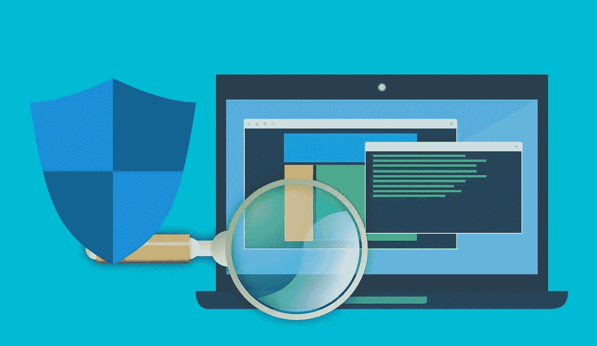

# 2019 年的信息安全工具、威胁和趋势

> 原文：<https://medium.com/hackernoon/information-security-tools-threats-and-trends-in-2019-2c91a57b63f8>

我今天想谈谈现代信息安全专家在 2019 年应该拥有的工具。我还将谈到我们现在面临的最严重的网络威胁，以及可以帮助我们应对这些威胁的技术。

如今，网络攻击已经被认为是很平常的事情。没有技术知识的骗子可以毫无问题地购买复杂的恶意软件或订购廉价的 DDOS 服务。另一方面，职业网络罪犯变得更有选择性，在攻击目标之前会全面调查未来的目标。

当“最好的防御是攻击”选项不合适时，什么工具可以帮助安全专家？

**工作站**

为了保护工作站，至少有必要使用杀毒软件。然而，由于微软的策略，反病毒软件已经安装在每台 Windows 机器上。在新的网络攻击快速增长和黑客惊人的足智多谋之际，许多人仍然认为杀毒软件只是一种安慰剂——你只要打开它，就可以忘记它和病毒。

那么，如果某种恶意软件通过这样的“假保护”泄漏，我们可以从备份中恢复机器，所有问题都将不复存在。这种态度很常见，但也有很多被感染的机器造成重大损害和经济损失的案例。

这年头，基于签名的经典杀毒真的没啥效果。攻击者变得更聪明了。因此，为了保护工作站，您需要使用结合了传统防病毒和各种恶意软件搜索选项的产品，例如使用行为因素。

不要忘记以下重要的事情:

监控所有公司机器上的软件漏洞。

RAM 和闪存驱动器的防病毒扫描。

检查电子邮件和网络流量。

此外，集中式管理控制台非常有用。它允许监控公司的所有机器，发现威胁，保存统计数据，并执行远程管理任务。

**虚拟机**

许多组织使用虚拟机。虚拟环境也需要得到保护。当然，您可以将保护放在每个虚拟机上，但是由于虚拟机通常不太强大，因此最好使用单独的主虚拟机来构建虚拟环境的保护。一台专用机器处理所有数据。只有一个小型代理(不需要大量资源)安装在所有其他虚拟机上。

您也可以使用仅适用于 VMware 的代理解决方案。在这种情况下，代理不会安装在虚拟机上，而是通过[虚拟机管理程序](https://en.wikipedia.org/wiki/Hypervisor)保护和检查机器是否存在威胁。

混合基础设施越来越受欢迎。公司使用一些位于云中的服务器和一些内部的服务器。要构建这样一个基础设施，你可以使用，例如，[微软 Azure](https://azure.microsoft.com/en-us/) 。至于保护，卡巴斯基实验室有一个合适的解决方案——[卡巴斯基云安全](https://www.kaspersky.com/security-cloud)。

**加密**

加密是信息安全的重要组成部分。员工经常使用可能丢失或被盗的笔记本电脑。因此，为了保护机密数据，不仅需要加密设备，还需要加密磁盘空间、电子邮件和网络流量，以及所有通信渠道。为了加密流量，你可以使用任何最好的 VPN 提供商的服务。

**周界防护**

如今防火墙也是必不可少的。传统防火墙仅在第一级根据预编程的参数过滤数据包。如今，使用应用防火墙要高效得多，它在 [OSI 模型](https://www.networkworld.com/article/3239677/the-osi-model-explained-how-to-understand-and-remember-the-7-layer-network-model.html)的应用层运行。它知道如何在较低的级别过滤数据包，并允许某些协议通过某个端口，例如，只有 HTTPS 流量通过端口 443。

**当 DoS 不是古 oS 的时候**

DDoS 是一件很不愉快的事情。如果竞争对手决定在最不合适的时候关闭你的网站，那么攻击会导致巨大的损失。许多厂商已经准备好提供他们的反 DDoS 解决方案。流行的解决方案工作如下:流量通过清洗中心，只有在此之后，它去客户端的网络服务器。清理中心在 OSI 模型的应用层检测到 DDoS 攻击。然后它会移除 DDoS 造成的所有负载。一些高级工具可以监控和“清除”加密的 HTTPS 流量。

**异常情况**

上面提到的所有技术可能会抵御 99%的恶意软件，但总会剩下 1%，这不会出现在签名数据库中。这 1%可以被创建用于一个可以造成巨大损害的特定攻击。只有[多阶段方法](https://www.proofpoint.com/us/products/ransomware-and-targeted-attack-protection)在对抗有针对性的攻击时才有效

**蜜罐还能用吗？**

被称为“蜜罐”的方法是安全社区从军方借来的。它是这样运作的:“诱饵”被放置在公司网络中。它们很难与普通节点区分开来。他们交换信息，晚上关机等等。他们被做得更容易被黑客注意到，这样他们就可以采取第一次攻击。在这些节点上检测到的任何活动都表明“客人已经来参加聚会”。

这种技术在安全研究人员中非常流行，但不幸的是，今天的公司并不总是有足够的资源来建立一个可靠的信息安全系统，更不用说用蜜罐抓住黑客了。此外，不合格员工使用蜜罐会导致整个网络受损。在给别人设陷阱之前，你需要想想自己怎么不陷进去。

**管理动物园**

如果公司注意公司安全，黑客的所有潜在漏洞似乎都被堵上了，这并不意味着信息安全专家可以高枕无忧。除了安全官必须找到适合其网络架构和企业需求的保护解决方案之外，他还必须注意这些工具的有效使用。

一些公司更愿意选择来自同一个制造商的所有安全解决方案。但大多数公司都建立了某种动物园，由付费和开源产品以及一些自行创建的附加产品组成。

在任何情况下，您都需要考虑从公司的整个设备系列中收集数据、分析和监控事件。而在这种情况下， [SIEM 系统](https://solutionsreview.com/security-information-event-management/the-25-best-security-analytics-and-siem-platforms/)变得至关重要。

人们认为 SIEM 的引入有助于保护基础架构，但事实并非如此。安全信息和事件管理本身并不能防止威胁。该系统用于分析来自各种系统的数据，如 DLP、IDS、防病毒、各种硬件，并进一步识别问题。SIEM 可以购买，但您可以基于开源解决方案自行构建。最受欢迎的是 Elasticsearch。

**趋势**

所有安全解决方案的开发者很快将不得不积极使用物联网设备。如今，许多人都购买了自己的智能水壶和冰箱。他们乐于使用智能设备，但不理解保护它们的必要性，尽管《美国周刊》从大量新闻中了解到一些事实，例如物联网设备被用于 DDoS 网站或重定向流量和窃取数据。物联网制造商还没有准备好开始在他们的设备上放置保护性解决方案。

我们也不能忽视加密货币的繁荣，因为这一趋势对现代网络犯罪分子非常有吸引力。或许，在可预见的未来，随着塑料卡和网上银行取代了储蓄账户，加密货币将建立一个新的大产业。尽管加密货币本身被认为是一种安全的解决方案，但仍然存在一些漏洞和漏洞。欺诈者经常使用钓鱼等老掉牙的方法。