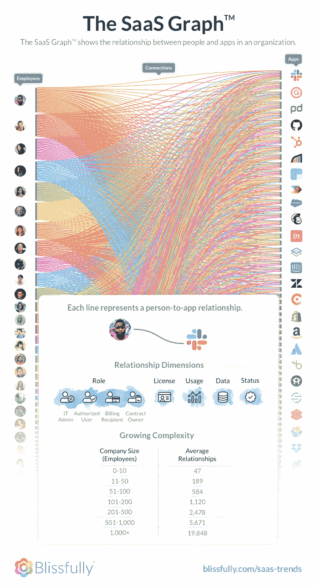

# SaaS 图表内部:转变 IT 管理的隐藏关系

> 原文：<https://medium.com/hackernoon/inside-the-saas-graph-the-hidden-relationships-transforming-it-management-ff629ef363fb>

应用程序和人之间的关系远比大多数组织意识到的要复杂。与脸书针对人与人之间关系的“[社交图](https://www.businessinsider.com/explainer-what-exactly-is-the-social-graph-2012-3)非常相似，SaaS 图展示了人与应用之间的关系，以及它们可能给组织带来的复杂性。每个 SaaS 图关系都可能代表一个潜在的安全漏洞或不必要的效率。一种新的 SaaS 管理方法可以最大限度地降低这些风险，并优化一度繁琐的工作流程。让我们深入了解一下。

来自 [Blissfully 的 2019 年 SaaS 趋势](https://www.blissfully.com/saas-trends/2019-annual/)报告的新数据显示，典型的 200-500 人公司使用 123 个应用程序，这听起来并不太难以管理。但是，当你考虑 SaaS 图关系时，它变得更加复杂:同样规模的公司平均有 2700 个 SaaS 图关系。随着组织的发展，关系的数量变得更深更复杂:拥有 500-1000 名员工的公司拥有令人震惊的 5671 个应用程序到人的关系！

# SaaS 图的维数

SaaS 图跨越了五个关键维度，所有这些维度都代表了整个组织的利益相关者所面临的新挑战。虽然 SaaS 让任何人跨团队购买和部署新软件变得更加容易，但这些维度引入了新的、潜在的隐藏问题和低效率。

## 作用

不是所有的 SaaS 用户看起来都一样。每个用户的角色可能会变得复杂，尤其是在一年中有新的团队成员加入和退出时。如果没有对这些角色的清晰理解，组织可能会在低效的流程上浪费时间，浪费金钱，或者更糟，将权限授予错误的人(这可能是一个很大的安全问题)。

任何应用程序中的潜在角色包括:

*   **IT 管理员:**把这个人想象成拥有“王国之钥”的人管理员可以添加或删除用户，或者更改组织中任何人的权限。
*   **合同所有者:**通常，合同所有者是选择 SaaS 应用程序的最初购买者或决策者。
*   **开票接收人:**此人有时可能与合同所有人相同，但也可能不同(例如，开票接收人可能属于财务团队)。
*   **用户:**该角色包括使用软件的任何团队成员，用户类型由每个单独的应用程序定义。

## 许可证

通常团队要么有免费的许可证，要么有付费的许可证，这在表面上看起来很明显。然而，付费许可证通常有不同的层级，当员工加入或离开时，公司需要跟踪这些层级。当团队领导购买的软件在其他团队或部门的订阅中有冗余时，或者如果有一个好的免费替代品，问题也会出现。

## 使用

个人和团队使用应用程序的频率可能会有很大差异。通常，应用程序可能几个月都没有得到充分利用或使用，而组织中的任何人都不知道。这些低效率累积起来会造成巨大的浪费。

## 数据

从安全性和合规性的角度来看，数据是 SaaS 图中最重要的维度。如果没有适当的保护，敏感数据可能会面临风险。例如，在缺乏强密码和/或多因素身份验证的情况下，每个用户的连接都可能存在安全漏洞。

通常，应用程序中的数据以三种不同的状态存在:

*   **创建:**用户每天都在他们的应用程序中创建数据，如果不是每小时或每分钟的话。通常，这些数据可能是敏感的知识产权或客户信息。
*   **生成:**许多应用程序在分析用户输入或其他信息后，自己生成数据。
*   **委托:**一些应用程序将权限委托给其他应用程序，并在它们之间馈送数据。例如，Salesforce 帐户可以访问 Gmail 或 G Suite 帐户。

## 供应商状态

如果不知道供应商状态，团队可能会面临浪费开支或潜在安全漏洞的风险(如果帐户对未授权用户开放或完全无人照管)。

选定的供应商可能处于组织中的以下任一阶段:

*   **探索阶段:**免费增值应用或免费试用是最典型的探索阶段。有时，这些许可证会在试用期到期后自动转换为付费许可证，或者在达到一定的使用限制后转换为付费许可证。
*   **未经批准:**通常被称为" [Shadow IT，](https://www.blissfully.com/blog/forget-shadow-it-think-enlightened-it/)"这些远离雷达的应用程序几乎存在于每个组织中，通常是团队领导或用户选择最适合他们的应用程序的结果。
*   **已批准:**这些代表 IT 或组织中其他利益相关者批准的应用程序。
*   **已弃用:**这些通常是组织中未使用的应用程序，已经被替换或不再有用，但可能从未被取消。

# 快速变化率

当您检查大多数组织的快速变化时，管理 SaaS 图变得复杂得多。我们的 2019 年 SaaS 趋势报告发现，在过去两年中，平均 43%的公司应用程序堆栈发生了变化。根据 LinkedIn 的数据，这是科技行业平均员工流失率的三倍多。这两个因素加在一起意味着平均 SaaS 图关系会发生微小的变化，这需要一种全新的 SaaS 管理方法。

# 管理 SaaS 图表:一项团队运动

由于通常不再有集中式 IT 经理在整个公司范围内调配应用程序的“命令和控制”方法，因此需要定期检查 SaaS 图中的每个维度。城里出现了一批新的利益相关者，他们每个人都需要一个席位。

通过采用[协作 IT](https://www.blissfully.com/guides/collaborative-it/) 方法，组织可以将所有关键利益相关者纳入 SaaS 管理流程。与命令和控制时代不同，团队领导、财务、人力资源、运营、安全和 IT 都必须参与该流程，以确保每个 SaaS 图关系都是有效和最新的。

虽然这种方法听起来可能更复杂，但实际上，这是一种对大多数组织来说很自然的文化转变，并且从长远来看维护起来更简单。每个集团在分担 SaaS 应用的责任方面都有既得利益:无论是为了获得正确的应用，平衡预算，还是确保安全性和合规性。将这些团队聚集在一个单一的记录系统周围，可以确保每个人在快速发展的组织中从技术中获得他们需要的东西。

*原载于 2019 年 5 月 8 日*[*https://www.blissfully.com*](https://www.blissfully.com/blog/hidden-relationships-transforming-it-management/)*。*