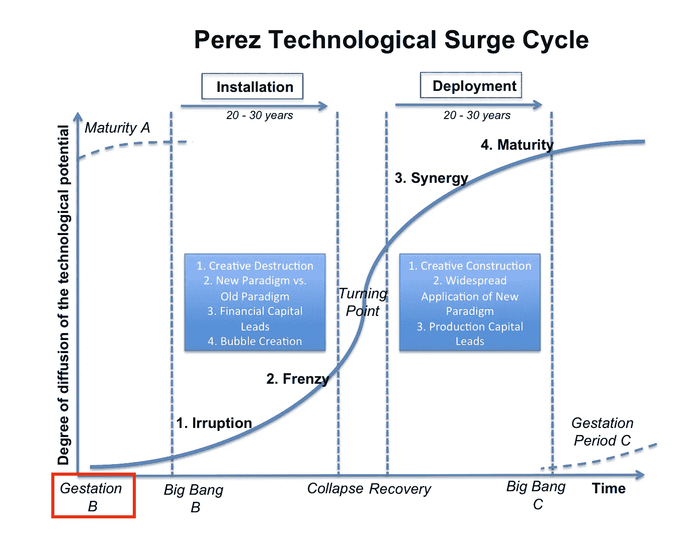
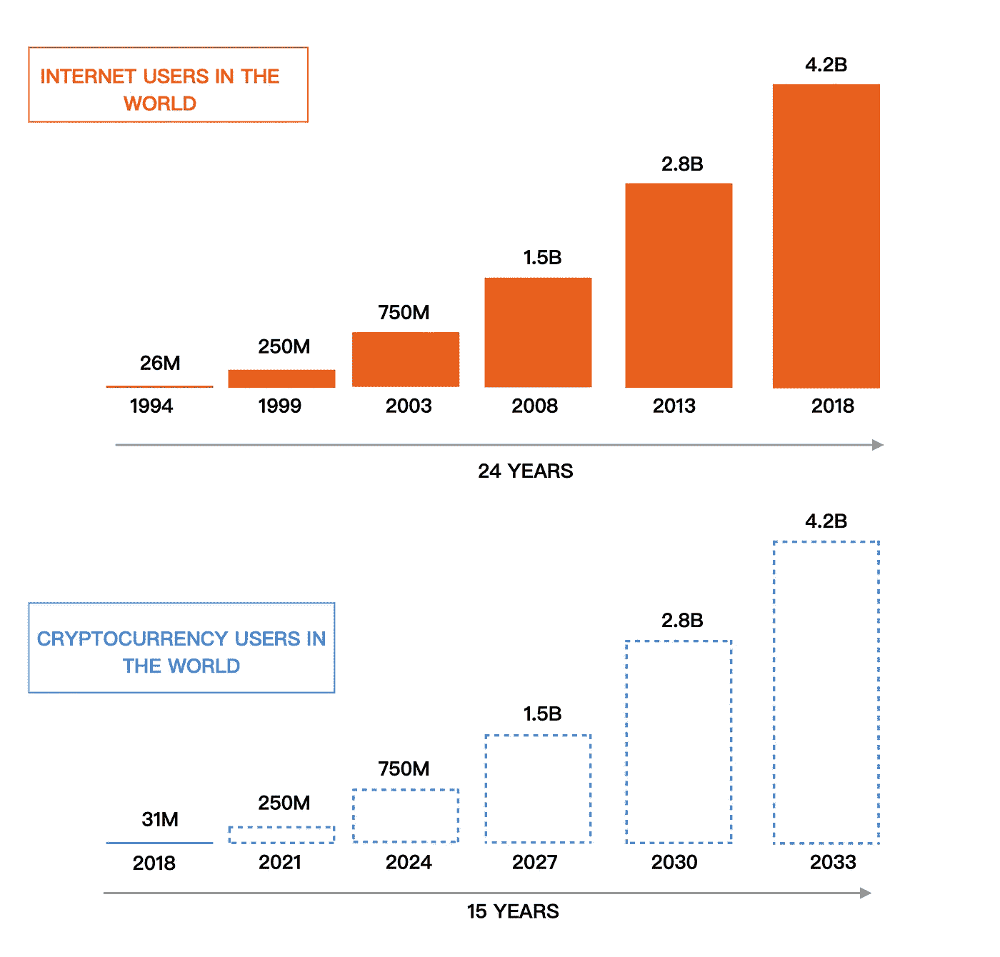
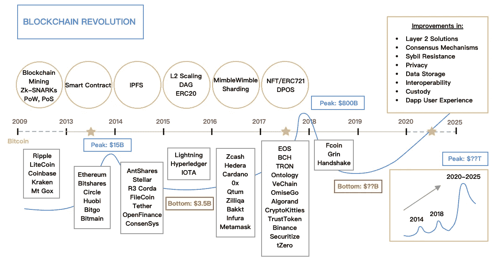
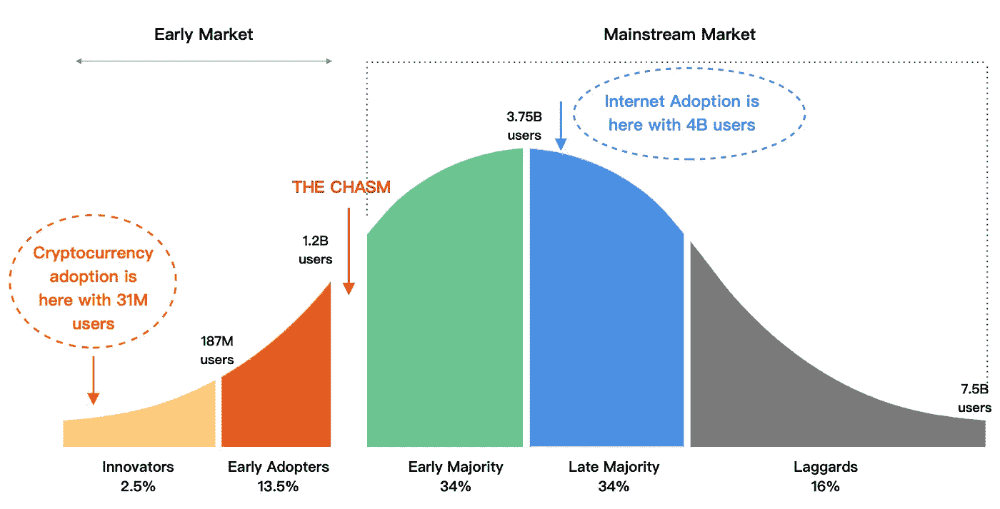

# 互联网 vs 区块链革命:我们是在 1994 年吗？接下来会发生什么？(第五部分)

> 原文：<https://medium.com/hackernoon/internet-vs-blockchain-revolution-are-we-in-1994-what-to-expect-next-part-5-170562d7229>

*本文是互联网 vs 区块链革命系列文章的一部分。如果你有兴趣阅读其他文章，* [*看看这个帖子*](/@remi.gai/internet-vs-blockchain-revolution-article-series-introduction-7f6ca1592796) *。*

Internet vs Blockchain Revolution: the evolution of the market, infrastructures, and companies

# 我们是在 1994 年吗？

有趣的是，1994 年初，当网景公司的创始人马克·安德森发现自己在硅谷时，他认为为时已晚，错过了整件事，因为 1990-1991 年的短暂衰退重创了科技行业。区块链和加密货币发展的当前阶段最类似于 1994 年的互联网革命，在这场革命中，我们发明了 TCP/IP、HTML 和 FTP，并由此导致了网景(1994 年)和脸书(2004 年)以及 Airbnb(2008 年)的发展。在区块链，我们仍在发明允许我们分布计算、保护隐私、管理身份和允许可伸缩性等的构件和工具。—突破性的 dapps 已经出现，并将在未来几年出现。

Perez Technological Surge Cycle from Technology Revolutions and Financial Capital

尽管在这次加密货币市场低迷期间出现了负面报道，但我们仍处于该行业的早期，泡沫来得过早，原因是 1)尽管许多产品和技术没有发布，但代币可能会出现早期流动性 2)由于互联网和社交媒体，世界现在的联系更加紧密，这可能会以一种前所未有的方式加速炒作的传播和泡沫的形成。然而，从技术角度来看，我们仍处于 *Perez 技术激增周期的“孕育”阶段，*“安装”期尚未出现，因为之前的市场狂热没有产生达到转折点所需的成果，其中包括“重大的基础设施改进和可复制的商业模式，可以作为部署期间的路线图”(查看由 [Daniel Heyman](https://medium.com/u/bc483fae50b4?source=post_page-----170562d7229--------------------------------) 撰写的这篇伟大的[帖子](https://hackernoon.com/why-blockchain-differs-from-traditional-technology-life-cycles-95f0deabdf85))。

The Growth of Internet users vs Growth Projection of Cryptocurrency Users in the World

当前用户对加密货币的采用与 1994 年对互联网的采用最为相似，24 年后，地球上超过一半的人口在日常生活中保持联系。我们可以预计，加密货币领域也会出现类似的增长轨迹，或许速度会更快，因为现在世界的联系更加紧密，新技术在过去几个世纪中以更快的速度被采用是一种普遍趋势。例如，电力用了 46 年，电话用了 35 年，电视用了 14 年，网络用了 7 年才达到 25%的全球市场渗透率。因此，我们估计加密货币可能还需要 15 年才能达到我们今天在互联网上的采用水平。

从资本角度来看，互联网和区块链革命期间投资的规模也非常不同，1999 年有 356 亿美元的风险资本流入美国互联网初创公司(根据 *CNN Money* 的数据)，而 2017 年 1B 的风险资本和 ico 的 50 亿美元进入全球区块链公司(根据 [CB Insights](https://medium.com/u/914088e570e?source=post_page-----170562d7229--------------------------------) )。在 2000 年互联网泡沫的巅峰时期，[纳斯达克](https://medium.com/u/3aaaf6f9eea?source=post_page-----170562d7229--------------------------------)的市值为 6.5T 美元(经通胀调整)，而 2018 年初加密货币的全球市值为 8000 亿美元。尽管互联网泡沫只发生在美国，而加密货币泡沫是全球性的，但前者投入的资本量更大，因为 1)互联网牛市与现有的长期股票牛市相结合，华尔街和散户投资者已经“热身”投入新的高回报互联网 IPOs 2)大量资本来自婴儿潮一代的积累财富，他们大约 40 多岁，管理自己的退休储蓄，一生中不熟悉经济危机。相比之下，加密货币投资者主要是千禧一代，他们的资本少于老一代人(千禧一代:41%，X 一代:24%，婴儿潮一代:18%)。此外，机构投资者投资于加密货币的资金量相对较小，并且不包括中国和印度等人口大国的参与。

Blockchain Revolution: the evolution of the market, technologies, and companies

从这些角度来看，我们应该预计未来几年将出现另一个或多个泡沫，因为“成功和可复制的商业模式”( *Carlota Perez* )将出现在去中心化的应用程序中，更大规模的机构资本将流入该行业，类似于 1999-2000 年互联网革命期间发生的情况。我们可以预计总市值最终将超过 10T 美元，因为它将结合协议令牌(从 dapps 中获取价值)、股权令牌、公用事业令牌(如果该模型在未来仍被证明是可行的)和加密货币(作为价值储存手段——其中*比特币*如果达到数字黄金的等值水平，可能会达到 7.8T 美元的市场)。总体而言，我们认为我们仍处于区块链技术周期的早期，类似于 1994 年互联网革命期间，我们应该预计未来几年将出现更多的市场周期。

# 接下来会发生什么？：

在当前市场低迷的情况下，加密货币和区块链行业需要一些成功的案例来重新树立对这项技术的信心。互联网泡沫破裂后，随着新一波网络创业公司开始找到自己的立足点，人们逐渐愿意再次相信互联网，*和 *PayPal* 的成功开始减少一些不确定性和糟糕的记忆。在加密货币和区块链世界，我们仍在寻找能够证明区块链技术和去中心化应用价值的成功用例，以帮助行业重拾信心。dapp 发展领域的杰出领导者之一、 [ConsenSys](https://medium.com/u/6c7078bf7b01?source=post_page-----170562d7229--------------------------------) 、 [Joseph Lubin](https://medium.com/u/6a370863659c?source=post_page-----170562d7229--------------------------------) 的创始人最近声称，“展望 2019 年，如果你能通过我的眼睛看到风景，你必须戴上墨镜”。 [Joseph Lubin](https://medium.com/u/6a370863659c?source=post_page-----170562d7229--------------------------------) 坚定地认为未来将是去中心化的，而来自 [Blockchain Capital](https://medium.com/u/9737c5ab2ab1?source=post_page-----170562d7229--------------------------------) 的其他人物如 [Jimmy Song](https://medium.com/u/4acb12744ff8?source=post_page-----170562d7229--------------------------------) 仍然对未来几年使用的去中心化应用持怀疑态度。到目前为止，该领域的独角兽都是具有传统商业模式的集中化公司，这些公司有利于加密货币生态系统本身( [COINBASE](https://medium.com/u/367181b93908?source=post_page-----170562d7229--------------------------------) 、[币安](https://medium.com/u/57600910a883?source=post_page-----170562d7229--------------------------------)、*、*、[、 *Circle* 、](https://medium.com/u/d7b292505fc?source=post_page-----170562d7229--------------------------------)、*、*和*比特大陆)*)。我们已经看到流行的分散式应用程序正在取代传统的公司。*

**

*The previous and future phases of the Blockchain Revolution*

*我们目前正在过渡到区块链发展的第五个阶段，在这个阶段，区块链在不同行业的应用以及区块链可扩展性解决方案都在探索之中。在 2009 年至 2012 年的第一阶段，比特币作为一种新型数字货币和概念证明被发布，首批用户由铁杆技术人员、密码专家和密码朋克组成，他们在各种邮件列表和论坛(*bitcointalk.org*、 *Reddit* 等)中挖掘和推广加密货币。).在 2013 年至 2014 年的第二阶段，随着媒体报道的增加(尽管其中许多都是负面报道)，交易所、钱包、托管和支付解决方案等基础设施开始增加。第三阶段 2015 年至 2017 年更侧重于围绕金融用例的现实应用，如汇款、微支付、跨境支付。随着与[以太坊](https://medium.com/u/d626b3859bc9?source=post_page-----170562d7229--------------------------------)的智能合约的出现，我们已经进入了第四阶段，在这个阶段，我们正在探索金融以外的用例，而新的融资工具 ICO 成为了这个阶段的杀手级应用。在第五阶段，我们期待成功的 dapps 和用例的出现，重新树立对该技术的信心，以及区块链可扩展性、隐私、数据存储、互操作性、托管和用户体验的改善。在第六阶段的后期，我们希望看到 dapps 破坏和竞争集中垄断，如 *Dropbox，脸书，Youtube，Airbnb，*等。，允许消费者参与并在数字经济中获得更多权力。*

*另一方面，成功的 dapps 可能需要一段时间才能推广，因为分散应用生态系统获得的资金比协议少得多。在互联网泡沫期间，大部分资金都投入到了应用程序的开发中(*雅虎*，*网景*，*易贝*，*亚马逊*等等。)而协议开发者(TCP/IP、HTML、FTP)是几乎没有报酬的研究人员，非营利组织经常处理技术的后续迭代。然而，在区块链领域，我们目睹了相反的情况，大部分资本进入了处理协议开发的私营公司([以太坊](https://medium.com/u/d626b3859bc9?source=post_page-----170562d7229--------------------------------) *、*[*NEO*](https://medium.com/u/95d056302ecb?source=post_page-----170562d7229--------------------------------)*、*[*ICON*](https://medium.com/u/97957d5f5ab2?source=post_page-----170562d7229--------------------------------)*、Ontology/* [*本体团队*](https://medium.com/u/4998f4ed133f?source=post_page-----170562d7229--------------------------------) *、*等)。)而且许多区块链工具无法从 ico 获得资金。不成比例的资金量可能会减缓分散应用程序的整体开发和发布。*

**

*Crossing the Chasm, a term created by Geoffrey Moore*

*总体而言，就全球采用情况而言，加密货币和区块链的采用者仍在 2.5%的“创新者”行列中。客观地说，大约有 40 亿互联网用户，我们正在进入“后期多数”阶段。下一个区块链泡沫可能会带来加密货币的“早期采用者”，而“鸿沟”可能会在大型面向消费者的公司([星巴克](https://medium.com/u/dec5a8211dd1?source=post_page-----170562d7229--------------------------------)、T2、脸书、沃尔玛等)和金融机构([富达](https://medium.com/u/3a8b739a08d1?source=post_page-----170562d7229--------------------------------) *、* [*纳斯达克*](https://medium.com/u/3aaaf6f9eea?source=post_page-----170562d7229--------------------------------) *、高盛*等)的帮助下跨越，这些公司已经开始探索机会，并拥有现有的庞大用户群和对更多传统参与者的影响力。例如，*脸书*目前正在开发一个解决方案，可以在其消息应用 *Whatsapp* 上实现 stablecoins 支付。该公司在金融服务领域迈出一步的潜力非常大，拥有超过 2 亿用户，在印度拥有庞大的用户群(在汇款方面领先世界——根据世界银行今年的数据，2017 年人们向印度汇款 690 亿美元)。我们也看到了*三星*和 *HTC* 最近的声明，他们已经在改进他们的硬件，并通过在 *Galaxy S10* 和 *Exodus 中引入内置加密货币钱包，为下一波采用做准备。**

*此外，我们已经看到机构方面的心态发生了转变，特别是哈佛大学、麻省理工学院、耶鲁大学和 T2 达特茅斯大学等捐赠基金的参与，他们开始投资加密货币领域，最近，领先的养老金和捐赠基金咨询公司 T4 剑桥协会开始建议他们的客户考虑长期投资数字资产领域。此外，最近的一个项目 [Bakkt](https://medium.com/u/36ab36b72f19?source=post_page-----170562d7229--------------------------------) ，由*洲际交易所*的(ICE)，包括*纽约证券交易所*在内的几个全球交易所的运营商，刚刚筹集了超过 1.825 亿美元的资金，使消费者和机构能够购买、出售、存储和消费数字资产。这些举措将从机构方面进一步推动加密货币的全球采用，帮助弥合采用鸿沟。*

*总之，我们仍然处于区块链技术周期的早期，类似于 1994 年互联网革命期间，我们预计更多的泡沫和更大的资本流向 dapps 生态系统。此外，我们希望在未来几年看到更多的 dapps 发布，其中一些将成为突破性的项目，逐渐重建对该领域的信心。大型企业和金融机构开始越来越多地涉足这一领域，并有可能吸引大量消费者和投资者，帮助弥合采用鸿沟，为大规模采用打开大门。我们仍然看好该行业的发展，并对未来几年的发展充满期待。我们关于互联网与区块链革命的系列文章到此结束，希望我们能为您提供一些有价值的观点和见解。*

*____*

*互联网革命的事实基于 Brian McCullough 写的书《互联网是如何发生的》。马克·吐温曾经说过，“历史不会重演，但会押韵”。我们试图在互联网和区块链革命之间找出一些相似之处，以帮助企业家和投资者更好地理解技术生命周期。请在下面留下您的想法和评论，希望这个文章系列能够提供一些关于区块链行业的有价值的观点。*

*作者:雷米·盖*

***来源:** *《互联网是如何发生的》，作者:*布莱恩·麦卡洛* [https://www.youtube.com/watch?v=pijR8vrQphk](https://www.youtube.com/watch?v=pijR8vrQphk)
[https://Twitter . com/ethereumJoseph/status/1076171159853502464](https://twitter.com/ethereumJoseph/status/1076171159853502464)[https://medium . com/@ mccannatron/12-graphs-that-show-just-How-early-the-the-crypto currency-market](/@mccannatron/12-graphs-that-show-just-how-early-the-cryptocurrency-market-is-653a4b8b2720)**