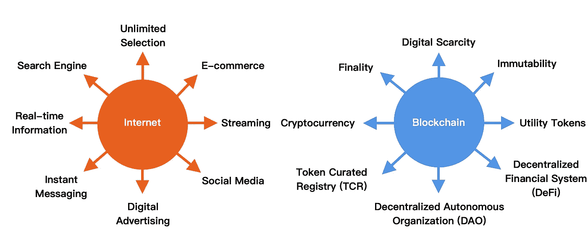
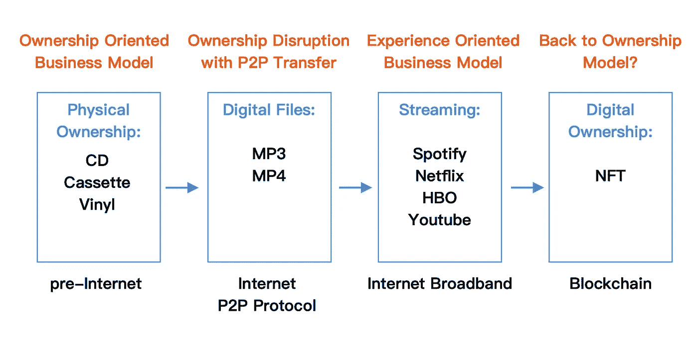
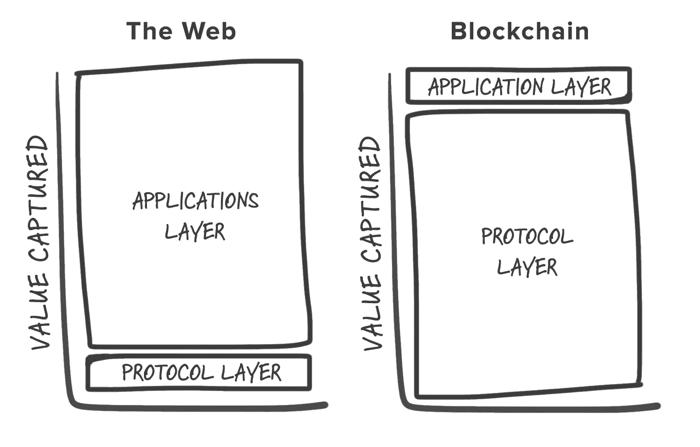

# 互联网 vs 区块链革命:新概念、估值方法和时机(第四部分)

> 原文：<https://medium.com/hackernoon/internet-vs-blockchain-revolution-new-concepts-valuation-methods-and-timing-part-4-f352c977065b>

*本文是互联网 vs 区块链革命系列文章的一部分。如果你有兴趣阅读其他文章，* [*看看这个帖子*](/@remi.gai/internet-vs-blockchain-revolution-article-series-introduction-7f6ca1592796) *。*

E mergent 技术使以前不可能或不切实际的新概念和商业模式成为可能。这些新概念和商业模式通常需要时间来验证，并需要新的评估方法。正如互联网革命向我们展示的那样，时机对于这些新概念和新模式在新兴市场取得成功非常重要。

# 新概念的出现:

New concepts that appeared with the development of the Internet and Blockchain

电子战技术有潜力创造新的概念和商业模式，允许新的市场出现。例如，互联网允许出现新的概念，如“无限选择”(例如:出售世界各地所有书籍的书店— *【亚马逊】*，或“即时满足”的概念(例如:出售世界各地所有电影的电影租赁店—*)*。互联网使这些新模式成为可能，亚马逊和网飞等公司明白消费者的期望正在改变，并专注于改变他们的模式以满足这些新需求。其他一些概念包括“搜索引擎”、“实时信息”、“即时通讯”、“社交媒体”、“数字广告”和“流媒体”。尽管我们现在认为其中许多是理所当然的，但这些概念中有许多是从一个想法开始的，需要时间来检验和证明。例如，在互联网早期，[杰夫·贝索斯](https://medium.com/u/957a3f99c6e0?source=post_page-----f352c977065b--------------------------------)从一开始就有“一切商店”的想法，但起初认为它太过宏伟，并选择专注于销售书籍，作为验证“电子商务”商业模式的概念证明。选择书籍是因为它们最类似于一种商品，购买者知道他们会收到什么，而且利润相对较高。一旦杰夫·贝索斯证明了“电子商务”可以成为图书的可行商业模式，亚马逊就迅速扩展到其他垂直领域。

Evolution of the entertainment industry with the emergence of new technologies

在区块链领域，随着 [CryptoKitties](https://medium.com/u/c8b1419b5d28?source=post_page-----f352c977065b--------------------------------) 的推出，2017 年底出现了一个新的迷人概念，即“数字稀缺”，允许你在区块链拥有数字猫。在区块链出现之前，完全拥有数字资产并不是一个可行的想法，这也是过去 30 年来迫使传统娱乐业转变商业模式的一个主要痛点。在前互联网时代，娱乐业的商业模式严重依赖于 CD、磁带、黑胶和 DVD 等实物产品的销售。随着互联网、MP3 和 MP4 等新型文件以及对等协议(1999 年)的出现，盗版开始盛行，文件变得可以在网上免费获取。数字版权保护和文件所有权工具的缺乏迫使传统娱乐业转向我们今天所知的以体验为导向的模式，出现了诸如*大片*、[网飞](https://medium.com/u/c3aeaf49d8a4?source=post_page-----f352c977065b--------------------------------)和 [Spotify](https://medium.com/u/60a317bb70e4?source=post_page-----f352c977065b--------------------------------) 等服务。如果区块链技术早 10 年出现，也许我们今天消费数字媒体的方式会有所不同。区块链带来的其他一些新概念包括“不变性”、“终结性”、“加密货币”、“公用令牌”、“令牌管理注册中心(TCR)”、“分散金融系统(DeFi)”和“分散自治组织(DAO)”。这些概念目前正在被许多令人兴奋的项目探索，时间和空间将在世界上验证它们的价值。

# 新的估价方法:

Fat vs Thin Protocol (a concept from USV, by [Joel Monégro](http://www.usv.com/blog/fat-protocols))

新商业模式的可行性在开始时并不总是清晰的。在互联网的早期，许多公司以“付费墙”商业模式开始，然后逐渐转变为广告模式，因为它被证明是有效的。数字广告商业模式是由 *Wired* 发现并推广的。1994 年， *Wired* 将其杂志中的传统广告模式复制到他们的新在线杂志中( *Hotwired* )，这在网络上是前所未有的。有趣的是，在早期网络时代，网站非常少，人们甚至喜欢点击广告横幅，只是为了浏览其他页面。一旦这种新的商业模式被证明能够产生可观的收入，许多公司都走上了这条道路，尤其是新兴的搜索引擎，如*雅虎、*之前一直在努力寻找货币化的方法。25 年间，全球数字广告的市场规模从无到有，到 2018 年达到 2700 亿美元( [*Statista*](https://www.statista.com/statistics/237974/online-advertising-spending-worldwide/) )。

在加密货币领域，我们已经看到了与代币经济学相关的有趣的新模型。例如，协议和实用程序令牌开发者可以通过保留一些最初铸造的令牌来为自己创造价值。然后，收入取决于代币的价格变化，这种变化基于代币的采用、需求和市场的投机。虽然这种模式从分散化的角度来看是有意义的，其中中间商获取价值的机会应该从系统中消除或最小化，但这些项目承担的风险相当大，因为它们的成功将完全取决于它们“一次性”铸造的令牌的成功，而没有机会在部署后进行重大的商业模式改变。其他一些有趣的新商业模式包括由交易所*Fcoin(*[*Fcoin official*](https://medium.com/u/38b3ad94df07?source=post_page-----f352c977065b--------------------------------)*)*开创的一种模式，该模式试图通过奖励代币进行交易来解决交易所的流动性问题(“交易即采矿”的模式)，而不是像大多数交易所那样收取费用，或者社交媒体平台 [Steemit](https://medium.com/u/a3df9c24e249?source=post_page-----f352c977065b--------------------------------) *，*奖励用户制作的内容，并允许他们在用户持有代币的情况下在平台上获得曝光率。总的来说，我们很高兴看到新的令牌和业务模式出现在这个领域。

为了评估加密货币的价格，我们已经看到了新的估值方法，如网络价值与交易(NVT)比率，该比率衡量加密资产交易活动相对于网络价值的美元价值(由[威利·吴](https://medium.com/u/a8f4de44a01d?source=post_page-----f352c977065b--------------------------------)和[克里斯·伯尼斯克](https://medium.com/u/2a8f9285c9aa?source=post_page-----f352c977065b--------------------------------)推广)，或 UTXO 分析(概念来自[未解放资本](https://medium.com/u/f100a44dc744?source=post_page-----f352c977065b--------------------------------))，该分析将比特币交易的未用产出与一段时间内的价格相关联。两者都是有趣的方式，可以提供新的框架来解释比特币在熊市和牛市周期中的价值。然而，对于如何正确评估协议令牌的价值，仍然存在许多问题。该值是否应该基于构建在区块链顶部的 dapps 的数量以及它们各自的用户群？还是应该基于他们提供的总计算资源(比如*以太坊*中的*气*费可以看做矿工提供的计算能力，或者 *FileCoin* 情况下的存储能力)？一般来说，由于我们仍处于区块链革命的早期阶段，因此没有评估区块链、dapps 和加密货币价值的标准化框架。

# 时机:

Internet Revolution: the evolution of the market, infrastructures, and companies

回顾互联网时代的主要应用程序是如何推出的，新技术的先驱很少能够存活足够长的时间来主导它们的类别:通常，它是今天仍在我们身边的模仿者:搜索领域的*谷歌*，而不是 *AltaVista* 或*雅虎*；*脸书*，而不是 *Friendster* 或 *MySpace* ，在社交网络中。在技术领域，一个新想法的最终成功在很大程度上取决于时机。导致 *Mosaic 成功的原因是，*第一款互联网浏览器成为该领域先行者的时机。在 80 年代，只有四所大学获得了足够的联邦资金来有效地建设(超级计算机过去花费 2500 万美元),他们正在开发 NSFNET ( *国家科学基金会网络*)，基本上是互联网。NCSA 的高速电脑和互联网连接使得[马克·安德森](https://medium.com/u/fa65e64cf273?source=post_page-----f352c977065b--------------------------------)和其他做研究的孩子能够在网络浪潮起飞之前，准确地抓住它。

即使是看起来是下一件大事的伟大想法也可能无法实现其承诺，因为底层技术或基础设施还不够成熟，不足以支持其采用和可行性。例如，流媒体是早期互联网的一个流行想法，其中*Broadcast.com*(1995 年由[马克·库班](https://medium.com/u/29fd628f3aaa?source=post_page-----f352c977065b--------------------------------)T4【创建的网络电台公司)获得了成功，但当时试图提供视频相关服务的其他公司失败了。对于 Youtube (2004)的起飞来说，它需要宽带互联网连接的发展，结合消费者视频和手机摄像头的采用，以及从 *Napster 的*失败(第一个因版权侵权而关闭的点对点文件共享服务)中吸取的版权侵权教训，这几乎发生在 10 年后。*脸书* (2004)也把握住了采用智能手机的时机，智能手机可以在任何时候提供更加个人化和亲密的互联网体验。如果 *iPhone* 没有开启智能手机革命，那么 *Instagram、Snapchat、Twitter、*和*优步*会是什么样子？这是社交媒体消费和生产所需的完美载体。一些人会认为社交媒体最终成为主流是因为智能手机同时成为主流——两者在正确的时间互补。在区块链领域，dapps 的主流采用将在很大程度上取决于技术和基础设施的成熟度，这些技术和基础设施允许一些用例的可行性和可扩展性。一些想法可能在未来几年内变得可行和实用，而另一些可能需要 5-10 年。

在的结论中，新兴技术允许新的概念和商业模式出现，从新的评估角度对它们进行评估很重要，因为以前的方法可能不适用。这些新概念中有许多需要时间来验证，它们的采用与时机密切相关。

— —

互联网革命的事实基于 Brian McCullough 写的《互联网是如何发生的》这本书。马克·吐温曾说过“历史不会重演，但会押韵”。我们试图在互联网和区块链革命之间找出一些相似之处，以帮助企业家和投资者更好地理解技术生命周期。请在下面留下您的想法和评论，希望这个文章系列能够提供一些关于区块链行业的有价值的观点。

**作者** : [雷米盖](https://medium.com/u/7fbd7ff92c3a?source=post_page-----f352c977065b--------------------------------)

**资料来源:** 书*《互联网是如何发生的》*，作者*布莱恩·麦卡洛*。
[https://a16z . com/2019/03/12/幻觉-视觉-场景-网络-销售-使用-制作-艺术-布莱恩-科佩尔曼-马克-安德森/](https://a16z.com/2019/03/12/hallucination-vision-scenius-networks-selling-using-making-art-brian-koppelman-marc-andreessen/)
[https://www . statista . com/statistics/237974/online-advertising-spending-world wide/](https://www.statista.com/statistics/237974/online-advertising-spending-worldwide/)
[https://coinmetrics.io/nvt/](https://coinmetrics.io/nvt/)
[https://www.delphidigital.io/utxo](https://www.delphidigital.io/utxo)