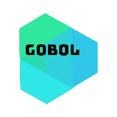

# GOBOL 语言简介

> 原文：<https://medium.com/hackernoon/introducing-the-gobol-language-fc6a0ac7f5d>

## 设计一种面向数据移动和操作的高级语言。


Photo by [Vojtech Bruzek](https://unsplash.com/@vojtechbruzek?utm_source=medium&utm_medium=referral) on [Unsplash](https://unsplash.com?utm_source=medium&utm_medium=referral)

在 Y2K 修复软件系统期间，我非常忙(是的，他们需要修复，一切没有崩溃的唯一原因是许多人非常努力地工作，以确保它不会崩溃)，以及 EDI(电子数据交换)的一些事情。不一定是 [ANSI EDI](https://www.edibasics.com/edi-resources/document-standards/ansi/) ，但是数据的交换都一样。如今，这通常被称为 [ETL](https://en.wikipedia.org/wiki/Extract,_transform,_load) (提取、转换、加载)，但最终结果是相同的，即合作伙伴之间的数据交换。当您有许多合作伙伴需要他们的数据时，您最终会有许多程序格式化这些数据。这让我有了一个漫长的思考过程，并零星地开始设计一种面向数据移动和操作的高级语言，这正是 [Gobol](https://github.com/the-kompany/gobol) 的目标。



基本上，我从 COBOL 中借用了很多动词，因为它易于阅读、学习和编程，并且非常面向数据移动。然而，它是一种旧的通用语言，所以我们当然可以清除许多穿孔卡片时代的旧思想。除了使用 Python 和 Go 的思想之外，我还从 Taurus Software 的 Warehouse 中大量借用了一种现已废弃的特定于平台的( [HP 3000](https://en.wikipedia.org/wiki/HP_3000) )语言。

最初我想将代码翻译成 [Python](https://www.python.org/) ，因为它是健壮的和多平台的，然而随着 [Go](https://golang.org/) 语言的出现，我决定 transpiler 将更有意义，并提供可以在多平台上以免提方式调度和运行的漂亮的紧密可执行文件。这使得代码可以运行和调度，而不会像这个领域的许多产品那样臃肿，需要您使用它们的基础设施来调度和运行，并且通常是用 Java 编写的。现在显而易见，这个名字是 COBOL 和 GO 上的一出戏。

这门语言的主要目标是清晰，而不是简洁。每个命令都应该易于理解并且非常强大，例如，以下示例假设脚本:

```
DEFINE R : RECORD
     F : CHAR(4)
     G : CHAR(6)
     H : CHAR(2)
ENDMOVE “ABCD” TO R.F
MOVE “efghij” TO R.G
MOVE “13” TO R.HExpression                                Result
MOVE EXTRACT(R, 1, 3) TO var              var = “ABC”
MOVE EXTRACT(R, 3, 3) TO var              var = “CDe”
MOVE EXTRACT(R.F, 1, 3) TO var            var = “ABC”
MOVE EXTRACT(R.G, 3, 3) TO var            var = “ghi”
MOVE STR2NUM(EXTRACT(R, 11, 2)) TO numvar numvar = 13
```

我们正在定义一个名为 R 的记录结构，它包含元素 F、G 和 h。MOVE 命令的 EXTRACT 函数有 3 个参数，一个源、一个起始位置和一个长度。你会注意到我们从 1 开始计数，而不是从 0，因为这是非程序员计数的方式。最后，您将看到 STR2NUM 函数也嵌入在命令中，因此我们首先从 R 中提取 2 个字符，从第 11 个字节开始(我们也可以只引用 R.H ),并在将它发送到 *numvar* 之前将其转换为一个数字。

现在，假设我们有一个包含名称的变量，它来自发送给我们的合作伙伴文件，因此我们不知道数据有多干净，但我们知道我们希望所有名称的第一个字符都是大写，后面跟着小写，因此我们可以使用这样的函数:

```
UPSHIFT(DOWNSHIFT(fullname),EACH)
```

在这种情况下，我们有一个名为*全名*的变量，我们首先要*将整个字符串向下移动*，然后*将字符串中每个单词的第一个字母向上移动*，使用*每个*。我们可以将它与 MOVE 命令结合起来执行这个功能，同时将它放入一个新的变量中，比如:

```
MOVE UPSHIFT(DOWNSHIFT(fullname),EACH) to Myfullname.
```

现在，假设我们正在读取一个文件，其中包含一个按 MM/DD/YYYY 顺序格式化的生日，但是我们需要将它放入一个 MySQL 日期字段中，那么它看起来会像这样:

```
MOVE STR2DATE(VR.dtBirthDate, “MM/DD/YYYY”) to table.BirthDate
```

如果你想把一个数组作为一个分隔文件转储呢？我的提议是这样的:

```
MOVE EXPORT(ARRAY, <DELIMITER>, [NEW, APPEND, OVERWRITE]) TO OUTPUT-FILE
```

这将获取数组并一次写出一个成员到输出文件，可选标志将创建、覆盖或追加文件。默认行为是新的。分隔符将在每个字段之间插入，这对于导出到 CSV 非常有用。该示例显示了我们如何删除了许多代码行，这使得冗长性是可以接受的，因为该命令将做什么是非常明显的。我使用 MOVE 命令的目的是使正在发生的事情变得显而易见，但是作为上述命令的替代方法，有一种想法是这样的:

```
WRITE OUTPUT-FILE(NEW, APPEND,OVERWRITE) FROM ARRAY DELIMITED BY “,”
```

我对这个项目没有财务上的兴趣，尽管我想找到一些财务上的赞助者来帮助加速开发，并在它可行时帮助获得采用。我正在寻找那些之前给 Golang 写过 transpilers 的人，他们愿意参与这个项目。当前的语言规范并不是一成不变的，我把它作为入门指南，并期望它会随着元素的实现而不断发展和完善。Github 项目在[https://github.com/the-kompany/gobol](https://github.com/the-kompany/gobol)举行，我希望你能加入我们。创造一种不是 C 语言衍生物的语言会很有趣。